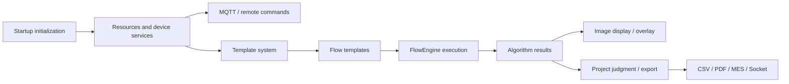

# Engine Business Flow Matrix

This page helps Engine handoff, troubleshooting, and requirement changes. It maps business capability to code entry, trigger, data/config source, first checks, and ownership boundaries. Use it as the horizontal map before reading the more detailed chain pages.

## How to Read

1. Use this page to decide whether the issue belongs to devices, templates, Flow, result display, project packages, or release validation.
2. If you already have a concrete requirement or defect, read [Engine Business Scenario Playbook](./business-scenario-playbook.md) for executable steps.
3. Read [Engine Business Handoff](./business-handoff.md) for the full execution chain.
4. When the change is ready for delivery, use [Engine Change Impact And Acceptance Checklist](./engine-change-impact-checklist.md) to collect evidence.
5. If you already know a class name such as `ServiceManager`, `TemplateControl`, `FlowControlData`, `NodeConfiguratorRegistry`, or `ViewResultAlg`, search it in source and then return here to understand the business context.

## Overall Chain



Engine connects these stages. UI provides operation entry and visual containers. Project packages provide customer workflows and judgment output. Do not put customer-specific rules into generic Engine result handlers.

## Core Flow Matrix

| Business scenario | Main code entry | Trigger | Data/config source | First checks |
| --- | --- | --- | --- | --- |
| Startup initialization | `App.xaml.cs`, `MySqlInitializer`, `MqttInitializer`, `ServiceInitializer`, `TemplateInitializer`, `RCInitializer` | Host startup, plugin load, initializer flow | Local config, MySQL, MQTT config, plugin folders | Init order, exception log, database connection, MQTT connection, template scan |
| Device service creation | `Services/ServiceManager.cs`, `Services/Type/TypeService.cs`, `Services/Devices/DeviceServiceFactory.cs`, `Services/DeviceService.cs` | Resource tree, device page, Flow node configurator | `SysDictionaryModel`, `SysResourceModel`, `DeviceServiceConfig` | `ServiceTypes`, resource `type/pid/is_delete/tenant_id`, factory registration, `DeviceServices` |
| MQTT and remote commands | `MQTT/MQTTControl.cs`, `MQTT/MQTTConfig.cs`, `Services/Devices/*/MQTT*.cs`, `Messages/`, `Services/RC/MQTTRCService.cs` | Device button, Flow node, project automation | MQTT address, topic, device code, RC config, file server | Connection, topic, return code/result id, file download, service log |
| Template loading | `Templates/TemplateContorl.cs`, `Templates/TemplateModel.cs`, `Templates/Jsons/**/Template*.cs`, `Templates/POI/TemplatePoi.cs` | Startup, template manager, flow editor | Template types, `TemplateDicId`, `Code`, template parameter tables | Type scan, parameter load, no-arg constructor, name conflict |
| Flow save/import | `Templates/Flow/TemplateFlow.cs`, `Templates/Flow/FlowPackageHelper.cs`, `Dao/ModMasterModel.cs`, `Dao/ModDetailModel.cs`, `Dao/SysResourceModel.cs` | Flow editor save, `.cvflow` import, project template selection | Template database, `SysResourceModel.Value`, `.cvflow` package | `DataBase64`, associated template import, rename handling, resource values |
| Flow execution | `FlowEngineLib/FlowEngineControl.cs`, `FlowEngineLib/Start/BaseStartNode.cs`, `FlowEngineLib/End/CVEndNode.cs`, `Templates/Flow/FlowControl.cs` | Manual run, project automation, Socket/MES trigger | Flow template, node parameters, device code, `FlowControlData` | Start node, node status, service tokens, `FlowCompleted`, end-node result |
| Node business binding | `Templates/Flow/Nodes/`, `Templates/Flow/NodeConfigurator/NodeConfiguratorRegistry.cs`, `*NodeConfig.cs` | Open flow, edit node, execute node | Node type, device list, template list, node parameters | Configurator exists, device/template names still exist, restore failure, not only `FlowEngineLib` changed |
| Algorithm result display | `Services/Core/ViewResultAlg.cs`, `Abstractions/IViewResult.cs`, `Abstractions/IResultHandlers.cs`, `Abstractions/IDisplayAlgorithm.cs`, `Templates/**/ViewHandle*.cs` | Algorithm result window, ImageEditor, project history | Algorithm result DAO, file path, `ViewResultAlgType` | Handler reflection, `CanHandle`, result id, image path, overlay coordinates |
| Data, batch, archive | `Dao/`, `Batch/`, `Archive/`, `Reports/`, `Dao/MeasureBatchModel.cs` | Batch page, history, report export, project readback | MySQL/SQLite, batch id, template name, test time | Batch created, result inserted, template/key match, query filter |
| Project package handoff | `Projects/*/Process/`, `Projects/*/Recipe/`, `Projects/*/Fix/`, `ObjectiveTestResult.cs`, exporters | Customer project window, Socket/MES automation, CSV/PDF output | Engine result, Recipe/Fix, SN/station config, customer fields | Raw value exists, `Process` reads the right key, Recipe/Fix does not blank it, exporter field matches |
| Files and images | `Services/Devices/FileServer/`, `Media/`, `Engine/ColorVision.FileIO/`, `cvColorVision/` | Camera capture, file-server download, ImageEditor open, CVRAW/CVCIE import/export | File server, raw image, custom formats | Path, permission, format reader, native DLL, image size and coordinate system |

## Device-Type Entry Points

| Device type | Engine directory | Flow relation | Smoke check |
| --- | --- | --- | --- |
| Camera | `Services/Devices/Camera/`, `Services/PhyCameras/` | Camera node or image input | Resource creates service, capture returns a file, ImageEditor opens it |
| PG | `Services/Devices/PG/` | Pattern/display-control node | MQTT succeeds and display state matches Flow state |
| Spectrum | `Services/Devices/Spectrum/` | Spectrum acquisition node | Measurement result, spectrum curve, and CIE values display |
| SMU | `Services/Devices/SMU/` | Power/measurement node | Connection and readings are stored or mapped to project fields |
| FileServer | `Services/Devices/FileServer/`, `Services/Cache/` | Camera and algorithm file dependency | Download path exists and cache cleanup is safe |
| Algorithm | `Services/Devices/Algorithm/`, `Templates/Jsons/`, `Templates/ARVR/` | Algorithm/template node | Service returns result id, DAO reads detail, `ViewHandle` displays |
| FlowDevice | `Services/Devices/FlowDevice/`, `Templates/Flow/` | Sub-flow or flow-device node | Selected flow template exists and start/end status is correct |
| ThirdPartyAlgorithms | `Services/Devices/ThirdPartyAlgorithms/` | Third-party algorithm node | Command protocol, file path, and parser all validate |

## Change Ownership

| Requirement | Primary location | Avoid | Docs to update |
| --- | --- | --- | --- |
| Add device type | `Services/Type/TypeService.cs`, `Services/Devices/`, `DeviceServiceFactoryRegistry` | Manually creating devices in project windows | Device service docs and user device page |
| Add Flow node | `FlowEngineLib/`, `Templates/Flow/Nodes/`, `Templates/Flow/NodeConfigurator/` | UI node only, no configurator | Flow docs and extension docs |
| Add algorithm template | `Templates/Jsons/`, `Templates/ARVR/`, `Templates/POI/` | Temporary JSON in project `Process/` | Algorithm/template docs |
| Change result overlay | `Templates/**/ViewHandle*.cs`, `Abstractions/IResultHandlers.cs`, `UI/ColorVision.ImageEditor/Draw/` | Project exporter | Result display docs and UI control catalog |
| Change customer judgment | `Projects/<Project>/Recipe/`, `Fix/`, `Process/`, exporter | Generic Engine handler | Project docs |
| Change Socket/MES integration | `Projects/<Project>/Services/SocketControl.cs` or `UI/ColorVision.SocketProtocol/` | Device base class | Project handoff and SocketProtocol docs |

## Common Troubleshooting Entry Points

| Symptom | First checks |
| --- | --- |
| Device category missing | `SysDictionaryModel`, `TypeService`, filtered service type values, MySQL connection |
| Resource exists but service is missing | `SysResourceModel.Type`, `ServiceTypes`, `DeviceServiceFactoryRegistry.CreateService()` |
| Flow opens but node parameters are lost | `TemplateFlow`, `NodeConfiguratorRegistry`, node config restore |
| `.cvflow` imports but cannot run | Associated templates, renamed templates, device codes in current environment |
| Algorithm succeeds but overlay is missing | DAO result id, `IDisplayAlgorithm`, `IResultHandleBase`, `ViewResultAlgType`, `CanHandle` |
| Project CSV/PDF field is empty | Engine raw result, project `Process`, Recipe/Fix, `ObjectiveTestResult`, exporter |

## Release and Acceptance Matrix

| Change type | Suggested build | Smoke test |
| --- | --- | --- |
| Device service | `dotnet build Engine/ColorVision.Engine/ColorVision.Engine.csproj -c Release -p:Platform=x64` | Create resource, refresh service tree, connect device, run one command |
| Template or algorithm | Build Engine and host if needed | Create/edit template, run algorithm, inspect result window |
| Flow node | Build `FlowEngineLib` and `ColorVision.Engine` | Open flow, edit node, save, reopen, execute |
| Result display | Build `ColorVision.Engine` and `ColorVision.ImageEditor` | Open historical result and verify overlay/coordinates |
| Project package logic | Build target project and host | Run one project flow and verify SQLite/CSV/PDF/MES/Socket |

Each docs-site change must still run:

```powershell
npm run docs:build
```

Use [Engine Change Impact And Acceptance Checklist](./engine-change-impact-checklist.md) before handoff to confirm the evidence package is complete.

## Risk Notes

- The `TemplateControl` class lives in `TemplateContorl.cs`; the filename typo does not mean there are two controllers.
- A `ServiceTypes` enum value is not enough; dictionary data, filters, and factory registration must also match.
- `.cvflow` packages can carry associated templates and node references; it is not just a plain STN file.
- `FlowEngineLib` is the execution skeleton; Engine `TemplateFlow` and `NodeConfigurator` bind business semantics.
- `IResultHandleBase` is for common display and overlay, not customer-specific judgment.
