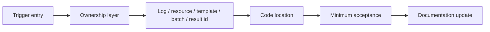

# Engine Business Scenario Playbook

This page organizes Engine handoff by "what to do after receiving a field requirement or defect." It complements the [Engine Business Flow Matrix](./business-flow-matrix.md) and [Engine Business Handoff](./business-handoff.md): the matrix locates the chain, the handoff page explains the full chain, and this page turns common changes into executable steps.

## How to Use This Page

| Current task | Start here | Then read |
| --- | --- | --- |
| Device missing, cannot connect, or new device needed | [Device Scenarios](#device-scenarios) | Device service chain |
| Template parameter change, save failure, flow import failure | [Template and Flow Scenarios](#template-and-flow-scenarios) | Template and Flow chain |
| Algorithm finished but result or overlay is missing | [Result Display Scenarios](#result-display-scenarios) | Result display and project handoff chain |
| Customer CSV/PDF/MES fields are wrong | [Project Package Reads Engine Results](#project-package-reads-engine-results) | Project package handoff |
| Socket/MQTT integration abnormal | [External System and Remote Service Scenarios](#external-system-and-remote-service-scenarios) | SocketProtocol, project page, MQTT config |
| You only know a class name | [Reverse Lookup by Class Name](#reverse-lookup-by-class-name) | Engine runtime object map |

## Make Three Decisions First

Do these before changing code:

1. Identify the entry: user UI action, Flow node execution, project automation, Socket/MES trigger, or scheduled job.
2. Identify ownership: resource/device, template/Flow, remote service, result display, project mapping, or delivery export.
3. Gather evidence: at least one log line, resource/template name, batch/SN/result id, or file path.



## Device Scenarios

### Scenario A: Device Exists in Database but Not in UI or Flow

| Step | Check | Code/data entry |
| --- | --- | --- |
| 1 | MySQL connected, resource enabled and not deleted | `MySqlInitializer`, `SysResourceModel` |
| 2 | Resource `Type` maps to `ServiceTypes` | `Services/Type/TypeService.cs` |
| 3 | `ServiceTypes` has a registered factory | `Services/Devices/DeviceServiceFactory.cs` |
| 4 | `ServiceManager.DeviceServices` contains the instance | `Services/ServiceManager.cs` |
| 5 | Flow node configurator filters the right device type | `Templates/Flow/NodeConfigurator/` |

Minimum acceptance: after refreshing the resource tree, the device appears, the device page opens and shows state, and the Flow node property panel can select the device.

Do not hard-code device objects inside Flow nodes. That bypasses `ServiceManager` and makes the device page, status bar, and project package readback inconsistent.

### Scenario B: Add a New Device Type

Recommended steps:

1. Add the device type to `ServiceTypes`.
2. Add `ConfigXxx : DeviceServiceConfig` with connection parameters and defaults.
3. Add `DeviceXxx : DeviceService<ConfigXxx>` and keep connection, state, and command entries in the service layer.
4. Register the factory in `DeviceServiceFactoryRegistry`.
5. If the device needs a main display page, add `GetDisplayControl()` and `DisplayXxx`.
6. If the device participates in Flow, add a `NodeConfigurator` or related node type.
7. If it uses MQTT commands, add or reuse `MQTTXxx`.
8. Update device user docs, the device service chain page, and this page.

Acceptance:

| Check | Pass standard |
| --- | --- |
| Resource creation | Database resource type and config fields are correct |
| Service creation | `DeviceXxx` appears in `ServiceManager` |
| UI display | Device page opens and state refreshes |
| Command execution | Minimum command succeeds, failure logs are clear |
| Flow binding | Node can select the device and reopen without losing it |
| Project usage | If used by a project package, one minimal project flow completes |

## Template and Flow Scenarios

### Scenario C: Add or Change Algorithm Template Parameters

First identify the template type:

| Template type | Common directory | Meaning |
| --- | --- | --- |
| General JSON algorithm template | `Templates/Jsons/` | MTF, FOV, Ghost, KB, OLED AOI, and similar algorithms |
| POI/ROI template | `Templates/POI/`, `Templates/FindLightArea/` | Points, regions, luminous area |
| Flow template | `Templates/Flow/` | Saved visual workflow |
| Device action template | `Services/Devices/*/Templates/` | Camera exposure, autofocus, PG, SMU, and similar device actions |

Change steps:

1. Update the parameter class while keeping field names, defaults, and old-data compatibility in mind.
2. If users edit the parameter, add `DisplayName`, `Description`, category, and a custom editor where needed.
3. Update the template entry and confirm `Code`, `Title`, and `TemplateDicId` do not conflict.
4. If Flow nodes reference the parameter, update the node configurator read/write logic.
5. If result display depends on it, inspect `AlgorithmXxx`, DAO, and `ViewHandleXxx`.
6. Validate old template, new template, copied template, and imported template.

Risks:

- `TemplateControl` lives in `TemplateContorl.cs`; the filename typo is not a second controller.
- Template-name conflicts affect Flow import and project package selection.
- Changing only the parameter class without editor metadata leaves users with raw field names.

### Scenario D: Add a Flow Node or Change Node Binding

A Flow node change must cover three layers:

| Layer | Focus | Code entry |
| --- | --- | --- |
| Node execution skeleton | Inputs, outputs, runtime event, start/end | `Engine/FlowEngineLib/` |
| Engine business binding | How device, template, or parameter is written to the node | `Templates/Flow/NodeConfigurator/` |
| Project post-processing | Who reads the result after Flow completion | `Projects/*/Process/`, `FlowControl.FlowCompleted` |

Steps:

1. Add a node type in `FlowEngineLib` or reuse an existing node.
2. If the node binds a device, template, POI, or algorithm parameter, add or update `NodeConfigurator`.
3. Open the Flow editor and confirm the node property panel shows business fields.
4. Save the flow, close it, reopen it, and confirm parameters persist.
5. Export `.cvflow`, import it into a clean environment, and confirm associated templates and node parameters still work.
6. Run the flow and confirm `FlowControl.FlowCompleted` returns status and parameters.

Minimum acceptance: open, edit, save, reopen, execute, and inspect completion state. Missing any one step is not enough.

## Result Display Scenarios

### Scenario E: Algorithm Has Results but History or Overlay Does Not Display

Troubleshooting order:

1. Confirm an `AlgResultMasterModel` record exists.
2. Check `ViewResultAlg.FilePath`, `ResultType`, and `ResultCode`.
3. Confirm `DisplayAlgorithmManager` discovered the matching `ViewHandleXxx`.
4. Confirm `ViewHandleXxx.CanHandle` includes the current `ViewResultAlgType`.
5. Confirm DAO reads detail data and fills `result.ViewResults`.
6. Confirm `ImageView` receives the correct image path and overlay coordinates are converted for the current image size.

Add a new result display:

| Step | Code entry |
| --- | --- |
| Define detail model | Implement `IViewResult` |
| Read detail data | Template-local `*Dao.cs` or Engine `Dao/` |
| Add display handler | `ViewHandleXxx : IResultHandleBase` |
| Declare supported type | `CanHandle` / `CanHandle1(result)` |
| Draw overlay | Reuse `ColorVision.ImageEditor.Draw` primitives |
| Map project fields | Keep customer fields in `Projects/<Project>/Process/Recipe/Fix` |

Do not put customer PASS/FAIL rules into generic `ViewHandleXxx`. Generic handlers display results; project packages judge and export them.

## Project Package Reads Engine Results

### Scenario F: UI Has Result but Customer CSV/PDF/MES Field Is Empty or Wrong

Separate three layers:

| Layer | Evidence | First check |
| --- | --- | --- |
| Engine raw result | Historical result page, DAO, batch id | `ViewResultAlg`, template DAO |
| Project business mapping | Empty field in `ObjectiveTestResult` | `Projects/<Project>/Process/` |
| Customer export format | CSV/PDF/MES field name or order is wrong | Project exporter, Socket/MES response model |

Troubleshooting order:

1. Confirm Engine raw result has value by batch, SN, or result id.
2. Check whether project `Process` reads the correct template name, key, or detail type.
3. Check whether `Recipe` / `Fix` changes the value to empty, Fail, or legacy format.
4. Check whether `ObjectiveTestResult` fields match exporter fields.
5. For Socket/MES, check event name, response fields, and customer protocol version.

Ownership rule: common algorithm result, overlay, and DAO stay in Engine. Customer fields, judgment thresholds, export order, and protocol responses should live in the project package.

## External System and Remote Service Scenarios

### Scenario G: Flow Node Runs but Remote Service Produces No Result

Check order:

| Stage | First check |
| --- | --- |
| MQTT connection | `MQTTControl` is connected and broker config is correct |
| Service registration | `MqttRCService.ServiceTokens` contains the target service token |
| Device command | Parameters built by `Services/Devices/*/MQTT*.cs` are correct |
| File dependency | FileServer can download algorithm input or output files |
| Result query | DAO can read details after the result id returns |
| Flow state | `FlowControlData.Status` and `Params` expose the failure reason |

If the backend did not receive a command, inspect MQTT topic and token first. If the backend succeeded but local result is missing, inspect file server, result id, and DAO.

### Scenario H: Socket/MES Connects but Business Result Is Wrong

Socket/MES is usually project-package business, not generic Engine device logic.

1. Confirm whether the entry is the generic `UI/ColorVision.SocketProtocol` server or the project package's own `SocketControl`.
2. Confirm event name, SN, flow group, template name, and response fields against the current project page, not another customer project.
3. Confirm the external trigger actually starts Engine Flow.
4. Confirm the project package reads the correct result after `FlowCompleted`.
5. Confirm Socket/MES response is sent after the final project result is ready.

If protocol fields differ from customer requirements, update the project page and [Project Capability & Handoff Matrix](../projects/project-capability-matrix.md).

## Reverse Lookup by Class Name

| Class | Usually belongs to | Next step |
| --- | --- | --- |
| `ServiceManager` | Device resource loading and runtime device collection | Check device creation and service-tree refresh |
| `DeviceServiceFactoryRegistry` | Resource type to device instance | Check new device registration |
| `TemplateControl` | Template discovery and entry dictionary | Check template scan and load |
| `TemplateFlow` | Flow template save/import/export | Check `.cvflow`, `DataBase64`, associated templates |
| `FlowControl` | Engine-side flow execution wrapper | Check `FlowCompleted` and execution state |
| `NodeConfiguratorRegistry` | Flow node business parameter binding | Check node property restore |
| `ViewResultAlg` | Generic algorithm master result | Check history result, file path, result type |
| `IResultHandleBase` | Result display handler | Check overlay, table, side panel display |
| `ObjectiveTestResult` | Project customer result | Check CSV/PDF/MES/Socket fields |

For the full class index, read the Engine runtime object map.

## Handoff Record Template

Every Engine business change should record:

| Field | Example |
| --- | --- |
| Business goal | Add a device, fix a template, add a result overlay |
| Trigger entry | User click, Flow node, project package, Socket/MES, scheduler |
| Code location | Directory, key class, config table |
| Input data | Device code, template name, SN, batch id, result id, file path |
| Output result | UI state, Flow state, result table, overlay, CSV/PDF/MES |
| Acceptance steps | Save/reopen, minimal flow, historical result, export file, external response |
| Docs updated | This page, chain page, project page, plugin page, user manual |

## Minimum Validation After Each Change

| Change type | Required validation |
| --- | --- |
| Device service | Resource creation, device page, command execution, Flow binding |
| Template parameter | Create, edit, save, copy, import, old-data compatibility |
| Flow node | Open, edit, save, reopen, execute, inspect `FlowCompleted` |
| Result display | Historical result, image open, overlay coordinates, table/side panel, project export |
| Project readback | SN/batch, project result, CSV/PDF, Socket/MES response |
| Remote service | MQTT connection, service token, result id, file download, DAO query |

Docs-site changes must still run:

```powershell
npm run docs:build
```

Then check the new page, local HTML, search index, and navigation entry.
