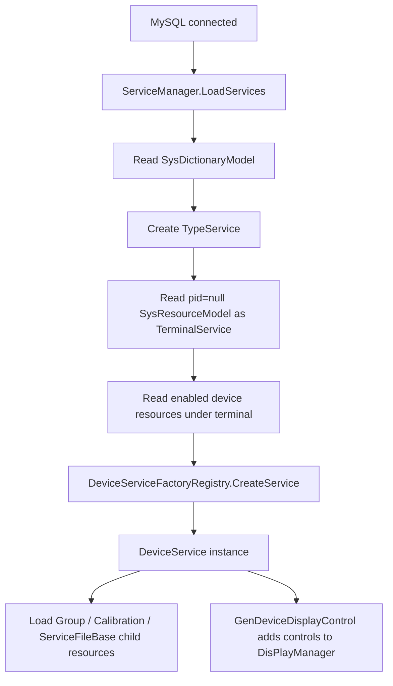

# Engine Device Service Chain

This page explains the full path from database resource to runtime `DeviceService`. Read it before taking over device services, terminals, MQTT device wrappers, or device display pages.

## One Sentence

Device services are not manually created by windows. They are produced from `SysResourceModel`, `ServiceTypes`, `DeviceServiceFactoryRegistry`, and `ServiceManager`.

## Key Source Files

| Source | Purpose |
| --- | --- |
| `Services/ServiceManager.cs` | Device service collection center; loads terminals, devices, groups, and calibration resources |
| `Services/DeviceService.cs` | Device service base class |
| `Services/Devices/DeviceServiceFactory.cs` | Device service factory registry |
| `Services/Devices/DeviceServiceConfig.cs` | Device config base class |
| `Services/Type/TypeService.cs` | `ServiceTypes` enum and type tree nodes |
| `Services/Terminal/` | Terminal nodes |
| `Services/Devices/<Device>/` | Concrete device implementations |

## Resource Hierarchy

Runtime resources are roughly organized like this:

```text
SysDictionaryModel
  TypeService
    TerminalService              # terminal resource with pid = null
      DeviceService              # enabled device resource with pid = terminal id
        GroupResource            # type = Group
        CalibrationResource      # type 30-50
        ServiceFileBase          # other device child resources
```

`ServiceManager.LoadServices()` reads `SysDictionaryModel` and `SysResourceModel` from database, then builds this tree.

## Startup And Reload

`ServiceManager` is a singleton:

```text
ServiceManager.GetInstance()
```

During initialization, if MySQL is connected, it runs `LoadServices()` on the UI Dispatcher. Later, `MySqlControl.GetInstance().MySqlConnectChanged` triggers reload.

Missing devices are not always code defects. They may come from disconnected MySQL, deleted resources, disabled resources, tenant mismatch, or an unexpected resource hierarchy.

## Device Service Creation Flow



## Default Device Types

`DeviceServiceFactoryRegistry.RegisterDefaults()` currently registers:

| ServiceTypes | Device class | Config class | Meaning |
| --- | --- | --- | --- |
| `Camera` | `DeviceCamera` | `ConfigCamera` | Camera |
| `PG` | `DevicePG` | `ConfigPG` | Pattern Generator |
| `Spectrum` | `DeviceSpectrum` | `ConfigSpectrum` | Spectrometer |
| `SMU` | `DeviceSMU` | `ConfigSMU` | SMU |
| `Sensor` | `DeviceSensor` | `ConfigSensor` | Sensor |
| `FileServer` | `DeviceFileServer` | `ConfigFileServer` | File server with default endpoint/port/path |
| `Algorithm` | `DeviceAlgorithm` | `ConfigAlgorithm` | Algorithm service, default `IsCCTWave = true` |
| `FilterWheel` | `DeviceCfwPort` | `ConfigCfwPort` | Filter wheel |
| `Calibration` | `DeviceCalibration` | `ConfigCalibration` | Calibration service |
| `Motor` | `DeviceMotor` | `ConfigMotor` | Motor |
| `ThirdPartyAlgorithms` | `DeviceThirdPartyAlgorithms` | `ConfigThirdPartyAlgorithms` | Third-party algorithm |
| `Flow` | `DeviceFlowDevice` | `ConfigFlowDevice` | Flow device |

If `SysResourceModel.Type` maps to a `ServiceTypes` value that has no registered factory, `CreateService()` returns `null` and the device does not enter `DeviceServices`.

## TypeService Filtering

`LoadServices()` skips some dictionary types:

```text
6, 11, 12, 13, 14, 15, 16, 17
```

These correspond to types such as FileServer, FocusRing, Flow, Archived, ThirdPartyAlgorithms, ThirdPartyAlgorithms32, PowerControl, and LightingControl. Do not assume that a value appearing in the enum always appears in the left type tree.

## Display Page Generation

After device loading, display area entries are still a separate path. `ServiceManager` has two display generation methods:

| Method | Meaning |
| --- | --- |
| `GenDeviceDisplayControl()` | Traverses `TypeServices` and generates device display controls |
| `GenControl(ObservableCollection<DeviceService>)` | Generates display controls from a specific device collection |

Both first put `FlowEngineManager.GetInstance().DisplayFlow` as the first display page, then append each device's `GetDisplayControl()`.

If the device exists in the tree but no main-area page appears, check:

1. Whether the device returns an `IDisPlayControl`.
2. Whether `GenDeviceDisplayControl()` ran.
3. Whether `DisPlayManager.GetInstance().RestoreControl()` restored an old layout.

## Steps For Adding A Device

1. Add a value to `ServiceTypes`.
2. Add `ConfigXxx : DeviceServiceConfig`.
3. Add `DeviceXxx : DeviceService<ConfigXxx>`.
4. Register a factory in `DeviceServiceFactoryRegistry.RegisterDefaults()` or a suitable initialization point.
5. Set `terminalIconResourceKey` if the terminal needs an icon.
6. Use `configureConfig` for default config values.
7. Add `Templates/Flow/NodeConfigurator/` support if the device is used by Flow nodes.
8. Implement `GetDisplayControl()` if the device needs a display page.
9. Update this page and user-facing device docs.

## Troubleshooting Checklist

| Symptom | Check first |
| --- | --- |
| Type tree has no device category | `SysDictionaryModel`, filtered types, MySQL connection |
| Terminal exists but no devices | `SysResourceModel.Pid`, `IsEnable`, `IsDelete`, `TenantId` |
| Resource exists but device is not created | `ServiceTypes` value and `DeviceServiceFactoryRegistry` |
| Device is created but no display page | `GetDisplayControl()`, `IDisPlayControl`, `DisPlayManager` |
| Calibration/group resource missing | Child resource type should be `Group` or 30-50 |
| State is wrong after DB reconnect | Whether `MySqlConnectChanged` triggered `LoadServices()` |

## Do Not Change It This Way

- Do not bypass `ServiceManager` from window code to maintain a global device collection manually.
- Do not add only a menu or window without registering `DeviceServiceFactoryRegistry`.
- Do not make lower-level device classes depend on customer project packages.
- Do not merge calibration resources, group resources, and device services into one object layer.
