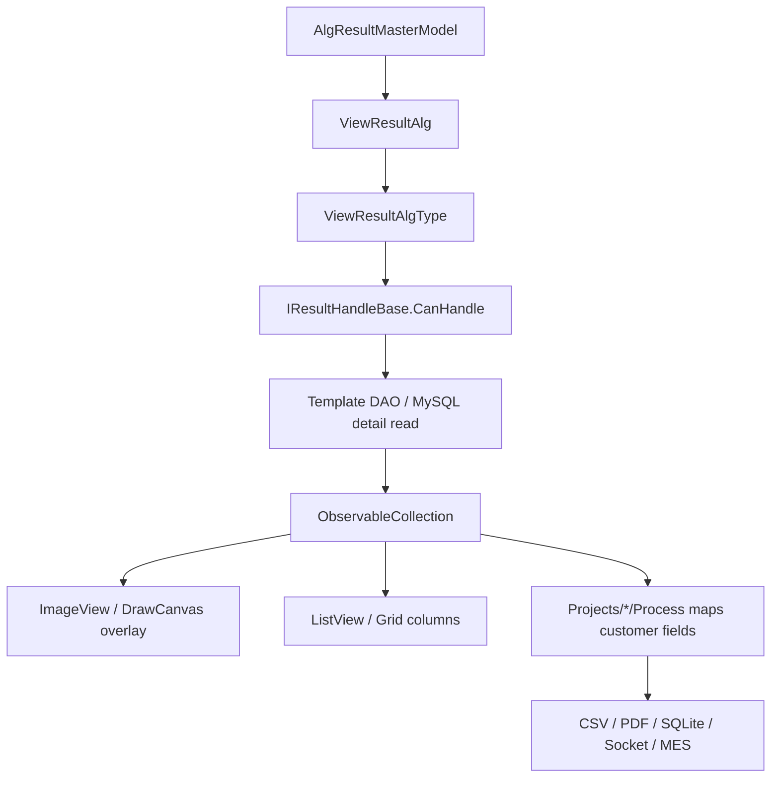

# Engine Result Display And Project Handoff Chain

This page explains how algorithm results return from database/backend service to ImageEditor overlay, and then become customer-facing project results. Read it before maintaining result display, overlays, CSV/PDF/MES/Socket output.

## One Sentence

The Engine result path has three layers: generic algorithm result model, generic display handler, and project-package business-result mapping. Do not put customer judgment rules into generic result handlers.

## Key Source Files

| Source | Purpose |
| --- | --- |
| `Services/Core/ViewResultAlg.cs` | Generic algorithm result view model |
| `Abstractions/IViewResult.cs` | Result-detail marker interface and collection conversion |
| `Abstractions/IResultHandlers.cs` | Result handler contracts and base class |
| `Abstractions/IDisplayAlgorithm.cs` | Result handler scanning and algorithm display entry |
| `Services/Devices/Algorithm/Views/AlgorithmView.xaml.cs` | Algorithm result viewer |
| `Templates/**/ViewHandle*.cs` | Algorithm-specific display handlers |
| `Templates/**/*Dao.cs` | Algorithm detail-result readers |
| `Projects/*/Process/` | Customer project result mapping |

## Result Object Layers

| Layer | Type | Meaning |
| --- | --- | --- |
| Master result | `ViewResultAlg` | Batch, file path, template name, result type, duration, result description |
| Detail result | `IViewResult` | POI, MTF, SFR, FOV, Ghost, and other algorithm details |
| Display handler | `IResultHandleBase` | Decides whether it can handle a `ViewResultAlgType` and renders UI/overlay |
| Project business result | `ObjectiveTestResult` and related types | Customer fields, judgment, export, MES/Socket response |

`ViewResultAlg.ViewResults` is the generic detail collection:

```text
ObservableCollection<IViewResult>
```

Algorithm handlers load detail rows through DAO and put them into this collection for UI display.

## What ViewResultAlg Owns

`ViewResultAlg` is constructed from `AlgResultMasterModel`. Main fields include:

- `Id`
- `Batch`
- `FilePath`
- `POITemplateName`
- `CreateTime`
- `ResultType`
- `ResultCode`
- `ResultDesc`
- `ResultImagFile`
- `TotalTime`
- `Version`

It also owns several context-menu commands:

- Open containing folder.
- Export CVCIE.
- Copy original file.
- Generate POI template from result.

So `ViewResultAlg` is not a pure DTO; it contains interaction commands needed by the result viewer.

## Handler Discovery

`DisplayAlgorithmManager` does this during construction:

1. Iterate `AssemblyHandler.GetInstance().GetAssemblies()`.
2. Find non-abstract types inheriting `IResultHandleBase`.
3. Create them with `Activator.CreateInstance(type)`.
4. Add them to `ResultHandles`.

If a new `ViewHandleXxx` does not work, first check:

- Assembly was loaded.
- Handler inherits `IResultHandleBase`.
- Handler is not abstract.
- Parameterless construction works.
- `CanHandle` contains the correct `ViewResultAlgType`.

## How A Handler Works

Core members of `IResultHandleBase`:

| Member | Meaning |
| --- | --- |
| `Name` | Defaults to type name |
| `RenderConfig` | Overlay text, decimals, font, line width, etc. |
| `CanHandle` | Supported `ViewResultAlgType` list |
| `CanHandle1(result)` | Runtime check for a specific master result |
| `Handle(context, result)` | Process and display result |
| `Load(context, result)` | Optional loading stage |
| `SideSave(result, selectedPath)` | Optional side-panel data save |

`ViewResultContext` provides:

- `ImageView`
- `ListView`
- `LeftGridViewColumnVisibilitys`
- `SideTextBox`

So a handler can update image overlay, table columns, and side-panel text together.

## Typical Result Chain



## Overlay Drawing

Generic result handlers should reuse `ColorVision.ImageEditor` primitives and `ImageView` behavior instead of drawing arbitrary WPF elements.

`IResultHandleBase.AddPOIPoint()` is a typical example:

- Circular POI uses `DVCircleText`.
- Rectangular POI uses `DVRectangleText`.
- Solid point uses `DVCircle`.
- Visuals are added through `imageView.AddVisual(...)`.

When adding result overlay, prefer the ImageEditor `Draw/` primitive system. Do not build an isolated Canvas drawing system inside a handler.

## Common Handler Locations

| Directory | Examples |
| --- | --- |
| `Templates/ARVR/SFR/` | `ViewHandleSFR` |
| `Templates/ARVR/MTF/` | `ViewHandleMTF` |
| `Templates/ARVR/Ghost/` | `ViewHandleGhost` |
| `Templates/ARVR/FOV/` | `ViewHandleFOV` |
| `Templates/POI/AlgorithmImp/` | `ViewHandleRealPOI`, `ViewHanlePOIY` |
| `Templates/Jsons/*/` | `ViewHandleSFR2`, `ViewHandleBlackMura`, `ViewHandleFindCross`, etc. |
| `Templates/Compliance/` | [Compliance Result Handoff](../algorithms/templates/compliance-results.md): `ViewHandleComplianceY/XYZ/JND` |
| `Templates/Matching/` | [Matching Template](../algorithms/templates/matching-template.md): `ViewHandleMatching` and AOI four-point overlay |
| `Templates/ImageCropping/` | [ImageCropping Template](../algorithms/templates/image-cropping-template.md): `ViewHandleImageCropping` and cropped-file details |

Many detail-read paths live near the handler in template-directory DAO files. For a result bug, usually follow `ViewHandle -> Dao -> IViewResult model`.

## How Project Packages Use Results

Project packages should not modify generic handlers to implement customer fields. A better path is:

1. Flow or algorithm execution completes.
2. Engine generates master and detail results.
3. Generic handler ensures image, table, and side-panel display are correct.
4. Project package reads required data in `Process/`, `Recipe/`, or `Fix/`.
5. It maps data into `ObjectiveTestResult` or a project-specific result model.
6. It outputs CSV, PDF, SQLite, Socket, or MES response.

Typical project locations:

- `Projects/ProjectLUX/Process/`
- `Projects/ProjectARVRPro/Process/`
- `Projects/ProjectKB/`

## Steps For Adding Algorithm Result Display

1. Confirm the master result `ViewResultAlgType`.
2. Add a detail model implementing `IViewResult`.
3. Add a DAO to read detail data from MySQL/backend.
4. Add `ViewHandleXxx : IResultHandleBase`.
5. Declare supported result types in `CanHandle`.
6. In `Handle()`, fill `result.ViewResults` and update `ImageView` overlay, table, or side panel.
7. If a project package needs customer fields, map them separately in project `Process/Recipe/Fix`.
8. Validate with real results: historical result list, image overlay, table columns, exported fields.

## Troubleshooting Checklist

| Symptom | Check first |
| --- | --- |
| Historical result exists but image cannot open | `ViewResultAlg.FilePath`, file-server download, original file existence |
| Image opens but no overlay | Handler scan, `CanHandle` match, DAO detail query |
| Overlay coordinate is wrong | Image size, coordinate system, POI/ROI pixel conversion |
| Left table has no columns or rows | `ViewResults` type, `GridViewColumnVisibility`, handler fill logic |
| Project CSV field is empty | Project `Process` key, Recipe/Fix correction, export field name |
| Result handled by wrong handler | `ViewResultAlgType` and overlapping handler `CanHandle` values |

## Do Not Change It This Way

- Do not put customer judgment rules into generic `ViewHandleXxx`.
- Do not bypass `IViewResult` and pass anonymous objects to project packages.
- Do not create a separate drawing framework inside a handler.
- Do not validate only new results; historical result replay must also be tested.

## Further Reading

- [Compliance Result Handoff](../algorithms/templates/compliance-results.md)
- [Validate Rule Templates](../algorithms/templates/validate-rules.md)
- [BuzProduct Business Template](../algorithms/templates/buz-product-template.md)
