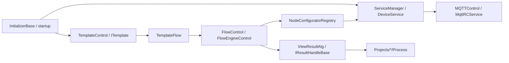

# Engine Runtime Object Map

This page organizes core `Engine/` classes by runtime responsibility. It does not replace [Engine Business Handoff](./business-handoff.md); it gives maintainers an index for answering: when I see a class name, which business chain does it belong to?

## Global Runtime Chain

Debug in this order: initialization, device creation, template loading, Flow node binding, result handler, then project-package result mapping.

## Startup And Initialization Objects

| Object | Source | Chain | Handoff focus |
| --- | --- | --- | --- |
| `MySqlInitializer` | `Engine/ColorVision.Engine/MySqlInitializer.cs` | Database initialization | Whether MySQL is connected before templates and devices load |
| `MqttInitializer` | `Engine/ColorVision.Engine/MQTT/MqttInitializer.cs` | MQTT initialization | MQTT config, connection window, default broker |
| `ServiceInitializer` | `Engine/ColorVision.Engine/Services/ServiceInitializer.cs` | Device service initialization | Whether `ServiceManager.GetInstance()` is called |
| `TemplateInitializer` | `Engine/ColorVision.Engine/Templates/TemplateContorl.cs` | Template initialization | `Order=4`, depends on `MySqlInitializer`, loads templates on Dispatcher |
| `IInitializerFlow` | `Engine/ColorVision.Engine/Templates/Flow/FlowEngineManager.cs` | Flow initialization | Flow display page and `FlowEngineManager` |
| `RCInitializer` | `Engine/ColorVision.Engine/Services/RC/RCInitializer.cs` | RC/MQTT service | Remote service token and service start/stop |

If templates are empty, devices are missing, or the Flow page is absent after startup, inspect initializer execution order before changing window code.

## Device And Resource Objects

| Object | Source | Responsibility | Common callers |
| --- | --- | --- | --- |
| `ServiceTypes` | `Services/Type/TypeService.cs` | Device/resource type enum | Resource tree, factory registry, device creation |
| `TypeService` | `Services/Type/TypeService.cs` | Groups resources by dictionary type | `ServiceManager.LoadServices()` |
| `ServiceManager` | `Services/ServiceManager.cs` | Runtime device-service collection center | Main UI, Flow node configurators, device display pages |
| `DeviceService` | `Services/DeviceService.cs` | Device-service base class | Camera, PG, Spectrum, SMU, etc. |
| `DeviceService<TConfig>` | `Services/DeviceService.cs` | Typed device base class | Concrete `DeviceXxx` classes |
| `DeviceServiceConfig` | `Services/Devices/DeviceServiceConfig.cs` | Base device config | Property editor, service startup |
| `DeviceServiceFactoryRegistry` | `Services/Devices/DeviceServiceFactory.cs` | Maps `ServiceTypes` to factories | `ServiceManager` |
| `DeviceServiceFactory<TConfig>` | `Services/Devices/DeviceServiceFactory.cs` | Default factory implementation | New device types |

Default registered devices include Camera, PG, Spectrum, SMU, Sensor, FileServer, Algorithm, FilterWheel, Calibration, Motor, ThirdPartyAlgorithms, and Flow. A new device must enter `DeviceServiceFactoryRegistry`, or a database resource will never become a runtime service.

## Concrete Device Directories

| Directory | Device | Handoff focus |
| --- | --- | --- |
| `Services/Devices/Camera/` | Camera | Capture, auto exposure, auto focus, camera templates |
| `Services/Devices/PG/` | Pattern Generator | Pattern switching and PG templates |
| `Services/Devices/Spectrum/` | Spectrometer | Spectrum capture, luminous flux, spectrum result reading |
| `Services/Devices/SMU/` | SMU | Source meter control |
| `Services/Devices/Sensor/` | Sensor | Generic sensor commands |
| `Services/Devices/FileServer/` | File server | Raw file download and path handling |
| `Services/Devices/Algorithm/` | Algorithm service | Algorithm execution, result query, `AlgorithmView` |
| `Services/Devices/Calibration/` | Calibration service | Calibration resources and camera calibration path |
| `Services/Devices/Motor/` | Motor | Motor movement and position |
| `Services/Devices/CfwPort/` | Filter wheel | Filter-wheel serial/port control |
| `Services/Devices/ThirdPartyAlgorithms/` | Third-party algorithm | External algorithm result viewing |
| `Services/Devices/FlowDevice/` | Flow device | Flow service integration |

Display views, template files, and MQTT wrappers in a device directory are usually different layers of the same business chain. Do not inspect only the window.

## MQTT And Remote Service Objects

| Object | Source | Responsibility |
| --- | --- | --- |
| `MQTTControl` | `MQTT/MQTTControl.cs` | MQTT connection state, start/stop, message forwarding |
| `MQTTConfig` | `MQTT/MQTTConfig.cs` | MQTT connection config |
| `MQTTConnect` | `MQTT/MQTTConnect.xaml.cs` | MQTT config window |
| `MqttRCService` | `Services/RC/MQTTRCService.cs` | Remote control service, service token, service restart |
| `Messages/` | `Messages/` | MQTT and business message models |

Many Flow nodes do not compute locally. They send device commands through MQTT and receive a result ID or file path from the backend. If a node runs but produces no result, inspect MQTT connection, topic, backend response, and file-server download.

## Template Objects

| Object | Source | Responsibility | Handoff focus |
| --- | --- | --- | --- |
| `IITemplateLoad` | `Templates/TemplateContorl.cs` | Template loading extension point | Type scanning and parameterless construction |
| `TemplateControl` | `Templates/TemplateContorl.cs` | Template entry dictionary and initialization center | `ITemplateNames`, `AddITemplateInstance` |
| `ITemplate<T>` | `Templates/ITemplate.cs` | Standard template entry | `Code`, `Title`, `Params`, menu |
| `ITemplateJson<T>` | `Templates/Jsons/` | JSON algorithm template entry | JSON params, editor control, algorithm command |
| `TemplateModel<T>` | `Templates/TemplateModel.cs` | Template-list item wrapper | Name, copy, rename, parameter object |
| `TemplateManagerWindow` | `Templates/TemplateManagerWindow.xaml.cs` | Template entry management window | Template categories and entry list |
| `TemplateEditorWindow` | `Templates/TemplateEditorWindow.xaml.cs` | Single-template editor host | PropertyGrid or custom UserControl |

Templates are not just UI forms. They affect algorithm parameters, Flow node binding, import/export, and project-package parsing. When changing template name, `Code`, or parameter fields, validate Flow and result handlers.

## Main Template Directories

| Directory | Meaning |
| --- | --- |
| `Templates/Flow/` | Visual Flow templates, `.cvflow` and STN data |
| `Templates/POI/` | POI point sets, point building, POI result |
| `Templates/Jsons/` | JSON algorithm templates: MTF, FOV, Ghost, KB, OLED AOI, etc. |
| `Templates/ARVR/` | AR/VR historical and general algorithm templates |
| `Templates/Compliance/` | Luminance, chromaticity, JND compliance results |
| `Templates/FindLightArea/` | Light-area detection |
| `Templates/ImageCropping/` | Image cropping |
| `Templates/Matching/` | AOI/matching results |
| `Templates/DataLoad/` | Data-load templates |
| `Services/Devices/*/Templates/` | Device-side templates such as exposure, auto focus, PG, SMU |

When adding an algorithm template, decide whether it is a generic JSON algorithm, a device-action template, or a project-only process. Customer judgment belongs in project package docs/code, not in generic templates.

## Flow Objects

| Object | Source | Responsibility |
| --- | --- | --- |
| `TemplateFlow` | `Templates/Flow/TemplateFlow.cs` | Flow template save, load, import, export |
| `FlowParam` | `Templates/Flow/` | Single flow template parameter and Base64 STN |
| `FlowControl` | `Templates/Flow/FlowControl.cs` | Engine-side Flow execution wrapper |
| `FlowControlData` | `Templates/Flow/FlowControl.cs` | Flow completion event data |
| `FlowEngineManager` | `Templates/Flow/FlowEngineManager.cs` | Flow display and FlowEngine runtime management |
| `DisplayFlow` | `Templates/Flow/DisplayFlow.xaml.cs` | Main flow display page |
| `FlowEngineControl` | `Engine/FlowEngineLib/FlowEngineControl.cs` | FlowEngineLib execution control |
| `BaseStartNode` | `Engine/FlowEngineLib/Start/BaseStartNode.cs` | Start node |
| `CVEndNode` | `Engine/FlowEngineLib/End/CVEndNode.cs` | End node |

Project packages typically select a `TemplateFlow`, run Flow, wait for `FlowCompleted`, and then parse results. They should not reimplement the FlowEngine main loop.

## Node Configurator Objects

| Object | Source | Responsibility |
| --- | --- | --- |
| `NodeConfiguratorRegistry` | `Templates/Flow/NodeConfigurator/NodeConfiguratorRegistry.cs` | Scans `INodeConfigurator` and registers by node type |
| `NodeConfiguratorAttribute` | `Templates/Flow/NodeConfigurator/NodeConfiguratorAttribute.cs` | Declares which node type a configurator supports |
| `NodeConfiguratorBase` | `Templates/Flow/NodeConfigurator/NodeConfiguratorBase.cs` | Base configurator |
| `DeviceOnlyNodeConfigurator<TNode,TDevice>` | `Templates/Flow/NodeConfigurator/NodeConfiguratorBase.cs` | Base for device-only binding |
| `NodeConfiguratorContext` | `Templates/Flow/NodeConfigurator/NodeConfiguratorContext.cs` | Context passed to configurators |
| `CameraNodeConfigurators` | `Templates/Flow/NodeConfigurator/CameraNodeConfigurators.cs` | Camera node binding |
| `AlgorithmNodeConfigurators` | `Templates/Flow/NodeConfigurator/AlgorithmNodeConfigurators.cs` | Algorithm node binding |
| `POINodeConfigurators` | `Templates/Flow/NodeConfigurator/POINodeConfigurators.cs` | POI node binding |
| `SpectrumNodeConfigurators` | `Templates/Flow/NodeConfigurator/SpectrumNodeConfigurators.cs` | Spectrum node binding |
| `OLEDNodeConfigurators` | `Templates/Flow/NodeConfigurator/OLEDNodeConfigurators.cs` | OLED/AOI node binding |
| `DeviceNodeConfigurators` | `Templates/Flow/NodeConfigurator/DeviceNodeConfigurators.cs` | PG, SMU, Sensor, Calibration, etc. |

For a new Flow node, confirm three things: node type exists in FlowEngineLib, a configurator is discoverable, and the configurator writes device/template/parameter values back to the node.

## Result Objects

| Object | Source | Responsibility |
| --- | --- | --- |
| `ViewResultAlg` | `Services/Core/ViewResultAlg.cs` | Generic algorithm master-result view model |
| `IViewResult` | `Abstractions/IViewResult.cs` | Algorithm detail-result interface |
| `IResultHandleBase` | `Abstractions/IResultHandlers.cs` | Generic result handler base |
| `DisplayAlgorithmManager` | `Abstractions/IDisplayAlgorithm.cs` | Scans result handlers |
| `AlgorithmView` | `Services/Devices/Algorithm/Views/AlgorithmView.xaml.cs` | Algorithm result viewing UI |
| `Templates/**/ViewHandle*.cs` | Template directories | Concrete algorithm result display |
| `Templates/**/*Dao.cs` | Template directories | Detail-result reading |

Separate three layers: Engine master result, generic display handler, and project-package business result. Customer CSV or MES fields should be mapped in project `Process/Recipe/Fix`, not inside generic `ViewHandle`.

## Data And Batch Objects

| Object | Source | Responsibility |
| --- | --- | --- |
| `MeasureBatchModel` | `Dao/MeasureBatchModel.cs` | Test batch model |
| `BatchResultMasterDao` | `Dao/MeasureBatchModel.cs` | Batch query DAO |
| `Dao/` | `Engine/ColorVision.Engine/Dao/` | Engine data access |
| `Batch/` | `Engine/ColorVision.Engine/Batch/` | Batch UI and logic |
| `Archive/` | `Engine/ColorVision.Engine/Archive/` | Archived result lookup |
| `Reports/` | `Engine/ColorVision.Engine/Reports/` | Report generation |

Project packages usually create or query a batch while running Flow, then use batch ID to retrieve algorithm results. If project output is empty, batch and template-name matching are the first checks.

## Task Lookup

| Task | Start with | Then read |
| --- | --- | --- |
| Device does not appear | `ServiceManager`, `DeviceServiceFactoryRegistry`, `ServiceTypes` | [Device Service Chain](./device-service-chain.md) |
| Add a device type | `DeviceService<TConfig>`, `DeviceServiceFactory<TConfig>` | [Device Service Chain](./device-service-chain.md) |
| Template does not appear | `TemplateInitializer`, `TemplateControl`, `IITemplateLoad` | [Templates And Flow Chain](./template-flow-chain.md) |
| Flow save fails | `TemplateFlow`, `FlowParam`, `SysResourceModel.Value` | [Templates And Flow Chain](./template-flow-chain.md) |
| Node parameter does not restore | `NodeConfiguratorRegistry`, concrete `*NodeConfigurator` | [Templates And Flow Chain](./template-flow-chain.md) |
| Flow completes but project has no result | `FlowControlData`, project `Process.Execute()` | [Project Package Handoff](../projects/project-handoff.md) |
| Result list has records but no overlay | `DisplayAlgorithmManager`, `IResultHandleBase`, `ViewHandleXxx` | [Result Display And Project Handoff](./result-handoff-chain.md) |
| CSV fields are empty | Engine result DAO, project `ObjectiveTestResult`, exporter | [Project Guide](../../00-projects/README.md) |

## Maintenance Requirements

- When adding a core runtime object, update this page so future maintainers can map class names to business chains.
- When adding a device type, update [Device Service Chain](./device-service-chain.md).
- When adding a template or Flow node, update [Templates And Flow Chain](./template-flow-chain.md).
- When adding a result handler, update [Result Display And Project Handoff](./result-handoff-chain.md).
- Customer-project rules belong in `Projects/` docs. Do not document project-only behavior as generic Engine behavior.
