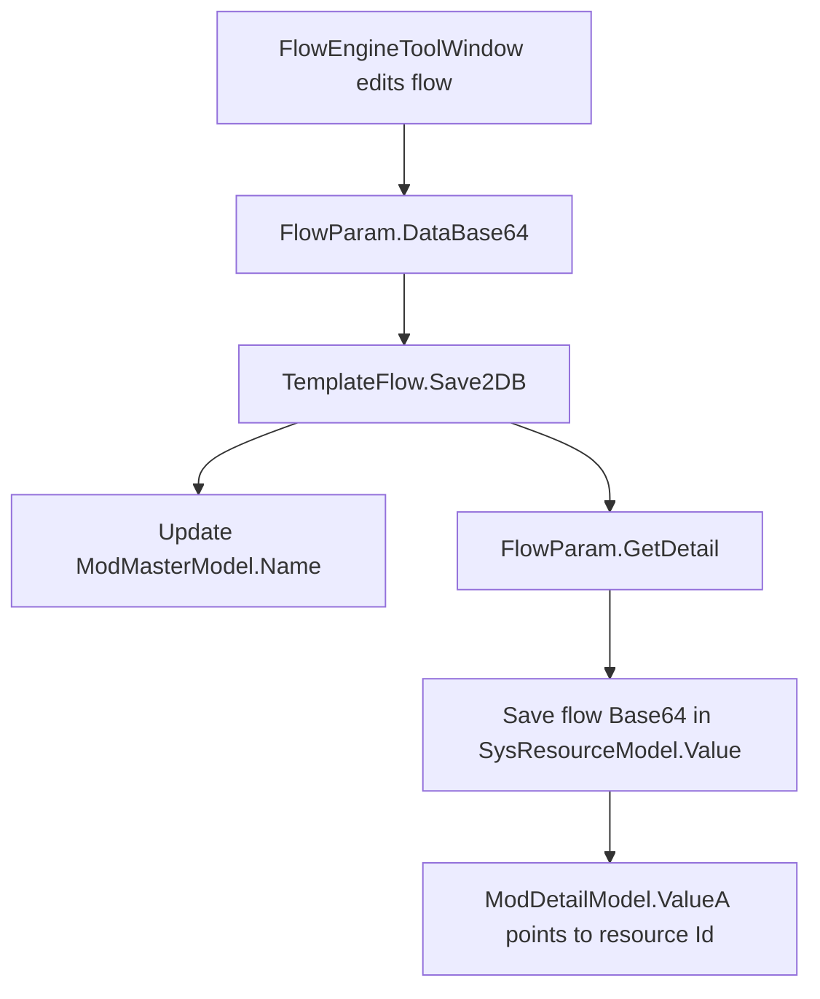
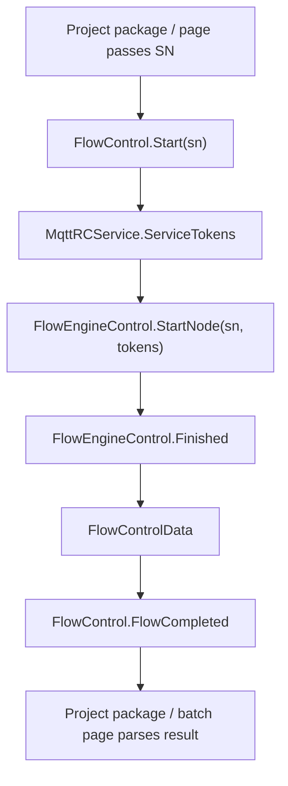

# Engine Templates And Flow Chain

This page explains how the template system and Flow engine cooperate in the current repository. Read it before maintaining Flow editing, algorithm templates, Flow nodes, or Flow import/export.

## One Sentence

Templates persist business parameters and Flow definitions. `FlowEngineLib` executes nodes. Real ColorVision workflows are completed by `TemplateControl`, `TemplateFlow`, node configurators, `FlowControl`, and project-package result processing together.

## Key Source Files

| Source | Purpose |
| --- | --- |
| `Templates/TemplateContorl.cs` | Template initialization and `IITemplateLoad` scanning |
| `Templates/TemplateModel.cs` | Template-list item model |
| `Templates/TemplateEditorWindow.xaml.cs` | Template management and editing window |
| `Templates/Flow/TemplateFlow.cs` | Flow template load, save, import, export |
| `Templates/Flow/FlowControl.cs` | Engine-side Flow execution wrapper |
| `Templates/Flow/DisplayFlow.xaml.cs` | Flow display and execution page |
| `Templates/Flow/NodeConfigurator/` | Configurators that bind Flow nodes to devices, templates, and parameters |
| `Engine/FlowEngineLib/` | Node canvas, node execution, start/end nodes |

## Template Initialization

`TemplateInitializer` is an initializer:

| Property | Current value |
| --- | --- |
| `Order` | `4` |
| `Dependencies` | `MySqlInitializer` |
| Action | Calls `TemplateControl.GetInstance()` on UI Dispatcher |

After construction, `TemplateControl` runs `Init()`, and re-runs it when MySQL connection changes.

`Init()` does this:

1. Check whether MySQL is connected.
2. Iterate `Application.Current.GetAssemblies()`.
3. Find non-abstract types implementing `IITemplateLoad`.
4. Create them with `Activator.CreateInstance(type)`.
5. Call `Load()`.

If a new template's `Load()` does not run, first check assembly loading, `IITemplateLoad`, and parameterless constructor availability.

## Template Model

`TemplateModel<T>` is the list item model where `T : ParamBase`.

It exposes `Value.Name` as `Key` and provides:

- Rename command.
- Copy-name command.
- Context menu.
- `GetValue()` returning the parameter object.

Template pages show `TemplateModel<T>`, but the real business parameters live in `Value`.

## TemplateControl Registry

`TemplateControl.ITemplateNames` is the current template entry dictionary:

```text
Dictionary<string, ITemplate>
```

Template implementations register through `AddITemplateInstance(code, template)`. `ExitsTemplateName()` and `FindDuplicateTemplate()` scan all template entries to detect name conflicts.

This means duplicate template names are not only checked inside one template type; cross-template conflicts can affect import, copy, and creation.

## Flow Template Storage

Key `TemplateFlow` storage facts:

| Item | Current value or location |
| --- | --- |
| `Code` | `flow` |
| `Title` | Flow template management |
| `TemplateParams` | `TemplateFlow.Params` |
| Master table | `ModMasterModel`, `Pid == 11` |
| Detail table | `ModDetailModel` |
| Flow data | Base64 STN stored in `SysResourceModel.Value` |
| Export format | `.cvflow` package or `.stn` / `.zip` |

`Load()` reads `ModMasterModel(Pid=11)`, then its `ModDetailModel`, then fills detail models with `SysResourceModel.Value`.

## Flow Save Path



Important details:

- `flowParam.ModMaster.Name` is synchronized with the template name.
- Main flow content lives in `DataBase64`.
- First detail item `ValueA` usually points to the `SysResourceModel` holding flow content.
- If the old resource does not exist, a new `SysResourceModel` is created.

## Flow Import And Export

`TemplateFlow.Export()` supports:

- Single flow: export `.cvflow` package or STN data.
- Multi-select flow: export zip.

`.cvflow` is not just an STN file. `FlowPackageHelper` collects related templates; import also imports related templates and replaces template references in STN when names change.

When a flow imports but execution fails, check:

1. Whether the `.cvflow` package contains related template manifest.
2. Whether related templates imported successfully.
3. Whether template names were renamed.
4. Whether references inside STN were replaced.

## Flow Execution Path

`Templates/Flow/FlowControl.cs` wraps `FlowEngineControl`:



`FlowControlData` maps low-level `StatusTypeEnum` to `FlowStatus` and includes:

- `StartNodeName`
- `SerialNumber`
- `EventName`
- `Status`
- `Params`
- `TotalTime`

Project packages usually process Engine's `FlowControl.FlowCompleted`, not `FlowEngineLib` directly.

## Node Configurators

`Templates/Flow/NodeConfigurator/` is the key directory binding Flow nodes to Engine business objects.

It currently includes:

- `NodeConfiguratorRegistry`
- `NodeConfiguratorBase`
- `NodeConfiguratorContext`
- `NodeConfiguratorAttribute`
- `DeviceNodeConfigurators`
- `CameraNodeConfigurators`
- `AlgorithmNodeConfigurators`
- `POINodeConfigurators`
- `SpectrumNodeConfigurators`
- `OLEDNodeConfigurators`

Do not change only `FlowEngineLib` when adding a node. If the node needs device, template, or parameter binding, add a node configurator; otherwise the editor may show the node while business parameters cannot be saved or restored.

## Common Template Binding Points

| Template / Entry | Flow handoff point |
| --- | --- |
| [FocusPoints Template](../algorithms/templates/focus-points-template.md) | `AlgorithmNode` light-area detection maps to `operatorCode = "FocusPoints"` and the configurator binds `TemplateFocusPoints`. |
| [ImageCropping Template](../algorithms/templates/image-cropping-template.md) | `AlgorithmType.图像裁剪` and `OLEDImageCroppingNode` bind `TemplateImageCropping`; the two-input node also depends on upstream ROI `MasterId`. |
| [Template Menu Entries](../algorithms/templates/template-menu-entries.md) | Menus open template editors; whether a Flow node can select the template is still controlled by `NodeConfigurator`. |
| [DataLoad Template](../algorithms/templates/data-load-template.md) | DataLoad nodes have both template-based and explicit-parameter input paths. |

## Where To Add Algorithm Template Pieces

| Task | Location |
| --- | --- |
| Add parameter class | Template directory, inherit `ParamBase` or JSON template parameter base |
| Add template entry | Implement `ITemplate<T>` / `ITemplateJson<T>` |
| Template initialization | Implement `IITemplateLoad.Load()` and register in `TemplateControl` |
| Template edit UI | `EditTemplateJson` or a dedicated UserControl |
| Flow node binding | `Templates/Flow/NodeConfigurator/` |
| Algorithm result display | `ViewHandle*.cs`, `IResultHandleBase` |
| Data reading | `Dao` or `*Dao.cs` in template directory |

## Troubleshooting Checklist

| Symptom | Check first |
| --- | --- |
| Template list is empty | MySQL connection, `TemplateInitializer`, `IITemplateLoad.Load()` |
| New template does not appear | Assembly loaded, parameterless constructor, registration in `TemplateControl` |
| Flow opens but save fails | `FlowParam.DataBase64`, `ModMasterModel`, `ModDetailModel.ValueA` |
| Imported Flow cannot find template | `.cvflow` manifest, template name mapping, `TemplateControl.ITemplateNames` |
| Node parameter does not restore | Whether a `NodeConfigurator` covers the node type |
| Flow completes but project has no result | Project package parsing after `FlowCompleted`, template name, result type |

## Do Not Change It This Way

- Do not put all flow-execution business into `FlowEngineLib`; business binding belongs in Engine template/configurator layers.
- Do not bypass `TemplateFlow.Save2DB()` and edit database fields directly.
- Do not copy only STN files without related templates.
- Do not put customer-specific judgment into generic templates.
