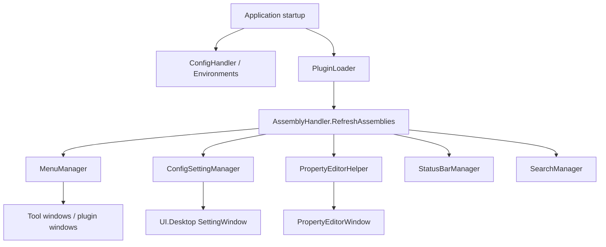

# ColorVision.UI

This page only retains the most critical infrastructure and entry point types currently in `UI/ColorVision.UI/`, no longer continuing the old documentation's writing style of "version list + full pseudo-API + changelog."

## Module Positioning

`ColorVision.UI` is not a single individual control, but the location of a large amount of UI infrastructure for the desktop application. Its current role is closer to "UI shell and common service collection," primarily reused by the main program, Engine, and other UI sub-projects.

From the directory structure, what it covers includes at least:

- Configuration read/write and environment paths
- Plugin loading and plugin package handling
- Menu system
- Property editor
- Hotkey system
- Multi-language resources
- Log-related UI configuration
- Shell, Search, Status Bar, Pages, and common controls

So it is not a single "control library" and is also not suitable to continue being written as a standard SDK with a stable public API surface.

## Most Critical Directories

If you just want to quickly build awareness, it is recommended to look at these directories first:

- `Plugins/`: Plugin discovery, metadata, dependency checks, unpacking, and updates
- `PropertyEditor/`: Property editing window, tree nodes, editor type system
- `Menus/`: Menu registration and dynamic menu refresh
- `HotKey/`: Global and window-level hotkeys
- `Languages/`: Language and resource switching
- `LogImp/`: Log-related configuration and window state
- `ConfigSetting/` and root-level `ConfigHandler.cs`: Configuration system entry points
- `Shell/`, `Serach/`, `StatusBar/`: Desktop interaction auxiliary capabilities

## Key Entry Point Types

### `ConfigHandler`

`ConfigHandler` is one of the most core infrastructure components in this project. Many `IConfig` configuration objects ultimately revolve around it or related configuration services to complete reading, caching, and saving.

If the problem manifests as "settings not saved," "configuration not loaded," "default value anomalies," typically look at this chain first.

### `PluginLoader`

`PluginLoader` is currently responsible for plugin runtime loading. What it does is not just "scan DLLs," but also includes:

- Scanning the `Plugins/` directory
- Reading `manifest.json`
- Parsing optional `.deps.json`
- Checking `ColorVision.*` dependency versions
- Finally loading plugin assemblies

This is also why plugin-related documentation almost always distorts if only written as "reflectively scan plugin types."

### `MenuManager`

`MenuManager` is the central object of the menu system. Many dynamic menus, recent file refreshes, and plugin menu entry points ultimately land on its registration or refresh chain.

So this part is more like the application shell's menu coordinator rather than a set of static XAML menu definitions.

### `PropertyEditor`

`PropertyEditor/` currently handles the main chain of the property editing experience:

- `PropertyEditorWindow`
- `PropertyTreeNode`
- Editor types and helper classes

This system works in conjunction with a large number of objects in the repository carrying attributes like `Category`, `DisplayName`, `Description`, `PropertyEditorType`, and is the foundation of the current dynamic property editing experience.

### `HotKey`

The hotkey system is currently not a single-point implementation, but split into:

- `GlobalHotKey/`
- `WindowHotKey/`
- `HotKeys` and its configuration and settings windows

Therefore, when modifying hotkeys, you typically need to first distinguish whether you are modifying a system-level hotkey or a window-level hotkey.

### `Languages`

Multi-language resources and UI culture switching related capabilities are centrally managed here. After setting the UI Culture during the main program startup phase, many interface resource loads are affected by this.

### `LogImp`

Log-related UI configuration and local log window state are also placed in this project. It is more oriented toward "log display and configuration support" rather than the complete log backend itself.

## Using It as a DLL

### When to Reference It

- Plugins or project packages need to register menus, status-bar items, settings, hotkeys, or property editors.
- Runtime code needs to load `Plugins/<Name>/manifest.json` through `PluginLoader`.
- Unified configuration services such as `ConfigHandler` or `ConfigSettingManager` are needed.
- Desktop shell services such as search, log display, update recovery, tray icon, or jump list are needed.

### Common Extension Points

| Need | First Entry |
| --- | --- |
| Add a menu | `Menus/MenuManager.cs`, `GlobalMenuBase`, `MenuItemBase`, `MenuItemAttribute` |
| Add a setting | `ConfigSetting/ConfigSettingManager.cs`, `IConfigSettingProvider` |
| Add a property editor | `PropertyEditor/PropertyEditors.cs`, `PropertyEditorTypeAttribute` |
| Add a status-bar item | `StatusBar/StatusBarManager.cs`, `IStatusBarProvider` |
| Add a hotkey | `HotKey/HotKeys.cs`, `GlobalHotKey/`, `WindowHotKey/` |
| Adjust plugin loading | `Plugins/PluginLoader.cs`, `PluginManifest.cs`, `DepsJson.cs` |

### DLL Release Acceptance

| Check | What to Inspect | Passing Standard |
| --- | --- | --- |
| Target framework outputs | `net8.0-windows7.0`, `net10.0-windows7.0` | Both TFMs produce DLL, `.nupkg`, and `.snupkg` |
| Package README | `PackageReadmeFile`, package root | `README.md` is included at the package root and matches the current shell capabilities |
| Package dependencies | `ColorVision.Common`, `ColorVision.Themes`, `log4net`, `Newtonsoft.Json` | Host and plugin output can resolve these dependencies |
| Configuration chain | `ConfigHandler`, `ConfigSettingManager` | A setting can be changed, saved, restarted, and read back consistently |
| Plugin chain | `PluginLoader`, `PluginManifest`, `.deps.json` | Manifest, README, and CHANGELOG can be read, and dependency-version issues are reportable |
| Discovery chain | `AssemblyHandler`, `MenuManager`, `StatusBarManager`, `SearchManager` | Menus, status items, search entries, and property editors are rediscovered after plugin load |
| Property editing | `PropertyEditorWindow`, `PropertyEditorTypeAttribute` | Common property types and custom editors open, with diagnosable logs on failure |
| Language/resources | `Languages/`, `Properties/Resources.*.resx` | Menus, settings, and log windows refresh primary text after language switch |

## Component Details And Handoff Checks

This section is organized around what a maintainer must verify after publishing `ColorVision.UI.dll`.

### Runtime Component Matrix

| Component family | Key classes/windows | Source entry | Runtime role | Minimum acceptance |
| --- | --- | --- | --- | --- |
| Configuration | `ConfigHandler`, `Environments`, `ConfigSettingManager`, `ConfigServiceAdapters` | `UI/ColorVision.UI/ConfigHandler.cs`, `ConfigSetting/` | Read, cache, save, and aggregate configuration items. | Change one simple setting, save, restart, and confirm persistence. |
| Plugin loading | `PluginLoader`, `PluginManifest`, `DepsJson`, `PluginExtractor` | `UI/ColorVision.UI/Plugins/` | Scan `Plugins/`, read manifest files, check `.deps.json`, and load assemblies. | Plugin manager can read manifest, README, CHANGELOG, and enabled state. |
| Menus | `MenuManager`, `GlobalMenuBase`, `MenuItemAttribute` | `UI/ColorVision.UI/Menus/` | Discover `IMenuItem` / `IMenuItemProvider` and build menu trees. | Built-in and plugin menus appear in the expected order and commands execute. |
| Property editor | `PropertyEditorWindow`, `PropertyEditorHelper`, `PropertyEditorTypeAttribute` | `UI/ColorVision.UI/PropertyEditor/` | Build parameter editing UI from property metadata and editor types. | Open bool, enum, path, list, and dictionary editors. |
| Hotkeys | `HotKeys`, `HotKeysSetting`, `GlobalHotKey/`, `WindowHotKey/` | `UI/ColorVision.UI/HotKey/` | Manage global and window-scoped hotkeys. | Open hotkey settings, change a non-critical hotkey, and verify conflict detection. |
| Language | `Languages/`, `LanguageConfig`, `LanguagePropertiesEditor` | `UI/ColorVision.UI/Languages/` | Manage culture switching and language configuration. | Menus, settings, and log windows refresh after language change. |
| Log UI | `WindowLog`, `WindowLogLocal`, `LogViewerControl`, `LogViewerAppender` | `UI/ColorVision.UI/LogImp/` | Show local logs, levels, and filters. | Filter by Error/Warn and locate the latest startup or click error. |
| Status bar | `StatusBarManager`, `StatusBarControl` | `UI/ColorVision.UI/StatusBar/` | Discover status providers and refresh main-window state. | Socket, Scheduler, or Database status items appear and can be clicked. |
| Search | `SearchManager`, `SearchControl`, `MenuSearchProvider` | `UI/ColorVision.UI/Serach/` | Aggregate search providers for quick entry points. | Searching a menu or window name opens the target entry. |
| Shell helpers | `JumpListManager`, `TrayIconManager`, `ArgumentParser` | `UI/ColorVision.UI/Shell/` | Windows jump list, tray icon, and command-line helpers. | Tray/jump-list features do not break startup; command-line args parse correctly. |
| Assembly discovery | `AssemblyHandler`, `FileProcessorFactory` | `UI/ColorVision.UI/` | Refresh scannable assemblies and file processors. | After plugin load, menus, settings, status providers, and tools are discoverable. |

### Runtime Discovery Chain

When a UI component is missing, follow this chain from left to right. First verify the plugin and assembly were loaded, then inspect menu, setting, property-editor, or status-bar discovery.

### Required Smoke Tests After Publishing

| Smoke test | Action | Pass condition |
| --- | --- | --- |
| Application startup | Build and start the main app. | No `MissingMethodException`, `FileLoadException`, or resource-load errors. |
| Plugin loading | Open plugin management or marketplace. | Plugin manifest and README/CHANGELOG are readable. |
| Menus | Open main menus and at least one plugin menu. | Sort order, permission filtering, and command execution work. |
| Settings | Open settings and search for theme, language, or log items. | Items can be searched, modified, and saved. |
| PropertyGrid | Edit a device/template/config object. | Categories, display names, descriptions, and editor types render correctly. |
| Status bar | Inspect Socket/Scheduler/Database status. | Provider items appear and refresh without blocking the UI. |
| Hotkeys | Open hotkey settings. | Global and window hotkeys do not double-register. |
| Log window | Open logs and filter Error/Warn. | The latest startup or interaction logs are visible. |

### Common Incidents

| Symptom | First check | Notes |
| --- | --- | --- |
| Plugin folder exists but menu is missing | Whether `PluginLoader` loaded the DLL and `AssemblyHandler` refreshed. | Menu discovery depends on loaded assemblies, not folders. |
| Setting item is missing | `IConfigSettingProvider` or `[ConfigSetting]` discovery. | Missing assemblies, constructor failures, or wrong attributes hide settings. |
| Property editor falls back to text | `PropertyEditorTypeAttribute` and `PropertyEditorHelper`. | Custom-editor creation failure degrades the editing experience. |
| Menu click does nothing | `CanExecute`, permissions, target-window logs. | A menu tree can exist while its command still cannot execute. |
| Status item does not refresh | `IStatusBarProviderUpdatable`, timer, main-window binding. | A provider can exist but never emit updates. |
| Some text ignores language change | Resource key, binding mode, window reload. | Some windows need recreation or rebinding. |
| Plugin dependency version error | `.deps.json` and root output `ColorVision.*.dll` versions. | Plugin-folder DLLs and root DLLs may not be the same batch. |

## Field First Checks

After replacing or publishing `ColorVision.UI.dll`, use this table when the application starts but shell behavior is wrong. The goal is to quickly decide whether the issue belongs to DLL versions, assembly discovery, config persistence, runtime providers, or an upper-level window.

| Symptom | Check first | Pass signal |
| --- | --- | --- |
| Application fails after replacing the DLL | Root-output `ColorVision.UI.dll`, `ColorVision.Common.dll`, and `ColorVision.Themes.dll` versions | The three base DLLs come from the same build batch, with no `FileLoadException` or `MissingMethodException` |
| Plugin is loaded but menu is missing | `PluginLoader` logs, `AssemblyHandler.RefreshAssemblies`, and `MenuManager` scan result | Plugin assembly is in the scanned assembly set, and menu item types can be created |
| A setting item is missing | `ConfigSettingManager`, `IConfigSettingProvider`, and `[ConfigSetting]` attributes | Provider construction has no exception, and config objects can be resolved from `ConfigService` |
| Setting changes disappear after restart | `ConfigHandler` save path, JSON serialization, and config file permissions | Saved file timestamp changes, and restart reads the same config file |
| Custom PropertyGrid editor does not open | `PropertyEditorTypeAttribute`, editor constructor, and property type | Custom editor instantiates; failure logs identify the property or editor type |
| Status-bar item exists but does not refresh | `StatusBarManager`, `IStatusBarProviderUpdatable`, and refresh events | Provider is created and emits `ItemsChanged` or an update callback |
| Saved hotkey does not work | `HotkeyService`, `HotKeyConfig.Instance.Hotkeys`, and global/window registration | Saved hotkeys are reapplied to runtime, and conflicts are detected |
| Language switch is inconsistent | `LanguageManager`, resource keys, and whether the window must be recreated | New windows show the new language; stale windows reveal binding/reload boundaries |
| Search cannot find a menu or window | `SearchManager`, `MenuSearchProvider`, and whether menus were scanned | Once the menu exists, the search index returns the entry |
| Plugin dependency warning is confusing | Plugin `.deps.json`, root-output DLLs, and private plugin-folder DLLs | Dependency check points to the host version actually being loaded, not just plugin-folder files |

## Where This Project Is Currently Most Easily Miswritten

### It Is Not a Single Control Library

Old documentation liked to write `ColorVision.UI` as the "core UI control package." The current code is far more complex than this, simultaneously handling cross-cutting capabilities like plugins, configuration, menus, hotkeys, property editing, and multi-language.

### The Plugin System Does Not Equal Extension Point Definitions Themselves

`PluginLoader` is located here, but what capabilities plugins truly extend still depends on individual plugin assemblies and the menu, template, service, and result view interfaces they implement.

### Permissions Should Not Be Generalized on This Page as a "Global RBAC Center"

Current global coarse-grained permissions come from `Authorization.Instance.PermissionMode`, while the finer local RBAC subsystem is primarily located in `UI/ColorVision.Solution/Rbac/`. `ColorVision.UI` provides the authorization infrastructure and common dependencies and should not continue to be written here as a complete permission platform.

## How to Better Read This Project Currently

### To View Configuration and Global Services

Read first:

- `ConfigHandler.cs`
- `Environments.cs`
- `FileProcessorFactory.cs`

### To View Plugin Runtime

Read first:

- `Plugins/PluginLoader.cs`
- `Plugins/PluginManifest.cs`
- `Plugins/PluginInfo.cs`

### To View the Property Editing System

Read first:

- `PropertyEditor/PropertyEditorWindow.xaml(.cs)`
- `PropertyEditor/PropertyTreeNode.cs`
- `PropertyEditor/PropertyEditors.cs`

### To View Menus and Hotkeys

Read first:

- `Menus/MenuManager.cs`
- `HotKey/HotKeys.cs`
- `HotKey/GlobalHotKey/`
- `HotKey/WindowHotKey/`

## What This Page No Longer Does

This page no longer continues to maintain these high-risk contents:

- Outdated version numbers and target framework lists
- Extensive unverified class member pseudo-code
- Describing `ColorVision.UI` as a stable public SDK
- Presenting cross-cutting capabilities like permissions, plugins, and logs as their own complete platforms

If a subsystem needs to be supplemented later, it should directly land on the corresponding topic page rather than continuing to stack "comprehensive" descriptions here.

## Continue Reading

- [UI Components Overview](./README.md)
- [ColorVision.Solution](./ColorVision.Solution.md)
- [Security and Permission Control](../../03-architecture/security/overview.md)
