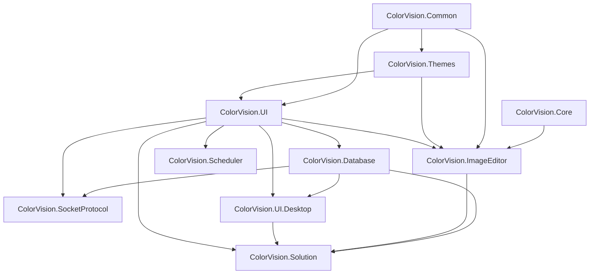

# UI DLL Component Handbook

This page explains each publishable DLL under `UI/`. It answers: what the component owns, who consumes it, where the entry points are, and what must be checked before release. For concrete controls, windows, and extension points, read the [UI Control Catalog](./control-catalog.md). For runtime discovery and troubleshooting, read [UI Runtime Component Handoff](./ui-runtime-handoff.md). For release validation, read the [UI DLL Release Matrix](./release-matrix.md).

## Component Layers

| Layer | DLL | Meaning |
| --- | --- | --- |
| Shared contract layer | `ColorVision.Common.dll` | MVVM, shared interfaces, status-bar metadata, initializers, coarse permission contracts, helpers |
| Theme resource layer | `ColorVision.Themes.dll` | Resource dictionaries, base windows, theme switching, caption appearance, common controls |
| UI infrastructure layer | `ColorVision.UI.dll` | Config, menus, plugin loading, property editor, hotkeys, localization, logging, status bar |
| Native image bridge | `ColorVision.Core.dll` | `HImage`, OpenCV helper P/Invoke, CUDA/fusion bridge, WPF bitmap bridge |
| Data access layer | `ColorVision.Database.dll` | SqlSugar DAO, MySQL/SQLite config, database browser providers |
| Desktop communication layer | `ColorVision.SocketProtocol.dll` | Local TCP server, JSON/Text dispatch, SQLite message history, status-bar and management window |
| Scheduling layer | `ColorVision.Scheduler.dll` | Quartz scheduler, task config, execution history, task manager window |
| Image editing layer | `ColorVision.ImageEditor.dll` | `ImageView`, drawing primitives, overlays, toolbar, pseudo-color, CIE, 3D, realtime images |
| Desktop tools layer | `ColorVision.UI.Desktop.exe` / package | Settings, wizard, marketplace, downloader, third-party apps, diagnostic windows |
| Workspace layer | `ColorVision.Solution.dll` | `.cvsln` workspace, explorer, editor system, AvalonDock, terminal, local RBAC |

## Dependency Boundary

Keep lower packages free of high-level product knowledge. `Common`, `Themes`, and `Core` should not know project packages, Engine business logic, or customer workflows.

## ColorVision.Common.dll

| Item | Detail |
| --- | --- |
| Source | `UI/ColorVision.Common/` |
| Target | `net8.0-windows7.0;net10.0-windows7.0` |
| Main dependencies | WPF, WinForms, Windows native APIs |
| Release focus | README, cursor resources, strong-name signing |
| Detail page | [ColorVision.Common](./ColorVision.Common.md) |

Main capabilities: `ViewModelBase`, `RelayCommand`, config/menu/status-bar/initializer interfaces, permission attributes, Win32 wrappers, and utility classes.

Use `Common` when a module only needs ViewModels, commands, shared interfaces, or helpers. Do not reference `UI.Desktop` or `Solution` just to define a command object.

## ColorVision.Themes.dll

| Item | Detail |
| --- | --- |
| Source | `UI/ColorVision.Themes/` |
| Main dependency | `HandyControl` |
| Release focus | ResourceDictionary, image/icon resources, common controls |
| Detail page | [ColorVision.Themes](./ColorVision.Themes.md) |

Main capabilities: `ThemeManager`, `ThemeManagerExtensions`, Base/Dark/White/Pink/Cyan resources, `BaseWindow`, `LoadingOverlay`, `ProgressRing`, `ToggleSwitch`, `MessageBoxWindow`, and upload controls.

Theme-layer code should not know plugins, Engine, or customer projects.

## ColorVision.UI.dll

| Item | Detail |
| --- | --- |
| Source | `UI/ColorVision.UI/` |
| Dependencies | `Common`, `Themes`, log4net, Newtonsoft.Json |
| Release focus | Plugin loading, config persistence, property editor, menu system |
| Detail page | [ColorVision.UI](./ColorVision.UI.md) |

Main capabilities: `ConfigHandler`, `ConfigSettingManager`, `PluginLoader`, `PluginManifest`, `MenuManager`, `GlobalMenuBase`, `PropertyEditorWindow`, hotkeys, localization, status bar, shell/search/log/update helpers.

Plugins and project packages usually reference `ColorVision.UI` when they need menu, settings, status-bar, or property-editor integration.

## ColorVision.Core.dll

| Item | Detail |
| --- | --- |
| Source | `UI/ColorVision.Core/` |
| Dependencies | native `opencv_helper.dll`, optional `opencv_cuda.dll`, OpenCV runtime DLLs |
| Release focus | Complete `runtimes/win-x64/native` content |
| Detail page | [ColorVision.Core](./ColorVision.Core.md) |

Main capabilities: `HImage`, `HImageExtension`, `OpenCVMediaHelper`, `OpenCVCuda`, and native log bridge.

Upper layers should pass image data through `HImage` and helper wrappers rather than directly manipulating native pointers.

## ColorVision.Database.dll

| Item | Detail |
| --- | --- |
| Source | `UI/ColorVision.Database/` |
| Dependencies | `ColorVision.UI`, `SqlSugarCore`, Newtonsoft.Json, log4net |
| Release focus | MySQL/SQLite providers and database browser |
| Detail page | [ColorVision.Database](./ColorVision.Database.md) |

Main capabilities: `BaseTableDao<T>`, `EntityBase`, `ViewEntity`, MySQL configuration, `DatabaseBrowserWindow`, `IDatabaseBrowserProvider`, MySQL and SQLite browser providers.

Add a provider when adding a data source; do not only add entity classes.

## ColorVision.SocketProtocol.dll

| Item | Detail |
| --- | --- |
| Source | `UI/ColorVision.SocketProtocol/` |
| Dependencies | `ColorVision.UI`, `ColorVision.Database` |
| Release focus | Socket config, SQLite message database, status-bar entry |
| Detail page | [ColorVision.SocketProtocol](./ColorVision.SocketProtocol.md) |

Main capabilities: `SocketManager`, `SocketInitializer`, `SocketConfig`, `ISocketJsonHandler`, `SocketMessageManager`, `SocketManagerWindow`, and `SocketStatusBarProvider`.

Project packages can implement `ISocketJsonHandler` and let dispatch select handlers by `EventName`.

## ColorVision.Scheduler.dll

| Item | Detail |
| --- | --- |
| Source | `UI/ColorVision.Scheduler/` |
| Dependencies | Quartz, SqlSugarCore, `ColorVision.UI` |
| Release focus | task JSON, execution-history SQLite, Quartz job scanning |
| Detail page | [ColorVision.Scheduler](./ColorVision.Scheduler.md) |

Main capabilities: `QuartzSchedulerManager`, `SchedulerInfo`, `TaskViewerWindow`, `CreateTask`, `TaskExecutionListener`, and `SchedulerDbManager`.

Task definitions and execution history are separate stores.

## ColorVision.ImageEditor.dll

| Item | Detail |
| --- | --- |
| Source | `UI/ColorVision.ImageEditor/` |
| Target | `net10.0-windows7.0` |
| Dependencies | `Common`, `Core`, `Themes`, `UI`, OpenCvSharp, HelixToolkit, ScottPlot |
| Release focus | shader, CIE data, colormap, icons, OpenCV runtime |
| Detail page | [ColorVision.ImageEditor](./ColorVision.ImageEditor.md) |

Main capabilities: `ImageView`, `EditorContext`, `EditorToolFactory`, `IImageOpen`, `Draw/`, annotations, zoom/view tools, pseudo-color, filters, histogram, 3D, CIE, realtime images, and layers.

Algorithm result display should reuse existing `DrawCanvas`, primitives, and annotation paths.

## ColorVision.UI.Desktop

| Item | Detail |
| --- | --- |
| Source | `UI/ColorVision.UI.Desktop/` |
| Output | `WinExe` plus package |
| Dependencies | `ColorVision.Database`, `ColorVision.UI`, WebView2, Markdig |
| Release focus | `github-markdown.css`, `aria2c.exe`, settings/wizard/marketplace windows |
| Detail page | [ColorVision.UI.Desktop](./ColorVision.UI.Desktop.md) |

Main capabilities: unified settings, wizard manager, marketplace, DLL-version viewer, downloader, third-party app launcher, feedback, timed-button stats, and WebView helpers.

This is a desktop helper-window collection, not the main product entry point.

## ColorVision.Solution.dll

| Item | Detail |
| --- | --- |
| Source | `UI/ColorVision.Solution/` |
| Dependencies | `Database`, `ImageEditor`, `UI.Desktop`, AvalonDock, AvalonEdit, WebView2, WPFHexaEditor |
| Release focus | editor registration, docking layout, terminal, RBAC SQLite |
| Detail page | [ColorVision.Solution](./ColorVision.Solution.md) |

Main capabilities: `SolutionManager`, explorer tree, `EditorManager`, workspace/docking layout, ConPTY terminal, multi-image viewer, Markdown preview, and local RBAC.

`ColorVision.Solution` is a workspace shell, not the Engine workflow layer.

## Quick Component Choice

| Need | Prefer |
| --- | --- |
| ViewModel, command, shared interface | `ColorVision.Common` |
| Theme resource or common window appearance | `ColorVision.Themes` |
| Menu, hotkey, status bar, property editor | `ColorVision.UI` |
| OpenCV/native image capability | `ColorVision.Core` |
| DAO or database browser provider | `ColorVision.Database` |
| Socket JSON event handling | `ColorVision.SocketProtocol` |
| Scheduled task | `ColorVision.Scheduler` |
| Image drawing, overlay, opener, image tool | `ColorVision.ImageEditor` |
| Settings, wizard, marketplace, download, diagnostics | `ColorVision.UI.Desktop` |
| Workspace editor, explorer, terminal, RBAC | `ColorVision.Solution` |

## Before Release

- [UI DLL Publishing](./publishing.md)
- [UI DLL Release Matrix](./release-matrix.md)
- [UI Control Catalog](./control-catalog.md)
- [UI Runtime Component Handoff](./ui-runtime-handoff.md)
- Each component `.csproj`: `TargetFrameworks`, `VersionPrefix`, `GeneratePackageOnBuild`, resources, and native runtime settings.
- Root `Directory.Build.props`: global version, signing, package metadata, and `UIProjectPackageVersion`.
