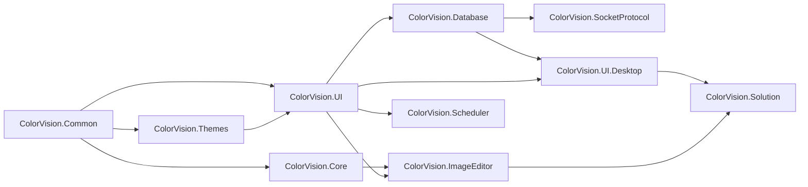

# UI DLL Release Matrix

This page is for maintainers who publish UI DLLs, replace field DLLs, or troubleshoot missing dependencies. It does not describe UI operation. It places each `UI/` release unit, dependency boundary, package resources, and post-release acceptance point in one matrix.

For component responsibilities, read [UI DLL Component Handbook](./component-handbook.md). For field replacement or a concrete release task, first use [UI DLL Release Playbook](./ui-dll-release-playbook.md), then use this matrix to confirm versions, resources, and smoke tests.

## Release Units

| Release unit | Project file | Target frameworks | Version | Output | Dependency focus |
| --- | --- | --- | --- | --- | --- |
| `ColorVision.Common` | `UI/ColorVision.Common/ColorVision.Common.csproj` | `net8.0-windows7.0;net10.0-windows7.0` | `1.5.5.2` | DLL + `.nupkg` + `.snupkg` | WPF, WinForms, shared interfaces and helpers |
| `ColorVision.Themes` | `UI/ColorVision.Themes/ColorVision.Themes.csproj` | net8/net10 Windows | `1.5.5.3` | DLL + packages | `HandyControl`, theme resources |
| `ColorVision.UI` | `UI/ColorVision.UI/ColorVision.UI.csproj` | net8/net10 Windows | `1.5.5.3` | DLL + packages | `Common`, `Themes`, log4net, Newtonsoft.Json |
| `ColorVision.Core` | `UI/ColorVision.Core/ColorVision.Core.csproj` | net8/net10 Windows | `1.5.5.2` | DLL + packages + native runtime | `opencv_helper.dll`, OpenCV runtime, optional `opencv_cuda.dll` |
| `ColorVision.Database` | `UI/ColorVision.Database/ColorVision.Database.csproj` | net8/net10 Windows | `1.5.5.3` | DLL + packages | `ColorVision.UI`, `SqlSugarCore`, log4net, Newtonsoft.Json |
| `ColorVision.SocketProtocol` | `UI/ColorVision.SocketProtocol/ColorVision.SocketProtocol.csproj` | net8/net10 Windows | `1.5.5.2` | DLL + packages | `ColorVision.UI`, `ColorVision.Database` |
| `ColorVision.Scheduler` | `UI/ColorVision.Scheduler/ColorVision.Scheduler.csproj` | net8/net10 Windows | `1.5.5.2` | DLL + packages | `ColorVision.UI`, Quartz, SqlSugarCore |
| `ColorVision.ImageEditor` | `UI/ColorVision.ImageEditor/ColorVision.ImageEditor.csproj` | `net10.0-windows7.0` | `1.5.5.5` | DLL + packages + embedded resources | `Core`, `UI`, OpenCvSharp, HelixToolkit, ScottPlot |
| `ColorVision.UI.Desktop` | `UI/ColorVision.UI.Desktop/ColorVision.UI.Desktop.csproj` | `net10.0-windows7.0` | `1.5.5.3` | `WinExe` + packages | `Database`, `UI`, WebView2, Markdig |
| `ColorVision.Solution` | `UI/ColorVision.Solution/ColorVision.Solution.csproj` | `net10.0-windows7.0` | `1.5.5.2` | DLL + packages | `ImageEditor`, `UI.Desktop`, AvalonDock, AvalonEdit, WebView2, WPFHexaEditor |

Most UI projects set `GeneratePackageOnBuild=True`, so a Release build produces both DLLs and NuGet packages.

## Recommended Build Order



For ordinary development, building the host or solution is often enough. For single-package failure analysis, build from the lower layers upward.

## Consumers and Release Impact

| Consumer | Current reference style | Release impact |
| --- | --- | --- |
| `ColorVision/ColorVision.csproj` | ProjectReference to UI Desktop and UI | Host output carries the referenced UI DLLs |
| `Engine/ColorVision.Engine` | Source-first references with package fallback for several UI packages | External delivery should lock versions rather than relying on `*` |
| `Plugins/Spectrum` | References ImageEditor, Database, Scheduler, SocketProtocol, UI | Plugin release must match host `ColorVision.*.dll` versions |
| `Plugins/Conoscope` | References ImageEditor and Solution | Missing image editor or workspace resources degrade plugin function |
| `Plugins/SystemMonitor` | References `ColorVision.UI` | Depends on menu, status bar, and configuration chain |
| `Plugins/EventVWR` | References `ColorVision.Common` | Mostly shared interfaces and helpers |
| `Plugins/WindowsServicePlugin` | References UI Desktop and UI | Depends on desktop helper windows |
| `Projects/ProjectARVR` | References `ColorVision.UI` | Project package menu/config/UI integration depends on UI version |

## Package Resource Checks

| Release unit | Must check | Symptom if missing |
| --- | --- | --- |
| `ColorVision.Common` | README, cursor resources | Basic tool cursor or package docs missing |
| `ColorVision.Themes` | icons, `uploadbg.avif`, theme XAML | Window icon, upload background, or theme load failure |
| `ColorVision.UI` | plugin/config/property-editor types | Plugin management, menus, settings, property editor failures |
| `ColorVision.Core` | `runtimes/win-x64/native/opencv_helper.dll` and OpenCV DLLs | `DllNotFoundException`, image/video processing failure |
| `ColorVision.Database` | README and SqlSugar dependencies | Database browser or DAO errors |
| `ColorVision.SocketProtocol` | README, Socket config, message entities | Socket manager, message history, JSON/Text dispatch errors |
| `ColorVision.Scheduler` | README in package root, Quartz/SqlSugar dependencies | Task manager or history database issues |
| `ColorVision.ImageEditor` | shaders, colormap images, CIE CSV, icons, OpenCvSharp runtime | Pseudo-color, CIE, 3D, image open, or video failures |
| `ColorVision.UI.Desktop` | `github-markdown.css`, `aria2c.exe` | Marketplace README preview or downloader failure |
| `ColorVision.Solution` | AvalonDock/AvalonEdit/WebView2/WPFHexaEditor dependencies | Workspace, editor, terminal, or RBAC window failure |

## Pre-Release Commands

```powershell
rg -n "VersionPrefix|GeneratePackageOnBuild|PackageReadmeFile|PackagePath|CopyToOutputDirectory" UI -g "*.csproj"
Get-Content Directory.Build.props
dotnet restore
dotnet build ColorVision/ColorVision.csproj -c Release -p:Platform=x64
```

For package-level validation, build each UI project in Release x64 when the change touches that package.

## Package Spot Checks

`.nupkg` files are zip archives. Expand the newest package and inspect native/runtime resources:

```powershell
$pkg = Get-ChildItem UI/ColorVision.Core/bin -Recurse -Filter "ColorVision.Core.*.nupkg" | Sort-Object LastWriteTime -Descending | Select-Object -First 1
$tmp = Join-Path $env:TEMP "cv-core-nupkg"
Remove-Item $tmp -Recurse -Force -ErrorAction SilentlyContinue
New-Item $tmp -ItemType Directory | Out-Null
Copy-Item $pkg.FullName "$tmp/core.zip"
Expand-Archive "$tmp/core.zip" "$tmp/core"
Get-ChildItem "$tmp/core/runtimes/win-x64/native"
```

## Post-Release Smoke Matrix

| Capability | Verify | First failure checks |
| --- | --- | --- |
| Host startup | Release output starts | strong name, missing DLL, target framework |
| Plugin loading | Plugin manager reads manifest, README, CHANGELOG | `PluginLoader`, `.deps.json`, host DLL versions |
| Settings | Settings, theme, language, log level open and save | UI, UI Desktop, config path |
| Property editor | Any config object opens `PropertyEditorWindow` | `PropertyEditorTypeAttribute`, reflection |
| Image editor | Open image, pseudo-color, CIE, annotation import/export, 3D | ImageEditor resources, Core native runtime, OpenCvSharp |
| Database browser | MySQL/SQLite providers list tables | Database, SqlSugar, connection config |
| Socket manager | Enable service, send JSON/Text, view history | SocketConfig, port conflict, `SocketMessages.db` |
| Scheduler | Task manager opens; task list/history can read | Quartz, task JSON, history db |
| Solution workspace | Open `.cvsln`, file tree, text editor, image editor, terminal, layout restore | Solution dependencies and editor registration |

## Handoff Requirements

Every UI DLL release should record: release scope, version list, resource spot checks, consumer validation, smoke-test result, and rollback package/DLL location.

## Continue Reading

- [UI DLL Release Playbook](./ui-dll-release-playbook.md)
- [UI DLL Publishing](./publishing.md)
- [UI DLL Component Handbook](./component-handbook.md)
