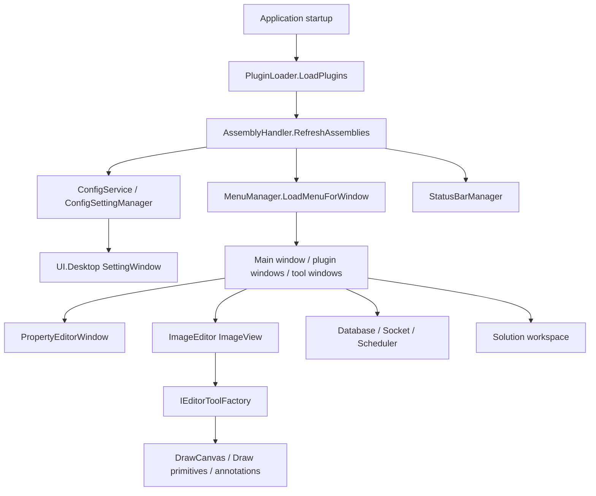
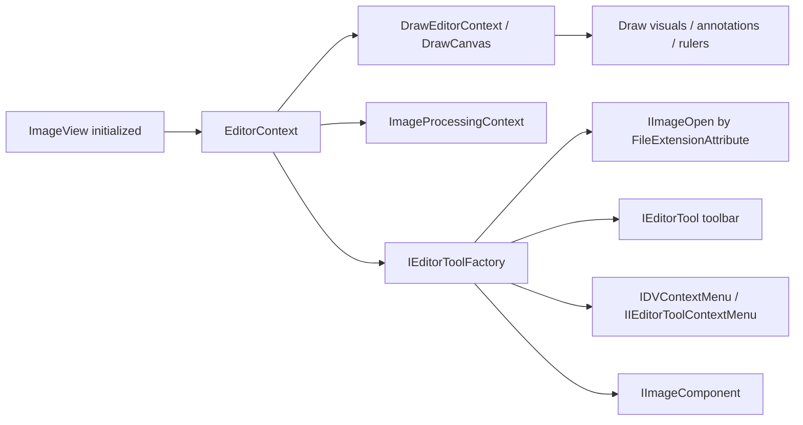

# UI Runtime Component Handoff

This page is for people taking over the `UI/` runtime path. It does not explain only how to package a DLL. It explains how menus, settings, plugin loading, the property editor, the image editor, Socket, Scheduler, Marketplace, and the Solution workspace are discovered, assembled, and debugged after the main application starts.

For DLL or NuGet release work, start with [UI DLL Release Playbook](./ui-dll-release-playbook.md) and [UI DLL Release Matrix](./release-matrix.md). For control changes or runtime UI issues, start here, then go to [UI Control Catalog](./control-catalog.md) and the specific DLL page.

## Boundary In One Table

| Module | Runtime role | Do not put here |
| --- | --- | --- |
| `ColorVision.Common` | Base contracts, MVVM, commands, menu/status bar interfaces | Concrete windows, customer business logic, Engine device logic |
| `ColorVision.Themes` | Theme resources, base windows, themed shared controls | Plugins, project packages, algorithm business logic |
| `ColorVision.UI` | Menus, plugin loading, config, setting discovery, property editor, logs, hotkeys, status bar | Marketplace UI, Solution workspace, project workflows |
| `ColorVision.Core` | Image native bridge, `HImage`, OpenCV helpers | WPF interaction controls, customer judgment logic |
| `ColorVision.Database` | SqlSugar, MySQL/SQLite config, database browser | Device protocols, project export formats |
| `ColorVision.SocketProtocol` | Local TCP server, JSON/Text dispatch, message history | The project test workflow itself |
| `ColorVision.Scheduler` | Quartz tasks, task windows, execution history | Long-running algorithm implementation |
| `ColorVision.ImageEditor` | `ImageView`, toolbar, draw primitives, overlay, CIE/3D/realtime image | Customer result judgment and export |
| `ColorVision.UI.Desktop` | Settings, wizard, marketplace, downloader, diagnostics | Main application startup center, Engine flow business |
| `ColorVision.Solution` | `.cvsln` workspace, explorer, editors, terminal, RBAC | Device control, algorithm execution, project test main path |

During handoff, classify the issue by this runtime boundary first, then open the matching DLL page. Do not route every WPF issue to `ColorVision.UI`.

## Main Runtime Path

The central dependency is assembly discovery. After plugins or project packages are loaded, `AssemblyHandler`, `AssemblyService`, and `Application.Current.GetAssemblies()` affect whether later menus, settings, ImageEditor tools, Solution editors, and other UI extensions can be discovered. If an extension does not appear, first prove the assembly entered the discovery set.

## Discovery Matrix

| Capability | Discovery entry | Implementation or marker | Typical source | First checks |
| --- | --- | --- | --- | --- |
| Plugin loading | `PluginLoader.LoadPlugins("Plugins")` | `manifest.json`, `DllName`, `.deps.json` | `UI/ColorVision.UI/Plugins/PluginLoader.cs` | Plugin directory, manifest `Id` and `DllName`, dependency DLL versions, enabled state |
| Menus | `MenuManager.LoadMenuForWindow` | `IMenuItem`, `IMenuItemProvider`, `MenuItemAttribute` | `UI/ColorVision.UI/Menus/`, `UI/ColorVision.Common/Interfaces/Menus/` | `OwnerGuid`, `GuidId`, `Order`, target window name, permission filter, assembly refresh |
| Settings window | `ConfigSettingManager.GetAllSettings` | `IConfigSettingProvider`, `[ConfigSetting]` on `IConfig` properties | `UI/ColorVision.UI/ConfigSetting/`, `UI/ColorVision.UI.Desktop/Settings/` | `ConfigService`, group/order metadata, search filter |
| Property editor | `PropertyEditorWindow` | `[Category]`, `[DisplayName]`, `[Description]`, `PropertyEditorTypeAttribute` | `UI/ColorVision.UI/PropertyEditor/` | Public get/set properties, clone/reset support, editor construction |
| Status bar | `StatusBarManager` | `IStatusBarProvider`, `IStatusBarProviderUpdatable` | `UI/ColorVision.UI/StatusBar/` | Provider discovery, refresh frequency, main window binding |
| Hotkeys | `HotkeyService` | `IHotKey`, window hotkey registration | `UI/ColorVision.UI/HotKey/` | Conflicts, disabled state, window focus |
| Log viewer | log4net appender | `LogViewerAppender`, `LogConfig` | `UI/ColorVision.UI/LogImp/` | log4net config, log path, UI filter |
| Image openers | `IEditorToolFactory` | `IImageOpen` + `FileExtensionAttribute` | `UI/ColorVision.ImageEditor/Abstractions/` | Extension match, constructor accepting `EditorContext`, image file path |
| Image toolbar | `IEditorToolFactory` | `IEditorTool`, `IEditorToggleTool`, `IEditorCustomControlTool` | `UI/ColorVision.ImageEditor/EditorTools/` | Tool construction, `GuidId` override, visibility config |
| Image context menu | `IEditorToolFactory` | `IDVContextMenu`, `IIEditorToolContextMenu` | `UI/ColorVision.ImageEditor/Abstractions/` | Constructor parameters, current `EditorContext` |
| Image components | `AssemblyService.LoadImplementations<IImageComponent>()` | `IImageComponent` | `UI/ColorVision.ImageEditor/` | Discovery and execution after `ImageView` initialization |
| Database browser | Provider registry | `IDatabaseBrowserProvider` | `UI/ColorVision.Database/` | Provider registration, connection config, SqlSugar dependency |
| Socket events | `SocketManager` | `ISocketJsonHandler` | `UI/ColorVision.SocketProtocol/`, project packages | Port, protocol mode, `EventName`, message history, loaded project handler |
| Scheduler jobs | `QuartzSchedulerManager` | Quartz `IJob`, task config | `UI/ColorVision.Scheduler/` | `scheduler_tasks.json`, Job type, execution history DB, scheduler startup |
| Solution editors | `EditorManager` | `IEditor`, `EditorForExtensionAttribute`, `GenericEditorAttribute`, `FolderEditorAttribute` | `UI/ColorVision.Solution/Editor/` | Extension match, editor registration order, file lock and permission |

## Plugin Loading And Menu Path

The first step for a plugin entering the UI is assembly loading, not the menu class itself.

1. `PluginLoader` scans `Plugins/<PluginId>/`.
2. If `manifest.json` exists, it reads `Id`, `Name`, `Description`, and `DllName`.
3. If the directory has exactly one `.deps.json`, it checks whether `ColorVision.*` dependency DLLs exist and satisfy required versions.
4. If the plugin is enabled, it calls `Assembly.LoadFrom(dllPath)`.
5. `AssemblyHandler.GetInstance().RefreshAssemblies()` refreshes the assembly set.
6. Later discovery paths can then see menu, setting, ImageEditor tool, Socket handler, and other types.

When a menu does not appear, do not inspect only the menu class. First prove the plugin assembly loaded, then check `OwnerGuid`, `GuidId`, `Order`, target window name, and permission filtering.

## Settings And Property Editor

The settings window and property editor are related, but they are different paths.

| Scenario | Runtime path | Suitable content |
| --- | --- | --- |
| Global settings page | `ConfigSettingManager` -> `SettingWindowController` | Persistent user settings, switches, paths, update policy |
| Edit one config object | `PropertyEditorWindow` | Device parameters, template parameters, runtime object properties |
| Complex collection edit | Custom `IPropertyEditor` | Lists, dictionaries, JSON, large text, file/folder selection |

For new config, prefer an `IConfig` type managed by `ConfigService`. Use `[ConfigSetting]` for simple settings exposed in the settings window. Use `[Category]`, `[DisplayName]`, and `[Description]` to keep PropertyGrid readable. Add a custom `IPropertyEditor` only when the default editors cannot express the value.

Common failures:

| Symptom | First check | Notes |
| --- | --- | --- |
| Setting is missing | Whether `ConfigSettingManager` scanned the type | Assembly missing, no `IConfig`, or marker on a non-public property can all fail |
| Setting search misses it | `SettingEntry.SearchText`, group, description | It may be filtered, not unregistered |
| PropertyGrid is empty | Public get/set properties | Fields, read-only, or internal properties are not regular editable properties |
| OK does not apply | `Clone`, `CopyTo`, `Submited` event | The window copies between an edit object and the original object |
| Custom editor is missing | `PropertyEditorTypeAttribute` and editor construction | Construction or property type mismatch can cause fallback or failure |

## Themes And Window Controls

`ColorVision.Themes` owns themes and shared controls. It does not own business menus.

| Capability | Entry | Checks |
| --- | --- | --- |
| Application theme | `Application.ApplyTheme` | Theme enum, resource dictionary injection, theme XAML packaging |
| Window caption | `Window.ApplyCaption`, `BaseWindow` | Called after initialization, DWM API availability |
| Loading feedback | `LoadingOverlay`, `ProgressRing` | Overlay blocking, async task close path |
| Switch control | `ToggleSwitch` | Two-way binding, style resource |
| Upload feedback | `UploadWindow`, `UploadMsg` | Background resource, upload state, cancel logic |

Theme failures usually look like a window opens but styles, icons, or caption colors are wrong. For release checks, keep using [UI DLL Release Matrix](./release-matrix.md).

## ImageEditor Runtime Path

`ImageView` is a composite control, not a plain image control. Initialization creates `EditorContext`, then `IEditorToolFactory`, then discovers tools, context menus, openers, and components.

Choose the extension point by the need:

| Need | Preferred place | Notes |
| --- | --- | --- |
| Support a new file format | `IImageOpen` + `FileExtensionAttribute` | An opener can provide format-specific toolbar items |
| Add a toolbar button | `IEditorTool` or derived interface | Let the factory assemble and control visibility |
| Add context menu | `IDVContextMenu` or `IIEditorToolContextMenu` | Choose based on whether `EditorContext` is required |
| Add overlay | `Draw/` primitive or annotation model | Keeps zoom, export/import, and result review consistent |
| Add image processing | `ImageProcessingContext` or Core helper | Native processing belongs in `ColorVision.Core`; UI commands belong in ImageEditor |

For result display, read this together with [Result Display And Project Handoff](../engine-components/result-handoff-chain.md). Generic algorithm overlay belongs in Engine result handlers or ImageEditor draw primitives. Customer CSV, MES, and Socket response values should not be placed in ImageEditor.

## Database, Socket, And Scheduler Tool Windows

These windows are often used by field teams as business tools, but they are runtime utilities in the UI layer.

| Tool | Main entry | Storage/config | Handoff focus |
| --- | --- | --- | --- |
| Database browser | `DatabaseBrowserWindow`, `IDatabaseBrowserProvider` | MySQL/SQLite connection, SqlSugar entities | Prove the provider can list databases and tables before checking business DAO |
| Socket manager | `SocketManagerWindow`, `SocketStatusBarProvider`, `ISocketJsonHandler` | IP, port, protocol mode, SQLite message history | Prove the server starts and messages are persisted before checking project handlers |
| Scheduler manager | `TaskViewerWindow`, `CreateTask`, `QuartzSchedulerManager` | `scheduler_tasks.json`, `SchedulerHistory.db` | Task config and execution history are separate stores |

If external software triggers nothing, check the Socket window and message history first. If the message arrives but no project runs, then check the project package `ISocketJsonHandler` or project entry path.

## UI.Desktop Helper Windows

`ColorVision.UI.Desktop` is a helper-window package. It is a `WinExe` and also produces a package, but the main application entry is still the root `ColorVision/` project.

| Capability | Key class | Checks |
| --- | --- | --- |
| Settings | `SettingWindow`, `SettingWindowController` | Setting discovery, search filter, group ordering |
| Marketplace | `MarketplaceWindow`, `MarketplaceManager`, `MarketplaceClient` | Backend URL, package download, README preview, update plan |
| Downloader | `DownloadWindow`, `Aria2cDownloadService` | `aria2c.exe`, download path, permissions |
| Wizard | `WizardWindow`, `IWizardStep` | Step discovery and previous/next state |
| Menu manager | `MenuItemManagerWindow` | Menu hiding, ordering, owner override |
| Third-party apps | `ThirdPartyAppsWindow` | Start menu scan, custom paths, permissions |

Marketplace can prove that a package downloads, installs, or updates. It does not prove plugin business behavior. For business capability, go back to [Existing Plugin Capabilities](../plugins/README.md) and the specific plugin page.

## Solution Workspace

`ColorVision.Solution` is the local workspace shell for `.cvsln`, explorer, editors, terminal, and RBAC.

| Capability | Entry | Handoff focus |
| --- | --- | --- |
| Workspace | `SolutionManager` | Current workspace path, recent files, `.cvsln` |
| Explorer | `SolutionExplorer`, `SolutionNode` | Create/delete/rename and context menu |
| Editors | `EditorManager`, `IEditor` | Extension matching, generic editor, folder editor |
| Layout | `WorkspaceManager`, `DockLayoutManager` | AvalonDock layout save/restore |
| Terminal | `TerminalControl` | ConPTY, working directory, environment |
| RBAC | `RbacManagerWindow` and related windows | Local users, roles, permissions, audit |

Do not write customer project flows or device control directly into Solution. Project flows belong in `Projects/` or Engine business paths; Solution is a workspace and editor container.

## Common Troubleshooting

| Symptom | First check | Second check | Read |
| --- | --- | --- | --- |
| Plugin installed but no menu | Whether `PluginLoader` loaded the assembly | `MenuManager` `OwnerGuid`, filter, permission | [Plugin Runtime And Handoff Playbook](../plugins/plugin-handoff-playbook.md) |
| Menu exists but click does nothing | Command `CanExecute` and exception logs | Target window or service initialization | [UI Control Catalog](./control-catalog.md) |
| Setting is missing | `ConfigSettingManager` scan | `IConfigSettingProvider` or `[ConfigSetting]` | Settings section on this page |
| PropertyGrid is unclear | Property metadata | Custom editor binding | [Property Editor](../../01-user-guide/interface/property-editor.md) |
| Theme or icons missing | `ColorVision.Themes` resources | Runtime output resources | [UI DLL Release Matrix](./release-matrix.md) |
| Image opens but toolbar is incomplete | `IEditorToolFactory` discovery | Visibility config and `GuidId` override | ImageEditor section on this page |
| Overlay coordinates are wrong | Draw primitive and zoom coordinate system | Engine result handler coordinate conversion | [Result Display And Project Handoff](../engine-components/result-handoff-chain.md) |
| Socket receives message but project does not run | `SocketManager` message history | Project `ISocketJsonHandler` and EventName | [Project Package Runtime And Handoff Playbook](../projects/project-package-playbook.md) |
| Scheduled task does not run | Quartz startup | Task JSON and Job type | [UI Control Catalog](./control-catalog.md) |
| Marketplace download fails | Marketplace backend and network | `aria2c.exe`, download folder permissions | [UI DLL Release Matrix](./release-matrix.md) |

## New UI Component Handoff Checklist

For every new or refactored UI component, record at least:

| Item | Required content |
| --- | --- |
| Owner DLL | For example `ColorVision.UI`, `ColorVision.ImageEditor`, `ColorVision.UI.Desktop` |
| Runtime discovery | Reflection interface, attribute marker, provider registry, manual construction, XAML reference |
| Entry class | Which window, menu, status bar, hotkey, or toolbar opens it |
| Config | Whether it uses `ConfigService`, settings window, JSON, SQLite, or project config |
| Dependencies | Native DLL, resource dictionary, image, CSS, third-party exe, WebView2 |
| Verification | Which window to open, menu to click, config to save, log to inspect |
| Docs | Update this page, [UI Control Catalog](./control-catalog.md), the DLL page, and the release matrix |

## Verification After Changes

| Change area | Minimum verification |
| --- | --- |
| Menu/status bar/hotkey | Start the app, confirm the target menu appears, order is correct, command executes |
| Settings/PropertyGrid | Open settings or property editor, search, modify, save, restart, verify persistence |
| Theme controls | Switch Dark/White/Pink/Cyan, verify caption, icon, and resources |
| ImageEditor | Open a normal image and at least one business result image, verify toolbar, zoom, overlay, annotation import/export |
| Database/Socket/Scheduler | Open management window, verify connection, messages, or task history read/write |
| Marketplace/downloader | Open Marketplace, view details, download or simulate download, verify README and DLL version window |
| Solution workspace | Open `.cvsln`, create file, open editor, start terminal, save layout |

For DLL releases, continue using the build, package-content, native-runtime, and smoke-test checks in [UI DLL Release Playbook](./ui-dll-release-playbook.md).

## Continue Reading

- [UI DLL Component Handbook](./component-handbook.md)
- [UI Control Catalog](./control-catalog.md)
- [UI DLL Release Playbook](./ui-dll-release-playbook.md)
- [UI DLL Release Matrix](./release-matrix.md)
- [Engine Business Handoff](../engine-components/business-handoff.md)
