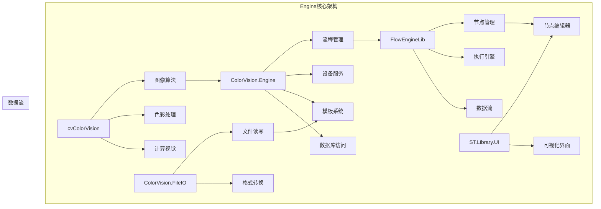

# Engine组件概览

## 目录
1. [概述](#概述)
2. [核心组件列表](#核心组件列表)
3. [组件架构](#组件架构)
4. [组件依赖关系](#组件依赖关系)
5. [使用指南](#使用指南)
6. [开发建议](#开发建议)

## 概述

Engine 目录包含了 ColorVision 系统的核心算法引擎和处理组件，负责图像处理、设备管理、流程控制和数据处理等核心功能。Engine 层是整个系统的数据处理和逻辑控制中心。

### 基本信息

- **主要功能**: 核心算法引擎、流程管理、设备服务、数据处理
- **技术栈**: .NET、OpenCV、MQTT、数据库访问
- **架构模式**: 模块化、服务化、插件化
- **扩展性**: 支持自定义算法模块和设备驱动

## 核心组件列表

### 算法引擎组件

#### 1. [ColorVision.Engine](./ColorVision.Engine.md)
**核心流程引擎和服务管理器**
- **主要功能**: 
  - 流程设计和执行管理
  - 设备服务协调
  - 模板系统管理
  - 数据库操作封装
- **关键特性**:
  - 可视化流程设计器
  - 设备服务自动发现
  - 模板参数化配置
  - 实时状态监控

#### 2. [cvColorVision](./cvColorVision.md)
**底层色彩视觉算法库**
- **主要功能**:
  - 核心图像处理算法
  - 色彩空间转换
  - 图像质量评估
  - 计算机视觉算法
- **关键特性**:
  - 高性能C++实现
  - OpenCV集成
  - CUDA加速支持
  - 多线程处理

#### 3. [ColorVision.FileIO](./ColorVision.FileIO.md)
**文件输入输出处理模块**
- **主要功能**:
  - 各种图像格式支持
  - 数据文件读写
  - 配置文件管理
  - 批量文件处理
- **关键特性**:
  - 多格式支持
  - 异步IO操作
  - 数据验证
  - 错误恢复机制

### 支撑组件

#### 4. [FlowEngineLib](./FlowEngineLib.md)
**流程引擎核心库**
- **主要功能**:
  - 流程节点管理
  - 执行引擎
  - 数据流控制
  - 异常处理
- **关键特性**:
  - 动态节点加载
  - 并行执行支持
  - 流程调试功能
  - 状态持久化

#### 5. [ST.Library.UI](./ST.Library.UI.md)
**节点编辑器UI库**
- **主要功能**:
  - 可视化节点编辑器
  - 流程图渲染
  - 交互操作处理
  - 界面组件
- **关键特性**:
  - 拖拽编辑支持
  - 自动布局算法
  - 撤销重做功能
  - 属性面板集成

## 组件架构



## 组件依赖关系

### 核心依赖
- **ColorVision.Engine** ← 依赖所有其他Engine组件
- **cvColorVision** ← 被ColorVision.Engine调用
- **FlowEngineLib** ← 被ColorVision.Engine和ST.Library.UI使用
- **ColorVision.FileIO** ← 被ColorVision.Engine使用
- **ST.Library.UI** ← 被UI层调用显示流程编辑器

### 外部依赖
- **OpenCV**: 图像处理算法支持
- **MQTT**: 设备通信协议
- **Entity Framework**: 数据库ORM
- **Newtonsoft.Json**: JSON数据序列化

## 使用指南

### 1. 基本集成步骤

```csharp
// 初始化Engine核心服务
var engineService = new ColorVisionEngineService();
await engineService.InitializeAsync();

// 注册设备服务
engineService.RegisterDeviceService<CameraService>();
engineService.RegisterDeviceService<SpectrometerService>();

// 加载流程模板
var flowTemplate = await engineService.LoadFlowTemplateAsync("template_name");

// 执行流程
var result = await engineService.ExecuteFlowAsync(flowTemplate, parameters);
```

### 2. 自定义算法节点

```csharp
public class CustomAlgorithmNode : IFlowNode
{
    public string Name => "Custom Algorithm";
    public string Description => "自定义算法处理节点";
    
    public async Task<NodeResult> ExecuteAsync(NodeContext context)
    {
        // 实现自定义算法逻辑
        var inputImage = context.GetInput<Mat>("image");
        var result = ProcessImage(inputImage);
        return NodeResult.Success(result);
    }
}
```

### 3. 设备服务集成

```csharp
public class CustomDeviceService : BaseDeviceService
{
    public override string ServiceType => "CustomDevice";
    
    public override async Task<bool> ConnectAsync()
    {
        // 实现设备连接逻辑
        return true;
    }
    
    public override async Task<object> ExecuteCommandAsync(string command, object parameters)
    {
        // 实现设备命令执行
        return await ProcessCommandAsync(command, parameters);
    }
}
```

## 开发建议

### 1. 架构原则
- **模块化设计**: 每个组件职责单一，接口清晰
- **可扩展性**: 支持插件化扩展和自定义组件
- **高性能**: 关键算法采用C++实现，支持多线程和CUDA加速
- **容错设计**: 完善的异常处理和错误恢复机制

### 2. 最佳实践
- 使用依赖注入管理组件生命周期
- 实现异步操作避免UI阻塞
- 采用事件驱动模式处理设备状态变化
- 定期性能监控和内存管理

### 3. 性能考虑
- 大图像处理使用内存映射文件
- 关键路径避免不必要的对象分配
- 合理使用线程池和任务调度
- 数据库操作使用连接池和批量处理

### 4. 扩展开发
- 新算法节点继承IFlowNode接口
- 自定义设备服务继承BaseDeviceService
- 使用属性特性标记节点参数
- 实现ITemplate接口创建自定义模板

## 版本兼容性

### 当前版本
- **稳定版本**: 与UI组件同步版本 1.3.8.1
- **目标框架**: .NET 8.0 / .NET 6.0
- **最低系统要求**: Windows 10, OpenCV 4.x

### 升级指南
1. 检查算法API兼容性
2. 更新设备服务接口
3. 验证流程模板格式
4. 测试核心算法功能
5. 检查数据库架构变更

## 相关资源

- [流程引擎详细文档](../algorithm-engine-templates/flow-engine/流程引擎.md)
- [算法引擎与模板](../algorithm-engine-templates/算法引擎与模板.md)
- [设备管理指南](../device-management/)
- [开发者指南](../developer-guide/)
- [API 参考文档](../developer-guide/api-reference/)