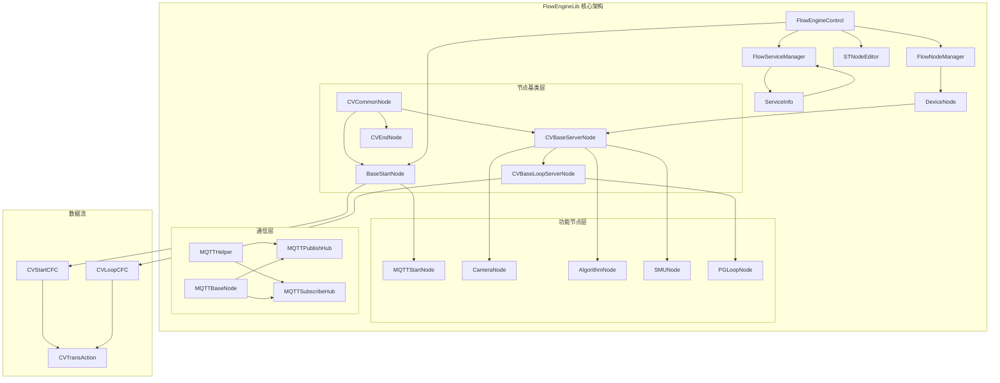
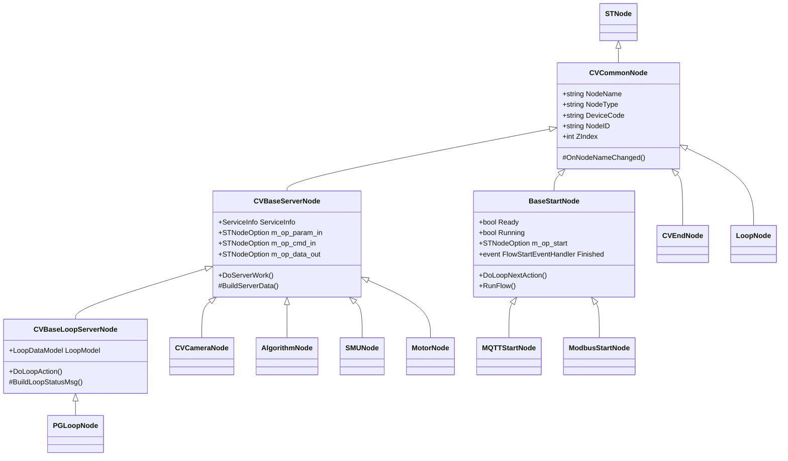
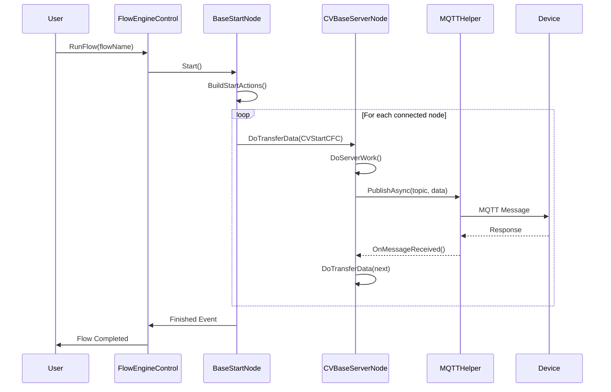

# FlowEngineLib 详细文档

## 概述

FlowEngineLib 是 ColorVision 系统的流程引擎核心库，提供可视化流程节点编辑和执行框架。该库实现了基于节点的流程编排系统，支持多种设备集成、MQTT通信、算法处理和流程控制功能。

### 核心特性

- **可视化流程编辑** - 基于 ST.Library.UI 的节点编辑器，支持拖拽连线
- **流程节点管理** - 支持各种类型的流程节点：相机、算法、传感器、逻辑控制等
- **MQTT 通信集成** - 流程执行中的设备通信和消息传递
- **模板参数化** - 支持流程模板的创建、保存和参数配置
- **循环控制** - 支持循环节点和条件判断逻辑
- **设备抽象** - 统一的设备接口，支持相机、光谱仪、源表等设备
- **异步执行** - 支持流程的异步执行和状态监控

### 技术规格

- **目标框架**: .NET 8.0 Windows / .NET Framework 4.7.2
- **主要依赖**:
  - ST.Library.UI - 节点编辑器UI库
  - MQTTnet 4.3.4 - MQTT通信
  - Newtonsoft.Json 13.0.x - JSON序列化
  - log4net 3.2.0 - 日志记录
- **文件数量**: 271个C#源文件
- **代码行数**: 约20,000+行

## 架构设计

### 整体架构



### 类层次结构



### 数据流模型



## 核心组件详解

### 1. FlowEngineControl

流程引擎的主控制器，负责流程的加载、启动、停止和状态管理。

**主要职责**:
- 管理节点编辑器 (STNodeEditor)
- 维护启动节点集合
- 管理服务节点
- 处理流程执行事件

**关键方法**:
```csharp
// 附加节点编辑器
public FlowEngineControl AttachNodeEditor(STNodeEditor nodeEditor)

// 运行流程
public void RunFlow(string flowName, string serialNumber = "")

// 停止流程
public void StopFlow(string flowName)

// 获取流程状态
public bool IsRunning { get; }
public bool IsReady { get; }
```

**使用示例**:
```csharp
var nodeEditor = new STNodeEditor();
var flowEngine = new FlowEngineControl(nodeEditor, isAutoStartName: true);

flowEngine.Finished += (sender, args) => {
    Console.WriteLine($"Flow {args.FlowName} completed");
};

flowEngine.RunFlow("MainFlow");
```

### 2. FlowNodeManager

节点管理器，负责管理所有设备节点的注册、更新和查找。

**主要职责**:
- 管理命名设备节点
- 管理匿名设备节点
- 更新设备状态
- 同步MQTT服务信息

**关键方法**:
```csharp
// 添加设备节点
public void AddDevice(DeviceNode device)

// 更新设备状态
public void UpdateDevice(Dictionary<string, Dictionary<string, DeviceNode>> devices)
public void UpdateDevice(List<MQTTServiceInfo> services)

// 清除所有设备
public void Clear()
```

### 3. FlowServiceManager

服务管理器，管理MQTT服务的注册和状态维护。

**主要职责**:
- 管理MQTT服务列表
- 维护服务状态
- 提供服务查找功能

**关键方法**:
```csharp
// 获取单例实例
public static FlowServiceManager Instance

// 添加服务
public void AddService(MQTTServiceInfo service)

// 获取所有服务
public List<MQTTServiceInfo> GetServices()

// 查找服务
public MQTTServiceInfo FindService(string serviceType, string serviceCode)
```

## 节点类型系统

### 节点基类

#### CVCommonNode

所有流程节点的基类，继承自 `STNode`。

**核心属性**:
- `NodeName` - 节点名称/服务名称
- `NodeType` - 节点类型/类别
- `DeviceCode` - 设备代码
- `NodeID` - 唯一标识符 (GUID)
- `ZIndex` - 显示层级

**核心功能**:
- 节点属性管理
- 绘制标题和内容
- 事件处理

### 启动节点

#### BaseStartNode

流程的入口节点，所有流程必须从启动节点开始。

**特性**:
- 支持主流程输出 (OUT_START)
- 支持2个循环输出 (OUT_LOOP1, OUT_LOOP2)
- 管理流程执行上下文
- 处理流程完成事件

**派生类**:
- `MQTTStartNode` - 基于MQTT消息触发的启动节点
- `ModbusStartNode` - 基于Modbus协议的启动节点

### 服务节点

#### CVBaseServerNode

执行具体业务逻辑的节点基类。

**核心接口**:
- `m_op_param_in` - 参数输入
- `m_op_cmd_in` - 命令输入
- `m_op_data_out` - 数据输出

**关键方法**:
```csharp
// 执行服务工作
protected abstract void DoServerWork(CVStartCFC cfc)

// 构建服务数据
protected virtual CVBaseDataFlowResp BuildServerData()

// 传输数据到下一节点
protected void DoTransferData(STNodeOption option, CVStartCFC cfc)
```

**主要派生类**:

1. **CVCameraNode** - 相机节点
   - 支持相机拍照
   - 图像数据采集
   - 通道管理

2. **AlgorithmNode** - 算法节点
   - 图像算法处理
   - ROI区域处理
   - 算法参数配置

3. **SMUNode** - 源表节点
   - SMU设备控制
   - 扫描参数配置
   - 数据采集

4. **MotorNode** - 电机节点
   - 电机运动控制
   - 位置管理
   - 速度控制

### 循环节点

#### CVBaseLoopServerNode

支持循环执行的服务节点。

**特性**:
- 循环参数配置
- 循环状态管理
- 支持嵌套循环

**循环数据模型**:
```csharp
public class LoopDataModel
{
    public int BeginVal { get; set; }    // 起始值
    public int EndVal { get; set; }      // 结束值
    public int StepVal { get; set; }     // 步长
    public int CurVal { get; set; }      // 当前值
    public int LoopCount { get; set; }   // 循环次数
}
```

**派生类**:
- `PGLoopNode` - PG设备循环节点
- `LVCameraLoopNode` - 相机循环采集节点
- `CVCameraLoopNode` - 相机循环节点

### 控制节点

#### LoopNode

通用循环控制节点。

**功能**:
- 配置循环起始值、结束值、步长
- 输出循环索引值
- 支持循环终止条件

#### LoopNextNode

循环跳转节点，用于控制循环流程跳转。

**功能**:
- 跳转到指定循环节点
- 传递循环控制信息

#### ManualConfirmNode

手动确认节点，需要用户确认后才继续执行。

**功能**:
- 暂停流程执行
- 等待用户确认
- 支持超时设置

### 结束节点

#### CVEndNode

流程结束节点。

**功能**:
- 标记流程结束
- 收集执行结果
- 触发完成事件

## MQTT通信系统

### MQTTHelper

MQTT通信的核心辅助类。

**主要功能**:
- MQTT客户端管理
- 消息发布
- 消息订阅
- 连接管理

**配置方法**:
```csharp
public static void SetDefaultCfg(
    string host,           // MQTT服务器地址
    int port,              // 端口
    string userName,       // 用户名
    string userPwd,        // 密码
    bool useTls,          // 是否使用TLS
    string clientId        // 客户端ID
)
```

**发布消息**:
```csharp
public static void PublishAsyncClient(string topic, string data)
```

**订阅消息**:
```csharp
public static void SubscribeAsyncClient(string topic)
```

### MQTT节点

#### MQTTPublishHub

MQTT发布节点，用于发布自定义消息。

**输入**:
- 主题 (Topic)
- 消息内容

#### MQTTSubscribeHub

MQTT订阅节点，用于接收MQTT消息。

**输出**:
- 接收的消息内容

#### MQTTCustomPublishNode

自定义MQTT发布节点。

**特性**:
- 支持自定义主题
- 支持消息格式化
- 支持QoS设置

#### MQTTCustomSubscribeNode

自定义MQTT订阅节点。

**特性**:
- 支持通配符订阅
- 消息过滤
- 数据解析

### MQTT数据结构

#### MQTTServiceInfo

服务信息数据结构。

```csharp
public class MQTTServiceInfo
{
    public string ServiceType { get; set; }              // 服务类型
    public string ServiceCode { get; set; }              // 服务代码
    public Dictionary<string, MQTTDeviceInfo> Devices    // 设备列表
}
```

#### MQTTDeviceInfo

设备信息数据结构。

```csharp
public class MQTTDeviceInfo
{
    public string DeviceCode { get; set; }    // 设备代码
    public string DeviceName { get; set; }    // 设备名称
    public string Status { get; set; }        // 设备状态
}
```

## 数据传输系统

### CVStartCFC

流程启动的流控制对象。

**核心属性**:
```csharp
public class CVStartCFC
{
    public string NodeName { get; set; }         // 节点名称
    public string SerialNumber { get; set; }     // 流水号
    public string FlowName { get; set; }         // 流程名称
    public object Params { get; set; }           // 参数
    public string EventName { get; set; }        // 事件名称
}
```

### CVTransAction

数据传输动作对象。

**核心属性**:
```csharp
public class CVTransAction
{
    public ActionTypeEnum ActionType { get; set; }     // 动作类型
    public object Data { get; set; }                   // 数据内容
    public StatusTypeEnum Status { get; set; }         // 状态
}
```

### CVLoopCFC

循环流控制对象。

**核心属性**:
```csharp
public class CVLoopCFC
{
    public string NodeName { get; set; }         // 循环节点名称
    public string SerialNumber { get; set; }     // 流水号
    public int LoopIndex { get; set; }           // 循环索引
    public object LoopData { get; set; }         // 循环数据
}
```

## 算法节点系统

### AlgorithmNode

通用算法处理节点。

**支持的算法类型**:
1. **图像处理算法**
   - ROI提取
   - 图像预处理
   - 特征提取
   - 缺陷检测

2. **ARVR算法**
   - 畸变校正
   - 亮度均匀性
   - 色彩一致性

3. **OLED算法**
   - Mura检测
   - 亮度分析
   - 色域分析

**算法参数**:
```csharp
public class AlgorithmParam
{
    public string AlgorithmType { get; set; }         // 算法类型
    public Dictionary<string, object> Params          // 算法参数
}
```

### 算法节点类型

#### AlgorithmARVRNode

AR/VR专用算法节点。

**功能**:
- 畸变校正
- 亮度均匀性分析
- MTF测试
- 色彩分析

#### CalibrationNode

校准算法节点。

**功能**:
- 相机校准
- 颜色校准
- 光源校准

## 相机系统

### 相机节点

#### CVCameraNode

标准相机节点。

**功能**:
- 相机拍照
- 参数设置
- 图像保存
- 通道管理

**通道系统**:
```csharp
public class Channel
{
    public string ChannelName { get; set; }      // 通道名称
    public int ChannelID { get; set; }           // 通道ID
    public Dictionary<string, object> Params     // 通道参数
}
```

#### CVCameraLoopNode

相机循环采集节点。

**功能**:
- 多次拍照
- 自动保存
- 循环控制

#### LVCameraNode

LV相机节点 (大视场相机)。

**特性**:
- 大图像处理
- 分区采集
- 拼接支持

### 相机数据模型

#### CameraDataModel

```csharp
public class CameraDataModel
{
    public string CameraType { get; set; }           // 相机类型
    public int Width { get; set; }                   // 图像宽度
    public int Height { get; set; }                  // 图像高度
    public Dictionary<string, Channel> Channels      // 通道集合
}
```

## 设备集成

### 设备节点基类

#### DeviceNode

设备的抽象表示。

```csharp
public class DeviceNode
{
    public string DeviceType { get; set; }      // 设备类型
    public string DeviceCode { get; set; }      // 设备代码
    public ServiceInfo ServiceInfo { get; set; } // 服务信息
    
    // 获取设备唯一键
    public string GetKey()
    
    // 更新设备状态
    public void Update(DeviceNode device)
}
```

### 专用设备节点

#### SMUNode - 源表节点

**功能**:
- IV扫描
- 电压电流测量
- 数据采集

**参数**:
```csharp
public class SMUScanRequestParam
{
    public double StartVoltage { get; set; }    // 起始电压
    public double EndVoltage { get; set; }      // 结束电压
    public double StepVoltage { get; set; }     // 电压步长
    public double Compliance { get; set; }       // 限流值
}
```

#### MotorNode - 电机节点

**功能**:
- 位置控制
- 速度控制
- 回零操作

**运行类型**:
```csharp
public enum MotorRunType
{
    Absolute,    // 绝对位置
    Relative,    // 相对位置
    Home         // 回零
}
```

#### FWNode - 滤光片节点

**功能**:
- 滤光片切换
- 位置管理

#### PGLoopNode - PG设备循环节点

**功能**:
- PG图案切换
- 循环显示
- 参数配置

## 流程模板系统

### CVTemplateParam

流程模板参数。

```csharp
public class CVTemplateParam
{
    public string TemplateName { get; set; }         // 模板名称
    public Dictionary<string, object> Params         // 模板参数
    public List<NodeConfig> Nodes                    // 节点配置列表
}
```

### POI模板

#### POINode

兴趣点(Point of Interest)节点。

**功能**:
- 定义测试点位
- 坐标管理
- 数据关联

```csharp
public class POITemplateParam
{
    public List<POIStorageModel> POIs { get; set; }
}

public class POIStorageModel
{
    public string Name { get; set; }       // POI名称
    public double X { get; set; }          // X坐标
    public double Y { get; set; }          // Y坐标
    public object Data { get; set; }       // 关联数据
}
```

## 事件系统

### 流程引擎事件

#### FlowEngineEventHandler

流程完成事件处理器。

```csharp
public delegate void FlowEngineEventHandler(object sender, FlowEngineEventArgs e);

public class FlowEngineEventArgs : EventArgs
{
    public string FlowName { get; set; }
    public bool Success { get; set; }
    public string Message { get; set; }
    public object Result { get; set; }
}
```

#### FlowEngineNodeEvent

节点事件基类。

```csharp
public delegate void FlowEngineNodeEvent(object sender, FlowEngineNodeEventArgs e);

public class FlowEngineNodeEventArgs : EventArgs
{
    public string NodeName { get; set; }
    public string NodeType { get; set; }
    public object Data { get; set; }
}
```

#### FlowEngineNodeRunEvent

节点运行事件。

```csharp
public delegate void FlowEngineNodeRunEvent(object sender, FlowEngineNodeRunEventArgs e);

public class FlowEngineNodeRunEventArgs : FlowEngineNodeEventArgs
{
    public ActionStatusEnum Status { get; set; }
    public string Message { get; set; }
}
```

#### FlowEngineNodeEndEvent

节点结束事件。

```csharp
public delegate void FlowEngineNodeEndEvent(object sender, FlowEngineNodeEndEventArgs e);

public class FlowEngineNodeEndEventArgs : FlowEngineNodeEventArgs
{
    public bool Success { get; set; }
    public CVBaseDataFlowResp Response { get; set; }
}
```

## UI控件系统

### 自定义节点控件

#### STNodeDevText

设备文本控件，用于显示和编辑设备相关文本。

#### STNodeEditText

文本编辑控件。

#### STNodeEditDouble

双精度浮点数编辑控件。

#### STNodeSelectEnumBox

枚举选择框控件。

### Hub控件

#### STNodeHubSingle

单输入Hub控件。

**用途**:
- 汇聚多个输入到单一输出
- 数据合并

#### STNodeHubMulti

多输出Hub控件。

**用途**:
- 单输入分发到多个输出
- 数据广播

#### CVCommonNodeHub

通用节点Hub。

**功能**:
- 支持自定义连接逻辑
- 数据转换

## 配置系统

### Config

全局配置类。

```csharp
public class Config
{
    // MQTT配置
    public static string MQTTHost { get; set; }
    public static int MQTTPort { get; set; }
    
    // 日志配置
    public static string LogPath { get; set; }
    public static string LogLevel { get; set; }
    
    // 流程配置
    public static int MaxFlowThreads { get; set; }
    public static int FlowTimeout { get; set; }
}
```

## 日志系统

### LogHelper

日志辅助类，基于 log4net。

**日志级别**:
- Debug - 调试信息
- Info - 一般信息
- Warn - 警告
- Error - 错误
- Fatal - 致命错误

**使用示例**:
```csharp
private static readonly ILog logger = LogManager.GetLogger(typeof(YourClass));

logger.Info("Flow started");
logger.Error("Flow execution failed", exception);
logger.Debug($"Node {nodeName} processing data");
```

## 错误处理

### 异常类型

1. **FlowExecutionException** - 流程执行异常
2. **NodeConnectionException** - 节点连接异常
3. **DeviceNotReadyException** - 设备未就绪异常
4. **MQTTConnectionException** - MQTT连接异常

### 错误处理策略

```csharp
try
{
    flowEngine.RunFlow(flowName);
}
catch (DeviceNotReadyException ex)
{
    logger.Error("Device not ready", ex);
    // 重试或通知用户
}
catch (FlowExecutionException ex)
{
    logger.Error("Flow execution failed", ex);
    // 回滚操作
}
```

## 性能优化

### 多线程处理

FlowEngineLib 使用线程池来处理并发流程：

```csharp
ThreadPool.SetMinThreads(1, 1);
ThreadPool.SetMaxThreads(5, 5);
```

### 异步操作

关键操作使用异步模式：
- MQTT消息发布/订阅
- 设备通信
- 数据保存

### 内存管理

- 使用对象池减少GC压力
- 及时释放大对象
- 图像数据使用非托管内存

## 扩展开发

### 创建自定义节点

#### 1. 继承基类

```csharp
using FlowEngineLib.Base;
using ST.Library.UI.NodeEditor;

[STNode("/Custom/MyNode")]  // 节点分类
public class MyCustomNode : CVBaseServerNode
{
    public MyCustomNode()
        : base("MyNode", "CustomNode", "CN1", "DEV01")
    {
        // 初始化
    }
    
    protected override void OnCreate()
    {
        base.OnCreate();
        // 添加输入输出选项
    }
    
    protected override void DoServerWork(CVStartCFC cfc)
    {
        // 实现业务逻辑
    }
}
```

#### 2. 添加属性

```csharp
private double m_threshold;

[STNodeProperty("阈值", "处理阈值", false, false)]
public double Threshold
{
    get { return m_threshold; }
    set { m_threshold = value; }
}
```

#### 3. 添加输入输出

```csharp
protected override void OnCreate()
{
    base.OnCreate();
    
    // 添加输入
    InputOptions.Add("Input1", typeof(double), false);
    
    // 添加输出
    OutputOptions.Add("Output1", typeof(double), false);
}
```

#### 4. 处理数据

```csharp
protected override void DoServerWork(CVStartCFC cfc)
{
    // 获取输入数据
    var inputData = GetInputData<double>("Input1");
    
    // 处理数据
    var result = ProcessData(inputData);
    
    // 发送输出
    SetOutputData("Output1", result);
    
    // 传递给下一节点
    DoTransferData(m_op_data_out, cfc);
}
```

### 创建循环节点

```csharp
public class MyLoopNode : CVBaseLoopServerNode<MyLoopProperty>
{
    protected override void DoLoopAction(CVStartCFC cfc, int loopIndex)
    {
        // 循环执行的逻辑
        logger.Info($"Loop iteration {loopIndex}");
        
        // 处理数据
        ProcessLoopData(loopIndex);
    }
}
```

### 集成MQTT设备

```csharp
public class MyMQTTDeviceNode : CVBaseServerNode
{
    protected override void DoServerWork(CVStartCFC cfc)
    {
        // 发送MQTT命令
        var topic = $"{ServiceInfo.ServiceType}/{DeviceCode}/cmd";
        var command = BuildCommand(cfc);
        
        MQTTHelper.PublishAsyncClient(topic, command);
        
        // 等待响应
        WaitForResponse(topic + "/resp", timeout: 5000);
    }
}
```

## 最佳实践

### 1. 节点设计原则

- **单一职责**: 每个节点只做一件事
- **可复用性**: 设计通用的节点供多个流程使用
- **错误处理**: 妥善处理异常并提供有意义的错误信息
- **日志记录**: 记录关键操作和状态变化

### 2. 流程设计

- **模块化**: 将复杂流程拆分为多个子流程
- **参数化**: 使用模板参数而非硬编码
- **容错性**: 添加重试和回退机制
- **可监控**: 提供状态查询和进度反馈

### 3. MQTT通信

- **主题规范**: 使用统一的主题命名规则
- **QoS设置**: 根据重要性选择合适的QoS级别
- **消息格式**: 使用JSON格式便于调试和扩展
- **连接管理**: 处理断线重连

### 4. 性能优化

- **异步执行**: 避免阻塞UI线程
- **批量处理**: 合并多个小操作
- **缓存机制**: 缓存频繁访问的数据
- **资源释放**: 及时释放不再使用的资源

## 调试技巧

### 1. 日志调试

```csharp
logger.Debug($"Node {NodeName} - Input data: {JsonConvert.SerializeObject(inputData)}");
logger.Debug($"Node {NodeName} - Processing...");
logger.Debug($"Node {NodeName} - Output data: {JsonConvert.SerializeObject(outputData)}");
```

### 2. 断点调试

在关键位置设置断点：
- `DoServerWork` 方法入口
- `DoTransferData` 数据传递点
- MQTT消息接收处理

### 3. 流程可视化

使用 STNodeEditor 的调试视图：
- 查看节点连接关系
- 监控数据流向
- 检查节点状态

### 4. 性能分析

```csharp
var sw = Stopwatch.StartNew();
DoServerWork(cfc);
sw.Stop();
logger.Info($"Node {NodeName} execution time: {sw.ElapsedMilliseconds}ms");
```

## 常见问题

### Q1: 如何处理节点执行超时？

```csharp
protected override void DoServerWork(CVStartCFC cfc)
{
    var cts = new CancellationTokenSource(TimeSpan.FromSeconds(30));
    
    try
    {
        Task.Run(() => {
            // 执行任务
        }, cts.Token).Wait();
    }
    catch (OperationCanceledException)
    {
        logger.Warn($"Node {NodeName} execution timeout");
    }
}
```

### Q2: 如何在节点间共享数据？

使用 CVStartCFC 的 Params 属性：

```csharp
// 节点A保存数据
cfc.Params = new Dictionary<string, object>
{
    ["SharedData"] = myData
};

// 节点B读取数据
var sharedData = (cfc.Params as Dictionary<string, object>)?["SharedData"];
```

### Q3: 如何实现条件分支？

```csharp
protected override void DoServerWork(CVStartCFC cfc)
{
    var result = ProcessData();
    
    if (result.Success)
    {
        DoTransferData(m_op_success_out, cfc);
    }
    else
    {
        DoTransferData(m_op_failure_out, cfc);
    }
}
```

### Q4: 如何处理设备未就绪？

```csharp
protected override void DoServerWork(CVStartCFC cfc)
{
    if (!IsDeviceReady())
    {
        logger.Warn("Device not ready, waiting...");
        WaitForDeviceReady(timeout: 10000);
    }
    
    // 继续执行
}
```

## 版本历史

- **v1.6.1** - 最新版本
  - 优化MQTT连接稳定性
  - 增加新的算法节点
  - 性能优化

## 相关文档

- [流程引擎使用指南](../flow-engine/flow-engine-overview.md)
- [节点开发指南](../extensibility/README.md)
- [ST.Library.UI文档](./ST.Library.UI.md)
- [ColorVision.Engine文档](./ColorVision.Engine.md)

## 技术支持

- **维护团队**: ColorVision 开发团队
- **文档更新**: 2024年
- **问题反馈**: 通过项目Issue系统提交

---

本文档持续更新中，如有疑问或建议，欢迎提交反馈。
