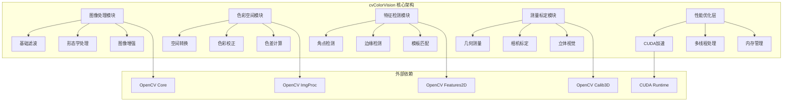

# cvColorVision

## 目录
1. [概述](#概述)
2. [核心功能](#核心功能)
3. [架构设计](#架构设计)
4. [算法模块](#算法模块)
5. [图像处理](#图像处理)
6. [色彩空间](#色彩空间)
7. [计算机视觉](#计算机视觉)
8. [性能优化](#性能优化)
9. [使用示例](#使用示例)
10. [API参考](#api参考)

## 概述

**cvColorVision** 是 ColorVision 系统的底层色彩视觉算法库，采用 C++ 实现，基于 OpenCV 构建。它提供了高性能的图像处理、色彩分析和计算机视觉算法，是整个系统的算法核心。

### 基本信息

- **实现语言**: C++
- **基础库**: OpenCV 4.x
- **加速支持**: CUDA, OpenCL
- **架构**: 模块化, 多线程
- **特色功能**: 色彩空间转换、图像质量评估、特征检测、机器视觉算法

## 核心功能

### 1. 图像处理算法
- **基础滤波**: 高斯滤波、中值滤波、双边滤波
- **形态学处理**: 膨胀、腐蚀、开闭运算
- **边缘检测**: Canny、Sobel、Laplacian算子
- **图像增强**: 直方图均衡化、伽马校正、锐化

### 2. 色彩空间处理
- **色彩空间转换**: RGB、HSV、LAB、XYZ、YUV转换
- **色彩校正**: 白平衡、色温调整、色彩匹配
- **色差计算**: ΔE76、ΔE94、ΔE2000色差公式
- **色域分析**: 色域范围检测和分析

### 3. 特征检测与匹配
- **角点检测**: Harris、FAST、ORB特征点
- **边缘检测**: 直线、圆形、轮廓检测
- **模板匹配**: 单模板、多模板、变形模板匹配
- **对象识别**: 形状、纹理、颜色特征识别

### 4. 测量与标定
- **几何测量**: 距离、角度、面积、周长测量
- **相机标定**: 内参、外参、畸变校正
- **立体视觉**: 双目测距、三维重建
- **精度评估**: 测量精度和重复性评估

## 架构设计



## 算法模块

### ImageProcessor 图像处理器

```cpp
class ImageProcessor
{
public:
    // 基础滤波
    static cv::Mat gaussianBlur(const cv::Mat& src, cv::Size ksize, double sigma);
    static cv::Mat medianBlur(const cv::Mat& src, int ksize);
    static cv::Mat bilateralFilter(const cv::Mat& src, int d, double sigmaColor, double sigmaSpace);
    
    // 形态学处理
    static cv::Mat morphologyEx(const cv::Mat& src, int operation, const cv::Mat& kernel);
    static cv::Mat erode(const cv::Mat& src, const cv::Mat& kernel, int iterations = 1);
    static cv::Mat dilate(const cv::Mat& src, const cv::Mat& kernel, int iterations = 1);
    
    // 图像增强
    static cv::Mat equalizeHistogram(const cv::Mat& src);
    static cv::Mat gammaCorrection(const cv::Mat& src, double gamma);
    static cv::Mat sharpen(const cv::Mat& src, double strength);
};
```

### ColorSpaceConverter 色彩空间转换器

```cpp
class ColorSpaceConverter
{
public:
    // 色彩空间转换
    static cv::Mat convertColorSpace(const cv::Mat& src, int srcSpace, int dstSpace);
    static cv::Mat rgb2xyz(const cv::Mat& rgb);
    static cv::Mat xyz2lab(const cv::Mat& xyz);
    static cv::Mat rgb2hsv(const cv::Mat& rgb);
    
    // 色差计算
    static double deltaE76(const cv::Vec3f& lab1, const cv::Vec3f& lab2);
    static double deltaE94(const cv::Vec3f& lab1, const cv::Vec3f& lab2);
    static double deltaE2000(const cv::Vec3f& lab1, const cv::Vec3f& lab2);
    
    // 白平衡校正
    static cv::Mat whiteBalance(const cv::Mat& src, const cv::Vec3f& whitePoint);
    static cv::Mat colorTemperatureAdjust(const cv::Mat& src, double temperature);
};
```

### FeatureDetector 特征检测器

```cpp
class FeatureDetector
{
public:
    // 角点检测
    static std::vector<cv::Point2f> detectHarrisCorners(const cv::Mat& src, double threshold);
    static std::vector<cv::KeyPoint> detectFASTKeypoints(const cv::Mat& src);
    static std::vector<cv::KeyPoint> detectORBKeypoints(const cv::Mat& src, int maxFeatures);
    
    // 边缘检测
    static cv::Mat cannyEdgeDetection(const cv::Mat& src, double threshold1, double threshold2);
    static std::vector<cv::Vec2f> detectLines(const cv::Mat& edges, double rho, double theta);
    static std::vector<cv::Vec3f> detectCircles(const cv::Mat& src, double dp, double minDist);
    
    // 轮廓检测
    static std::vector<std::vector<cv::Point>> findContours(const cv::Mat& binary);
    static std::vector<cv::Point> findLargestContour(const cv::Mat& binary);
};
```

## 图像处理

### 基础滤波算法

#### 高斯滤波
```cpp
cv::Mat ImageProcessor::gaussianBlur(const cv::Mat& src, cv::Size ksize, double sigma)
{
    cv::Mat dst;
    cv::GaussianBlur(src, dst, ksize, sigma, sigma, cv::BORDER_DEFAULT);
    return dst;
}
```

#### 双边滤波
```cpp
cv::Mat ImageProcessor::bilateralFilter(const cv::Mat& src, int d, double sigmaColor, double sigmaSpace)
{
    cv::Mat dst;
    cv::bilateralFilter(src, dst, d, sigmaColor, sigmaSpace);
    return dst;
}
```

### 图像增强算法

#### 自适应直方图均衡化
```cpp
cv::Mat ImageProcessor::adaptiveHistogramEqualization(const cv::Mat& src)
{
    cv::Mat lab, dst;
    cv::cvtColor(src, lab, cv::COLOR_BGR2LAB);
    
    std::vector<cv::Mat> channels;
    cv::split(lab, channels);
    
    // 创建CLAHE对象
    cv::Ptr<cv::CLAHE> clahe = cv::createCLAHE(2.0, cv::Size(8, 8));
    clahe->apply(channels[0], channels[0]);
    
    cv::merge(channels, lab);
    cv::cvtColor(lab, dst, cv::COLOR_LAB2BGR);
    
    return dst;
}
```

#### 伽马校正
```cpp
cv::Mat ImageProcessor::gammaCorrection(const cv::Mat& src, double gamma)
{
    cv::Mat dst;
    cv::Mat lookupTable(1, 256, CV_8U);
    uchar* p = lookupTable.ptr();
    
    for (int i = 0; i < 256; ++i) {
        p[i] = cv::saturate_cast<uchar>(pow(i / 255.0, gamma) * 255.0);
    }
    
    cv::LUT(src, lookupTable, dst);
    return dst;
}
```

## 色彩空间

### RGB到LAB转换

```cpp
cv::Mat ColorSpaceConverter::rgb2lab(const cv::Mat& rgb)
{
    cv::Mat xyz, lab;
    
    // RGB转XYZ
    cv::cvtColor(rgb, xyz, cv::COLOR_RGB2XYZ);
    
    // XYZ转LAB
    cv::cvtColor(xyz, lab, cv::COLOR_XYZ2Lab);
    
    return lab;
}
```

### 色差计算

#### Delta E 2000 色差公式
```cpp
double ColorSpaceConverter::deltaE2000(const cv::Vec3f& lab1, const cv::Vec3f& lab2)
{
    double L1 = lab1[0], a1 = lab1[1], b1 = lab1[2];
    double L2 = lab2[0], a2 = lab2[1], b2 = lab2[2];
    
    // 计算色度值
    double C1 = sqrt(a1*a1 + b1*b1);
    double C2 = sqrt(a2*a2 + b2*b2);
    double Cab = (C1 + C2) / 2.0;
    
    // G值计算
    double G = 0.5 * (1 - sqrt(pow(Cab, 7) / (pow(Cab, 7) + pow(25, 7))));
    
    // 校正后的a值
    double ap1 = a1 * (1 + G);
    double ap2 = a2 * (1 + G);
    
    // 重新计算色度值
    double Cp1 = sqrt(ap1*ap1 + b1*b1);
    double Cp2 = sqrt(ap2*ap2 + b2*b2);
    
    // 色相角计算
    double hp1 = atan2(b1, ap1) * 180.0 / M_PI;
    double hp2 = atan2(b2, ap2) * 180.0 / M_PI;
    
    // 更多复杂计算...
    // 返回最终的Delta E 2000值
    return deltaE;
}
```

### 白平衡算法

```cpp
cv::Mat ColorSpaceConverter::whiteBalance(const cv::Mat& src, const cv::Vec3f& whitePoint)
{
    cv::Mat dst = src.clone();
    
    // 计算各通道的缩放因子
    cv::Scalar meanValues = cv::mean(src);
    
    std::vector<cv::Mat> channels;
    cv::split(src, channels);
    
    for (int i = 0; i < 3; i++) {
        double scale = whitePoint[i] / meanValues[i];
        channels[i] *= scale;
    }
    
    cv::merge(channels, dst);
    return dst;
}
```

## 计算机视觉

### 模板匹配

```cpp
class TemplateMatchResult
{
public:
    cv::Point location;
    double matchValue;
    double angle;
    cv::Size templateSize;
};

class TemplateeMatcher
{
public:
    static std::vector<TemplateMatchResult> matchTemplate(
        const cv::Mat& image, 
        const cv::Mat& templ, 
        int method = cv::TM_CCOEFF_NORMED,
        double threshold = 0.8)
    {
        cv::Mat result;
        cv::matchTemplate(image, templ, result, method);
        
        std::vector<TemplateMatchResult> matches;
        
        // 查找所有匹配位置
        cv::Mat mask;
        cv::threshold(result, mask, threshold, 1.0, cv::THRESH_BINARY);
        
        std::vector<cv::Point> locations;
        cv::findNonZero(mask, locations);
        
        for (const auto& loc : locations) {
            TemplateMatchResult match;
            match.location = loc;
            match.matchValue = result.at<float>(loc);
            match.templateSize = templ.size();
            matches.push_back(match);
        }
        
        return matches;
    }
};
```

### 形状检测

```cpp
class ShapeDetector
{
public:
    struct Circle {
        cv::Point2f center;
        float radius;
    };
    
    struct Rectangle {
        cv::Point2f vertices[4];
        double angle;
    };
    
    static std::vector<Circle> detectCircles(const cv::Mat& src, double dp = 1, double minDist = 30)
    {
        cv::Mat gray;
        if (src.channels() > 1) {
            cv::cvtColor(src, gray, cv::COLOR_BGR2GRAY);
        } else {
            gray = src;
        }
        
        std::vector<cv::Vec3f> circles;
        cv::HoughCircles(gray, circles, cv::HOUGH_GRADIENT, dp, minDist);
        
        std::vector<Circle> result;
        for (const auto& c : circles) {
            Circle circle;
            circle.center = cv::Point2f(c[0], c[1]);
            circle.radius = c[2];
            result.push_back(circle);
        }
        
        return result;
    }
};
```

## 性能优化

### CUDA 加速

```cpp
#ifdef USE_CUDA
class CudaImageProcessor
{
public:
    static cv::cuda::GpuMat gaussianBlurCuda(const cv::cuda::GpuMat& src, cv::Size ksize, double sigma)
    {
        cv::cuda::GpuMat dst;
        cv::Ptr<cv::cuda::Filter> filter = cv::cuda::createGaussianFilter(
            src.type(), src.type(), ksize, sigma);
        filter->apply(src, dst);
        return dst;
    }
    
    static cv::cuda::GpuMat bilateralFilterCuda(const cv::cuda::GpuMat& src, 
                                               int kernel_size, 
                                               float sigma_color, 
                                               float sigma_spatial)
    {
        cv::cuda::GpuMat dst;
        cv::cuda::bilateralFilter(src, dst, kernel_size, sigma_color, sigma_spatial);
        return dst;
    }
};
#endif
```

### 多线程处理

```cpp
class ParallelImageProcessor
{
public:
    static cv::Mat processParallel(const cv::Mat& src, 
                                  std::function<cv::Mat(const cv::Mat&)> processor,
                                  int numThreads = 0)
    {
        if (numThreads == 0) {
            numThreads = cv::getNumThreads();
        }
        
        // 分割图像为多个区域
        std::vector<cv::Rect> regions = divideImage(src, numThreads);
        std::vector<cv::Mat> results(regions.size());
        
        // 并行处理每个区域
        cv::parallel_for_(cv::Range(0, regions.size()), [&](const cv::Range& range) {
            for (int i = range.start; i < range.end; i++) {
                cv::Mat roi = src(regions[i]);
                results[i] = processor(roi);
            }
        });
        
        // 合并结果
        return mergeResults(results, regions, src.size());
    }
};
```

### 内存管理

```cpp
class MemoryPool
{
private:
    std::vector<cv::Mat> pool;
    std::mutex poolMutex;
    
public:
    cv::Mat acquire(cv::Size size, int type)
    {
        std::lock_guard<std::mutex> lock(poolMutex);
        
        for (auto it = pool.begin(); it != pool.end(); ++it) {
            if (it->size() == size && it->type() == type) {
                cv::Mat mat = *it;
                pool.erase(it);
                return mat;
            }
        }
        
        return cv::Mat(size, type);
    }
    
    void release(cv::Mat& mat)
    {
        if (!mat.empty()) {
            std::lock_guard<std::mutex> lock(poolMutex);
            pool.push_back(mat);
            mat = cv::Mat(); // 清空引用
        }
    }
};
```

## 使用示例

### 完整的图像处理流水线

```cpp
#include "cvColorVision.h"

int main()
{
    // 加载图像
    cv::Mat image = cv::imread("input.jpg");
    if (image.empty()) {
        std::cerr << "无法加载图像" << std::endl;
        return -1;
    }
    
    // 1. 预处理 - 去噪
    cv::Mat denoised = ImageProcessor::bilateralFilter(image, 9, 80, 80);
    
    // 2. 色彩空间转换
    cv::Mat lab = ColorSpaceConverter::rgb2lab(denoised);
    
    // 3. 图像增强
    cv::Mat enhanced = ImageProcessor::adaptiveHistogramEqualization(lab);
    
    // 4. 特征检测
    cv::Mat gray;
    cv::cvtColor(enhanced, gray, cv::COLOR_BGR2GRAY);
    auto keypoints = FeatureDetector::detectORBKeypoints(gray, 500);
    
    // 5. 形状检测
    auto circles = ShapeDetector::detectCircles(gray);
    
    // 6. 结果可视化
    cv::Mat result = enhanced.clone();
    
    // 绘制关键点
    for (const auto& kp : keypoints) {
        cv::circle(result, kp.pt, 3, cv::Scalar(0, 255, 0), -1);
    }
    
    // 绘制圆形
    for (const auto& circle : circles) {
        cv::circle(result, circle.center, circle.radius, cv::Scalar(0, 0, 255), 2);
    }
    
    // 保存结果
    cv::imwrite("output.jpg", result);
    
    // 输出统计信息
    std::cout << "检测到关键点: " << keypoints.size() << std::endl;
    std::cout << "检测到圆形: " << circles.size() << std::endl;
    
    return 0;
}
```

### 色差分析示例

```cpp
void colorDifferenceAnalysis(const cv::Mat& reference, const cv::Mat& sample)
{
    // 转换为LAB色彩空间
    cv::Mat refLab = ColorSpaceConverter::rgb2lab(reference);
    cv::Mat sampleLab = ColorSpaceConverter::rgb2lab(sample);
    
    // 计算每个像素的色差
    cv::Mat deltaE(reference.size(), CV_64F);
    
    for (int y = 0; y < reference.rows; y++) {
        for (int x = 0; x < reference.cols; x++) {
            cv::Vec3f refColor = refLab.at<cv::Vec3f>(y, x);
            cv::Vec3f sampleColor = sampleLab.at<cv::Vec3f>(y, x);
            
            double de2000 = ColorSpaceConverter::deltaE2000(refColor, sampleColor);
            deltaE.at<double>(y, x) = de2000;
        }
    }
    
    // 统计分析
    cv::Scalar meanDE, stdDE;
    cv::meanStdDev(deltaE, meanDE, stdDE);
    
    double minDE, maxDE;
    cv::minMaxLoc(deltaE, &minDE, &maxDE);
    
    std::cout << "色差统计:" << std::endl;
    std::cout << "平均色差: " << meanDE[0] << std::endl;
    std::cout << "标准差: " << stdDE[0] << std::endl;
    std::cout << "最小色差: " << minDE << std::endl;
    std::cout << "最大色差: " << maxDE << std::endl;
    
    // 生成色差热图
    cv::Mat heatmap;
    cv::normalize(deltaE, heatmap, 0, 255, cv::NORM_MINMAX, CV_8U);
    cv::applyColorMap(heatmap, heatmap, cv::COLORMAP_JET);
    cv::imwrite("color_difference_heatmap.jpg", heatmap);
}
```

## API参考

### 主要头文件

```cpp
// 主要包含文件
#include "ImageProcessor.h"      // 图像处理算法
#include "ColorSpaceConverter.h" // 色彩空间转换
#include "FeatureDetector.h"     // 特征检测
#include "TemplateeMatcher.h"    // 模板匹配
#include "ShapeDetector.h"       // 形状检测
#include "CameraCalibrator.h"    // 相机标定
#include "PerformanceOptimizer.h"// 性能优化
```

### 错误处理

```cpp
enum class CVisionError
{
    Success = 0,
    InvalidInput,
    InsufficientMemory,
    UnsupportedFormat,
    ProcessingError,
    CudaError
};

class CVisionException : public std::exception
{
public:
    CVisionException(CVisionError error, const std::string& message)
        : error_(error), message_(message) {}
    
    CVisionError getError() const { return error_; }
    const char* what() const noexcept override { return message_.c_str(); }
    
private:
    CVisionError error_;
    std::string message_;
};
```

### 配置管理

```cpp
struct CVisionConfig
{
    // CUDA配置
    bool enableCuda = false;
    int cudaDeviceId = 0;
    
    // 内存配置
    bool useMemoryPool = true;
    size_t maxMemoryPoolSize = 1024 * 1024 * 1024; // 1GB
    
    // 线程配置
    int numThreads = 0; // 0 = 自动检测
    
    // 精度配置
    double defaultThreshold = 0.8;
    int defaultIterations = 10;
};

// 全局配置单例
class CVisionSystem
{
public:
    static CVisionSystem& getInstance() {
        static CVisionSystem instance;
        return instance;
    }
    
    void initialize(const CVisionConfig& config);
    void shutdown();
    const CVisionConfig& getConfig() const { return config_; }
    
private:
    CVisionConfig config_;
    bool initialized_ = false;
};
```

## 相关资源

- [OpenCV 官方文档](https://docs.opencv.org/)
- [CUDA 编程指南](https://docs.nvidia.com/cuda/)
- [图像处理算法参考](../developer-guide/image-processing-algorithms/)
- [性能优化指南](../developer-guide/performance-optimization/)
- [API 完整参考](../developer-guide/api-reference/cvColorVision/)