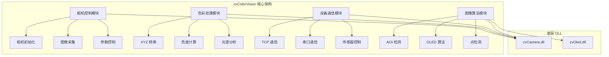

# cvColorVision

## 目录
1. [概述](#概述)
2. [技术架构](#技术架构)
3. [核心模块](#核心模块)
4. [相机控制](#相机控制)
5. [色彩处理](#色彩处理)
6. [设备通信](#设备通信)
7. [图像算法](#图像算法)
8. [使用示例](#使用示例)
9. [API参考](#api参考)
10. [常见问题](#常见问题)

## 概述

**cvColorVision** 是 ColorVision 系统的视觉处理核心模块，提供图像采集、色彩分析和视觉算法的底层实现。它是一个 **C# 封装库**，通过 P/Invoke 技术调用底层 **C++ DLL**（cvCamera.dll、cvOled.dll）实现高性能的图像处理功能。

### 基本信息

- **封装层语言**: C# (.NET)
- **底层实现**: C++ (基于 OpenCV 4.x)
- **接口方式**: P/Invoke (DllImport)
- **硬件支持**: 多种相机型号、光谱仪、传感器
- **加速支持**: CUDA (GPU 加速，底层支持)
- **特色功能**: 
  - 相机控制与图像采集
  - 色彩空间转换与测量
  - 设备通信（TCP/串口）
  - OLED 像素检测
  - AOI 缺陷检测
  - 光谱数据处理

## 技术架构

### 整体架构

```
┌─────────────────────────────────────────────────────────┐
│              ColorVision 应用层                          │
│              (ColorVision.Engine)                        │
└──────────────────────┬──────────────────────────────────┘
                       │ 调用
                       ↓
┌─────────────────────────────────────────────────────────┐
│          cvColorVision (C# 封装层)                       │
│  ┌──────────────┬──────────────┬──────────────────┐    │
│  │  相机控制    │   色彩处理    │    设备通信      │    │
│  ├──────────────┼──────────────┼──────────────────┤    │
│  │  图像算法    │   工具类      │    数据结构      │    │
│  └──────────────┴──────────────┴──────────────────┘    │
└──────────────────────┬──────────────────────────────────┘
                       │ P/Invoke (DllImport)
                       ↓
┌─────────────────────────────────────────────────────────┐
│          底层 C++ DLL 库                                 │
│  ┌──────────────────────────────────────────────┐      │
│  │  cvCamera.dll (相机控制和图像处理)            │      │
│  │  - OpenCV 4.x                                 │      │
│  │  - CUDA 加速                                  │      │
│  │  - 多种相机 SDK                               │      │
│  └──────────────────────────────────────────────┘      │
│  ┌──────────────────────────────────────────────┐      │
│  │  cvOled.dll (OLED 专用算法)                   │      │
│  │  - 像素检测                                   │      │
│  │  - 摩尔纹滤波                                 │      │
│  └──────────────────────────────────────────────┘      │
└─────────────────────────────────────────────────────────┘
```

### 模块化设计



## 核心模块

### 模块分类总览

| 分类 | 文件 | 行数 | 主要功能 |
|------|------|------|----------|
| **相机控制** | cvCameraCSLib.cs | 1061 | 相机初始化、图像采集、参数控制 |
| | CMStruct.cs | 155 | 相机数据结构和枚举 |
| **色彩处理** | ConvertXYZ.cs | 98 | XYZ 色彩空间转换 |
| | Spectrometer.cs | 138 | 光谱数据处理 |
| **设备通信** | SensorComm.cs | 115 | 传感器 TCP/串口通信 |
| | PG.cs | 50 | Pattern Generator 控制 |
| | PassSx.cs | 73 | 电源设备控制 |
| **图像算法** | Algorithms.cs | 13 | 基础点检测算法 |
| | AoiParam.cs | 44 | AOI 缺陷检测 |
| | KeyBoard.cs | 24 | 键盘光晕检测 |
| | CvOledDLL.cs | 26 | OLED 算法接口 |
| | CVLED_COLOR.cs | 9 | LED 颜色定义 |
| | CVOLED_ERROR.cs | 15 | 错误码定义 |
| **工具类** | Util/CfgFile.cs | 50 | 配置文件读写 |
| **总计** | | **1821** | |

## 相机控制

### cvCameraCSLib - 相机控制主模块

这是最核心的模块（1061 行），提供完整的相机控制功能。

#### 支持的相机类型

```csharp
public enum CameraType
{
    CV_Q,           // QHY 相机（色度模式）
    LV_Q,           // QHY 相机（亮度模式）
    BV_Q,           // QHY 相机（黑白模式）
    MIL_CL,         // Matrox CameraLink 相机
    MIL_CXP,        // Matrox CoaXPress 相机
    BV_H,           // Hikvision 黑白相机
    LV_H,           // Hikvision 亮度相机
    HK_CXP,         // Hikvision CoaXPress
    CV_HK_USB,      // Hikvision USB 相机
    // ... 更多类型
}
```

#### 相机模式

```csharp
public enum CameraMode
{
    CV_MODE,        // 色度模式（Color Value）
    BV_MODE,        // 黑白模式（Black/White）
    LV_MODE,        // 亮度模式（Luminance Value）
    LVTOBV_MODE,    // 亮度转黑白模式
}
```

#### 主要功能

##### 1. 相机初始化与管理

```csharp
// 初始化相机
IntPtr CM_Init(CameraType camType);

// 打开相机（通过索引）
bool CM_Open(IntPtr handle, int index);

// 关闭相机
bool CM_Close(IntPtr handle);

// 释放相机资源
bool CM_Uninit(IntPtr handle);
```

##### 2. 图像采集

```csharp
// 采集单帧图像
int CM_GetImage(IntPtr handle, byte[] rawArray);

// 开始实时预览
bool CM_StartLive(IntPtr handle, LiveShowEvent liveCallBack);

// 停止实时预览
bool CM_StopLive(IntPtr handle);
```

##### 3. 相机参数控制

**曝光控制**:
```csharp
// 设置曝光时间（微秒）
bool CM_SetExposureTime(IntPtr handle, uint exposureTime);

// 获取曝光时间
uint CM_GetExposureTime(IntPtr handle);
```

**增益控制**:
```csharp
// 设置增益
bool CM_SetGain(IntPtr handle, double gain);

// 获取增益
double CM_GetGain(IntPtr handle);
```

**白平衡控制**:
```csharp
// 设置白平衡 RGB
bool CM_SetWhiteBalance(IntPtr handle, double wbR, double wbG, double wbB);

// 自动白平衡
bool CM_AutoWhiteBalance(IntPtr handle);
```

##### 4. 图像信息获取

```csharp
// 获取图像宽度
int CM_GetImageWidth(IntPtr handle);

// 获取图像高度
int CM_GetImageHeight(IntPtr handle);

// 获取图像位深
int CM_GetImageBpp(IntPtr handle);

// 获取图像通道数
int CM_GetImageChannels(IntPtr handle);
```

### CMStruct - 数据结构定义

#### 采集模式

```csharp
public enum TakeImageMode
{
    Measure_Normal = 0,     // 标准测量模式
    Live,                   // 实时预览模式
    Measure_Fast,           // 快速测量模式
    Measure_FastEx          // 扩展快速模式
}
```

#### 标定类型

```csharp
public enum CalibrationType
{
    DarkNoise = 0,          // 暗噪声标定
    DefectWPoint,           // 白点缺陷
    DefectBPoint,           // 黑点缺陷
    DefectPoint,            // 综合缺陷
    DSNU,                   // 暗信号不均匀性
    Uniformity,             // 均匀性标定
    Luminance,              // 亮度标定
    Distortion,             // 畸变标定
    ColorShift,             // 色偏标定
    // ... 更多类型
}
```

#### 图像通道类型

```csharp
public enum ImageChannelType
{
    Gray_X = 0,             // X 通道灰度
    Gray_Y = 1,             // Y 通道灰度
    Gray_Z = 2,             // Z 通道灰度
    xCIE = 3,               // CIE x 色度
    yCIE = 4,               // CIE y 色度
    CIE_X = 7,              // CIE X 三刺激值
    CIE_Y = 8,              // CIE Y 三刺激值
    CIE_Z = 9,              // CIE Z 三刺激值
    // ... 更多类型
}
```

## 色彩处理

### ConvertXYZ - 色彩空间转换

提供 XYZ 色彩空间转换和色度计算功能。

#### 初始化与资源管理

```csharp
// 初始化 XYZ 转换器
IntPtr CM_InitXYZ(IntPtr cameraHandle);

// 设置图像缓冲区
int CM_SetBufferXYZ(IntPtr handle, uint w, uint h, uint bpp, uint channels, byte[] rawArray);

// 释放资源
int CM_UnInitXYZ(IntPtr handle);
```

#### 圆形区域测量

```csharp
// 获取 XYZ 和 xyuv 色度坐标（圆形区域）
int CM_GetXYZxyuvCircle(
    IntPtr handle, 
    int pX, int pY,             // 中心点坐标
    ref float X, ref float Y, ref float Z,    // XYZ 三刺激值
    ref float x, ref float y,                 // xy 色度坐标
    ref float u, ref float v,                 // uv 色度坐标
    double nRadius = 3                        // 半径
);

// 批量测量（圆形区域）
int CM_GetXYZxyuvCircleEx(
    IntPtr handle,
    int[] pX, int[] pY,         // 多个点的坐标数组
    float[] pdX, float[] pdY, float[] pdZ,    // XYZ 结果数组
    float[] pdx, float[] pdy,                 // xy 结果数组
    float[] pdu, float[] pdv,                 // uv 结果数组
    int nLen,                   // 点的数量
    string szFileName,          // 结果保存文件
    double nRadius = 0.0
);
```

#### 矩形区域测量

```csharp
// 获取 XYZ 值（矩形区域）
int CM_GetXYZRect(
    IntPtr handle,
    int nX, int nY,             // 左上角坐标
    ref float dX, ref float dY, ref float dZ,
    int nRw, int nRh            // 矩形宽度和高度
);

// 批量测量（矩形区域）
int CM_GetXYZRectEx(
    IntPtr handle,
    int[] pX, int[] pY,
    float[] pdX, float[] pdY, float[] pdZ,
    int nLen,
    string szFileName,
    int nRw, int nRh
);
```

#### 色度和色温计算

```csharp
// 获取色度坐标和色温
int CM_GetxyuvCCTWaveCircle(
    IntPtr handle,
    int pX, int pY,
    ref float x, ref float y,   // xy 色度
    ref float u, ref float v,   // uv 色度
    ref float CCT,              // 相关色温（K）
    ref float Wave,             // 主波长（nm）
    double nRadius = 3
);
```

#### 滤波设置

```csharp
// 设置滤波器
int CM_SetFilter(IntPtr handle, bool bEnable, float fthreshold);

// 设置 XYZ 滤波器
int CM_SetFilterXYZ(IntPtr handle, bool bEnable, int nType, float fthreshold);
```

### Spectrometer - 光谱数据处理

#### 光谱参数结构

```csharp
public struct COLOR_PARA
{
    // CIE 1931 色坐标
    public float fCIEx;
    public float fCIEy;
    public float fCIEz;
    
    // CIE 2015 色坐标
    public float fCIEx_2015;
    public float fCIEy_2015;
    public float fCIEz_2015;
    
    // xy 色度坐标
    public float fx;
    public float fy;
    
    // uv 色度坐标
    public float fu;
    public float fv;
    
    // 2015 色度坐标
    public float fx_2015;
    public float fy_2015;
    public float fu_2015;
    public float fv_2015;
    
    // 色温和色差
    public float fCCT;          // 相关色温（K）
    public float dC;            // 色差 dC
    
    // 波长参数
    public float fLd;           // 主波长（nm）
    public float fPur;          // 色纯度（%）
    public float fLp;           // 峰值波长（nm）
    public float fHW;           // 半波宽（nm）
    public float fLav;          // 平均波长（nm）
    
    // 显色性
    public float fRa;           // 显色性指数 Ra
    public float[] fRi;         // 显色性指数 R1-R15（数组）
    
    // 颜色比例
    public float fRR;           // 红色比
    public float fGR;           // 绿色比
    public float fBR;           // 蓝色比
    
    // 光度和辐射度
    public float fPh;           // 光度值
    public float fPhe;          // 辐射度值
    public float fPlambda;      // 绝对光谱系数
    
    // 光谱范围
    public float fSpect1;       // 起始波长
    public float fSpect2;       // 结束波长
}
```

## 设备通信

### SensorComm - 传感器通信

支持 TCP/IP 和串口两种通信方式。

#### 通信类型

```csharp
public enum Communicate_Type
{
    Communicate_Tcp = 0,        // TCP/IP 通信
    Communicate_Serial,         // 串口通信
}
```

#### 传感器客户端

##### 初始化与连接

```csharp
// 初始化传感器通信
IntPtr CM_InitSensorComm(Communicate_Type eCOM_Type);

// 连接到传感器（TCP）
bool CM_ConnectToSensor(IntPtr handle, string szIPAddress, uint nPort);

// 连接到传感器（串口）
bool CM_InitSerialSensor(IntPtr handle, string szComName, ulong BaudRate);

// 检查连接状态
bool CM_SensorConnected(IntPtr handle);

// 断开连接
bool CM_DestroySensor(IntPtr handle);

// 释放资源
bool CM_UnInitSensorComm(IntPtr handle);
```

##### 指令收发

```csharp
// 发送指令并接收响应
bool CM_SendCmdToSensorEx(
    IntPtr handle,
    string szCmd,           // 发送的指令
    byte[] szResponses,     // 接收缓冲区
    ulong dwTimeOut         // 超时时间（ms）
);

// 发送二进制指令
int CM_SendCmdToSensorEx2(
    IntPtr handle,
    byte[] szCmd, int nSendLen,         // 发送数据
    byte[] szResponses, int nResLen,    // 接收数据
    ulong dwTimeOut
);
```

#### TCP Server

##### 服务器创建

```csharp
// 回调函数定义
public delegate void ReceiveCallback(IntPtr data1, IntPtr data2, byte[] data3, int data4);
public delegate void ListenCallback(IntPtr data1, IntPtr data2, bool data3);

// 创建 TCP 服务器
IntPtr CM_CreateTCPServer(
    uint nPort,
    IntPtr hOperate,
    ReceiveCallback receiveCallback,
    ListenCallback listenCallback
);
```

##### 服务器操作

```csharp
// 检查 Socket 状态
bool CM_Sv_IsSocketOpened(IntPtr hServer);

// 检查客户端连接
bool CM_Sv_IsConnected(IntPtr hServer, IntPtr hClient);

// 向所有客户端发送数据
ulong CM_Sv_Send(IntPtr hServer, byte[] lpBuffer, ulong dwLength);

// 向指定客户端发送数据
ulong CM_Sv_SendEx(IntPtr hServer, IntPtr hClient, byte[] lpBuffer, ulong dwLength);

// 获取客户端数量
long CM_Sv_GetClientCount(IntPtr hServer);

// 获取客户端 IP
bool CM_Sv_GetClientIP(IntPtr hServer, IntPtr hClient, char[] szIPAddress, ref uint nPort);
```

### PG - Pattern Generator 控制

图案生成器（测试图案）控制模块。

#### PG 类型

```csharp
public enum PG_Type
{
    GX09C_LCM = 0,      // GX09C LCD 模块
    SKYCODE,            // SKYCODE 图案生成器
}
```

#### 主要功能

```csharp
// 初始化 PG
IntPtr CM_InitPG(PG_Type ePgType, Communicate_Type eCOMType);

// 连接到 PG（TCP）
bool CM_ConnectToPG(IntPtr handle, string szIPAddress, uint nPort);

// 连接到 PG（串口）
bool CM_InitSerialPG(IntPtr handle, string szComName, ulong BaudRate);

// 检查连接
bool CM_IsConnectedPG(IntPtr handle);

// 启动图案显示
bool CM_StartPG(IntPtr handle);

// 停止图案显示
bool CM_StopPG(IntPtr handle);

// 切换图案
bool CM_SwitchUpPG(IntPtr handle);          // 上一个
bool CM_SwitchDownPG(IntPtr handle);        // 下一个
bool CM_SwitchFramePG(IntPtr handle, int nIndex);  // 指定帧

// 关闭连接
bool CM_ClosePG(IntPtr handle);

// 释放资源
bool CM_UnInitPG(IntPtr handle);
```

### PassSx - 电源控制

电源设备（源表）控制模块。

#### 主要功能

```csharp
// 打开网络设备
int OpenNetDevice(bool bNet, string devName);

// 关闭设备
bool CloseDevice(int nDevID);

// 获取设备标识
bool cvPssSxGetIDN(int nDevID, byte[] pszIdn, ref int strLen);

// 测量数据（设置电压/电流并测量）
bool cvMeasureData(
    int nDevID,
    double measureVal,      // 测量值（V 或 mA）
    double lmtVal,          // 限制值
    ref double rstV,        // 返回电压
    ref double rstI         // 返回电流
);

// 单步测量
bool cvStepMeasureData(
    int nDevID,
    double measureVal,
    double lmtVal,
    ref double rstV,
    ref double rstI
);

// 序列扫描
bool cvSweepData(
    int nDevID,
    double srcRng,          // 源量程
    double lmtRng,          // 限制量程
    double lmtVal,          // 限制值
    double startVal,        // 起始值
    double stopVal,         // 结束值
    int points,             // 点数
    double[] pVList,        // 电压数组
    double[] pIList         // 电流数组
);

// 设置输出
bool CvPssSxSetOutput(int nDevID);

// 设置源类型（电压源/电流源）
bool cvPssSxSetSourceV(int nDevID, bool isSourceV);
```

## 图像算法

### Algorithms - 基础点检测

```csharp
// 点检测算法
int forPoint(
    byte[] inputim,         // 输入图像
    out int[] xPos,         // 输出 X 坐标数组
    out int[] yPos,         // 输出 Y 坐标数组
    int h, int w,           // 图像高度和宽度
    int nbpp,               // 位深
    int nChannels,          // 通道数
    int method,             // 检测方法
    ref int pointNumber,    // 点的数量
    int pointDistance,      // 点间距
    int startPosition,      // 起始位置
    int binaryPercentage    // 二值化百分比
);
```

### AoiParam - AOI 缺陷检测

#### 检测参数

```csharp
public struct AoiParam
{
    // 面积过滤
    public bool filter_by_area;
    public int max_area;
    public int min_area;
    
    // 对比度过滤
    public bool filter_by_contrast;
    public float max_contrast;
    public float min_contrast;
    public float contrast_brightness;
    public float contrast_darkness;
    
    // 图像处理参数
    public int blur_size;           // 模糊核大小
    public int min_contour_size;    // 最小轮廓大小
    public int erode_size;          // 腐蚀核大小
    public int dilate_size;         // 膨胀核大小
    
    // 检测区域
    public int left;
    public int right;
    public int top;
    public int bottom;
}
```

#### 检测功能

```csharp
// 创建 AOI 检测器
IntPtr CreateAOIDetector();

// 设置检测参数
bool AOIDetectorSetParam(IntPtr handle, AoiParam aoiParam);

// 输入图像进行检测
int AOIDetectorInput(
    IntPtr handle,
    uint w, uint h,
    uint bpp, uint channels,
    byte[] rawArray
);

// 获取检测结果 Blob
bool GetAoiDetectorBlob(IntPtr handle, int nIndex, PartiCle tParticle);

// 释放检测器
bool ReleaseAOIDetector(IntPtr handle);
```

### KeyBoard - 键盘光晕检测

```csharp
// 初始化键盘源数据
void CM_InitialKeyBoardSrc(
    int w, int h,
    int bpp, int channels,
    IntPtr imgdata,
    int saveProcessData,
    string debugPath,
    float exp,
    string luminFile,
    int doCali = 1
);

// 计算光晕
float CM_CalculateHalo(
    IRECT keyRect,          // 键盘区域
    int outMOVE,            // 外部移动
    int threadV,            // 阈值
    int haloSize,           // 光晕大小
    string savePath,
    ushort[] gray,
    ref uint pixNum
);

// 计算键盘亮度
float CM_CalculateKey(
    IRECT keyRect,
    int inMOVE,
    int threadV,
    string path,
    ushort[] gray,
    ref uint pixNum
);

// 获取检测结果
int CM_GetKeyBoardResult(
    ref int w, ref int h,
    ref int bpp, ref int channels,
    byte[] pData
);
```

### CvOledDLL - OLED 算法

#### OLED 颜色类型

```csharp
public enum CVLED_COLOR
{
    CVLED_R = 0,            // 红色
    CVLED_G,                // 绿色
    CVLED_B,                // 蓝色
    CVLED_W,                // 白色
    CVLED_ALL               // 全部
}
```

#### 错误码

```csharp
public enum CVOLED_ERROR
{
    CVOLED_OK = 0,          // 成功
    CVOLED_ERROR_PARAM,     // 参数错误
    CVOLED_ERROR_FILE,      // 文件错误
    CVOLED_ERROR_MEMORY,    // 内存错误
    CVOLED_ERROR_UNKNOWN    // 未知错误
}
```

#### 主要功能

```csharp
// 初始化 OLED 算法
void CvOledInit();

// 释放 OLED 算法
void CvOledRealse();

// 加载参数
CVOLED_ERROR CvLoadParam(string json);

// 加载图片
ulong loadPictureMemLength(string path);
int loadPicture(string path, ref int w, ref int h, byte[] imgdata);

// 查找点阵
CVOLED_ERROR findDotsArray(
    int w, int h,
    byte[] imgdata,
    int type,
    CVLED_COLOR color
);

// 重建像素
CVOLED_ERROR rebuildPixels(
    int w, int h,
    byte[] imgdata,
    int type,
    CVLED_COLOR color,
    float exp,
    string path
);

// 摩尔纹滤波
CVOLED_ERROR morieFilter(
    int w, int h,
    byte[] imgdata,
    int type,
    string path
);
```

## 使用示例

### 示例 1: 相机初始化和图像采集

```csharp
using cvColorVision;
using System;

class CameraExample
{
    private IntPtr cameraHandle;
    
    public bool InitializeCamera()
    {
        try
        {
            // 初始化相机（QHY 色度相机）
            cameraHandle = cvCameraCSLib.CM_Init(CameraType.CV_Q);
            
            if (cameraHandle == IntPtr.Zero)
            {
                Console.WriteLine("相机初始化失败");
                return false;
            }
            
            // 打开第一个相机
            if (!cvCameraCSLib.CM_Open(cameraHandle, 0))
            {
                Console.WriteLine("打开相机失败");
                return false;
            }
            
            // 设置相机参数
            cvCameraCSLib.CM_SetExposureTime(cameraHandle, 100000); // 100ms
            cvCameraCSLib.CM_SetGain(cameraHandle, 1.0);
            
            Console.WriteLine("相机初始化成功");
            return true;
        }
        catch (Exception ex)
        {
            Console.WriteLine($"初始化异常: {ex.Message}");
            return false;
        }
    }
    
    public byte[] CaptureImage()
    {
        try
        {
            // 获取图像尺寸
            int width = cvCameraCSLib.CM_GetImageWidth(cameraHandle);
            int height = cvCameraCSLib.CM_GetImageHeight(cameraHandle);
            int bpp = cvCameraCSLib.CM_GetImageBpp(cameraHandle);
            int channels = cvCameraCSLib.CM_GetImageChannels(cameraHandle);
            
            // 计算图像缓冲区大小
            int bufferSize = width * height * channels * (bpp / 8);
            byte[] imageData = new byte[bufferSize];
            
            // 采集图像
            int result = cvCameraCSLib.CM_GetImage(cameraHandle, imageData);
            
            if (result == 0)
            {
                Console.WriteLine($"采集图像成功: {width}x{height}, {bpp}bit, {channels}ch");
                return imageData;
            }
            else
            {
                Console.WriteLine($"采集图像失败，错误码: {result}");
                return null;
            }
        }
        catch (Exception ex)
        {
            Console.WriteLine($"采集异常: {ex.Message}");
            return null;
        }
    }
    
    public void Cleanup()
    {
        if (cameraHandle != IntPtr.Zero)
        {
            cvCameraCSLib.CM_Close(cameraHandle);
            cvCameraCSLib.CM_Uninit(cameraHandle);
            cameraHandle = IntPtr.Zero;
            Console.WriteLine("相机已关闭");
        }
    }
}
```

### 示例 2: 色彩空间转换和测量

```csharp
using cvColorVision;
using System;
using System.Collections.Generic;

class ColorMeasurement
{
    private IntPtr cameraHandle;
    private IntPtr xyzHandle;
    
    public bool Initialize(IntPtr camHandle)
    {
        cameraHandle = camHandle;
        
        // 初始化 XYZ 转换器
        xyzHandle = ConvertXYZ.CM_InitXYZ(cameraHandle);
        
        if (xyzHandle == IntPtr.Zero)
        {
            Console.WriteLine("XYZ 转换器初始化失败");
            return false;
        }
        
        Console.WriteLine("XYZ 转换器初始化成功");
        return true;
    }
    
    public ColorData MeasureColor(byte[] imageData, int width, int height, 
                                  int bpp, int channels, int x, int y, double radius = 3)
    {
        try
        {
            // 设置图像缓冲区
            int result = ConvertXYZ.CM_SetBufferXYZ(xyzHandle, 
                (uint)width, (uint)height, (uint)bpp, (uint)channels, imageData);
            
            if (result != 0)
            {
                Console.WriteLine("设置缓冲区失败");
                return null;
            }
            
            // 测量 XYZ 和色度坐标
            float X = 0, Y = 0, Z = 0;
            float x_chr = 0, y_chr = 0, u = 0, v = 0;
            
            result = ConvertXYZ.CM_GetXYZxyuvCircle(xyzHandle, x, y,
                ref X, ref Y, ref Z, ref x_chr, ref y_chr, ref u, ref v, radius);
            
            if (result == 0)
            {
                var colorData = new ColorData
                {
                    X = X, Y = Y, Z = Z,
                    x = x_chr, y = y_chr,
                    u = u, v = v
                };
                
                Console.WriteLine($"测量成功: XYZ=({X:F2}, {Y:F2}, {Z:F2}), xy=({x_chr:F4}, {y_chr:F4})");
                return colorData;
            }
            else
            {
                Console.WriteLine($"测量失败，错误码: {result}");
                return null;
            }
        }
        catch (Exception ex)
        {
            Console.WriteLine($"测量异常: {ex.Message}");
            return null;
        }
    }
    
    public List\\<ColorData\> BatchMeasure(byte[] imageData, int width, int height,
                                        int bpp, int channels, 
                                        List\\<Point\> points, double radius = 3)
    {
        var results = new List\\<ColorData\>();
        
        try
        {
            // 设置图像缓冲区
            ConvertXYZ.CM_SetBufferXYZ(xyzHandle, 
                (uint)width, (uint)height, (uint)bpp, (uint)channels, imageData);
            
            // 准备批量测量的参数
            int pointCount = points.Count;
            int[] xPos = new int[pointCount];
            int[] yPos = new int[pointCount];
            float[] xValues = new float[pointCount];
            float[] yValues = new float[pointCount];
            float[] zValues = new float[pointCount];
            float[] xChrom = new float[pointCount];
            float[] yChrom = new float[pointCount];
            float[] uChrom = new float[pointCount];
            float[] vChrom = new float[pointCount];
            
            for (int i = 0; i < pointCount; i++)
            {
                xPos[i] = points[i].X;
                yPos[i] = points[i].Y;
            }
            
            // 批量测量
            int result = ConvertXYZ.CM_GetXYZxyuvCircleEx(xyzHandle,
                xPos, yPos, xValues, yValues, zValues,
                xChrom, yChrom, uChrom, vChrom,
                pointCount, "", radius);
            
            if (result == 0)
            {
                for (int i = 0; i < pointCount; i++)
                {
                    results.Add(new ColorData
                    {
                        X = xValues[i], Y = yValues[i], Z = zValues[i],
                        x = xChrom[i], y = yChrom[i],
                        u = uChrom[i], v = vChrom[i]
                    });
                }
                Console.WriteLine($"批量测量成功: {pointCount} 个点");
            }
            else
            {
                Console.WriteLine($"批量测量失败，错误码: {result}");
            }
        }
        catch (Exception ex)
        {
            Console.WriteLine($"批量测量异常: {ex.Message}");
        }
        
        return results;
    }
    
    public void Cleanup()
    {
        if (xyzHandle != IntPtr.Zero)
        {
            ConvertXYZ.CM_ReleaseBuffer(xyzHandle);
            ConvertXYZ.CM_UnInitXYZ(xyzHandle);
            xyzHandle = IntPtr.Zero;
            Console.WriteLine("XYZ 转换器已释放");
        }
    }
}

class ColorData
{
    public float X { get; set; }
    public float Y { get; set; }
    public float Z { get; set; }
    public float x { get; set; }
    public float y { get; set; }
    public float u { get; set; }
    public float v { get; set; }
}

class Point
{
    public int X { get; set; }
    public int Y { get; set; }
}
```

### 示例 3: 传感器通信（TCP）

```csharp
using cvColorVision;
using System;
using System.Text;

class SensorCommunication
{
    private IntPtr sensorHandle;
    
    public bool ConnectToSensor(string ipAddress, uint port)
    {
        try
        {
            // 初始化 TCP 传感器
            sensorHandle = SensorComm.CM_InitSensorComm(Communicate_Type.Communicate_Tcp);
            
            if (sensorHandle == IntPtr.Zero)
            {
                Console.WriteLine("传感器初始化失败");
                return false;
            }
            
            // 连接到传感器
            bool connected = SensorComm.CM_ConnectToSensor(sensorHandle, ipAddress, port);
            
            if (connected)
            {
                Console.WriteLine($"连接传感器成功: {ipAddress}:{port}");
                return true;
            }
            else
            {
                Console.WriteLine("连接传感器失败");
                return false;
            }
        }
        catch (Exception ex)
        {
            Console.WriteLine($"连接异常: {ex.Message}");
            return false;
        }
    }
    
    public string SendCommand(string command, ulong timeout = 5000)
    {
        try
        {
            if (!SensorComm.CM_SensorConnected(sensorHandle))
            {
                Console.WriteLine("传感器未连接");
                return null;
            }
            
            byte[] response = new byte[4096];
            
            bool result = SensorComm.CM_SendCmdToSensorEx(
                sensorHandle, command, response, timeout);
            
            if (result)
            {
                // 转换响应为字符串
                int nullIndex = Array.IndexOf(response, (byte)0);
                if (nullIndex < 0) nullIndex = response.Length;
                
                string responseStr = Encoding.ASCII.GetString(response, 0, nullIndex);
                Console.WriteLine($"命令: {command}, 响应: {responseStr}");
                return responseStr;
            }
            else
            {
                Console.WriteLine($"发送命令失败: {command}");
                return null;
            }
        }
        catch (Exception ex)
        {
            Console.WriteLine($"发送命令异常: {ex.Message}");
            return null;
        }
    }
    
    public void Disconnect()
    {
        if (sensorHandle != IntPtr.Zero)
        {
            SensorComm.CM_DestroySensor(sensorHandle);
            SensorComm.CM_UnInitSensorComm(sensorHandle);
            sensorHandle = IntPtr.Zero;
            Console.WriteLine("传感器已断开");
        }
    }
}
```

### 示例 4: AOI 缺陷检测

```csharp
using cvColorVision;
using System;

class AOIDetection
{
    private IntPtr aoiHandle;
    
    public bool Initialize()
    {
        aoiHandle = cvCameraCSLib.CreateAOIDetector();
        
        if (aoiHandle == IntPtr.Zero)
        {
            Console.WriteLine("AOI 检测器创建失败");
            return false;
        }
        
        Console.WriteLine("AOI 检测器创建成功");
        return true;
    }
    
    public int DetectDefects(byte[] imageData, int width, int height, 
                             int bpp, int channels)
    {
        try
        {
            // 配置检测参数
            AoiParam param = new AoiParam
            {
                filter_by_area = true,
                min_area = 10,
                max_area = 10000,
                filter_by_contrast = true,
                min_contrast = 0.1f,
                max_contrast = 1.0f,
                contrast_brightness = 0.8f,
                contrast_darkness = 0.2f,
                blur_size = 5,
                min_contour_size = 3,
                erode_size = 3,
                dilate_size = 3,
                left = 0,
                right = width,
                top = 0,
                bottom = height
            };
            
            // 设置参数
            if (!cvCameraCSLib.AOIDetectorSetParam(aoiHandle, param))
            {
                Console.WriteLine("设置 AOI 参数失败");
                return -1;
            }
            
            // 输入图像进行检测
            int defectCount = cvCameraCSLib.AOIDetectorInput(aoiHandle,
                (uint)width, (uint)height, (uint)bpp, (uint)channels, imageData);
            
            if (defectCount >= 0)
            {
                Console.WriteLine($"检测到 {defectCount} 个缺陷");
                
                // 获取每个缺陷的详细信息
                for (int i = 0; i < defectCount; i++)
                {
                    PartiCle particle = new PartiCle();
                    if (cvCameraCSLib.GetAoiDetectorBlob(aoiHandle, i, particle))
                    {
                        // 处理缺陷信息...
                        Console.WriteLine($"缺陷 {i}: 面积={particle.area}, 位置=({particle.x}, {particle.y})");
                    }
                }
            }
            else
            {
                Console.WriteLine("检测失败");
            }
            
            return defectCount;
        }
        catch (Exception ex)
        {
            Console.WriteLine($"检测异常: {ex.Message}");
            return -1;
        }
    }
    
    public void Cleanup()
    {
        if (aoiHandle != IntPtr.Zero)
        {
            cvCameraCSLib.ReleaseAOIDetector(aoiHandle);
            aoiHandle = IntPtr.Zero;
            Console.WriteLine("AOI 检测器已释放");
        }
    }
}
```

### 示例 5: 完整工作流程

```csharp
using cvColorVision;
using System;

class CompleteWorkflow
{
    public void Run()
    {
        CameraExample camera = new CameraExample();
        ColorMeasurement colorMeas = new ColorMeasurement();
        
        try
        {
            // 1. 初始化相机
            if (!camera.InitializeCamera())
            {
                Console.WriteLine("相机初始化失败，退出");
                return;
            }
            
            // 2. 初始化色彩测量
            if (!colorMeas.Initialize(camera.cameraHandle))
            {
                Console.WriteLine("色彩测量初始化失败，退出");
                return;
            }
            
            // 3. 采集图像
            byte[] imageData = camera.CaptureImage();
            if (imageData == null)
            {
                Console.WriteLine("图像采集失败，退出");
                return;
            }
            
            // 4. 获取图像信息
            int width = cvCameraCSLib.CM_GetImageWidth(camera.cameraHandle);
            int height = cvCameraCSLib.CM_GetImageHeight(camera.cameraHandle);
            int bpp = cvCameraCSLib.CM_GetImageBpp(camera.cameraHandle);
            int channels = cvCameraCSLib.CM_GetImageChannels(camera.cameraHandle);
            
            // 5. 测量色彩
            var colorData = colorMeas.MeasureColor(imageData, width, height, 
                                                   bpp, channels, 
                                                   width/2, height/2, 10.0);
            
            if (colorData != null)
            {
                Console.WriteLine("=== 测量结果 ===");
                Console.WriteLine($"三刺激值: X={colorData.X:F2}, Y={colorData.Y:F2}, Z={colorData.Z:F2}");
                Console.WriteLine($"xy 色度: x={colorData.x:F4}, y={colorData.y:F4}");
                Console.WriteLine($"uv 色度: u={colorData.u:F4}, v={colorData.v:F4}");
            }
            
            Console.WriteLine("工作流程完成");
        }
        catch (Exception ex)
        {
            Console.WriteLine($"工作流程异常: {ex.Message}");
        }
        finally
        {
            // 6. 清理资源
            colorMeas.Cleanup();
            camera.Cleanup();
        }
    }
}
```

## API参考

### 命名规范

cvColorVision 的 API 遵循以下命名规范：

- **前缀**: `CM_` 表示 Camera/Color Measurement
- **动词**: Init/Uninit, Open/Close, Start/Stop, Get/Set
- **对象**: Camera, XYZ, Sensor, PG, AOI 等

### 返回值约定

- **IntPtr**: 句柄类型，`IntPtr.Zero` 表示失败
- **bool**: 布尔类型，`true` 表示成功，`false` 表示失败
- **int**: 整数类型，通常 `0` 表示成功，负数表示错误码，正数可能表示计数

### 错误处理最佳实践

```csharp
// 1. 检查句柄是否为空
IntPtr handle = CM_Init(cameraType);
if (handle == IntPtr.Zero)
{
    throw new Exception("初始化失败");
}

// 2. 检查布尔返回值
if (!CM_Open(handle, 0))
{
    throw new Exception("打开失败");
}

// 3. 检查整数返回值
int result = CM_GetImage(handle, imageData);
if (result != 0)
{
    throw new Exception($"获取图像失败，错误码: {result}");
}

// 4. 使用 try-finally 确保资源释放
try
{
    // ... 操作 ...
}
finally
{
    CM_Close(handle);
    CM_Uninit(handle);
}
```

### 线程安全性

**注意**: cvColorVision 的底层 C++ DLL 可能不是完全线程安全的。建议：

1. 每个线程使用独立的句柄
2. 对共享资源使用锁保护
3. 避免同时从多个线程访问同一相机

```csharp
private readonly object lockObj = new object();

public byte[] ThreadSafeCapture()
{
    lock (lockObj)
    {
        return camera.CaptureImage();
    }
}
```

## 常见问题

### Q1: DllNotFoundException 异常

**问题**: 运行时提示找不到 cvCamera.dll 或 cvOled.dll

**解决方案**:
1. 确保 DLL 文件在以下位置之一：
   - 与可执行文件相同目录
   - 系统 PATH 环境变量中
   - Windows\System32 目录（不推荐）

2. 检查平台匹配（x86/x64）

3. 使用 Dependency Walker 检查 DLL 依赖

### Q2: 相机打开失败

**问题**: CM_Open 返回 false

**可能原因**:
1. 相机未连接或未识别
2. 相机驱动未安装
3. 相机被其他程序占用
4. 权限不足（需要管理员权限）

**解决方案**:
```csharp
// 1. 检查相机数量
int cameraCount = CM_GetCameraCount();
Console.WriteLine($"检测到 {cameraCount} 个相机");

// 2. 尝试不同的相机索引
for (int i = 0; i < cameraCount; i++)
{
    if (CM_Open(handle, i))
    {
        Console.WriteLine($"成功打开相机 {i}");
        break;
    }
}

// 3. 以管理员权限运行程序
```

### Q3: 图像数据异常

**问题**: 获取的图像数据全黑或有异常

**可能原因**:
1. 缓冲区大小计算错误
2. 曝光时间过短或过长
3. 增益设置不当
4. 相机模式不匹配

**解决方案**:
```csharp
// 1. 正确计算缓冲区大小
int width = CM_GetImageWidth(handle);
int height = CM_GetImageHeight(handle);
int bpp = CM_GetImageBpp(handle);
int channels = CM_GetImageChannels(handle);
int bufferSize = width * height * channels * (bpp / 8);

// 2. 调整曝光和增益
CM_SetExposureTime(handle, 50000);  // 50ms
CM_SetGain(handle, 2.0);

// 3. 确认相机模式
CameraMode mode = CM_GetCameraMode(handle);
Console.WriteLine($"相机模式: {mode}");
```

### Q4: 色彩测量返回异常值

**问题**: XYZ 或 xy 值异常（如负数、过大）

**可能原因**:
1. 未正确设置图像缓冲区
2. 测量位置超出图像范围
3. 图像数据格式不匹配
4. 滤波器设置不当

**解决方案**:
```csharp
// 1. 设置缓冲区前验证数据
if (imageData == null || imageData.Length == 0)
{
    throw new ArgumentException("图像数据无效");
}

// 2. 验证测量位置
if (x < 0 || x >= width || y < 0 || y >= height)
{
    throw new ArgumentOutOfRangeException("测量位置超出范围");
}

// 3. 禁用滤波器进行测试
CM_SetFilter(xyzHandle, false, 0.0f);

// 4. 检查返回值
int result = CM_GetXYZxyuvCircle(xyzHandle, x, y, 
    ref X, ref Y, ref Z, ref x_chr, ref y_chr, ref u, ref v, radius);
if (result != 0)
{
    Console.WriteLine($"测量失败，错误码: {result}");
}
```

### Q5: 内存泄漏

**问题**: 长时间运行后内存占用持续增长

**可能原因**:
1. 未释放句柄
2. 图像缓冲区未及时释放
3. 回调函数中的对象未释放

**解决方案**:
```csharp
// 1. 使用 using 模式或确保 Cleanup
public class CameraWrapper : IDisposable
{
    private IntPtr handle;
    
    public void Dispose()
    {
        Cleanup();
        GC.SuppressFinalize(this);
    }
    
    private void Cleanup()
    {
        if (handle != IntPtr.Zero)
        {
            CM_Close(handle);
            CM_Uninit(handle);
            handle = IntPtr.Zero;
        }
    }
    
    ~CameraWrapper()
    {
        Cleanup();
    }
}

// 2. 及时释放大型缓冲区
byte[] imageData = new byte[bufferSize];
// ... 使用 imageData ...
imageData = null;
GC.Collect();  // 在关键时刻手动触发 GC
```

### Q6: TCP 通信超时

**问题**: 传感器通信经常超时

**解决方案**:
```csharp
// 1. 增加超时时间
SensorComm.CM_SendCmdToSensorEx(handle, command, response, 10000);  // 10秒

// 2. 检查网络连接
if (!SensorComm.CM_SensorConnected(handle))
{
    // 尝试重新连接
    SensorComm.CM_DestroySensor(handle);
    SensorComm.CM_ConnectToSensor(handle, ipAddress, port);
}

// 3. 使用异步模式或重试机制
int retryCount = 3;
for (int i = 0; i < retryCount; i++)
{
    if (SendCommand(command, timeout))
    {
        break;
    }
    System.Threading.Thread.Sleep(1000);  // 等待1秒后重试
}
```

## 相关资源

### 内部文档
- [算法组件文档](../../docs/algorithms/README.md)
- [流程引擎使用指南](../../docs/engine-components/ColorVision.Engine.md)
- [插件开发指南](../../docs/plugins/README.md)

### 外部资源
- [OpenCV 文档](https://docs.opencv.org/)
- [P/Invoke 教程](https://docs.microsoft.com/en-us/dotnet/standard/native-interop/pinvoke)
- [C# 互操作性](https://docs.microsoft.com/en-us/dotnet/csharp/programming-guide/interop/)

### 技术支持
- GitHub Issues: [提交问题](https://github.com/xincheng213618/scgd_general_wpf/issues)
- 文档问题: [文档仓库](https://github.com/xincheng213618/scgd_general_wpf/tree/master/docs)

---

**版本**: 2025.8.9.0  
**最后更新**: 2025-01-XX  
**维护者**: ColorVision 算法团队