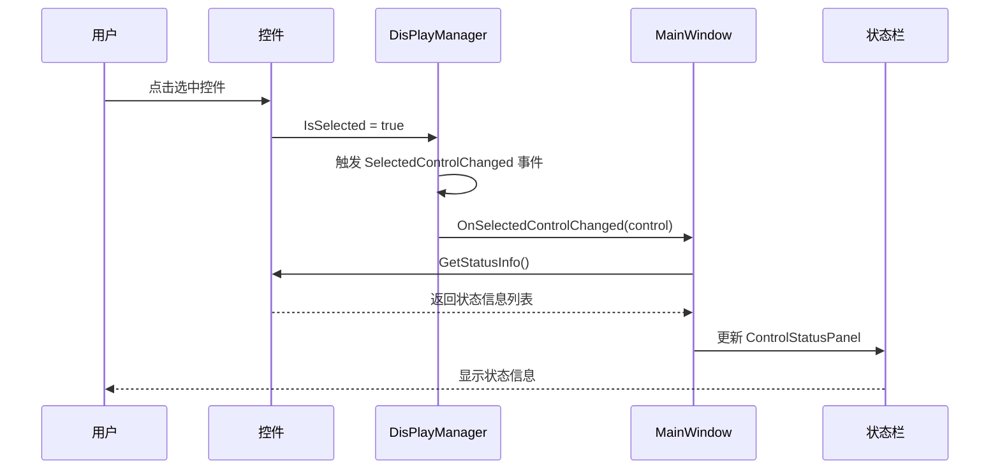

# IControlStatusProvider 接口

## 概述

`IControlStatusProvider` 接口允许控件在被选中时向状态栏提供状态信息。实现此接口的控件可以显示特定的状态信息，例如图像控件可以显示位深度、尺寸、通道信息，文本编辑控件可以显示行列信息等。

## 命名空间

```csharp
namespace ColorVision.UI
```

## 接口定义

```csharp
public interface IControlStatusProvider
{
    /// <summary>
    /// 获取当前控件的状态信息
    /// </summary>
    /// <returns>状态信息的键值对集合</returns>
    IEnumerable<KeyValuePair<string, string>> GetStatusInfo();
}
```

## 使用场景

当控件实现了 `IDisPlayControl` 和 `IControlStatusProvider` 两个接口时：
1. 用户选中该控件
2. `DisPlayManager` 触发 `SelectedControlChanged` 事件
3. `MainWindow` 检测到控件实现了 `IControlStatusProvider`
4. 调用 `GetStatusInfo()` 获取状态信息
5. 在状态栏左侧显示这些信息

## 实现示例

### 相机显示控件示例

```csharp
public partial class DisplayCamera : UserControl, IDisPlayControl, IControlStatusProvider
{
    public IEnumerable<KeyValuePair<string, string>> GetStatusInfo()
    {
        var statusInfo = new List<KeyValuePair<string, string>>();

        // 相机名称
        statusInfo.Add(new KeyValuePair<string, string>("名称", Device.Config.Name));

        // 如果有图像，显示图像相关信息
        if (View?.ImageView?.ViewBitmapSource != null)
        {
            var bitmap = View.ImageView.ViewBitmapSource;
            if (bitmap is BitmapSource bitmapSource)
            {
                // 图像尺寸
                statusInfo.Add(new KeyValuePair<string, string>(
                    "尺寸", 
                    $"{bitmapSource.PixelWidth}×{bitmapSource.PixelHeight}"));
                
                // 位深度（比特率）
                statusInfo.Add(new KeyValuePair<string, string>(
                    "位深度", 
                    $"{bitmapSource.Format.BitsPerPixel} bpp"));
                
                // 通道信息
                int channels = GetChannelCount(bitmapSource.Format);
                statusInfo.Add(new KeyValuePair<string, string>("通道", channels.ToString()));
            }

            // 文件名
            if (!string.IsNullOrEmpty(View.ImageView.Config.FilePath))
            {
                statusInfo.Add(new KeyValuePair<string, string>(
                    "文件", 
                    Path.GetFileName(View.ImageView.Config.FilePath)));
            }
        }

        return statusInfo;
    }

    private int GetChannelCount(PixelFormat format)
    {
        if (format == PixelFormats.Rgb24 || format == PixelFormats.Bgr24)
            return 3;
        else if (format == PixelFormats.Rgba64 || 
                 format == PixelFormats.Bgra32 ||
                 format == PixelFormats.Pbgra32)
            return 4;
        else if (format == PixelFormats.Gray8 || format == PixelFormats.Gray16)
            return 1;
        
        return format.BitsPerPixel / 8;
    }
}
```

### 文本编辑器控件示例

```csharp
public partial class TextEditorControl : UserControl, IDisPlayControl, IControlStatusProvider
{
    public IEnumerable<KeyValuePair<string, string>> GetStatusInfo()
    {
        var statusInfo = new List<KeyValuePair<string, string>>();

        // 当前行列
        if (TextEditor != null)
        {
            int line = TextEditor.TextArea.Caret.Line;
            int column = TextEditor.TextArea.Caret.Column;
            statusInfo.Add(new KeyValuePair<string, string>("行", line.ToString()));
            statusInfo.Add(new KeyValuePair<string, string>("列", column.ToString()));
            
            // 总行数
            statusInfo.Add(new KeyValuePair<string, string>("总行数", TextEditor.LineCount.ToString()));
            
            // 字符数
            statusInfo.Add(new KeyValuePair<string, string>("字符数", TextEditor.Text.Length.ToString()));
        }

        return statusInfo;
    }
}
```

## 状态信息显示效果

状态信息会在状态栏左侧以 "键: 值" 的格式显示，例如：
```
名称: Camera1  尺寸: 1920×1080  位深度: 24 bpp  通道: 3  文件: image.png
```

## 注意事项

1. **性能考虑**：`GetStatusInfo()` 方法会在控件被选中时调用，应确保方法执行效率
2. **空值检查**：应对可能为空的属性进行检查，避免空引用异常
3. **简洁性**：建议只显示最关键的状态信息，避免信息过多造成状态栏拥挤
4. **国际化**：状态信息的键名应使用资源文件，支持多语言

## 相关接口

- `IDisPlayControl`：控件选中管理接口
- `IStatusBarProvider`：全局状态栏项提供接口
- `DisPlayManager`：控件显示管理器

## 架构说明



## 扩展建议

可以根据不同类型的控件提供不同的状态信息：

| 控件类型 | 建议显示的状态信息 |
|---------|------------------|
| 图像控件 | 尺寸、位深度、通道、格式、文件名 |
| 文本编辑器 | 行号、列号、总行数、字符数、编码 |
| 表格控件 | 行数、列数、选中单元格 |
| 图表控件 | 数据点数、坐标范围、图表类型 |
| 3D视图 | 顶点数、面数、帧率 |

---

*最后更新时间: 2025-10-13*
