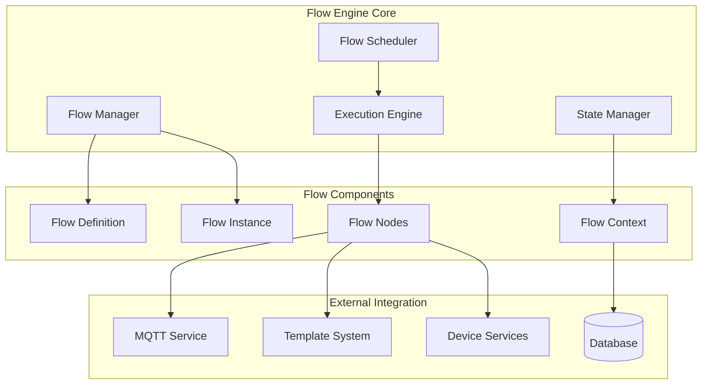
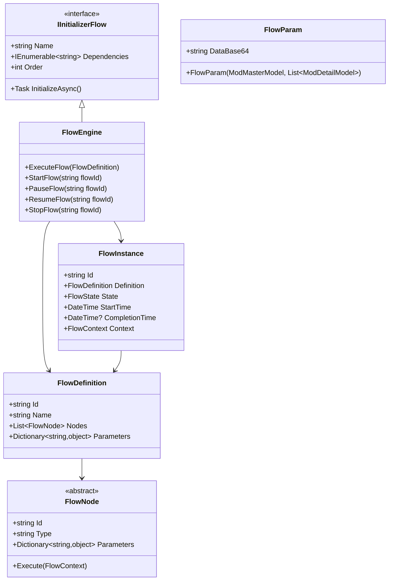
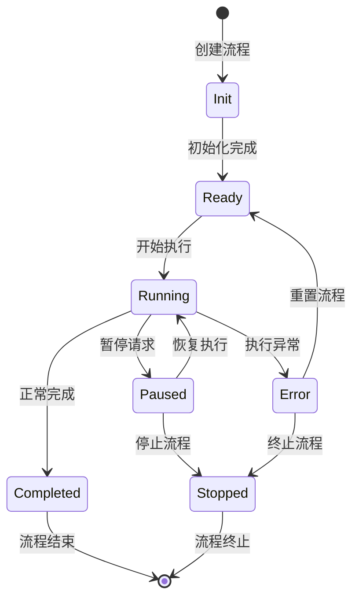
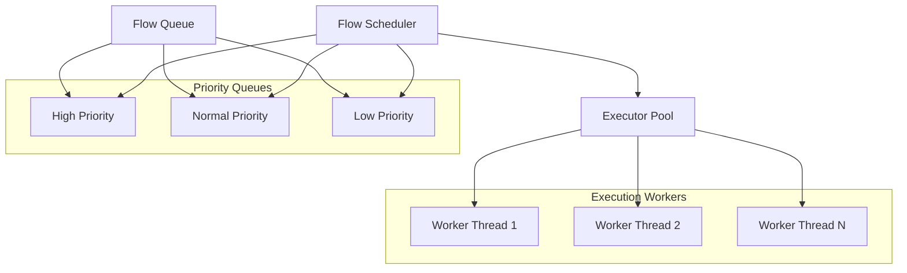
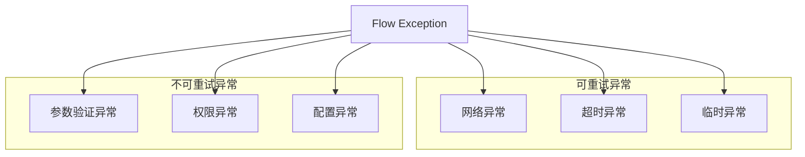

# Flow Engine Overview

---
**Metadata:**
- Title: Flow Engine - Core Workflow Management System
- Status: draft  
- Updated: 2024-09-28
- Author: ColorVision Development Team
---

## 简介

Flow Engine 是 ColorVision 系统的核心工作流管理引擎，负责协调和执行复杂的图像处理和设备控制流程。本文档详细描述流程引擎的架构、状态模型、调度策略和扩展机制。

## 目录

1. [概述](#概述)
2. [架构设计](#架构设计)
3. [状态机模型](#状态机模型)
4. [调度与并发策略](#调度与并发策略)
5. [接口与扩展点](#接口与扩展点)
6. [错误处理与重试机制](#错误处理与重试机制)
7. [性能优化](#性能优化)
8. [扩展性说明](#扩展性说明)

## 概述

### 核心功能

Flow Engine 提供以下核心能力：

- **工作流编排**: 定义和执行复杂的业务流程
- **状态管理**: 全生命周期的流程状态跟踪
- **并发控制**: 支持多流程并行执行
- **错误恢复**: 自动重试和异常处理机制
- **扩展支持**: 灵活的插件和扩展点

### 应用场景

- 图像处理算法链
- 设备控制序列
- 数据采集和分析流程
- 自动化测试流程
- 批量处理任务

## 架构设计

### 整体架构



### 类图结构



## 状态机模型

### 流程状态定义



### 状态转换规则

| 当前状态 | 可转换到 | 触发条件 | 说明 |
|---------|----------|----------|------|
| Init | Ready | 初始化成功 | 所有依赖项就绪 |
| Ready | Running | 启动命令 | 用户或系统触发 |
| Running | Paused | 暂停命令 | 用户主动暂停 |
| Running | Completed | 正常结束 | 所有节点执行完成 |
| Running | Error | 异常发生 | 节点执行失败 |
| Paused | Running | 恢复命令 | 继续执行 |
| Paused | Stopped | 停止命令 | 终止流程 |
| Error | Ready | 重置命令 | 清除错误状态 |
| Error | Stopped | 放弃命令 | 不再重试 |

### 状态持久化

```csharp
public class FlowState
{
    public string FlowId { get; set; }
    public FlowStatus Status { get; set; }
    public string CurrentNodeId { get; set; }
    public Dictionary<string, object> Variables { get; set; }
    public List<FlowExecutionStep> ExecutionHistory { get; set; }
    public DateTime LastUpdated { get; set; }
}

public enum FlowStatus
{
    Init,
    Ready, 
    Running,
    Paused,
    Completed,
    Error,
    Stopped
}
```

## 调度与并发策略

### 调度器架构



### 并发控制策略

#### 线程池配置
```csharp
public class FlowSchedulerConfig
{
    public int MaxConcurrentFlows { get; set; } = 10;
    public int WorkerThreadCount { get; set; } = Environment.ProcessorCount;
    public TimeSpan HeartbeatInterval { get; set; } = TimeSpan.FromSeconds(1);
    public TimeSpan TimeoutThreshold { get; set; } = TimeSpan.FromMinutes(30);
}
```

#### 资源隔离
- **CPU 密集型流程**: 使用专用计算线程池
- **I/O 密集型流程**: 异步 I/O 操作，避免阻塞线程
- **设备控制流程**: 设备专用线程，避免并发冲突

### 重试策略

```csharp
public class RetryPolicy
{
    public int MaxRetryCount { get; set; } = 3;
    public TimeSpan InitialDelay { get; set; } = TimeSpan.FromSeconds(1);
    public double BackoffMultiplier { get; set; } = 2.0;
    public TimeSpan MaxDelay { get; set; } = TimeSpan.FromMinutes(5);
    
    public bool ShouldRetry(Exception exception, int attemptCount)
    {
        // 重试策略逻辑
        return attemptCount < MaxRetryCount && 
               IsRetriableException(exception);
    }
}
```

## 接口与扩展点

### IInitializerFlow 接口

Flow Engine 的核心初始化接口：

```csharp
public interface IInitializerFlow : IInitializer
{
    string Name { get; }
    IEnumerable<string> Dependencies { get; }
    int Order { get; }
    Task InitializeAsync();
}
```

#### 实现示例
```csharp
public class MQTTFlowInitializer : IInitializerFlow
{
    public string Name => "MQTT Flow Integration";
    public IEnumerable<string> Dependencies => new[] { "MQTT", "Database" };
    public int Order => 10;

    public Task InitializeAsync()
    {
        // 配置 MQTT 连接
        var mqttConfig = MQTTSetting.Instance.MQTTConfig;
        FlowEngineLib.MQTTHelper.SetDefaultCfg(
            mqttConfig.Host, 
            mqttConfig.Port, 
            mqttConfig.UserName, 
            mqttConfig.UserPwd, 
            false, 
            null);
        
        return Task.CompletedTask;
    }
}
```

### 流程节点扩展

#### 自定义节点接口
```csharp
public interface IFlowNode
{
    string NodeType { get; }
    string NodeId { get; set; }
    Dictionary<string, object> Parameters { get; set; }
    
    Task<FlowNodeResult> ExecuteAsync(FlowContext context);
    bool ValidateParameters();
}
```

#### 节点实现示例
```csharp
public class ImageProcessingNode : IFlowNode
{
    public string NodeType => "ImageProcessing";
    public string NodeId { get; set; }
    public Dictionary<string, object> Parameters { get; set; }

    public async Task<FlowNodeResult> ExecuteAsync(FlowContext context)
    {
        var imagePath = Parameters["ImagePath"].ToString();
        var algorithmId = Parameters["AlgorithmId"].ToString();
        
        // 执行图像处理算法
        var result = await ProcessImageAsync(imagePath, algorithmId);
        
        return new FlowNodeResult
        {
            Success = result.Success,
            Data = result.Data,
            Message = result.Message
        };
    }
    
    private async Task<AlgorithmResult> ProcessImageAsync(string imagePath, string algorithmId)
    {
        // 算法处理逻辑
        return new AlgorithmResult();
    }
}
```

## 错误处理与重试机制

### 异常分类



### 错误处理流程

```csharp
public class FlowErrorHandler
{
    public async Task<FlowNodeResult> HandleErrorAsync(
        Exception exception, 
        FlowNode node, 
        FlowContext context)
    {
        // 记录错误日志
        LogError(exception, node, context);
        
        // 判断是否可重试
        if (CanRetry(exception, context))
        {
            await ApplyRetryDelayAsync(context.RetryCount);
            context.RetryCount++;
            return FlowNodeResult.Retry;
        }
        
        // 执行错误恢复策略
        var recoveryResult = await TryRecoveryAsync(exception, node, context);
        if (recoveryResult.Success)
        {
            return recoveryResult;
        }
        
        // 标记流程失败
        return FlowNodeResult.Failed(exception.Message);
    }
}
```

## 性能优化

### 内存管理
- **对象池**: 重用 FlowContext 和 FlowNode 实例
- **弱引用**: 大型数据对象使用弱引用避免内存泄漏
- **及时清理**: 完成的流程实例及时从内存中移除

### 执行优化
- **预编译**: 流程定义预编译为执行图
- **并行执行**: 无依赖关系的节点并行执行
- **延迟加载**: 按需加载节点和依赖项

### 监控指标
```csharp
public class FlowMetrics
{
    public long TotalFlowsExecuted { get; set; }
    public long ActiveFlowCount { get; set; }
    public TimeSpan AverageExecutionTime { get; set; }
    public double SuccessRate { get; set; }
    public Dictionary<string, long> NodeExecutionCounts { get; set; }
}
```

## 扩展性说明

### 插件支持
Flow Engine 支持通过插件扩展功能：

- **自定义节点类型**: 实现 IFlowNode 接口
- **自定义调度器**: 实现 IFlowScheduler 接口  
- **自定义持久化**: 实现 IFlowStateStore 接口

### 配置扩展
```json
{
  "FlowEngine": {
    "MaxConcurrentFlows": 20,
    "EnableMetrics": true,
    "CustomNodeTypes": [
      "MyCompany.CustomNodes.dll"
    ],
    "RetryPolicy": {
      "DefaultMaxRetries": 3,
      "BackoffStrategy": "Exponential"
    }
  }
}
```

### 相关文档
- [State Model](state-model.md) - 详细状态机模型
- [Extensibility Points](extensibility-points.md) - 扩展点详细说明
- [Template System](template-system.md) - 模板系统集成

---

*最后更新: 2024-09-28 | 状态: draft*