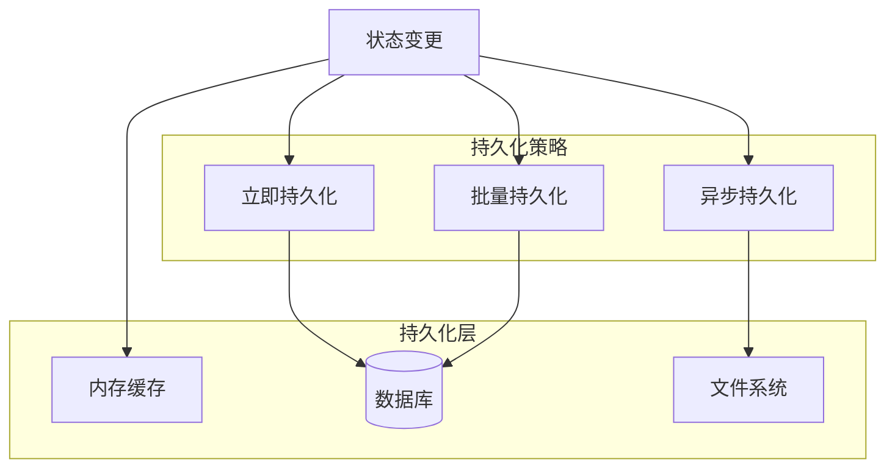
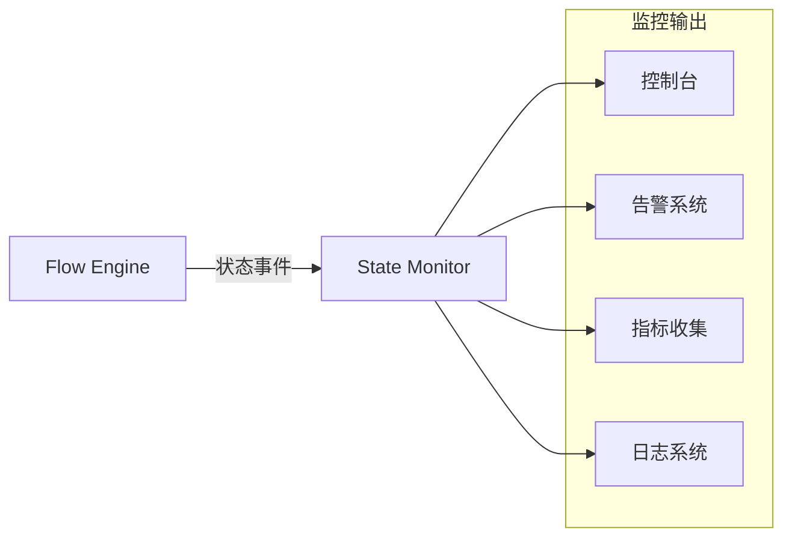
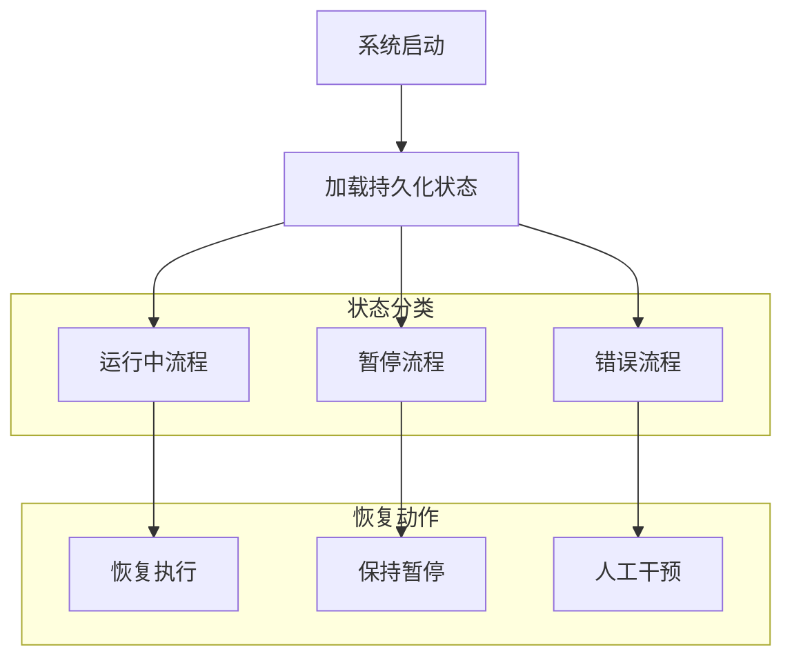

# Flow Engine State Model

---
**Metadata:**
- Title: Flow Engine State Model - Detailed State Management
- Status: draft
- Updated: 2024-09-28
- Author: ColorVision Development Team
---

## 简介

本文档详细描述 Flow Engine 的状态管理模型，包括状态定义、转换规则、持久化机制和状态监控。

## 目录

1. [状态定义](#状态定义)
2. [状态转换矩阵](#状态转换矩阵)
3. [状态持久化](#状态持久化)
4. [状态监控](#状态监控)
5. [状态恢复](#状态恢复)

## 状态定义

### 流程级状态

```csharp
public enum FlowStatus
{
    /// <summary>初始状态 - 流程已创建但未初始化</summary>
    Init = 0,
    
    /// <summary>就绪状态 - 流程已初始化，等待执行</summary>
    Ready = 1,
    
    /// <summary>运行状态 - 流程正在执行</summary>
    Running = 2,
    
    /// <summary>暂停状态 - 流程被用户暂停</summary>
    Paused = 3,
    
    /// <summary>完成状态 - 流程正常执行完成</summary>
    Completed = 4,
    
    /// <summary>错误状态 - 流程执行出现异常</summary>
    Error = 5,
    
    /// <summary>停止状态 - 流程被强制终止</summary>
    Stopped = 6
}
```

### 节点级状态

```csharp
public enum NodeStatus
{
    /// <summary>等待执行</summary>
    Pending = 0,
    
    /// <summary>正在执行</summary>
    Running = 1,
    
    /// <summary>执行成功</summary>
    Completed = 2,
    
    /// <summary>执行失败</summary>
    Failed = 3,
    
    /// <summary>被跳过</summary>
    Skipped = 4,
    
    /// <summary>重试中</summary>
    Retrying = 5
}
```

## 状态转换矩阵

### 流程状态转换表

| 当前状态 | 目标状态 | 触发事件 | 前置条件 | 后置动作 |
|---------|----------|----------|----------|----------|
| Init | Ready | Initialize | 所有依赖就绪 | 创建执行上下文 |
| Ready | Running | Start | 有可执行节点 | 开始节点调度 |
| Running | Paused | Pause | 用户请求 | 保存当前状态 |
| Running | Completed | Finish | 所有节点完成 | 清理资源 |
| Running | Error | Exception | 节点执行失败 | 记录错误信息 |
| Paused | Running | Resume | 用户请求 | 恢复节点执行 |
| Paused | Stopped | Stop | 用户请求 | 终止并清理 |
| Error | Ready | Reset | 用户请求 | 重置错误状态 |
| Error | Stopped | Abandon | 用户请求 | 放弃执行 |

### 状态转换验证

```csharp
public class FlowStateValidator
{
    private static readonly Dictionary<FlowStatus, FlowStatus[]> ValidTransitions = 
        new Dictionary<FlowStatus, FlowStatus[]>
        {
            { FlowStatus.Init, new[] { FlowStatus.Ready } },
            { FlowStatus.Ready, new[] { FlowStatus.Running } },
            { FlowStatus.Running, new[] { FlowStatus.Paused, FlowStatus.Completed, FlowStatus.Error } },
            { FlowStatus.Paused, new[] { FlowStatus.Running, FlowStatus.Stopped } },
            { FlowStatus.Error, new[] { FlowStatus.Ready, FlowStatus.Stopped } },
            { FlowStatus.Completed, new FlowStatus[0] },
            { FlowStatus.Stopped, new FlowStatus[0] }
        };

    public bool CanTransition(FlowStatus from, FlowStatus to)
    {
        return ValidTransitions.ContainsKey(from) && 
               ValidTransitions[from].Contains(to);
    }
}
```

## 状态持久化

### 状态数据结构

```csharp
public class FlowStateSnapshot
{
    public string FlowId { get; set; }
    public string FlowDefinitionId { get; set; }
    public FlowStatus Status { get; set; }
    public DateTime CreatedAt { get; set; }
    public DateTime UpdatedAt { get; set; }
    public string CurrentNodeId { get; set; }
    public int CompletedNodeCount { get; set; }
    public int TotalNodeCount { get; set; }
    public Dictionary<string, object> GlobalVariables { get; set; }
    public List<NodeStateSnapshot> NodeStates { get; set; }
    public FlowExecutionMetrics Metrics { get; set; }
    public string ErrorMessage { get; set; }
    public int RetryCount { get; set; }
}

public class NodeStateSnapshot
{
    public string NodeId { get; set; }
    public NodeStatus Status { get; set; }
    public DateTime? StartTime { get; set; }
    public DateTime? EndTime { get; set; }
    public Dictionary<string, object> InputData { get; set; }
    public Dictionary<string, object> OutputData { get; set; }
    public string ErrorMessage { get; set; }
    public int RetryCount { get; set; }
}
```

### 持久化策略



### 持久化实现

```csharp
public class FlowStateStore : IFlowStateStore
{
    private readonly IDatabase _database;
    private readonly IMemoryCache _cache;
    private readonly ILogger _logger;

    public async Task SaveStateAsync(FlowStateSnapshot snapshot)
    {
        try
        {
            // 更新内存缓存
            _cache.Set($"flow_state_{snapshot.FlowId}", snapshot, TimeSpan.FromHours(1));
            
            // 异步持久化到数据库
            await _database.UpsertAsync("flow_states", snapshot);
            
            // 记录状态变更日志
            _logger.Information("Flow {FlowId} state changed to {Status}", 
                snapshot.FlowId, snapshot.Status);
        }
        catch (Exception ex)
        {
            _logger.Error(ex, "Failed to save flow state for {FlowId}", snapshot.FlowId);
            throw;
        }
    }

    public async Task<FlowStateSnapshot> LoadStateAsync(string flowId)
    {
        // 首先尝试从缓存读取
        var cached = _cache.Get<FlowStateSnapshot>($"flow_state_{flowId}");
        if (cached != null)
        {
            return cached;
        }

        // 从数据库加载
        var state = await _database.GetAsync<FlowStateSnapshot>("flow_states", flowId);
        if (state != null)
        {
            _cache.Set($"flow_state_{flowId}", state, TimeSpan.FromHours(1));
        }

        return state;
    }
}
```

## 状态监控

### 实时状态监控



### 监控指标

```csharp
public class FlowStateMetrics
{
    // 流程级指标
    public int ActiveFlowCount { get; set; }
    public int CompletedFlowCount { get; set; }
    public int FailedFlowCount { get; set; }
    public double AverageExecutionTime { get; set; }
    public double SuccessRate { get; set; }
    
    // 状态分布
    public Dictionary<FlowStatus, int> StatusDistribution { get; set; }
    
    // 性能指标
    public TimeSpan MaxExecutionTime { get; set; }
    public TimeSpan MinExecutionTime { get; set; }
    public int TotalRetryCount { get; set; }
    
    // 资源使用
    public long MemoryUsage { get; set; }
    public double CpuUsage { get; set; }
    public int ThreadCount { get; set; }
}
```

### 状态事件发布

```csharp
public interface IFlowStateEventPublisher
{
    Task PublishStateChangedAsync(FlowStateChangedEvent eventData);
    Task PublishNodeStateChangedAsync(NodeStateChangedEvent eventData);
}

public class FlowStateChangedEvent
{
    public string FlowId { get; set; }
    public FlowStatus OldStatus { get; set; }
    public FlowStatus NewStatus { get; set; }
    public DateTime Timestamp { get; set; }
    public string Reason { get; set; }
    public Dictionary<string, object> Metadata { get; set; }
}
```

## 状态恢复

### 恢复策略



### 恢复实现

```csharp
public class FlowRecoveryService
{
    public async Task RecoverFlowsOnStartupAsync()
    {
        var allStates = await _stateStore.GetAllActiveStatesAsync();
        
        foreach (var state in allStates)
        {
            try
            {
                await RecoverFlowAsync(state);
            }
            catch (Exception ex)
            {
                _logger.Error(ex, "Failed to recover flow {FlowId}", state.FlowId);
                // 标记为错误状态，需要人工干预
                await _stateStore.MarkAsErrorAsync(state.FlowId, ex.Message);
            }
        }
    }
    
    private async Task RecoverFlowAsync(FlowStateSnapshot state)
    {
        switch (state.Status)
        {
            case FlowStatus.Running:
                // 检查是否可以继续执行
                if (await CanContinueExecutionAsync(state))
                {
                    await _flowEngine.ResumeFlowAsync(state.FlowId);
                }
                else
                {
                    await _flowEngine.PauseFlowAsync(state.FlowId);
                }
                break;
                
            case FlowStatus.Paused:
                // 保持暂停状态，等待用户操作
                break;
                
            case FlowStatus.Error:
                // 根据错误类型决定是否自动重试
                if (IsRetriableError(state.ErrorMessage))
                {
                    await _flowEngine.RetryFlowAsync(state.FlowId);
                }
                break;
        }
    }
}
```

### 一致性检查

```csharp
public class FlowStateConsistencyChecker
{
    public async Task<ConsistencyReport> CheckConsistencyAsync(string flowId)
    {
        var state = await _stateStore.LoadStateAsync(flowId);
        var definition = await _definitionStore.LoadDefinitionAsync(state.FlowDefinitionId);
        
        var report = new ConsistencyReport { FlowId = flowId };
        
        // 检查节点状态一致性
        CheckNodeConsistency(state, definition, report);
        
        // 检查执行进度一致性
        CheckProgressConsistency(state, report);
        
        // 检查时间戳一致性
        CheckTimestampConsistency(state, report);
        
        return report;
    }
    
    private void CheckNodeConsistency(FlowStateSnapshot state, 
        FlowDefinition definition, ConsistencyReport report)
    {
        // 检查所有节点都有对应的状态记录
        var definedNodes = definition.Nodes.Select(n => n.Id).ToHashSet();
        var stateNodes = state.NodeStates.Select(n => n.NodeId).ToHashSet();
        
        var missingNodes = definedNodes.Except(stateNodes);
        var extraNodes = stateNodes.Except(definedNodes);
        
        foreach (var nodeId in missingNodes)
        {
            report.Issues.Add(new ConsistencyIssue
            {
                Type = IssueType.MissingNodeState,
                NodeId = nodeId,
                Message = $"Node {nodeId} missing in state snapshot"
            });
        }
    }
}
```

---

*最后更新: 2024-09-28 | 状态: draft*