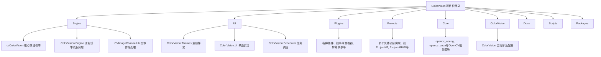
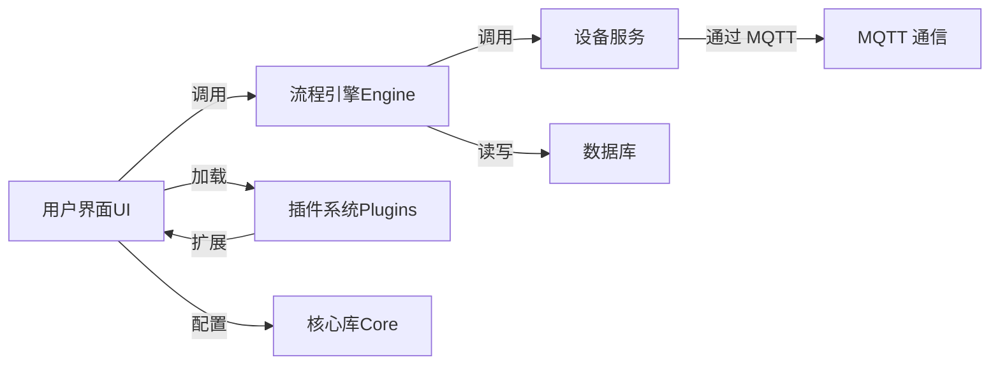

# 简介

# 简介

## 目录
1. [介绍](#介绍)
2. [项目结构](#项目结构)
3. [核心组件](#核心组件)
4. [架构概览](#架构概览)
5. [详细组件分析](#详细组件分析)
6. [依赖关系分析](#依赖关系分析)
7. [性能考虑](#性能考虑)
8. [故障排除指南](#故障排除指南)
9. [总结](#总结)
10. [附录](#附录)

## 介绍

ColorVision 项目由视彩（上海）光电技术有限公司开发，是一款基于 Windows 平台的 WPF 应用程序，旨在提供先进的色彩管理和光电技术解决方案。项目支持多语言、多主题模式，支持丰富的硬件设备（如相机、光谱仪、电机等）及算法服务，用户可以通过流程引擎对流程参数进行灵活配置和管理。

本项目面向专业用户和开发者，帮助他们实现复杂的色彩检测、图像处理以及设备控制等功能，解决了色彩管理领域中多设备协同、流程自动化和多语言支持的核心问题。

---

## 项目结构

ColorVision 项目结构清晰，按功能和模块划分，方便维护和扩展。主要目录及其功能如下：

### 主要目录说明

1. **Engine**  
   包含核心算法和流程引擎。  
   - `cvColorVision`：核心色彩视觉算法实现。  
   - `ColorVision.Engine`：流程引擎，支持用户配置流程参数，管理设备服务。  
   - `CVImageChannelLib`：图像数据传输与处理库。  

2. **UI**  
   用户界面相关代码。  
   - `ColorVision.Themes`：主题样式支持（深色、浅色、跟随系统等）。  
   - `ColorVision.UI`：界面逻辑实现，包含插件加载、热键支持、状态栏等。  
   - `ColorVision.Scheduler`：任务计划管理，支持定时和循环任务。  

3. **Plugins**  
   各类功能插件，用户可自定义实现插件接口 `IPlugin`，程序启动时自动加载。  

4. **Projects**  
   多个具体应用项目，每个项目为独立子系统，支持独立开发与管理。  

5. **Core**  
   OpenCV 相关的底层支持模块，包括 CUDA 加速和 OpenGL 渲染支持。  

6. **ColorVision**  
   主程序入口及配置，包含主窗口、插件管理、更新机制等核心功能。  

7. **Docs**  
   文档资料，如解决方案说明、用户手册等。  

8. **Scripts**  
   构建、配置、更新等辅助脚本。  

9. **Packages**  
   第三方依赖库，如 OpenCV、spdlog、nlohmann JSON 等。

---

## 核心组件

ColorVision 项目核心组件包括：

- **流程引擎（Engine/ColorVision.Engine）**  
  负责管理和执行用户定义的检测和处理流程，支持设备配置和服务管理。用户通过界面配置具体流程参数，实现自动化控制。

- **设备服务支持**  
  支持多种物理设备，如相机（LV、BV、CV）、光谱仪、传感器、电机、文件服务器等。设备通过 MQTT 协议进行通信，保证实时数据交互。

- **模板管理**  
  用户可以创建、编辑、导入导出检测模板。模板保存在数据库中，支持快速检测和多种分类，如流程模板、关注点模板、合规校验模板、校准模板、算法模板等。

- **用户界面（UI）**  
  提供多语言、多主题支持，包含主窗口、菜单区、操作区、状态栏、设置窗口和视图窗口。支持热键控制和插件扩展。

- **插件系统**  
  用户可自定义插件功能，扩展系统能力。插件实现接口 `IPlugin`，放入 `Plugins` 目录，程序启动时自动加载。

- **任务计划管理**  
  支持任务的立即启动、延迟启动、重复执行等多种模式，方便用户实现周期性检测和自动化运行。

- **更新机制**  
  支持手动更新、配置时自动检测更新以及任务计划中定时检测更新，保证软件持续迭代。

---

## 架构概览

ColorVision 采用模块化架构，分层设计，主要包括以下几个主要组件：

- **用户界面(UI)**：负责交互展示，菜单、视图、状态栏、设置、热键等功能。
- **流程引擎(Engine)**：核心业务逻辑，管理流程执行和设备服务。
- **插件系统(Plugins)**：功能扩展，支持用户自定义插件。
- **核心库(Core)**：底层算法库和图像处理库，依赖 OpenCV 等。
- **设备服务(Devices)**：管理具体物理设备，支持配置和控制。
- **数据库(DB)**：存储模板、项目、配置和历史数据。
- **MQTT 通信**：实现设备与流程引擎之间的消息传递。

---

## 详细组件分析

### 1. 主窗口与界面结构

主窗口分为菜单区、操作区、状态栏和视图窗口。状态栏支持多种实现方式，显示数据库连接状态、系统资源使用情况等。

视图窗口基于接口 `IView` 实现，支持独立窗口、隐藏窗口及指定布局，用户可自定义布局逻辑。

### 2. 流程引擎（Engine/ColorVision.Engine）

流程引擎采用流程驱动设计，用户可通过界面配置流程参数，实现自动化检测。支持多种服务设备的配置管理。

核心类包括流程管理、设备管理、MQTT 通信管理等。流程引擎对外提供接口供 UI 调用，保证逻辑与界面解耦。

### 3. 设备服务

支持多种物理设备，设备通过 MQTT 协议与流程引擎通信。设备类型包括相机、校正器、算法模块、光谱仪、传感器、电机、文件服务器等。

设备配置通过界面完成，支持许可证配置、校准文件关联等。

### 4. 模板系统

模板存储于数据库，支持创建、编辑、导入导出和快速检测。模板类型丰富，涵盖流程、关注点、合规校验、校准、算法等。

模板管理提供用户友好的操作界面，支持批量导出为压缩包。

### 5. 插件系统

插件需实现接口 `IPlugin`，放入 `Plugins` 目录，程序启动时自动加载。插件可扩展菜单、视图和功能，增强系统灵活性。

### 6. 多语言与主题支持

支持 English、简体中文、繁体中文、日语、韩语、俄语等多语言，语言资源通过 Resx 文件管理。主题支持深色、浅色和跟随系统，用户可动态切换。

---

## 依赖关系分析

- **内部依赖**  
  - UI 调用 Engine 进行业务处理。  
  - Engine 调用设备服务模块控制硬件。  
  - 插件扩展 UI 和业务逻辑。  
  - 核心库为 Engine 和 UI 提供基础算法支持。

- **外部依赖**  
  - MQTT 用于设备与引擎间通信。  
  - MySQL 数据库存储数据和模板。  
  - OpenCV 及 CUDA 提供图像处理和加速。  
  - HandyControl、Extended.Wpf.ToolKit 等第三方 UI 组件。

---

## 性能考虑

- 流程引擎采用异步和事件驱动设计，保证界面响应流畅。  
- 使用 OpenCV CUDA 加速图像处理，提升计算效率。  
- MQTT 协议轻量，适合实时设备通信。  
- 模板和数据存储依赖数据库，支持批量操作和压缩导出，提升数据管理效率。

---

## 故障排除指南

- **更新失败**：可手动在安装目录运行 ColorVisionSetup 重新下载更新程序。  
- **MQTT 连接异常**：检查 MQTT 服务器配置和网络连接。  
- **设备无法识别**：确认设备许可证和校准文件正确配置。  
- **语言切换无效**：需重启程序以加载新的语言资源。  
- **插件加载失败**：确保插件实现了 `IPlugin` 接口且放置于正确目录。

---

## 总结

ColorVision 是一款功能丰富、架构清晰的色彩管理和光电技术解决方案软件。它通过模块化设计支持多设备、多语言、多主题和插件扩展，满足专业用户复杂的自动化检测需求。流程引擎和模板系统为用户提供灵活的配置和管理能力，任务计划和更新机制保障系统的自动化和持续迭代。

---

## 附录

### 主要文件类型说明（来自 docs/Solution.md）

| 文件后缀 | 含义 | 用途说明 |
| --- | --- | --- |
| .cvsln | ColorVision Solution | 解决方案文件 |
| .cvproj | ColorVision Project | 项目文件，特定于应用程序 |
| .cvrun | ColorVision Runtime | 运行时信息文件 |
| .stn | Flow 流程保存文件 | 流程配置存储 |
| .cvcie | ColorVision Catalog of Image Entries | 图像信息保存 |
| .cvcal | ColorVision Calibration | 校准文件 |

---

