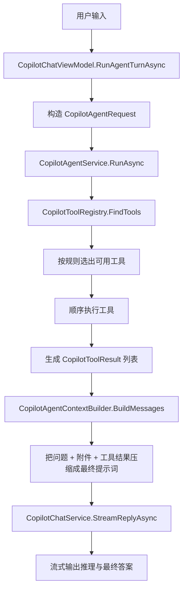

# Copilot Agent 现状与 ReAct 演进路线

本文档说明 ColorVision 当前 Copilot Agent 的实际工作方式、它与 ReAct 风格 Agent 的差异，以及下一步如何演进到支持本地文件读取和更便宜的上下文检索。

另见：Copilot Context Integration v1。该文档聚焦 Copilot 如何从独立聊天模块演进为软件上下文服务，与本文的 Agent/ReAct 路线互补。

## 一句话结论

当前实现不是标准的 ReAct Agent，而是“静态候选筛选 + 最小模型 planner + 最多几轮工具执行 + 局部结构化文件读取参数 + 一次性压缩上下文 + 一次性调用大模型”的只读 Agent。

最近一轮已经开始削弱“用户原话关键词门槛”这一层静态限制：工具注册表不再把 planner 可见工具硬截断到前 6 个，SearchFiles、GrepText、GetRecentLog 也已经改成以运行时能力为主的可见性判断，让 planner 在存在搜索根或最近日志时自己决定是否先做便宜检索。planner 解析失败时，也不再盲目执行注册表里的第一个工具，而是按当前模式和已知上下文做保守回退；如果没有合适候选，则直接结束工具阶段。

它已经具备最小工具层和最小 planner-executor 雏形，但还没有以下能力：

- 像代码代理那样继续做检索、修改、构建、看错误、再迭代
- 让模型对更多诊断/环境工具也输出真正结构化的参数，而不只是目前对 ReadLocalFile、SearchFiles、GrepText、GetRecentLog、FetchUrl 生效
- 支持更强的多工具连续规划，而不是当前这种每轮偏单步的最小 planner

## 当前实际执行链路

当前调用链路如下：





关键代码位置：

- Agent 主流程：ColorVision/Copilot/Agent/CopilotAgentService.cs
- 工具注册表：ColorVision/Copilot/Agent/CopilotToolRegistry.cs
- 工具接口：ColorVision/Copilot/Agent/ICopilotTool.cs
- 上下文压缩：ColorVision/Copilot/Agent/CopilotAgentContextBuilder.cs
- UI 接入：ColorVision/Copilot/CopilotChatViewModel.cs

## 当前工具层到底做了什么

当前默认注册了十一个工具，其中八个只读工具加三个受控执行工具：

1. ExecuteMenu
   作用：按菜单名称或路径执行主菜单命令，例如“选项”“VAM”“检查更新”，也能命中主题、语言这类菜单子项。

2. SetTheme
   作用：按用户明确意图切换应用主题，例如浅色、深色、粉色、青色或跟随系统。

3. SetLanguage
   作用：按用户明确意图切换界面语言，并复用现有重启确认流程。

4. SearchDocs
   作用：查询发布后的 ColorVision 在线文档索引，按章节、页面和页面内标题返回最相关片段，适合软件使用、菜单、设备、插件、开发指南和架构说明问题。

5. FetchUrl
   作用：优先抓取 planner 通过 query 指定的 URL；如果 planner 没给出 URL，再回退到用户文本里的 URL 并抓取网页正文。

6. SearchFiles
   作用：按文件名或路径片段在当前解决方案搜索根里找候选文件。

7. GrepText
   作用：按关键字或标识符在当前解决方案文本文件里找命中行。

8. ListDirectory
   作用：列出用户在当前消息中明确提到的本地文件夹内容，并产出后续可读文件候选。

9. ReadAttachedFile
   作用：读取“当前会话已经挂载的文件附件”。

10. ReadLocalFile
   作用：读取用户在当前消息中明确提到的本地文本文件。

11. GetRecentLog
   作用：读取最近日志，并可按 planner 提供的 query 过滤结果。

这说明当前 Agent 仍然有明确的受控能力边界：

- 它能读取已经挂到会话里的文件。
- 它也能读取当前用户消息里显式出现的本地文本文件路径。
- 它还能基于当前解决方案根目录、活动文档目录和附件所在目录，先做一轮轻量文件名/文本检索。
- 它现在还能访问发布后的 ColorVision 在线文档索引，用较小上下文回答软件使用和开发文档问题。
- 它现在还能在显式用户意图下执行少量受控动作，例如执行主菜单命令、切换主题和界面语言。
- 它仍不能根据模型在对话里临时生成的新路径去读取任意本地文件，也不能执行任意副作用操作。
- 它已经有最小结构化参数层，但参数面仍然比较窄。

## 它和 ReAct 的核心差异

ReAct 的典型模式是：

1. 模型先思考当前缺什么信息
2. 模型提出一个动作，例如 Search、ReadFile、Grep、RunTests
3. 系统执行动作并返回 Observation
4. 模型基于 Observation 继续决定下一步
5. 多轮后再给出最终答案

而当前实现和理想中的完整 coding agent 仍有差距，主要有四点：

### 1. 工具不是模型决定的，而是规则提前决定的

当前是 CopilotToolRegistry.FindTools 根据 request 直接跑 CanHandle。

也就是说：

- 工具是否执行，取决于本地 C# 规则
- 不是模型在上下文中动态决定“下一步该读哪个文件”

### 2. 工具已有轻量结构化参数，但参数面仍有限

当前 ICopilotTool 的签名是：


```csharp
bool CanHandle(CopilotAgentRequest request);
Task<CopilotToolResult> ExecuteAsync(CopilotAgentRequest request, CopilotAgentToolInput toolInput, CancellationToken cancellationToken);
```


这意味着工具除了拿到整个 request，也会拿到一个最小结构化输入对象，例如：


```json
{ "tool": "read_file", "path": "...", "startLine": 1, "endLine": 200 }
```


当前这层结构化输入主要覆盖 query、path、startLine、endLine 四个字段，已经足以支持搜索、文件读取，以及 SetTheme/SetLanguage 这类小型应用控制动作；但它仍不像完整函数调用那样有更细的 schema、权限模型和参数验证体系。

### 3. 服务层已经有最小 planner-executor 循环，但还不是完整闭环

CopilotAgentService.RunAsync 的模式是：

- 每轮先让 planner 在当前可用工具里选择一个动作
- 执行该工具并记录 observation
- 在 MaxToolRounds 范围内继续下一轮，直到 planner finish 或工具阶段收敛
- 最后再把累计工具观察喂给模型输出最终回答

所以它已经不是单轮“先全执行工具，再统一回答”的模式，但还没有演进到带编辑、测试、验证的完整 coding loop。

### 4. 没有针对代码代理的便宜检索层

用户期望中的流程是：


```text
用户任务
-> Agent 判断需要哪些上下文
-> 先用便宜工具找候选信息
-> 压缩候选结果
-> 发给大模型
-> 制定修改方案
-> 编辑
-> 测试/构建
-> 看错误
-> 继续检索/继续修改
```


当前实现只覆盖了其中一小段：


```text
用户任务
-> 规则暴露工具
-> planner 选下一步
-> 执行受控工具
-> 压缩结果
-> 调大模型
-> 结束
```


它没有 grep、symbol search、AST search、embedding search、git history、diagnostics、tests 这些更便宜的候选上下文工具，也没有修改和验证循环。

## 为什么它现在仍然不是完整的本地文件 Agent

当前版本已经能处理“请读取 C:\\Users\\...\\remote_control.py”这类明确路径输入，但仍然有明显边界：

1. 当前仍然不能让模型跳出允许列表，去读取任意新路径
2. request 里已经有最小的统一工具参数对象，但接口层和权限策略对象还没有彻底独立出来
3. 结构化参数目前已覆盖 ReadLocalFile 与 ListDirectory 的 path，以及 SearchFiles、GrepText、GetRecentLog、SearchDocs、FetchUrl 的 query；其中 SearchFiles、GrepText、GetRecentLog 的可见性也已开始从“用户原话关键词”放宽为“能力优先”，SearchDocs 则走发布后的稳定文档索引，FetchUrl 虽然已支持结构化 query 执行，但工具可见性仍主要依赖请求级 URL 提取
4. 服务层虽然已经能做最小 planner-executor 循环，但还不是更强的多工具规划闭环
5. 当前文件读取虽然支持按行范围精读，但还没有更细的片段定位、symbol 级读取和 AST 级上下文

所以它已经迈出了第一步，但还不是一个真正的代码检索 Agent。

## 推荐的演进方向

不建议一步直接跳到“完整 coding agent”。更稳的路线是分三层演进。

### 阶段 1：先支持显式路径的本地文件读取

目标：当用户明确给出一个路径时，Agent 能安全地读取该文件。

这一步不要求完整 ReAct，只需要把当前最小多轮 Agent 扩一下即可。

当前状态：已实现最小版本，能够从当前用户消息里提取显式本地路径，并把显式文件与显式文件夹分流处理；也已经补上基于解决方案搜索根的 SearchFiles 和 GrepText，以及针对本地文件夹的 ListDirectory，并支持 `ListDirectory(path) -> ReadLocalFile(batch-all)` 与 `SearchFiles/GrepText -> ReadLocalFile(path, startLine, endLine)` 这种最小两轮链式执行。对于显式目录分析场景，首个 ReadLocalFile 会优先批量读取当前目录下全部候选文件，而不是继续逐文件消耗轮次。

#### 建议新增能力

1. 在 CopilotAgentRequest 中加入运行上下文

当前已经接入的字段：

- SearchRootPaths
- ActiveDocumentPath

后续仍建议补充的字段：

- AllowedReadRoots
- AllowExternalRead
- MaxToolCalls

2. 新增 ReadLocalFile 工具

建议输入参数：

- path
- startLine
- endLine
- reason

建议返回内容：

- 实际解析后的路径
- 文件摘要
- 读取的片段内容
- 截断信息
- 错误信息

3. 先做显式路径触发，不急着做模型规划

最便宜的第一版可以这样做：

- 如果用户消息里出现看起来像文件路径的文本
- 且路径在允许范围内
- 则自动调用 ReadLocalFile

这一步足以覆盖截图里的场景。

#### 安全边界

这一步必须带文件访问策略，否则很容易越权读取：

- 默认只允许工作区内路径
- 工作区外路径需要用户显式授权
- 只允许白名单文本扩展名，例如 .cs .xaml .py .json .md .txt .log
- 单次读取限制最大字符数和行数
- 二进制文件直接拒绝
- 在执行过程里显示“读取了哪个路径、读了多少行”

### 阶段 2：补齐“便宜检索工具层”

目标：让 Agent 在调用大模型前，先自己收集候选上下文，而不是只靠附件和 URL。

当前状态：阶段 2 已完成最小落地版本，SearchFiles、GrepText、GetRecentLog 与 SearchDocs 已接入默认工具表；其中 SearchDocs 通过发布后的 docs-search-index.json 查询 ColorVision 在线文档，不再要求用户先给出 URL。工具注册表也已去掉前 6 项硬截断，SearchFiles、GrepText、GetRecentLog 现在会优先按运行时能力暴露给 planner，但还没有按 glob/正则/符号级别继续细化。执行层对 FetchUrl 也已补齐结构化 query、重复检测和执行摘要，不再只把它当成“用户原句里附带 URL 的特例工具”。

后续建议新增或增强的只读工具：

1. SearchFiles
   作用：进一步支持 glob、目录约束和结果排序。

2. GrepText
   作用：进一步支持正则、上下文行和更稳定的查询提取。

3. ReadLocalFile
   作用：按路径和行号读取文件片段。

4. ReadSymbolSummary
   作用：按类名、方法名、属性名找定义附近片段。

5. GetDiagnostics
   作用：收集最近的构建/诊断错误摘要。

6. GetGitDiff / GetGitHistory
   作用：理解当前改动和历史语义。

这一层完成后，就能更接近用户期待的流程：


```text
问题
-> 便宜检索
-> 压缩候选结果
-> 发给大模型
```


### 阶段 3：再演进到真正的 ReAct / Planner-Executor 闭环

目标：让模型先决定“下一步做什么”，而不是本地规则一次性选完工具。

推荐改成两层模型：

1. Planner
   只负责输出下一步动作，不直接回答用户。

2. Answerer
   在工具观察足够后，负责生成最终回答。

建议循环：


```text
for step in 1..N:
  planner -> 输出结构化 action
  executor -> 校验并执行 action
  observation -> 追加到轨迹
  若 action == final_answer 则结束
```


结构化动作建议至少支持：

- search_files
- grep_text
- read_file
- read_log
- fetch_url
- final_answer

这样模型才能在读完一个文件后继续说：

- 还需要 grep 某个符号
- 还需要打开另一个文件
- 还需要看最新构建错误

这才是真正接近 ReAct 的关键。

## 建议的代码改造点

### 1. CopilotAgentModels.cs

当前状态：已经补上 `CopilotToolCall`、`CopilotToolObservation`、`CopilotAgentStepRecord` 这些最小轨迹模型，服务层也会把每轮工具执行记成 step record；但还没有独立的 runtime context、tool schema 和真正的 `tool call` 执行契约。

建议新增：

- CopilotAgentRuntimeContext
- CopilotToolArgument

目标：让工具调用从“整个 request 触发”变成“指定工具 + 参数调用”。

### 2. ICopilotTool.cs

当前状态：运行链路已经引入最小的统一工具参数对象，用来承载 query/path/startLine/endLine；现有已结构化工具已经直接消费该对象，但 `ICopilotTool.ExecuteAsync(request, ...)` 仍然依赖 request 聚合对象，兼容访问器也还保留在 request 模型上。

建议演进成：


```csharp
public interface ICopilotTool
{
    string Name { get; }
    string Description { get; }
    ToolSchema Schema { get; }
    Task<CopilotToolResult> ExecuteAsync(CopilotToolCall call, CopilotAgentRuntimeContext context, CancellationToken cancellationToken);
}
```


这样 ReadLocalFile 才能读取模型指定的 path、startLine、endLine。

### 3. CopilotToolRegistry.cs

当前问题：只有 FindTools，没有 ResolveTool(name)。

建议新增：

- 根据名称解析工具
- 返回工具 schema 列表给 planner prompt
- 保留一层静态启发式候选过滤，避免 planner 任意乱调工具

### 4. CopilotAgentService.cs

当前状态：虽然已经有最小模型驱动循环，也已经会记录 step record 并把 observation 送入最终回答，但还不是完整的 planner-executor。

建议拆成三段：

1. BuildCandidateContextAsync
   跑便宜搜索和启发式工具

2. PlanNextActionAsync
   让 planner 生成下一步结构化动作

3. ExecuteLoopAsync
   执行动作并把 observation 追加回上下文

第一版可以只支持最多 3 到 5 步，先保持简单。

### 5. CopilotAgentContextBuilder.cs

当前状态：它已经拆出 `BuildPlannerMessages`、`BuildAnswerMessages`、`BuildObservationSummary` 三个入口，不再只负责“最终回答提示词”；但 planner 和 answer 仍共享同一套 observation 序列化策略，还没有更细的 token 预算和摘要层级。

建议拆成：

- BuildPlannerMessages
- BuildAnswerMessages
- BuildObservationSummary

这样可以控制 token，避免把整个轨迹原样塞给最终回答模型。

### 6. CopilotChatViewModel.cs

当前问题：传给 Agent 的只有 UserText、History、Attachments、Mode。

建议增加：

- 当前工作区根
- 当前活动文件
- 选中文本
- 用户显式授权的可读目录
- 用户是否允许读取工作区外文件

这部分是本地文件读取最需要的入口。

## 对“本地文件读取”最务实的下一步建议

如果目标是尽快解决截图里的问题，推荐不要直接做完整 ReAct，而是按下面顺序推进：

1. 把 ReadLocalFile 从“整文件读取”升级成“按路径 + 行范围读取片段”
2. 给 SearchFiles 增加更稳定的文件名/glob 提取与排序
3. 给 GrepText 增加正则、上下文行和更严格的扫描预算
4. 只允许工作区内路径默认直读
5. 工作区外路径弹一次确认或要求用户先授权
6. 在执行过程面板展示更结构化的检索摘要
7. 最后把最小 planner 升级成支持结构化参数和多工具决策的完整 Planner-Executor 循环

这样收益最大，风险最低。

## 推荐的下一版目标

建议把下一版目标定义为：

> 让 Agent 在只读模式下，能安全读取工作区内显式路径文件，并在回答前自动执行 1 到 2 个便宜检索动作。

这是一个清晰、可验证、风险可控的中间里程碑。

完成这个里程碑后，再继续往完整 ReAct 演进会更稳。

## 参考实现顺序


```text
Phase 1
  Add CopilotReadLocalFileTool
  Add runtime context and read policy
  Support explicit path detection

Phase 2
  Add SearchFiles / GrepText
  Add candidate context compression

Phase 3
  Add planner prompt -> structured tool call
  Add executor loop

Phase 4
  Add diagnostics / build / test read-only tools
  Decide whether to move to edit-capable coding agent
```


## 总结

当前 Agent 已经有一个正确的起点：

- 有独立工具抽象
- 有工具注册表
- 有执行过程面板
- 有工具结果压缩层

但它离 ReAct 还差三个关键层：

1. 结构化工具调用
2. 更强的多步 planner-executor 闭环
3. 面向代码场景的便宜检索工具集

できるだけ早く ReAct にアプローチし続けたい場合、次の最善のステップは、完全なコーディング エージェントを直接使用するのではなく、診断ツールを追加し続け、現在実装されている明示的なツールと引数のインターフェイスに基づいてプランナーと実行プログラムの閉ループの品質を向上させ、より安価だがよりよく理解できるコード構造の取得機能を徐々に導入することです。