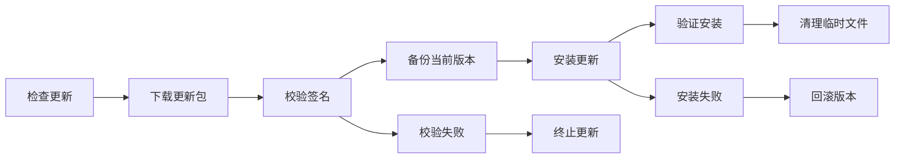

# システムドキュメントを更新する

更新メカニズム、バージョン管理、障害回復などのシステムドキュメントを自動的に更新します。

## ディレクトリ構造

- [自動更新フロー](auto-update-flow.md) - 自動更新の手順と仕組み
- [バージョン管理](version-management.md) - バージョン管理とリリース戦略
- [更新ロールバック](update-rollback.md) - 更新失敗時のロールバック機構
- [変更ログウィンドウ](changelog-window.md) - 変更ログウィンドウの詳細ドキュメント

## 概要

ColorVision の自動更新システムにより、ユーザーは最新の機能とセキュリティ修正にタイムリーにアクセスできるようになります。

### 更新プロセス

### コア機能

- **バージョンチェック**: リモートアップデートサーバーを定期的にチェックします。
- **増分アップデート**: 差分ファイルのみをダウンロードし、帯域幅の使用量を削減します。
- **署名検証**: アップデート パッケージの整合性とセキュリティを確保します。
- **自動ロールバック**: アップデートが失敗した場合、自動的に前のバージョンに戻ります。
- **サイレント アップデート**: ユーザーの操作に影響を与えることなく、バックグラウンドで自動的にアップデートします。

### 戦略を更新する

- **安定**: 完全にテストされた正式バージョン
- **ベータ**: 最新機能を含むプレビュー バージョン
- **セキュリティ アップデート**: 緊急セキュリティ パッチ、必須アップデート

## 関連コンポーネント

- `ColorVisionSetup/` - インストールおよび更新プログラム
- `Scripts/update/` - 関連スクリプトの更新

## 関連ドキュメント

- [展開ドキュメント](../deployment/README.md)
- [セキュリティとアクセス許可の制御](../security/README.md)

---

*最終更新日: 2024-09-28*