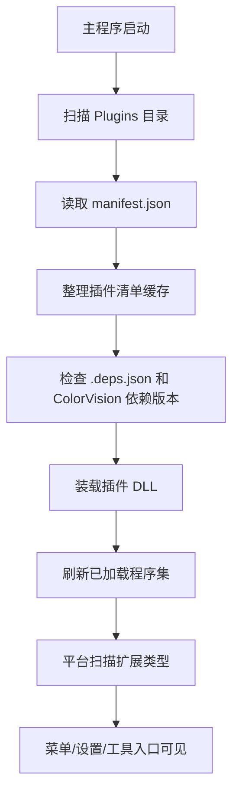

#プラグインライフサイクル

---
**メタデータ:**
- タイトル: プラグインのライフサイクル - 検出、読み込み、管理
- ステータス: ドラフト
- 更新日: 2024-09-28
- 著者: ColorVision 開発チーム
---

## はじめに

このドキュメントでは、プラグインの検出、ロード、初期化、ランタイム管理、アンインストール プロセスを含む、ColorVision プラグイン システムの完全なライフ サイクルを詳細に説明します。障害分離メカニズムとバージョン互換性戦略についても説明します。

## ディレクトリ
# プラグインのライフサイクル

このページでは、コードから直接確認できる、現在のウェアハウスにおけるプラグインの実行パスについて説明します。古いバージョンの「独立したプラグイン ホスト + 非同期ライフ サイクル インターフェイス」の説明は使用されなくなりました。

## 起動から利用可能になるまでの一般的なプロセス

## 1. プラグインを検出する

`PluginLoader.LoadPlugins()` は実行ディレクトリ内の `Plugins/` をスキャンします。各サブディレクトリはプラグイン ディレクトリの候補とみなされます。

プラットフォームが探しているもの:

- `manifest.json`
- プラグインマスターDLL
- オプションの`.deps.json`

`manifest.json` がディレクトリに存在する場合、プラットフォームはプラグイン ID、名前、説明、DLL パスおよびその他の情報を読み取り、この情報を内部構成キャッシュと同期します。

ディレクトリにマニフェストがない場合でも、プラットフォームは「ディレクトリ名と同じ名前の DLL」メソッドでマニフェストをロードしようとしますが、これは互換性のための動作にすぎず、正式な配信方法としては推奨されません。

## 2. プラグイン リストをクリーンアップして同期する

スキャンの開始時に、プラットフォームはまず、構成に記録されているがディスク上に存在しなくなったプラグイン ID をキャッシュから削除します。言い換えれば、プラグイン ディレクトリの存在は、プラットフォームの既知のプラグイン リストに逆影響を与えます。

そのため、プラグインディレクトリを削除すると、次回起動時にプラグインが管理リストから消えてしまいます。

## 3. 依存関係を確認する

プラグイン ディレクトリに `.deps.json` がある場合、プラットフォームは依存関係を読み取り、`ColorVision.*` 関連アセンブリのチェックに重点を置きます。

- 対象の DLL がメインプログラムディレクトリに存在するかどうか
- 実際のバージョンがプラグインによって宣言された最小バージョンを満たしているかどうか

バージョンが満たされていない場合、プラグインはロードを停止し、ログまたはプロンプト メッセージを表示します。

## 4. アセンブリをロードする

マニフェストと依存関係のチェックに合格すると、プラットフォームは次のことを行います。

1. プラグインのメイン DLL への実際のパスを計算します。
2. `Assembly.LoadFrom(...)` を使用してアセンブリをロードします。
3. アセンブリ名、バージョン、パス、ビルド時間、その他の情報を記録します。
4. すべてのプラグインがロードされた後、アセンブリ リストを更新します。

現在のコード パスでは、プラグインの読み込みは、プラグインごとに独立したホストや再利用可能な読み込みコンテキストを確立するのではなく、「アセンブリをメイン プロセスに追加し、後続の型スキャンに参加する」ことです。

## 5. 拡張ポイントが有効になります

DLL が読み込まれた後、プラットフォームは読み込まれたアセンブリ上の拡張型のスキャンを続けます。一般的な結果は次のとおりです。

- メニュー項目プロバイダーが見つかりました
- 設定ページまたは構成アイテムプロバイダーが検出される
- ステータスバー、ツールウィンドウ、またはその他の拡張機能の入り口が見つかった

したがって、プラグインが「利用可能であるかどうか」は、プラグインが単に読み込まれているかどうかではなく、プラットフォームが期待するプロバイダー インターフェイスをアセンブリが実装しているかどうかに依存することがよくあります。

## 6. アップデートと管理

プラグイン情報が記録されると、プラットフォームはキャッシュ内のプラグイン情報に基づいてプロンプトを管理および更新できます。更新ロジックとプラグイン マーケットの統合は UI レイヤーのプラグイン関連モジュール内にありますが、これらは以前のスキャンおよびロード結果のセットに基づいて構築されています。

## 問題が発生したときに最初に確認すること

### プラグイン ディレクトリは存在しますが、まったく認識されません

- `manifest.json` が存在し、解決可能かどうかを確認します
- `dllpath` が正しいかどうかを確認してください
- DLLが実際にプラグインディレクトリにコピーされているかどうかを確認します

### プラグインは認識されましたが、ロードできませんでした。

- `.deps.json` の `ColorVision.*` のバージョン要件を確認する
- 必要な依存 DLL がメイン プログラム ディレクトリに存在するかどうかを確認します。
- 依存関係のバージョンが不十分であるか、DLL プロンプトが欠落していないかログを確認してください。

### プラグインはロードされていますが、メニューや機能が表示されません。

- 対応するプロバイダーインターフェイスが実装されているかどうかを確認します
- エントリ タイプが、非抽象、非オープン ジェネリック、パブリックのパラメータなし構造などの基本要件を満たしているかどうかを確認します。

## 説明

- 現在の文書では、倉庫内で直接目に見える積載経路のみが説明されています。
- `PluginContext`、権限システム、隔離されたホスト、アンインストール可能なコンテキストなどに関する古いドキュメントの内容は、現在のメイン パス実装のデフォルトの基礎として使用できません。