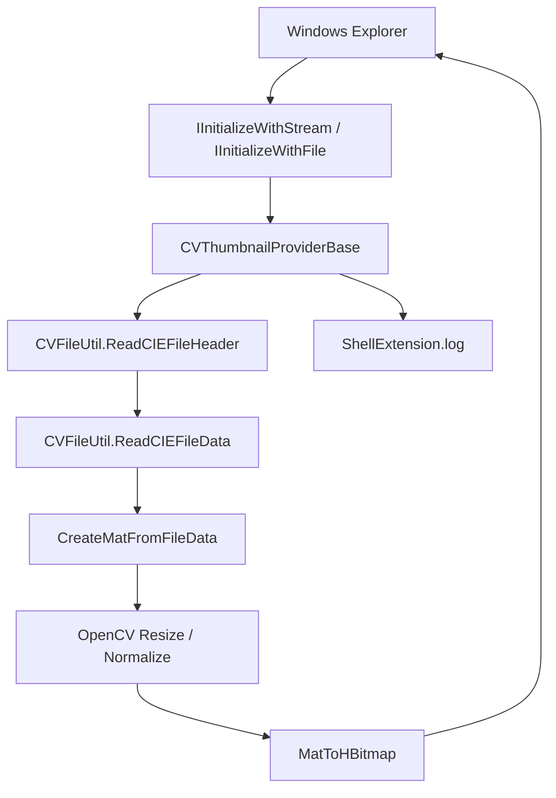

# ColorVision.ShellExtension

`ColorVision.ShellExtension` は Windows Explorer のサムネイル拡張です。メインアプリの Engine 実行チェーンではありません。現地担当者がフォルダー内で `.cvraw` と `.cvcie` を直接プレビューできるようにするための外部連携モジュールです。

## 現在の位置づけ

| 項目 | 現在の状態 |
| --- | --- |
| ソース | `Engine/ColorVision.ShellExtension/` |
| project file | `ColorVision.ShellExtension.csproj` |
| platform | x64 |
| build flags | `EnableComHosting=true`、`EnableDynamicLoading=true`、`AllowUnsafeBlocks=true` |
| key output | `ColorVision.ShellExtension.comhost.dll`、`ColorVision.ShellExtension.dll`、`ColorVision.FileIO.dll`、OpenCvSharp runtime |
| file types | `.cvraw`、`.cvcie` |
| host | Windows Explorer |
| log | `%APPDATA%\ColorVision\Log\ShellExtension.log` |

[ColorVision.FileIO](./ColorVision.FileIO.md) で ColorVision 独自ファイルの header と pixel data を読み取り、OpenCvSharp で `HBITMAP` を作成して Explorer に返します。

## 呼び出しチェーン



引き継ぎではまず `CVThumbnailProviderBase.cs` を確認します。Explorer initialization、file read、exception protection、OpenCV resize、`HBITMAP` 作成、logging をここで扱います。

## 主要ファイル

| ファイル | 役割 | 引き継ぎ重点 |
| --- | --- | --- |
| `ColorVision.ShellExtension.csproj` | COM hosting、dynamic loading、x64、dependencies | `.comhost.dll` と OpenCvSharp runtime が出力されるか |
| `CVThumbnailProviderBase.cs` | Shell thumbnail provider base | Explorer 初期化、HRESULT 返却、例外を外へ出さないこと |
| `CVRawShellThumbnailProvider.cs` | `.cvraw` provider、CLSID `{7B5E2A3C-8F1D-4E6A-B9C2-1D3E5F7A8B9C}` | RAW/SRC data を OpenCV Mat にする処理 |
| `CVCieShellThumbnailProvider.cs` | `.cvcie` provider、CLSID `{8C6F3B4D-9E2A-5F7B-C3D4-2E4F6A8B9C0D}` | 3-channel XYZ は現在 first channel を thumbnail に使う |
| `Interop/ShellInterfaces.cs` | Windows Shell COM interfaces | GUID と `PreserveSig` |
| `ShellLog.cs` | Explorer process 内 log | logging failure が Explorer に影響しないこと |
| `Register.ps1` | COM server と extension handler 登録 | admin required、HKCR/HKLM 変更、Explorer restart、thumbnail cache clear |
| `Unregister.ps1` | handler と COM server registration を削除 | rollback の最初の手順 |

## ファイル形式の扱い

`CVRawShellThumbnailProvider` は `CVType.Raw` と `CVType.Src` を direct pixel data として扱います。非 8-bit data は表示前に 0-255 に normalize されます。

`CVCieShellThumbnailProvider` は `CVType.CIE` を扱います。3-channel CIE/XYZ data は現在 first channel のみを thumbnail display に使います。Explorer thumbnail は quick preview であり、測定結果や color analysis ではありません。

## 登録と解除

```powershell
dotnet build Engine/ColorVision.ShellExtension/ColorVision.ShellExtension.csproj -c Release -p:Platform=x64
Engine/ColorVision.ShellExtension/Register.ps1
Engine/ColorVision.ShellExtension/Unregister.ps1
```

`Register.ps1` は `ColorVision.ShellExtension.comhost.dll` を登録し、`.cvraw` / `.cvcie` の thumbnail provider registry key を書き込み、approved shell extension への追加を試み、Explorer を再起動して thumbnail/icon cache を削除します。

## 現在のスクリプトリスク

現在の `Register.ps1` では `$handlerClsid` が `{7B5E2A3C-8F1D-4E6A-B9C2-1D3E5F7A8B9C}` です。これは `CVRawShellThumbnailProvider` の CLSID で、スクリプトは `.cvraw` と `.cvcie` の両方をこの CLSID に bind します。

引き継ぎ時に、`.cvcie` が同じ handler を共有する想定か確認します。`CVCieShellThumbnailProvider` を使う場合は、`.cvcie` を `{8C6F3B4D-9E2A-5F7B-C3D4-2E4F6A8B9C0D}` に bind し、両方の file type を再テストします。

## 受け入れチェック

| チェック | 合格条件 |
| --- | --- |
| build output | `bin/x64/Release/net10.0-windows/` に `.dll`、`.comhost.dll`、`.deps.json`、`.runtimeconfig.json` がある |
| dependencies | `ColorVision.FileIO.dll`、OpenCvSharp、`runtimes/win-x64/native` が出力にある |
| registration | admin script が成功し、`regsvr32` が成功する |
| registry | `.cvraw` と `.cvcie` handler が期待 CLSID を指す |
| Explorer | restart 後に thumbnail が表示される |
| log | `%APPDATA%\ColorVision\Log\ShellExtension.log` に initialization と `GetThumbnail` が記録される |
| rollback | `Unregister.ps1` で binding が削除され cache が clear される |

## トラブルシュート

| 症状 | 最初に確認 |
| --- | --- |
| thumbnail が出ない | COM host registration、shellex key、Explorer restart、cache clear |
| `.cvraw` だけ正常 | `.cvcie` CLSID binding と CIE provider 呼び出し |
| log がない | Explorer が extension を load したか、log directory が writable か |
| header read failure | file が現在の [ColorVision.FileIO](./ColorVision.FileIO.md) support format か |
| native DLL missing | OpenCvSharp runtime と `runtimes/win-x64/native` |
| Explorer unstable | 先に unregister、cache clear、小さい file で再テスト |

メインアプリの image viewer、ROI/POI overlay、Flow、template、device、MQTT、project output はこの module の責務ではありません。メインアプリの結果問題は [結果表示とプロジェクト引き継ぎ](./result-handoff-chain.md) または [ColorVision.ImageEditor](../ui-components/ColorVision.ImageEditor.md) から確認します。
