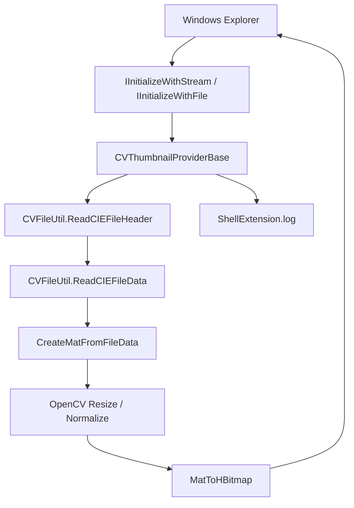

# ColorVision.ShellExtension

`ColorVision.ShellExtension`은 Windows Explorer 썸네일 확장입니다. 메인 애플리케이션의 Engine 실행 체인이 아닙니다. 현장 담당자가 폴더에서 `.cvraw`와 `.cvcie` 파일을 바로 미리 볼 수 있게 하는 외부 통합 모듈입니다.

## 현재 위치

| 항목 | 현재 상태 |
| --- | --- |
| 소스 | `Engine/ColorVision.ShellExtension/` |
| 프로젝트 파일 | `ColorVision.ShellExtension.csproj` |
| 플랫폼 | x64 |
| 빌드 속성 | `EnableComHosting=true`, `EnableDynamicLoading=true`, `AllowUnsafeBlocks=true` |
| 주요 출력 | `ColorVision.ShellExtension.comhost.dll`, `ColorVision.ShellExtension.dll`, `ColorVision.FileIO.dll`, OpenCvSharp runtime |
| 파일 형식 | `.cvraw`, `.cvcie` |
| 호스트 | Windows Explorer |
| 로그 | `%APPDATA%\ColorVision\Log\ShellExtension.log` |

이 확장은 [ColorVision.FileIO](./ColorVision.FileIO.md)로 ColorVision 사용자 정의 파일 header와 pixel data를 읽고, OpenCvSharp로 `HBITMAP`을 만들어 Explorer에 반환합니다.

## 호출 체인



인수인계 시 먼저 `CVThumbnailProviderBase.cs`를 확인합니다. Explorer 초기화, 파일 읽기, 예외 보호, OpenCV resize, `HBITMAP` 생성, 로그를 여기서 공통 처리합니다.

## 주요 파일

| 파일 | 역할 | 인수인계 중점 |
| --- | --- | --- |
| `ColorVision.ShellExtension.csproj` | COM hosting, dynamic loading, x64, dependencies | `.comhost.dll`과 OpenCvSharp runtime 출력 여부 |
| `CVThumbnailProviderBase.cs` | Shell thumbnail provider 공통 base | Explorer 초기화, HRESULT 반환, 예외를 밖으로 던지지 않음 |
| `CVRawShellThumbnailProvider.cs` | `.cvraw` provider, CLSID `{7B5E2A3C-8F1D-4E6A-B9C2-1D3E5F7A8B9C}` | RAW/SRC data를 OpenCV Mat으로 변환 |
| `CVCieShellThumbnailProvider.cs` | `.cvcie` provider, CLSID `{8C6F3B4D-9E2A-5F7B-C3D4-2E4F6A8B9C0D}` | 3-channel XYZ는 현재 첫 번째 channel을 thumbnail에 사용 |
| `Interop/ShellInterfaces.cs` | Windows Shell COM interfaces | GUID와 `PreserveSig` |
| `ShellLog.cs` | Explorer process 내부 log | 로그 실패가 Explorer에 영향을 주면 안 됨 |
| `Register.ps1` | COM server와 확장자 handler 등록 | 관리자 필요, HKCR/HKLM 변경, Explorer 재시작, thumbnail cache 삭제 |
| `Unregister.ps1` | handler와 COM server registration 제거 | rollback 첫 단계 |

## 파일 형식 동작

`CVRawShellThumbnailProvider`는 `CVType.Raw`와 `CVType.Src`를 direct pixel data로 처리합니다. 8-bit가 아닌 데이터는 표시 전에 0-255로 normalize합니다.

`CVCieShellThumbnailProvider`는 `CVType.CIE`를 처리합니다. 3-channel CIE/XYZ data는 현재 첫 번째 channel만 thumbnail display에 사용합니다. Explorer thumbnail은 빠른 미리보기일 뿐이며 측정 결과나 색 분석 결과가 아닙니다.

## 등록과 해제

```powershell
dotnet build Engine/ColorVision.ShellExtension/ColorVision.ShellExtension.csproj -c Release -p:Platform=x64
Engine/ColorVision.ShellExtension/Register.ps1
Engine/ColorVision.ShellExtension/Unregister.ps1
```

`Register.ps1`은 `ColorVision.ShellExtension.comhost.dll`을 등록하고, `.cvraw` / `.cvcie` thumbnail provider registry key를 작성하며, approved shell extension 추가를 시도한 뒤 Explorer를 재시작하고 thumbnail/icon cache를 삭제합니다.

## 현재 스크립트 위험

현재 `Register.ps1`의 `$handlerClsid`는 `{7B5E2A3C-8F1D-4E6A-B9C2-1D3E5F7A8B9C}`입니다. 이는 `CVRawShellThumbnailProvider`의 CLSID이며, 스크립트는 `.cvraw`와 `.cvcie` 모두를 이 CLSID에 bind합니다.

인수인계 시 `.cvcie`가 같은 handler를 공유하는 것이 의도인지 확인해야 합니다. `CVCieShellThumbnailProvider`를 사용해야 한다면 `.cvcie`를 `{8C6F3B4D-9E2A-5F7B-C3D4-2E4F6A8B9C0D}`에 bind하고 두 파일 형식을 다시 테스트합니다.

## 인수 검증 체크리스트

| 항목 | 통과 기준 |
| --- | --- |
| 빌드 출력 | `bin/x64/Release/net10.0-windows/`에 `.dll`, `.comhost.dll`, `.deps.json`, `.runtimeconfig.json` 존재 |
| 의존성 출력 | `ColorVision.FileIO.dll`, OpenCvSharp, `runtimes/win-x64/native` 존재 |
| 등록 | 관리자 스크립트 성공, `regsvr32` 성공 |
| 레지스트리 | `.cvraw`와 `.cvcie` handler가 기대 CLSID를 가리킴 |
| Explorer | 재시작 후 thumbnail 표시 |
| 로그 | `%APPDATA%\ColorVision\Log\ShellExtension.log`에 initialization과 `GetThumbnail` 기록 |
| rollback | `Unregister.ps1`로 binding 제거 및 cache 삭제 |

## 문제 해결

| 증상 | 먼저 확인 |
| --- | --- |
| thumbnail 없음 | COM host registration, shellex key, Explorer restart, cache clear |
| `.cvraw`만 정상 | `.cvcie` CLSID binding과 CIE provider 호출 여부 |
| log 없음 | Explorer가 extension을 load했는지, log directory가 writable인지 |
| header read failure | 파일이 현재 [ColorVision.FileIO](./ColorVision.FileIO.md) 지원 형식인지 |
| native DLL missing | OpenCvSharp runtime과 `runtimes/win-x64/native` |
| Explorer unstable | 먼저 unregister, cache clear, 작은 파일로 재테스트 |

메인 앱의 image viewer, ROI/POI overlay, Flow, template, device, MQTT, project output은 이 module의 책임이 아닙니다. 메인 앱 결과 문제는 [결과 표시 및 프로젝트 인수인계](./result-handoff-chain.md) 또는 [ColorVision.ImageEditor](../ui-components/ColorVision.ImageEditor.md)에서 확인합니다.
