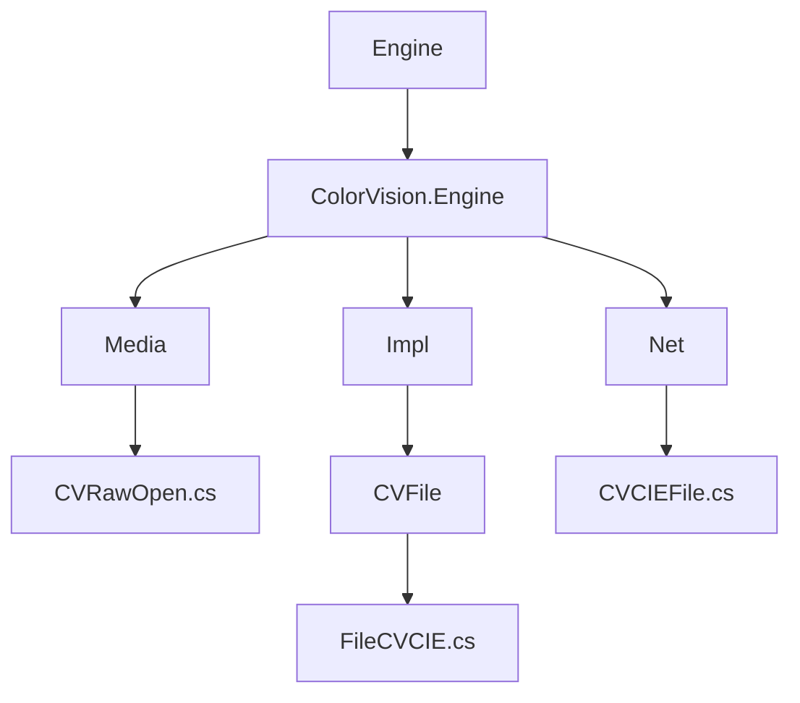

# 文件格式说明


# 文件格式说明

## 目录
1. [简介](#简介)
2. [项目结构](#项目结构)
3. [核心组件](#核心组件)
4. [架构概述](#架构概述)
5. [详细组件分析](#详细组件分析)
6. [依赖关系分析](#依赖关系分析)
7. [性能考虑](#性能考虑)
8. [故障排除指南](#故障排除指南)
9. [总结](#总结)
10. [附录](#附录)

## 简介
本文档详细描述了 ColorVision 软件中使用的特定文件格式，主要包括 CVRaw 和 CVCIE 文件格式。文中介绍了这些文件格式的结构、用途以及如何进行读写操作。通过对相关核心代码的分析，本文旨在为用户和开发人员提供对文件格式的深入理解，帮助其更好地使用和扩展 ColorVision 系统。

---

## 项目结构
ColorVision 项目结构较为庞大，采用模块化设计，主要按照功能和技术层次划分目录。以下是与文件格式相关的核心目录及其说明：



1. **Engine/ColorVision.Engine/Media**  
   该目录包含对图像文件的打开和处理逻辑，如 `CVRawOpen.cs`，负责 CVRaw 和 CVCIE 文件的读取与显示。

2. **Engine/ColorVision.Engine/Impl/CVFile**  
   实现了文件元数据管理及文件格式的导出功能，如 `FileCVCIE.cs`，定义了文件的元信息及导出为多种图像格式的功能。

3. **Engine/ColorVision.Net**  
   包含文件格式的核心数据结构定义，如 `CVCIEFile.cs`，定义了 CVCIE 文件的结构体，描述文件的基本属性和数据。

以上目录体现了 ColorVision 对文件格式处理的分层设计，从文件结构定义、文件操作实现到界面交互的完整链路。

---

## 核心组件

### 1. CVRawOpen 类 (路径: Engine/ColorVision.Engine/Media/CVRawOpen.cs)
- 负责打开 `.cvraw` 和 `.cvcie` 文件。
- 提供图像显示、图层选择及鼠标放大镜功能。
- 支持读取文件头信息，初始化显示缓冲区。
- 通过委托和事件机制处理用户交互。
- 支持多线程加载文件数据，提升响应速度。

### 2. FileCVCIE 类 (路径: Engine/ColorVision.Engine/Impl/CVFile/FileCVCIE.cs)
- 继承自 FileMetaBase，管理文件元数据。
- 支持导出为 BMP、TIFF、PNG 等多种图像格式。
- 通过 OpenCVSharp 进行图像数据处理和保存。
- 提供菜单项支持用户操作。

### 3. CVCIEFile 结构体 (路径: Engine/ColorVision.Net/CVCIEFile.cs)
- 定义了 CVCIE 文件的核心属性，如版本号、文件类型、行列数、位深、通道数、增益、曝光时间数组、源文件名及数据缓存。
- 提供了位深到 OpenCV Mat 类型的映射。

---

## 架构概述
ColorVision 文件格式处理架构主要分为三层：

1. **文件结构定义层**  
   通过 `CVCIEFile` 结构体定义文件的存储结构，包括图像的尺寸、颜色通道、数据格式及相关元信息。

2. **文件操作实现层**  
   `FileCVCIE` 类负责文件的读取、写入及导出操作，使用 OpenCVSharp 处理图像数据，实现格式转换和保存。

3. **界面交互层**  
   `CVRawOpen` 类负责文件的打开显示、图层切换、鼠标交互等用户界面逻辑，支持异步加载和事件响应。

这种分层设计保证了代码的模块化和可维护性，便于扩展新的文件格式和功能。

---

## 详细组件分析

### CVRawOpen.cs

该类实现了对 `.cvraw` 和 `.cvcie` 文件的打开和显示功能。主要功能包括：

- **文件扩展名支持**  
  支持 `.cvraw` 和 `.cvcie` 两种扩展名。

- **图层管理**  
  通过 `ComboBoxLayerItems` 管理图像的不同图层，如原图（Src）、红绿蓝通道（R、G、B）及 CIE XYZ 三个色彩空间通道（X、Y、Z）。

- **点集合管理**  
  `Points` 属性存储多组点，用于鼠标附近点的查找，支持用户交互。

- **缓冲区设置**  
  `CVCIESetBuffer` 方法负责初始化文件缓冲区，读取文件头和数据，启动后台线程加载数据，并绑定鼠标移动事件显示色彩信息。

- **鼠标放大镜显示**  
  根据放大镜类型（圆形或矩形），调用底层 `ConvertXYZ` 库计算色彩空间值，并绘制显示。

- **图层切换事件**  
  根据用户选择的图层，切换显示对应的图像通道。

- **异步图像加载**  
  支持异步加载图像数据，提升界面响应速度。

- **右键菜单支持**  
  提供导出菜单项，调用导出对话框。

代码示例：

```csharp
public void CVCIESetBuffer(ImageView imageView, string filePath)
{
    // 读取点数据文件，初始化 Points
    // 绑定鼠标移动事件显示色彩信息
    // 初始化 ConvertXYZ 句柄
    // 设置图层切换事件
    // 读取 CIE 文件头，启动线程加载数据
}
```

### FileCVCIE.cs

该类继承自 `FileMetaBase`，管理 `.cvraw` 和 `.cvcie` 文件的元数据和导出功能。主要功能：

- **导出命令**  
  提供导出为 BMP、TIFF、PNG 格式的命令绑定。

- **导出实现**  
  读取文件头和数据，利用 OpenCVSharp 将原始数据转换为 Mat 对象，再保存为对应格式。

- **菜单项定义**  
  定义文件右键菜单，支持多格式导出。

代码示例：

```csharp
public void ExportAS(ImageFormat imageFormat)
{
    int index = CVFileUtil.ReadCIEFileHeader(FileInfo.FullName, out CVCIEFile cvcie);
    if (index < 0) return;
    CVFileUtil.ReadCIEFileData(FileInfo.FullName, ref cvcie, index);
    var src = Mat.FromPixelData(cvcie.cols, cvcie.rows, MatType.MakeType(cvcie.Depth, cvcie.channels), cvcie.data);
    src.SaveImage(dialog.FileName, new ImageEncodingParam(...));
}
```

### CVCIEFile.cs

该结构体定义了 CVCIE 文件的核心数据结构：

- **文件版本**  
  `version` 字段标记文件版本。

- **文件类型**  
  使用枚举 `CVType` 标识文件类型，如 Raw、Src、CIE 等。

- **图像尺寸和格式**  
  包含行数 `rows`，列数 `cols`，位深 `bpp`，通道数 `channels`。

- **曝光时间和增益**  
  `exp` 数组存储曝光时间，`gain` 存储增益值。

- **原始数据**  
  `data` 字节数组存储图像原始数据。

- **辅助属性**  
  `Depth` 属性将位深映射为 OpenCV 的深度类型。

---

## 依赖关系分析

- `CVRawOpen` 依赖于 `ConvertXYZ` 本地库进行色彩空间计算。
- `FileCVCIE` 依赖 OpenCVSharp 进行图像数据的处理和保存。
- `CVCIEFile` 作为数据结构被 `CVRawOpen` 和 `FileCVCIE` 共同使用。
- `CVFileUtil` 提供文件头读取和数据读取的静态方法，贯穿文件操作流程。
- 界面层通过 `ImageView` 和相关控件实现文件显示和用户交互。

---

## 性能考虑

- 文件数据加载采用多线程异步处理，避免界面阻塞。
- 色彩计算采用本地 DLL，提升性能。
- 图层切换通过预先加载不同通道数据，减少重复读取。

---

## 故障排除指南

- 若文件无法打开，检查文件路径及扩展名是否正确。
- 若色彩数据显示异常，确认 `ConvertXYZ` 库是否正确初始化。
- 导出失败时，检查目标路径权限及支持的格式。
- 鼠标放大镜无响应，确认事件绑定是否正确。

---

## 总结
ColorVision 的 CVRaw 和 CVCIE 文件格式处理模块设计合理，分层清晰。通过结构体定义文件格式，类实现文件操作和界面交互，结合本地库和 OpenCV 进行高效处理。文档详细介绍了文件格式结构、用途及读写操作，方便用户理解和开发扩展。

---

## 附录

### 相关源码链接

- [CVRawOpen.cs](https://github.com/xincheng213618/scgd_general_wpf/blob/master/Engine/ColorVision.Engine/Media/CVRawOpen.cs)
- [FileCVCIE.cs](https://github.com/xincheng213618/scgd_general_wpf/blob/master/Engine/ColorVision.Engine/Impl/CVFile/FileCVCIE.cs)
- [CVCIEFile.cs](https://github.com/xincheng213618/scgd_general_wpf/blob/master/Engine/ColorVision.Net/CVCIEFile.cs)

