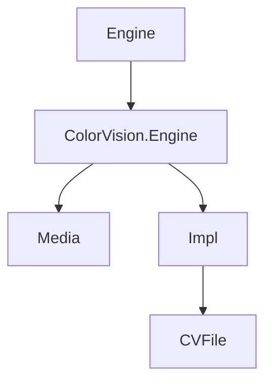
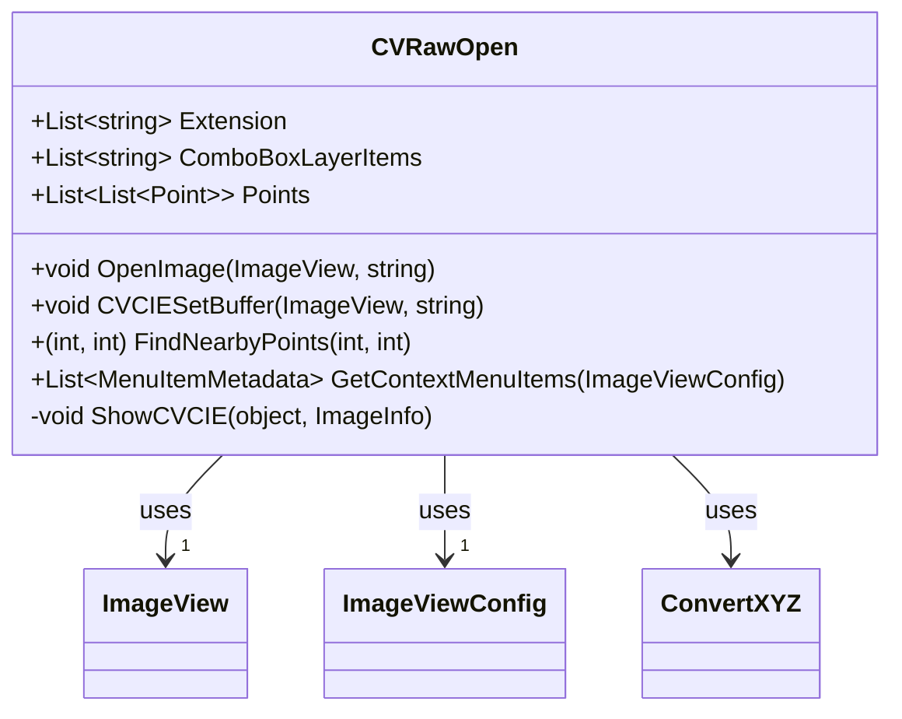
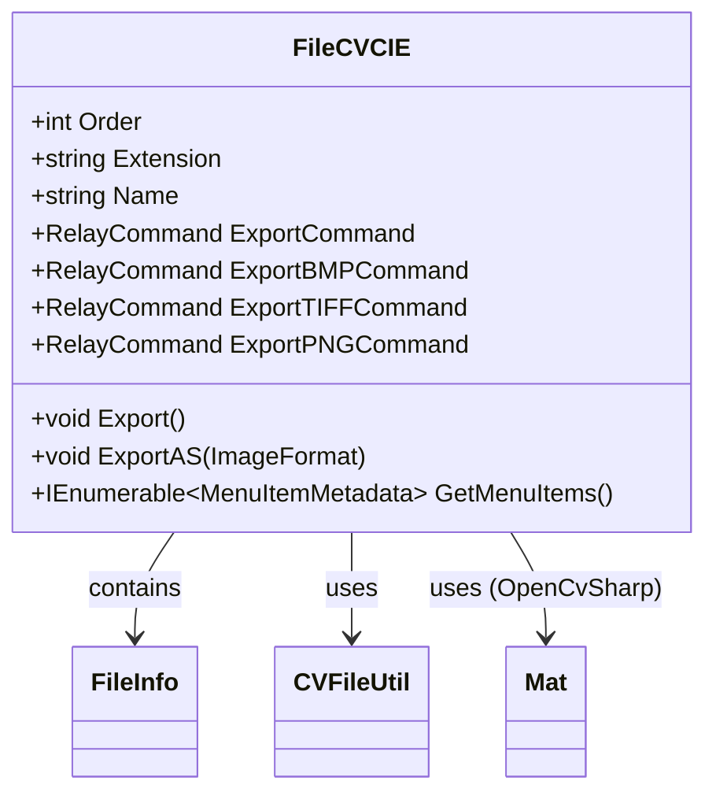

# 附录


# 附录

## 目录
1. [介绍](#介绍)
2. [项目结构](#项目结构)
3. [核心组件](#核心组件)
4. [架构概览](#架构概览)
5. [详细组件分析](#详细组件分析)
   - [CVRawOpen 类](#cvrawopen-类)
   - [FileCVCIE 类](#filecvcie-类)
6. [依赖关系分析](#依赖关系分析)
7. [性能考虑](#性能考虑)
8. [故障排除指南](#故障排除指南)
9. [总结](#总结)
10. [附录](#附录)

---

## 介绍

本附录旨在详细说明 ColorVision 项目中与 `.cvraw` 和 `.cvcie` 文件格式相关的核心组件和功能实现。文档通过解析关键代码文件，介绍了图像文件的读取、处理、显示和导出机制，帮助读者理解项目的核心架构与实现细节。即使是技术背景有限的读者，也能通过本附录获得对项目相关模块的深入认识。

---

## 项目结构

本项目采用模块化设计，文件组织清晰，主要按照功能和技术层次划分。以下是与本附录内容相关的主要目录结构分析：



- **Engine/ColorVision.Engine/Media/**  
  存放媒体相关的图像处理类，如 `CVRawOpen.cs`，负责图像文件的打开、读取及显示等功能。

- **Engine/ColorVision.Engine/Impl/CVFile/**  
  存放具体文件格式的实现与处理类，如 `FileCVCIE.cs`，负责 `.cvraw` 和 `.cvcie` 文件的元数据管理及导出功能。

项目中采用 MVVM（Model-View-ViewModel）设计模式，结合 WPF 技术实现界面和业务逻辑分离，增强可维护性和扩展性。

---

## 核心组件

本附录重点分析以下核心组件：

- **CVRawOpen**  
  负责打开和显示 `.cvraw` 和 `.cvcie` 文件，支持多图层显示及鼠标交互的颜色数据展示。

- **FileCVCIE**  
  管理 `.cvraw` 和 `.cvcie` 文件的元信息，支持多种图像格式导出功能，方便用户将专用格式转换为通用图像格式。

---

## 架构概览

该系统围绕图像文件的读取、显示和导出功能构建，核心架构包括：

- 文件元数据解析（FileCVCIE）
- 图像数据缓冲与转换（CVRawOpen）
- 用户界面交互（ImageView 及相关控件）
- 事件驱动的鼠标交互和图层切换
- 异步任务处理保证界面响应性

整体架构采用事件订阅与命令模式，确保用户操作与后台处理的高效协作。

---

## 详细组件分析

### CVRawOpen 类

**文件路径**  
[Engine/ColorVision.Engine/Media/CVRawOpen.cs](https://github.com/xincheng213618/scgd_general_wpf/blob/master/Engine/ColorVision.Engine/Media/CVRawOpen.cs)

**功能概述**  
`CVRawOpen` 实现了 `IImageOpen` 接口，负责打开 `.cvraw` 和 `.cvcie` 文件，读取文件数据并显示在界面上。支持多图层显示（如原图、R/G/B 通道、XYZ 颜色空间通道），并实现了鼠标移动时显示颜色信息的功能。

**关键功能点**

1. **扩展名支持**  
   支持 `.cvraw` 和 `.cvcie` 文件格式。

2. **图层管理**  
   `ComboBoxLayerItems` 用于存储可显示的图层名称，如 "Src", "R", "G", "B" 等，用户可通过界面选择显示不同图层。

3. **点查找功能**  
   `FindNearbyPoints` 方法用于根据鼠标位置查找附近的点，支持交互式显示点信息。

4. **颜色数据缓冲设置**  
   `CVCIESetBuffer` 方法初始化颜色转换缓冲区，读取鼠标放大镜相关事件，动态显示颜色 XYZ 和 xyuv 信息。

5. **异步加载**  
   使用异步任务加载图像数据，保证 UI 流畅。

6. **上下文菜单**  
   提供“导出”菜单项，支持导出当前文件。

**代码示例**

```csharp
public (int pointIndex, int listIndex) FindNearbyPoints(int mousex, int mousey)
{
    for (int listIndex = 0; listIndex < Points.Count; listIndex++)
    {
        List<Point> pointList = Points[listIndex];
        for (int pointIndex = 0; pointIndex < pointList.Count; pointIndex++)
        {
            Point point = pointList[pointIndex];
            double deltaX = point.X - (double)mousex;
            double deltaY = point.Y - (double)mousey;
            if (!(Math.Abs(deltaX) > 5.0) && !(Math.Abs(deltaY) > 5.0))
            {
                double distance = Math.Sqrt(deltaX * deltaX + deltaY * deltaY);
                if (distance < 5.0)
                {
                    return (pointIndex: pointIndex, listIndex: listIndex);
                }
            }
        }
    }
    return (pointIndex: -1, listIndex: -1);
}
```

**关系图示**



**代码说明**

- 通过 `CVCIESetBuffer` 方法，初始化颜色转换缓冲区，读取文件头和数据，准备显示。
- 鼠标移动时调用 `ShowCVCIE` 方法，显示当前鼠标位置对应的颜色信息。
- 支持多图层，通过 ComboBox 控件切换显示不同颜色通道。
- 采用异步线程读取大文件，避免界面卡顿。

**潜在优化**

- 鼠标移动事件处理可以考虑节流（debounce）以减少频繁计算。
- 文件读取和缓冲初始化可增加异常处理和日志详细度。

---

### FileCVCIE 类

**文件路径**  
[Engine/ColorVision.Engine/Impl/CVFile/FileCVCIE.cs](https://github.com/xincheng213618/scgd_general_wpf/blob/master/Engine/ColorVision.Engine/Impl/CVFile/FileCVCIE.cs)

**功能概述**  
`FileCVCIE` 继承自 `FileMetaBase`，负责管理 `.cvraw` 和 `.cvcie` 文件的元数据，提供文件导出功能，支持将专用格式导出为 BMP、PNG、TIFF 等通用格式。

**关键功能点**

1. **文件扩展名和排序**  
   支持 `.cvraw` 和 `.cvcie` 文件，排序权重为 99。

2. **导出命令**  
   通过 `RelayCommand` 实现多种导出格式（BMP, TIFF, PNG）的命令绑定。

3. **导出实现**  
   使用 OpenCvSharp 库读取图像数据并保存为指定格式。

4. **菜单项生成**  
   提供导出菜单项，集成于 UI。

**代码示例**

```csharp
public void ExportAS(ImageFormat imageFormat)
{
    int index = CVFileUtil.ReadCIEFileHeader(FileInfo.FullName, out CVCIEFile cvcie);
    if (index < 0) return;

    var src = Mat.FromPixelData(cvcie.cols, cvcie.rows, MatType.MakeType(cvcie.Depth, cvcie.channels), cvcie.data);

    System.Windows.Forms.SaveFileDialog dialog = new System.Windows.Forms.SaveFileDialog();
    dialog.FileName = Path.GetFileNameWithoutExtension(FileInfo.FullName) + $".{imageFormat}";
    dialog.Filter = "Bitmap Image|*.bmp|PNG Image|*.png|JPEG Image|*.jpg;*.jpeg|TIFF Image|*.tiff|All Files|*.*";
    dialog.RestoreDirectory = true;

    if (dialog.ShowDialog() == System.Windows.Forms.DialogResult.OK)
    {
        string selectedExt = Path.GetExtension(dialog.FileName).ToLower(CultureInfo.CurrentCulture);
        switch (selectedExt)
        {
            case ".bmp":
                src.SaveImage(dialog.FileName);
                break;
            case ".png":
                src.SaveImage(dialog.FileName, new ImageEncodingParam(ImwriteFlags.PngCompression, 3));
                break;
            case ".jpg":
            case ".jpeg":
                src.SaveImage(dialog.FileName, new ImageEncodingParam(ImwriteFlags.JpegQuality, 95));
                break;
            case ".tiff":
                src.SaveImage(dialog.FileName, new ImageEncodingParam(ImwriteFlags.TiffCompression, 1));
                break;
            default:
                MessageBox.Show("Unsupported file format selected.", "Error");
                break;
        }
    }
}
```

**关系图示**



**代码说明**

- 通过 `ExportAS` 方法，弹出文件保存对话框，允许用户选择导出格式。
- 使用 OpenCvSharp 的 `Mat` 结构处理图像数据，支持多种图像格式编码。
- 菜单项通过 `GetMenuItems` 方法提供，方便集成到 UI 菜单。

**潜在优化**

- 导出功能可增加进度提示和错误处理。
- 支持更多图像格式或自定义导出选项。

---

## 依赖关系分析

- `CVRawOpen` 依赖于 `ConvertXYZ` 进行颜色空间转换和缓冲处理。
- `FileCVCIE` 依赖于 `CVFileUtil` 进行文件头和数据读取。
- 两者均依赖于 MVVM 框架中的 `RelayCommand` 实现命令绑定。
- 图像处理依赖 `OpenCvSharp`，实现跨平台高效图像操作。
- UI 相关依赖 WPF 控件（如 `ImageView`, `ComboBox`）和事件机制。

---

## 性能考虑

- 大文件读取采用异步线程，避免 UI 阻塞。
- 鼠标移动事件绑定颜色显示，可能影响性能，建议节流处理。
- 图像数据缓冲区初始化仅执行一次，避免重复计算。
- 导出操作基于 OpenCvSharp，性能较优，但可根据文件大小优化内存使用。

---

## 故障排除指南

- 如果文件无法打开，检查文件路径及扩展名是否正确。
- 颜色显示异常时，确认 `ConvertXYZ` 颜色空间转换库是否正常加载。
- 导出失败时，确保选择的导出格式受支持，且文件保存路径有写权限。
- 异步加载时若界面无响应，检查线程是否正常启动及异常捕获。

---

## 总结

本附录详细解析了 ColorVision 项目中处理 `.cvraw` 和 `.cvcie` 文件的两个核心类 `CVRawOpen` 和 `FileCVCIE`。两者分别负责图像文件的打开显示和文件元数据管理及导出功能。项目采用现代 MVVM 架构，结合 WPF 和 OpenCvSharp，实现了功能丰富且用户友好的图像处理体验。通过异步处理和事件驱动，保证了系统的响应性和扩展性。

---

## 附录

无其他补充文件格式说明或术语表。

