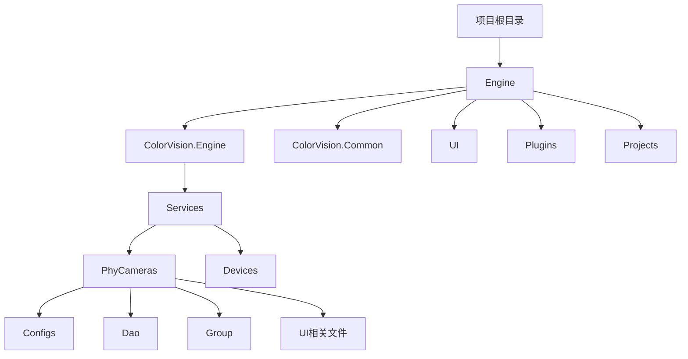
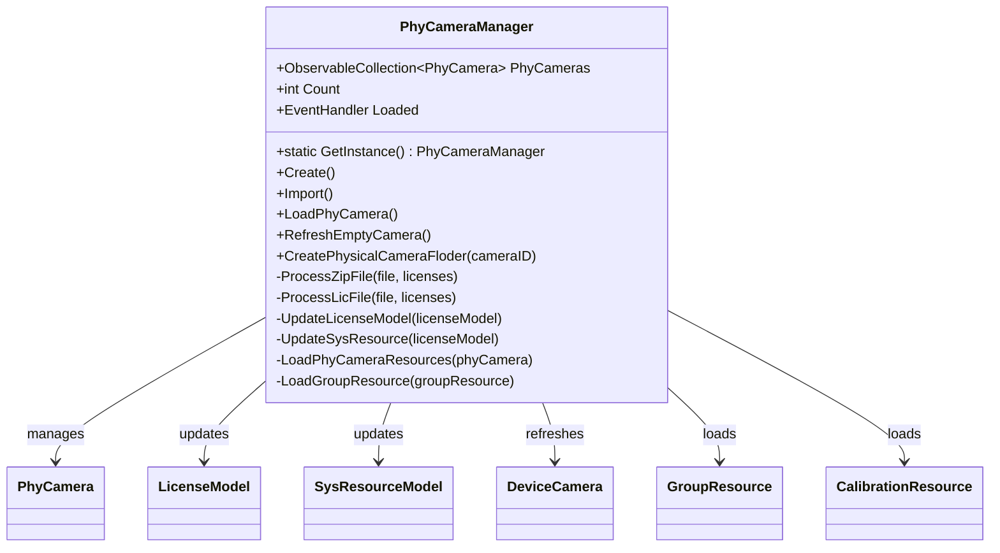

# 物理相机管理


# 物理相机管理

## 目录
1. [介绍](#介绍)
2. [项目结构](#项目结构)
3. [核心组件](#核心组件)
4. [架构概述](#架构概述)
5. [详细组件分析](#详细组件分析)
   - [PhyCameraManager.cs](#phycameramanagercs)
   - [EditPhyCamera.xaml.cs](#editphycameraxamlcs)
6. [依赖分析](#依赖分析)
7. [性能考虑](#性能考虑)
8. [故障排除指南](#故障排除指南)
9. [结论](#结论)

---

## 介绍
本项目主要涉及物理相机（PhyCamera）的管理，包括物理相机设备的添加、配置与校准。物理相机管理是系统中关键的设备管理模块，负责对物理设备的生命周期管理、许可导入、配置编辑以及相关资源的维护。本文档详细介绍了物理相机管理模块的架构设计、核心组件及其实现细节，帮助用户和开发者理解和维护该模块。

---

## 项目结构

该项目采用模块化设计，代码按功能和层次划分，主要目录和职责如下：



- **Engine/ColorVision.Engine/Services/PhyCameras**  
  负责物理相机设备管理的核心逻辑，包括设备实例管理、配置、资源加载、许可管理等。
  
- **Configs**  
  存放物理相机相关的配置类，如相机参数、通道配置等。

- **Dao**  
  数据访问层，负责物理相机相关数据的持久化操作，如许可信息、资源信息等。

- **Group**  
  物理相机资源分组管理相关代码，支持资源的层级组织。

- **UI相关文件**  
  包含物理相机管理界面及配置编辑窗口的实现。

- **Engine/ColorVision.Engine/Services/Devices**  
  设备服务层，管理各种设备（包括相机、算法、校准等）。

- **ColorVision.Common**  
  通用基础库，包含MVVM基础、工具类、接口定义等。

- **UI**  
  用户界面层，包含主题、控件、视图等。

- **Plugins**  
  插件相关代码。

- **Projects**  
  具体业务项目实现。

整体架构采用MVVM设计模式，分层清晰，便于维护和扩展。

---

## 核心组件

本模块的核心组件主要包括：

1. **PhyCameraManager**  
   物理相机管理单例，负责相机的创建、导入许可、加载和资源管理。

2. **PhyCamera**  
   物理相机实体，封装相机的属性、配置和资源子项。

3. **ConfigPhyCamera**  
   物理相机的配置类，包含相机模式、通道、图像参数等配置信息。

4. **CameraLicenseDao / LicenseModel**  
   许可管理相关，负责许可证的持久化和校验。

5. **UI窗口（CreateWindow、EditPhyCamera）**  
   提供相机创建和配置编辑的用户界面。

---

## 架构概述

物理相机管理模块架构如下：

- **单例管理器（PhyCameraManager）**  
  作为全局唯一实例，管理所有物理相机对象集合（ObservableCollection），并负责与数据库同步数据。

- **数据访问层（Dao）**  
  通过SysResourceDao和CameraLicenseDao访问数据库中的相机资源和许可数据。

- **资源层次结构**  
  物理相机包含多个资源子项（如校准资源、分组资源、文件资源等），支持递归加载和管理。

- **配置管理**  
  通过ConfigPhyCamera等配置类管理相机的详细参数，支持克隆和编辑。

- **许可导入与校验**  
  支持从.zip和.lic文件导入许可证，更新许可状态，并关联到相机资源。

- **UI交互**  
  提供创建和编辑窗口，支持用户交互和配置调整。

---

## 详细组件分析

### PhyCameraManager.cs

#### 1. 文件作用
该文件实现了物理相机管理器类 `PhyCameraManager`，它是管理物理相机设备的核心类，负责设备的创建、许可导入、设备数据加载及资源管理。

#### 2. 主要类与方法

- **PhyCameraManager (单例模式)**  
  - `GetInstance()`：线程安全的单例获取方法。  
  - `Create()`：创建新的物理相机实例，弹出创建窗口。  
  - `Import()`：导入许可文件（支持.zip和.lic），处理许可并更新数据库。  
  - `LoadPhyCamera()`：从数据库加载所有物理相机资源，更新内存集合。  
  - `RefreshEmptyCamera()`：刷新未创建相机数量。  
  - `CreatePhysicalCameraFloder(string cameraID)`：为新物理相机创建文件夹资源，并初始化相关设备配置。  
  - 私有方法 `ProcessZipFile` 和 `ProcessLicFile` 用于处理不同格式的许可文件。  
  - `LoadPhyCameraResources` 和 `LoadGroupResource` 递归加载相机资源和分组资源。

#### 3. 代码示例

```csharp
// 单例获取
public static PhyCameraManager GetInstance() 
{ 
    lock (Locker) 
    { 
        return _instance ??= new PhyCameraManager(); 
    } 
}

// 创建物理相机
public void Create()
{
    if (SysResourceDao.Instance.GetAllEmptyCameraId().Count <= 0)
    {
        MessageBox.Show(Application.Current.GetActiveWindow(), "找不到未创建的相机,请插上相机后在尝试", nameof(PhyCameraManager));
        foreach (var item in ServiceManager.GetInstance().DeviceServices.OfType<DeviceCamera>())
        {
            item.RefreshDeviceId();
        }
        return;
    }
    var createWindow = new CreateWindow(this)
    {
        Owner = Application.Current.GetActiveWindow(),
        WindowStartupLocation = WindowStartupLocation.CenterOwner
    };
    createWindow.ShowDialog();
}
```

#### 4. 设计模式和架构特点

- **单例模式**：确保物理相机管理器唯一实例。
- **MVVM模式**：继承自 `ViewModelBase`，支持数据绑定和通知。
- **事件驱动**：监听数据库连接变更自动加载数据。
- **资源管理**：支持递归资源加载，分层管理相机相关资源。
- **许可管理**：通过文件导入更新许可信息，保证设备合法使用。

#### 5. Mermaid 类图



---

### EditPhyCamera.xaml.cs

#### 1. 文件作用
该文件实现物理相机配置编辑窗口的交互逻辑，支持用户修改物理相机的详细配置参数。

#### 2. 主要类与方法

- **EditPhyCamera (Window)**  
  - 构造函数接受一个 `PhyCamera` 实例，绑定数据上下文。  
  - 初始化控件，动态绑定枚举类型到下拉框。  
  - 处理不同相机模式下通道配置逻辑。  
  - 支持波特率和串口号选择。  
  - 提供保存按钮事件，将编辑配置复制回物理相机配置，并提示用户文件夹复制和服务重启注意事项。

#### 3. 代码示例

```csharp
private void ComboxCameraModeSelectionChanged()
{
    if (EditConfig.CameraMode == CameraMode.LV_MODE)
    {
        ComboxCameraChannel.ItemsSource = from e1 in Enum.GetValues(typeof(ImageChannel)).Cast<ImageChannel>()
                                          where e1 != ImageChannel.Three
                                          select new KeyValuePair<ImageChannel, string>(e1, e1.ToDescription());
        EditConfig.CFW.IsUseCFW = false;
        EditConfig.Channel = ImageChannel.One;
    }
    else if (EditConfig.CameraMode == CameraMode.BV_MODE)
    {
        ComboxCameraChannel.ItemsSource = from e1 in Enum.GetValues(typeof(ImageChannel)).Cast<ImageChannel>()
                                          where e1 != ImageChannel.One
                                          select new KeyValuePair<ImageChannel, string>(e1, e1.ToDescription());
        EditConfig.CFW.IsUseCFW = false;
        EditConfig.Channel = ImageChannel.Three;
    }
    else if (EditConfig.CameraMode == CameraMode.CV_MODE)
    {
        ComboxCameraChannel.ItemsSource = from e1 in Enum.GetValues(typeof(ImageChannel)).Cast<ImageChannel>()
                                          where e1 != ImageChannel.One
                                          select new KeyValuePair<ImageChannel, string>(e1, e1.ToDescription());
        EditConfig.Channel = ImageChannel.Three;
        EditConfig.CFW.IsUseCFW = true;
    }
    else
    {
        ComboxCameraChannel.ItemsSource = from e1 in Enum.GetValues(typeof(ImageChannel)).Cast<ImageChannel>()
                                          select new KeyValuePair<ImageChannel, string>(e1, e1.ToDescription());
    }
}
```

#### 4. UI逻辑说明

- 通过枚举绑定下拉菜单，方便用户选择相机型号、模式、图像位深和通道。
- 不同相机模式下通道配置自动调整，避免用户选择不支持的通道类型。
- 支持对通道类型的多级配置（如CFW通道配置）。
- 保存时对文件路径变更提供提示，提醒用户手动复制文件和重启服务，防止配置失效。

#### 5. Mermaid 交互结构示意

```mermaid
classDiagram
    class EditPhyCamera {
        +EditPhyCamera(PhyCamera phyCamera)
        -ComboxCameraModeSelectionChanged()
        -Button_Click(object, RoutedEventArgs)
        +PhyCamera PhyCamera
        +ConfigPhyCamera EditConfig
    }
    EditPhyCamera --> PhyCamera : edits
    EditPhyCamera --> ConfigPhyCamera : edits configuration
}
```

---

## 依赖分析

1. **数据库依赖**  
   通过 `SysResourceDao` 和 `CameraLicenseDao` 访问物理相机资源和许可数据，依赖MySQL数据库。

2. **服务管理依赖**  
   依赖 `ServiceManager` 管理设备服务集合，支持设备配置刷新和保存。

3. **UI依赖**  
   使用WPF框架实现界面，依赖MVVM架构和命令绑定。

4. **第三方库依赖**  
   - `Newtonsoft.Json` 用于JSON序列化与反序列化。  
   - `cvColorVision` 提供相机相关底层接口和算法支持。

5. **许可文件处理**  
   支持.zip压缩包和.lic许可文件格式，使用系统IO和压缩库进行文件处理。

---

## 性能考虑

- 物理相机资源加载采用增量更新（备份字典匹配），避免重复创建对象，提升性能。
- 许可导入支持异步处理，避免界面阻塞。
- 资源递归加载支持分组层次结构，便于扩展和维护。
- 使用ObservableCollection支持UI自动刷新，提升用户体验。

---

## 故障排除指南

- **找不到未创建的相机**  
  提示用户连接相机并刷新设备ID。

- **许可文件导入失败**  
  检查文件格式是否为.zip或.lic，确保文件内容正确。

- **配置文件路径变更后无效**  
  需手动复制原文件夹至新路径，并重启相关服务。

- **加载物理相机失败**  
  确认数据库连接正常，许可状态有效。

---

## 结论

本物理相机管理模块通过单例管理器实现设备的统一管理，结合数据库资源持久化和许可管理，支持设备的创建、配置和校准资源管理。UI界面友好，支持多种配置参数调整及许可导入。整体架构清晰，采用MVVM设计模式，便于维护和扩展。通过本模块，用户可高效管理物理相机设备，确保设备的合法使用和准确配置。

