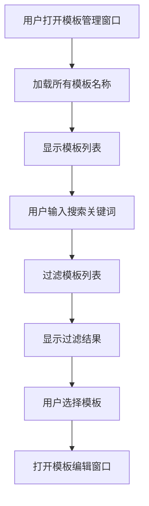
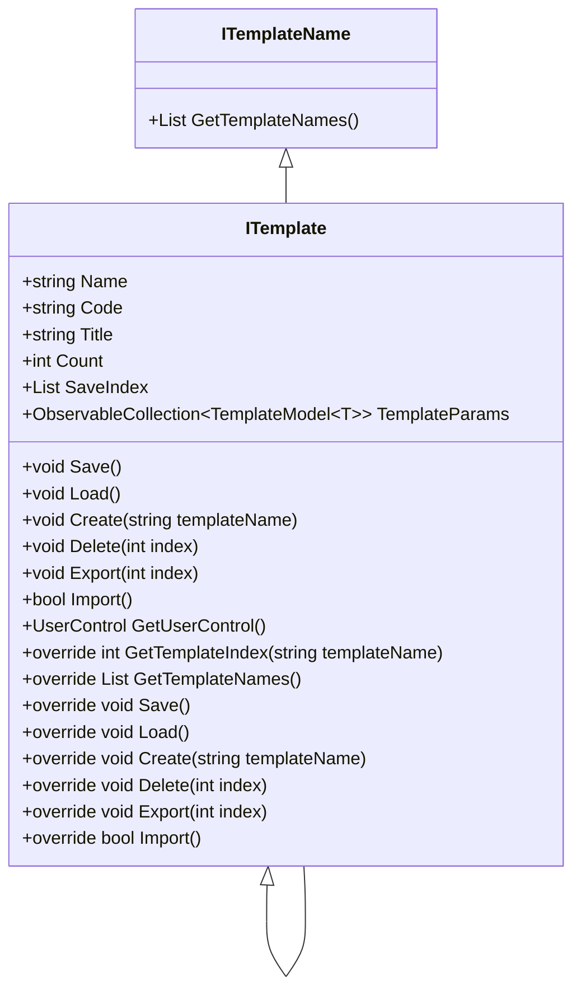

# 算法模板系统


# 算法模板系统

## 目录
1. [引言](#引言)
2. [项目结构](#项目结构)
3. [核心组件](#核心组件)
4. [架构概览](#架构概览)
5. [详细组件分析](#详细组件分析)
    - 5.1 [模板管理窗口（TemplateManagerWindow.xaml.cs）](#模板管理窗口)
    - 5.2 [模板接口与实现（ITemplate.cs）](#模板接口与实现)
6. [依赖分析](#依赖分析)
7. [性能考量](#性能考量)
8. [故障排查指南](#故障排查指南)
9. [总结](#总结)

---

## 引言

算法模板系统是一个用于封装和管理算法逻辑及其参数的框架。它通过模板的形式，将复杂的算法配置和执行逻辑抽象和复用，方便用户创建、修改和应用不同的算法模板以完成特定的分析任务。该系统旨在提升算法应用的灵活性和效率，同时降低用户的使用门槛。

---

## 项目结构

该项目采用模块化设计，代码组织清晰，主要按照功能和技术层次划分目录。重点目录包括：

- `/Engine/ColorVision.Engine/Templates/`：核心算法模板相关代码，包括模板定义、管理、编辑、导入导出等功能。
- `/Engine/ColorVision.Engine/Services/`：服务层，负责设备管理、算法执行等。
- `/UI/`：用户界面相关代码，包含主题、控件、视图等。
- `/Projects/`：具体项目实现，封装特定业务逻辑。
- `/Engine/ColorVision.Engine/MySql/`：数据库访问层，封装对MySQL的操作。
- `/Engine/ColorVision.Engine/`：引擎核心代码，包含主窗口、命令、消息等。
- `/Engine/ColorVision.Common/`：公共库，包含通用接口、工具类等。

这种结构体现了分层架构思想，将界面、业务逻辑、数据访问分离，方便维护和扩展。

---

## 核心组件

本系统的核心组件围绕“模板”展开，主要包括：

1. **模板接口（ITemplate）**  
   定义了模板的基本属性和操作，如模板名称、参数集合、创建、保存、加载、导入导出等。  
   泛型模板`ITemplate<T>`进一步支持特定参数模型的封装和管理。

2. **模板管理窗口（TemplateManagerWindow）**  
   提供用户界面，允许用户浏览、搜索、编辑和管理所有模板实例。支持模板的双击打开、搜索过滤和模板编辑窗口的调用。

3. **模板参数模型（ParamModBase及其派生类）**  
   封装具体算法的参数，支持从数据库加载和保存。

4. **数据库访问（MySQL相关Dao）**  
   负责模板数据的持久化，支持模板的增删改查。

5. **模板编辑与创建界面**  
   允许用户通过图形界面创建和修改模板，增强用户体验。

---

## 架构概览

系统采用典型的MVVM架构模式：

- **Model**：模板参数模型（ParamModBase及派生）、数据库实体模型（ModMasterModel、ModDetailModel等）。
- **View**：TemplateManagerWindow.xaml及相关编辑窗口。
- **ViewModel**：模板管理视图逻辑，处理模板集合的加载、搜索和操作。

此外，系统通过接口（如`ITemplateName`、`IMysqlCommand`）实现模块解耦，支持灵活替换和扩展。

模块间通过事件和命令进行交互，界面层调用模板接口操作数据，数据变化通过绑定自动更新界面。

---

## 详细组件分析

### 模板管理窗口

文件路径：  
[Engine/ColorVision.Engine/Templates/TemplateManagerWindow.xaml.cs](https://github.com/xincheng213618/scgd_general_wpf/blob/master/Engine/ColorVision.Engine/Templates/TemplateManagerWindow.xaml.cs)

#### 作用概述

模板管理窗口是模板系统的用户入口，提供模板列表展示、搜索过滤和模板编辑入口。用户可以通过该窗口方便地管理已有模板。

#### 主要类与方法

1. **MenuTemplateManagerWindow**  
   - 继承自`MenuItemBase`，代表菜单项“模板管理”。  
   - `Execute()`方法打开`TemplateManagerWindow`窗口。

2. **TemplateManagerWindow**  
   - WPF窗口类，负责模板列表展示和搜索交互。  
   - `Window_Initialized`：窗口初始化时加载所有模板名称。  
   - `Searchbox_TextChanged`：搜索框文本变化时过滤模板。  
   - `ListView2_SelectionChanged`：选择模板时打开对应的编辑窗口。

#### 代码片段说明

```csharp
keyValuePairs = TemplateControl.ITemplateNames.ToList();
ListView2.ItemsSource = keyValuePairs;
```
- 从模板控制中心获取所有模板名称及实例，绑定到模板列表视图。

```csharp
var keywords = searchtext.Split(Chars, StringSplitOptions.RemoveEmptyEntries);
filteredResults = Searches
    .OfType<ISearch>()
    .Where(template => keywords.All(keyword =>
        template.Header.Contains(keyword, StringComparison.OrdinalIgnoreCase) ||
        template.GuidId.ToString().Contains(keyword, StringComparison.OrdinalIgnoreCase)
    ))
    .ToList();
```
- 实现多关键词搜索，支持模板名或ID匹配。

#### 交互流程图示



---

### 模板接口与实现

文件路径：  
[Engine/ColorVision.Engine/Templates/ITemplate.cs](https://github.com/xincheng213618/scgd_general_wpf/blob/master/Engine/ColorVision.Engine/Templates/ITemplate.cs)

#### 作用概述

`ITemplate`接口及其泛型实现定义了算法模板的核心数据结构和操作方法。它封装了模板的参数、持久化、导入导出、创建和删除等功能，是模板系统的基石。

#### 关键类与接口

1. **ITemplateName**  
   - 定义获取模板名称列表的方法。

2. **ITemplate**  
   - 基类，实现`ITemplateName`接口。  
   - 定义模板基本属性（如`Name`、`Code`、`Title`等）和操作（如`Save`、`Load`、`Create`、`Delete`、`Export`、`Import`等）。  
   - 提供用户控件界面支持。

3. **ITemplate<T>**  
   - 泛型模板类，参数类型为`ParamModBase`派生类。  
   - 使用`ObservableCollection<TemplateModel<T>>`管理模板参数集合。  
   - 实现模板的增删改查、数据库交互、导入导出等具体逻辑。

#### 主要功能详解

- **模板参数管理**  
  通过`TemplateParams`集合管理所有模板实例，每个实例封装一个参数模型`T`。

- **数据库操作**  
  通过`ModMasterDao`和`ModDetailDao`访问数据库，实现模板的持久化存储和加载。

- **模板创建**  
  支持基于数据库字典模板创建新模板，自动初始化参数细节。

- **导入导出**  
  支持单个模板的JSON导出和导入，批量导出为ZIP文件，方便模板迁移和备份。

- **复制模板**  
  通过序列化和反序列化实现模板复制，方便快速创建相似模板。

#### 代码示例

```csharp
public override void Save()
{
    if (SaveIndex.Count == 0) return;

    foreach (var index in SaveIndex)
    {
        if(index >-1 && index < TemplateParams.Count)
        {
            var item = TemplateParams[index];
            var modMasterModel = ModMasterDao.Instance.GetById(item.Value.Id);
            if (modMasterModel?.Pcode != null)
            {
                modMasterModel.Name = item.Value.Name;
                var modMasterDao = new ModMasterDao(modMasterModel.Pcode);
                modMasterDao.Save(modMasterModel);
            }
            var details = new List<ModDetailModel>();
            item.Value.GetDetail(details);
            ModDetailDao.Instance.UpdateByPid(item.Value.Id, details);
        }
    }
}
```
- 保存选中模板到数据库，更新主表和详细参数表。

#### 类关系图



#### 复杂逻辑说明

模板的创建和加载依赖数据库中的字典模板定义（`SysDictionaryModModel`等），实现模板参数的动态生成和初始化。导入导出功能利用JSON序列化实现模板数据的文件化存储，便于模板的共享和备份。

---

## 依赖分析

- **数据库依赖**  
  模板系统强依赖MySQL数据库，通过DAO层操作模板数据，保证数据一致性和持久化。

- **UI依赖**  
  模板管理依赖WPF界面，支持用户交互和模板编辑。

- **服务层依赖**  
  依赖服务层提供的配置和用户信息（如租户ID）支持多用户环境。

- **第三方库**  
  使用`Newtonsoft.Json`进行JSON序列化，`NPOI`等库支持其他功能。

---

## 性能考量

- 模板参数集合采用`ObservableCollection`，支持界面自动刷新，适合动态数据展示。
- 搜索功能采用关键词拆分和LINQ过滤，适合中小规模模板集合，若模板数量巨大，建议优化搜索算法或采用索引加速。
- 导出批量模板时采用临时目录和ZIP归档，保证文件完整性和操作简洁。

---

## 故障排查指南

- **模板导入失败**  
  可能由于JSON格式错误或文件损坏，检查导入文件格式，查看异常提示。

- **数据库操作异常**  
  检查数据库连接状态，确认MySQL服务运行正常，且用户权限正确。

- **界面无响应或搜索异常**  
  检查模板集合是否异常，确认模板数据加载成功。

---

## 总结

算法模板系统通过定义统一的模板接口和泛型实现，封装了算法参数的管理与持久化，配合模板管理窗口实现了用户友好的操作界面。系统架构清晰，模块职责明确，支持模板的创建、编辑、导入导出和复制，极大提升了算法应用的灵活性和效率。数据库的深度集成保证了模板数据的可靠性和一致性。整体设计兼顾了功能性和可扩展性，适合多种分析任务的算法模板管理需求。

