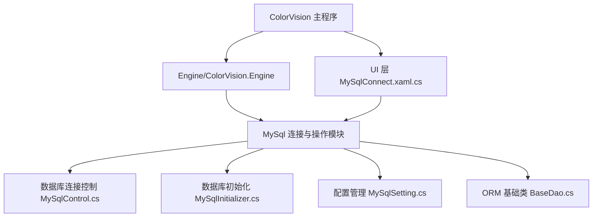
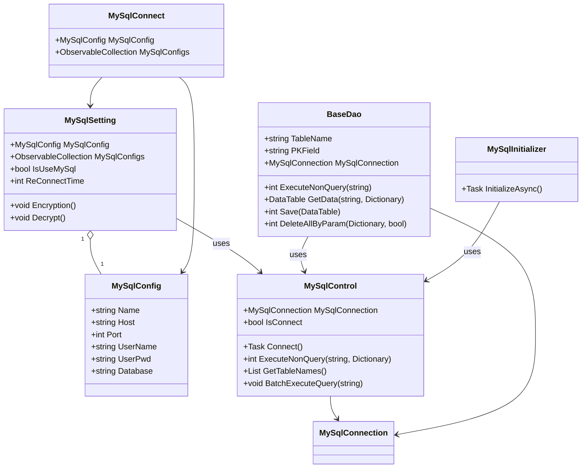

# 数据库集成 (MySQL)


# 数据库集成 (MySQL)

## 目录
1. [介绍](#介绍)
2. [项目结构](#项目结构)
3. [核心组件](#核心组件)
4. [架构概述](#架构概述)
5. [详细组件分析](#详细组件分析)
6. [依赖分析](#依赖分析)
7. [性能考虑](#性能考虑)
8. [故障排查指南](#故障排查指南)
9. [总结](#总结)

## 介绍
本篇文档详细介绍 ColorVision 软件如何集成并使用 MySQL 数据库进行数据存储。内容涵盖数据库连接管理、配置数据存储、结果数据管理、模板数据操作等核心功能实现。文档面向不同技术背景的用户，力求用通俗易懂的语言讲解代码结构、设计理念及关键实现细节，帮助理解 ColorVision 与 MySQL 数据库的集成方式。

## 项目结构
ColorVision 项目结构庞大，涵盖多个子模块。与 MySQL 数据库集成相关的核心代码集中在路径：
`/Engine/ColorVision.Engine/MySql/` 下，主要包含数据库连接控制、ORM（对象关系映射）基础类、配置管理、初始化等功能模块。

主要目录及说明：
1. `/Engine/ColorVision.Engine/MySql/`  
   - 负责 MySQL 数据库的连接管理、初始化、配置和ORM操作。  
   - 包含数据库连接控制类 `MySqlControl.cs`，初始化器 `MySqlInitializer.cs`，配置类 `MySqlConfig.cs`，配置管理 `MySqlSetting.cs`，以及基础DAO类 `BaseDao.cs`。

2. `/Engine/ColorVision.Engine/`  
   - 包含引擎核心逻辑和业务实现，MySql模块作为引擎的重要部分，提供数据库支持。

3. `/ColorVision/`  
   - 应用程序入口及界面层，包含数据库连接窗口 `MySqlConnect.xaml.cs`，用于用户配置数据库连接。

整体架构采用分层设计，界面层负责用户交互，业务逻辑层负责数据库操作和数据处理，ORM层封装数据库访问细节，保证了代码的清晰和可维护性。



## 核心组件

### 1. MySqlControl.cs
- 单例类，管理 MySQL 数据库连接的生命周期。
- 提供连接、断线重连、执行SQL命令、获取表名等功能。
- 使用定时器周期性检测连接状态，支持批量SQL执行。
- 通过事件通知连接状态变化，方便界面层响应。
- 支持连接字符串配置，提供连接测试功能。

### 2. BaseDao.cs
- ORM层基础类，封装数据库增删改查操作。
- 绑定表名和主键字段，支持参数化SQL执行，防止SQL注入。
- 支持DataTable数据保存，结合 MySqlDataAdapter 实现数据同步。
- 提供逻辑删除和物理删除两种删除方式。
- 通过日志记录异常，保证稳定性。

### 3. MySqlInitializer.cs
- 初始化器，程序启动时检测 MySQL 连接。
- 如果连接失败且数据库为本地，尝试启动 MySQL 服务。
- 启动失败弹出连接配置窗口，提示用户手动配置。

### 4. MySqlConfig.cs
- 数据库连接配置类，包含连接名称、主机、端口、用户名、密码和数据库名。
- 属性变更通知机制，支持界面绑定动态更新。

### 5. MySqlSetting.cs
- 配置管理类，单例模式管理 MySQL 配置和连接状态。
- 支持连接开启关闭标识，重连时间配置。
- 支持密码加密解密，保障安全性。
- 提供配置项和状态栏图标集成，方便用户操作。

### 6. MySqlConnect.xaml.cs
- 数据库连接配置窗口实现。
- 支持新增、复制、删除连接配置。
- 支持密码输入隐藏和连接测试。
- 界面响应用户操作，更新配置集合。

## 架构概述
ColorVision 的 MySQL 集成采用模块化设计，主要分为以下几个层次：

- **配置层**：`MySqlConfig` 和 `MySqlSetting` 管理连接参数和使用状态，支持加密保障安全。
- **连接层**：`MySqlControl` 负责数据库连接的建立、维护和断线重连。
- **数据访问层**：`BaseDao` 封装数据库操作，屏蔽底层细节，支持参数化查询和数据保存。
- **初始化层**：`MySqlInitializer` 负责程序启动时数据库连接检测和服务启动。
- **UI层**：`MySqlConnect` 提供连接配置界面，支持用户交互。

这种分层设计清晰分离关注点，保证系统灵活、易维护，同时通过事件和配置机制实现动态响应和安全管理。



## 详细组件分析

### MySqlControl.cs
负责管理数据库连接，采用单例模式确保全局唯一连接实例。通过 `Connect()` 方法建立连接，连接成功后触发事件通知。内置定时器自动断线重连，提升系统稳定性。支持执行单条及批量SQL语句，支持查询数据库中所有表名，方便动态操作数据库。

示例代码片段：

```csharp
public Task<bool> Connect()
{
    string connStr = GetConnectionString(Config);
    try
    {
        IsConnect = false;
        MySqlConnection = new MySqlConnection() { ConnectionString = connStr  };
        MySqlConnection.Open();
        Application.Current.Dispatcher.Invoke(() => MySqlConnectChanged?.Invoke(MySqlConnection, new EventArgs()));
        IsConnect = true;
        log.Info($"数据库连接成功:{connStr}");
        return Task.FromResult(true);
    }
    catch (Exception ex)
    {
        IsConnect = false;
        log.Error(ex);
        return Task.FromResult(false);
    }
}
```

### BaseDao.cs
提供数据库操作的基础方法，包括执行非查询SQL，带参数的执行，获取数据表，保存DataTable数据，逻辑删除和物理删除。使用 MySqlDataAdapter 和 MySqlCommandBuilder 实现数据同步。异常时记录日志，保证系统稳定。

关键方法：

- `ExecuteNonQuery(string sql, Dictionary<string, object> param)`：执行带参数的SQL命令。
- `GetData(string sql, Dictionary<string, object> param)`：查询数据返回DataTable。
- `Save(DataTable dt)`：将DataTable数据保存到数据库。
- `DeleteAllByParam(Dictionary<string, object> param, bool IsLogicDel)`：根据条件删除数据，支持逻辑删除。

### MySqlInitializer.cs
程序启动时调用，检测是否启用 MySQL，如果启用则尝试连接数据库。若连接失败且数据库为本地，尝试启动本地MySQL服务，提升用户体验。若启动失败则弹出连接配置窗口，方便用户手动配置。

### MySqlConfig.cs
定义数据库连接所需的配置属性，支持属性变更通知，方便界面绑定和动态更新。

### MySqlSetting.cs
管理 MySQL 配置和连接状态，支持多配置管理和密码加密解密。通过事件机制通知配置变更，支持状态栏图标集成，方便用户快速访问数据库连接配置。

### MySqlConnect.xaml.cs
用户界面层，提供连接配置窗口，支持新增、复制、删除连接配置，密码输入和连接测试。界面响应用户操作，动态更新配置集合。

## 依赖分析
- `MySqlControl` 是核心连接管理组件，其他组件均依赖它进行数据库操作。
- `BaseDao` 依赖 `MySqlControl` 进行数据库连接和命令执行。
- `MySqlInitializer` 依赖 `MySqlControl` 进行初始化连接检测。
- UI层 `MySqlConnect` 依赖 `MySqlSetting` 和 `MySqlConfig` 管理连接配置。
- `MySqlSetting` 依赖加密工具类实现密码加密解密。

组件之间耦合合理，职责清晰，避免了循环依赖。事件机制实现组件间松耦合通信。

## 性能考虑
- 连接采用单例模式，避免频繁创建连接对象，提升性能。
- 定时器自动重连机制保证连接稳定，减少异常断线带来的性能损耗。
- 批量执行SQL支持减少数据库交互次数，提升效率。
- 参数化SQL防止SQL注入，保障安全性。
- 使用 `MySqlDataAdapter` 和 `MySqlCommandBuilder` 实现高效数据同步。

## 故障排查指南
- 连接失败时，先检查 `MySqlSetting` 中配置是否正确，尤其是主机地址、端口、用户名和密码。
- 本地数据库连接失败时，检查 MySQL 服务是否启动，`MySqlInitializer` 会尝试自动启动服务。
- 使用连接测试按钮验证数据库连接。
- 查看日志文件，定位异常信息。
- 确认防火墙和网络配置允许数据库访问。

## 总结
ColorVision 通过模块化设计和合理的架构实现了对 MySQL 数据库的高效集成。系统支持配置管理、连接管理、ORM操作和用户交互，保障了数据存储的可靠性和安全性。文档详细解析了各个核心组件的职责和实现，帮助用户深入理解 ColorVision 的数据库集成方案。

