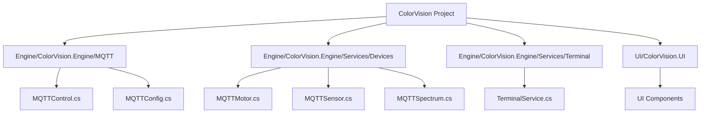
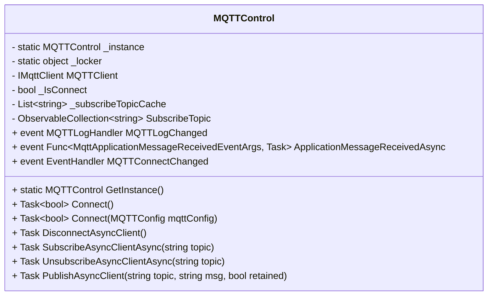

# MQTT 通信机制


# MQTT 通信机制

## Table of Contents
1. [Introduction](#introduction)
2. [Project Structure](#project-structure)
3. [Core Components](#core-components)
4. [Architecture Overview](#architecture-overview)
5. [Detailed Component Analysis](#detailed-component-analysis)
6. [Dependency Analysis](#dependency-analysis)
7. [Performance Considerations](#performance-considerations)
8. [Troubleshooting Guide](#troubleshooting-guide)
9. [Conclusion](#conclusion)
10. [Appendices](#appendices)

## Introduction
MQTT（Message Queuing Telemetry Transport）是一种轻量级的消息传输协议，广泛应用于物联网设备通信。ColorVision 系统中通过 MQTT 实现设备之间的通信、状态同步以及事件通知。本文档详细介绍了 MQTT 在 ColorVision 系统中的作用，包含主题（topic）设计、消息格式及与 MQTT Broker 的交互机制，旨在帮助用户理解系统的通信架构及实现细节。

## Project Structure
ColorVision 项目采用模块化设计，代码结构清晰，按功能和技术层次组织。MQTT 相关代码主要集中在以下目录：

1. **Engine/ColorVision.Engine/MQTT/**  
   - 包含 MQTT 协议的核心实现，如连接管理、消息发布订阅、配置管理等。  
   - 主要文件包括 `MQTTControl.cs`（MQTT 控制核心类）、`MQTTConfig.cs`（MQTT 配置类）等。

2. **Engine/ColorVision.Engine/Services/Devices/**  
   - 设备相关服务实现，其中包含基于 MQTT 的设备通信实现，如 `MQTTMotor.cs`、`MQTTSensor.cs`、`MQTTSpectrum.cs` 等，体现了 MQTT 在具体设备通信中的应用。

3. **Engine/ColorVision.Engine/Services/Terminal/**  
   - 终端服务相关，可能涉及 MQTT 终端管理。

4. 其他目录如 `/UI/ColorVision.UI/`、`/Engine/ColorVision.Engine/` 等，分别负责用户界面和业务逻辑实现。

整体架构采用 MVVM 设计模式，`ViewModelBase` 类作为基础视图模型，支持数据绑定和属性变更通知，方便 UI 与业务逻辑分离。



## Core Components

### 1. MQTTConfig 类
- 作用：封装 MQTT 连接配置，包括服务器地址、端口、用户名、密码等。  
- 继承自 `ViewModelBase`，支持属性变更通知，方便 UI 绑定。  
- 属性包括 `Name`（连接名称）、`Host`（IP 地址）、`Port`（端口）、`UserName`（账号）、`UserPwd`（密码）。  
- 提供重写的 `ToString()` 方法，方便调试输出配置信息。

### 2. MQTTControl 类
- 作用：MQTT 客户端核心控制类，负责连接管理、消息发布和订阅。  
- 采用单例模式确保全局唯一实例，线程安全。  
- 维护 MQTT 客户端实例 `IMqttClient`，并管理连接状态。  
- 提供异步连接方法 `Connect`，支持基于配置连接。  
- 处理连接、断开和消息接收事件，支持事件回调。  
- 实现消息发布 `PublishAsyncClient`，订阅和取消订阅功能。  
- 内部维护订阅主题缓存，自动重连后重新订阅。  
- 通过事件 `MQTTLogChanged` 传递日志信息，方便系统监控。

## Architecture Overview
ColorVision 系统中 MQTT 作为设备通信的消息总线，采用发布/订阅模式：

- **设备端**：通过 MQTTControl 连接到 MQTT Broker，订阅相关主题，发布设备状态和事件消息。  
- **服务端**：通过统一的 MQTTControl 管理客户端连接，监听主题消息，实现设备状态同步和事件通知。  
- **主题设计**：主题（topic）通常根据设备类型和功能划分，便于消息路由和管理。  
- **消息格式**：消息负载采用 UTF-8 编码的字符串，包含设备状态、命令参数等信息。

MQTTControl 作为核心组件，封装了连接管理、消息收发、订阅管理等功能，确保通信的可靠性和灵活性。它通过事件机制通知系统消息状态，支持日志记录和异步处理。

## Detailed Component Analysis

### MQTTConfig.cs
Source:
 - [https://github.com/xincheng213618/scgd_general_wpf/blob/master/Engine/ColorVision.Engine/MQTT/MQTTConfig.cs](Engine/ColorVision.Engine/MQTT/MQTTConfig.cs)

该类定义了 MQTT 连接的配置参数，所有属性均支持数据绑定更新。

```csharp
public class MQTTConfig : ViewModelBase
{
    public string Name { get => _Name; set { _Name = value; NotifyPropertyChanged(); } }
    private string _Name;

    public string Host { get => _Host; set { _Host = value; NotifyPropertyChanged(); } }
    private string _Host = "127.0.0.1";

    public int Port
    {
        get => _Port; set
        {
            _Port = value <= 0 ? 0 : value >= 65535 ? 65535 : value;
            NotifyPropertyChanged();
        }
    }
    private int _Port = 1883;

    public string UserName { get => _UserName; set { _UserName = value; NotifyPropertyChanged(); } }
    private string _UserName = string.Empty;

    public string UserPwd { get => _UserPwd; set { _UserPwd = value; NotifyPropertyChanged(); } }
    private string _UserPwd = string.Empty;

    public override string ToString()
    {
        return $"Host={Host};Port={Port};UserName={UserName};UserPwd={UserPwd}";
    }
}
```

- 端口范围限制在 0~65535，默认 1883（MQTT 默认端口）。  
- 方便 UI 绑定和配置管理。

### MQTTControl.cs
Source:
 - [https://github.com/xincheng213618/scgd_general_wpf/blob/master/Engine/ColorVision.Engine/MQTT/MQTTControl.cs](Engine/ColorVision.Engine/MQTT/MQTTControl.cs)

核心类，管理 MQTT 客户端连接、消息发布和订阅。

关键功能和方法：

1. **单例获取**  
   ```csharp
   public static MQTTControl GetInstance() { lock (_locker) { return _instance ??= new MQTTControl(); } }
   ```  
   保证全局唯一实例，线程安全。

2. **连接管理**  
   - `Connect()` 和 `Connect(MQTTConfig mqttConfig)` 异步连接 MQTT Broker，使用配置参数。  
   - 连接成功后触发 `MQTTClient_ConnectedAsync`，失败捕获异常日志。  
   - 断开连接时自动尝试重连，延迟 3 秒。

3. **消息处理**  
   - `MQTTClient_ApplicationMessageReceivedAsync` 处理接收到的消息，触发事件供其他模块处理。  
   - 支持异步消息处理回调。

4. **订阅管理**  
   - 维护订阅主题缓存 `_subscribeTopicCache`，支持连接后自动重新订阅。  
   - 提供异步订阅 `SubscribeAsyncClientAsync` 和取消订阅 `UnsubscribeAsyncClientAsync`。  
   - 订阅和取消订阅操作均有异常捕获和日志记录。

5. **消息发布**  
   - `PublishAsyncClient` 异步发布消息到指定主题，支持保留消息。  
   - 发布失败时通过日志和事件通知。

6. **日志事件**  
   - 通过 `MQTTLogChanged` 事件通知系统日志，方便前端显示和调试。

代码示例（连接与订阅）：

```csharp
public async Task<bool> Connect(MQTTConfig mqttConfig)
{
    log.Info($"Connecting to MQTT: {mqttConfig}");
    IsConnect = false;

    MQTTClient.ConnectedAsync -= MQTTClient_ConnectedAsync;
    MQTTClient.DisconnectedAsync -= MQTTClient_DisconnectedAsync;
    MQTTClient.ApplicationMessageReceivedAsync -= MQTTClient_ApplicationMessageReceivedAsync;
    await MQTTClient.DisconnectAsync();
    MQTTClient?.Dispose();
    MQTTClient = new MqttFactory().CreateMqttClient();

    var options = new MqttClientOptionsBuilder()
        .WithTcpServer(mqttConfig.Host, mqttConfig.Port)
        .WithCredentials(mqttConfig.UserName, mqttConfig.UserPwd)
        .WithClientId(Guid.NewGuid().ToString("N"))
        .Build();

    MQTTClient.ConnectedAsync += MQTTClient_ConnectedAsync;
    MQTTClient.DisconnectedAsync += MQTTClient_DisconnectedAsync;
    MQTTClient.ApplicationMessageReceivedAsync += MQTTClient_ApplicationMessageReceivedAsync;

    try
    {
        await MQTTClient.ConnectAsync(options);
        IsConnect = true;
        log.Info($"{DateTime.Now:HH:mm:ss.fff} MQTT connected");
        return true;
    }
    catch (Exception ex)
    {
        log.Error(ex);
        IsConnect = false;
        return false;
    }
}

private async Task MQTTClient_ConnectedAsync(MqttClientConnectedEventArgs arg)
{
    _subscribeTopicCache.AddRange(SubscribeTopic);
    SubscribeTopic.Clear();

    log.Info($"{DateTime.Now:HH:mm:ss.fff} MQTT connected");
    MQTTLogChanged?.Invoke(new MQTTLog(1, $"{DateTime.Now:HH:mm:ss.fff} MQTT connected"));
    IsConnect = true;
    await ResubscribeTopics();
}

public async Task SubscribeAsyncClientAsync(string topic)
{
    if (IsConnect && !SubscribeTopic.Contains(topic))
    {
        SubscribeTopic.Add(topic);
        try
        {
            var topicFilter = new MqttTopicFilterBuilder().WithTopic(topic).Build();
            await MQTTClient.SubscribeAsync(topicFilter);
            MQTTLogChanged?.Invoke(new MQTTLog(1, $"{DateTime.Now:HH:mm:ss.fff} Subscribed to {topic}"));
        }
        catch (Exception ex)
        {
            log.Warn(ex);
            MQTTLogChanged?.Invoke(new MQTTLog(-1, $"{DateTime.Now:HH:mm:ss.fff} Subscription to {topic} failed"));
        }
    }
}
```

Mermaid 类图展示 MQTTControl 主要结构：



## Dependency Analysis
- MQTTControl 依赖于 `MQTTnet` 库实现 MQTT 协议的客户端功能。  
- 依赖 `log4net` 进行日志记录，方便问题追踪。  
- 使用 `ColorVision.Common.MVVM.ViewModelBase` 实现属性通知，支持 UI 绑定。  
- 通过事件机制与系统其他模块解耦，便于扩展和维护。

## Performance Considerations
- MQTTControl 使用异步方法处理连接和消息，避免阻塞 UI 线程，提升系统响应速度。  
- 订阅主题采用缓存机制，自动重连后恢复订阅，保证消息不中断。  
- 日志记录详细，便于定位问题，但日志量大时需注意性能影响。

## Troubleshooting Guide
- 连接失败时，MQTTControl 会捕获异常并记录日志，用户可通过日志查看原因。  
- 断开连接后自动重连机制可能导致短暂的通信中断。  
- 订阅失败时会触发警告日志，需检查主题格式及权限。  
- 发布消息失败时，确保 MQTTClient 已连接。

## Conclusion
ColorVision 系统中的 MQTT 通信机制通过 `MQTTControl` 类实现，封装了 MQTT 客户端的连接、订阅、发布及事件处理。配置类 `MQTTConfig` 方便管理连接参数。该机制保障了设备间的高效通信和状态同步，支持系统的实时性和可靠性。理解这些组件及其工作原理，有助于用户和开发者更好地利用和扩展系统的 MQTT 功能。

## Appendices
无

