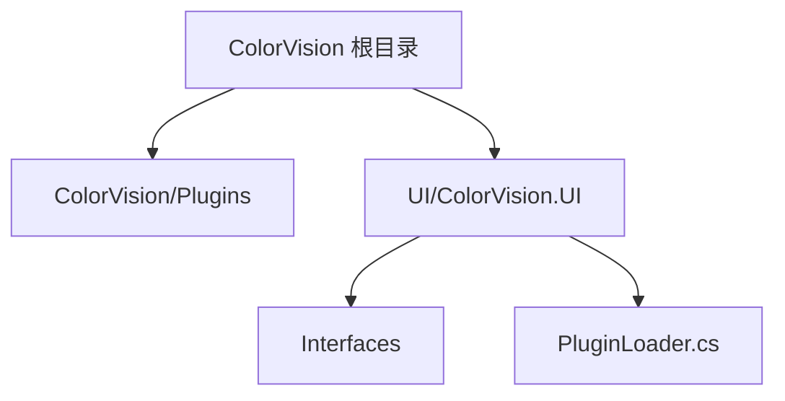
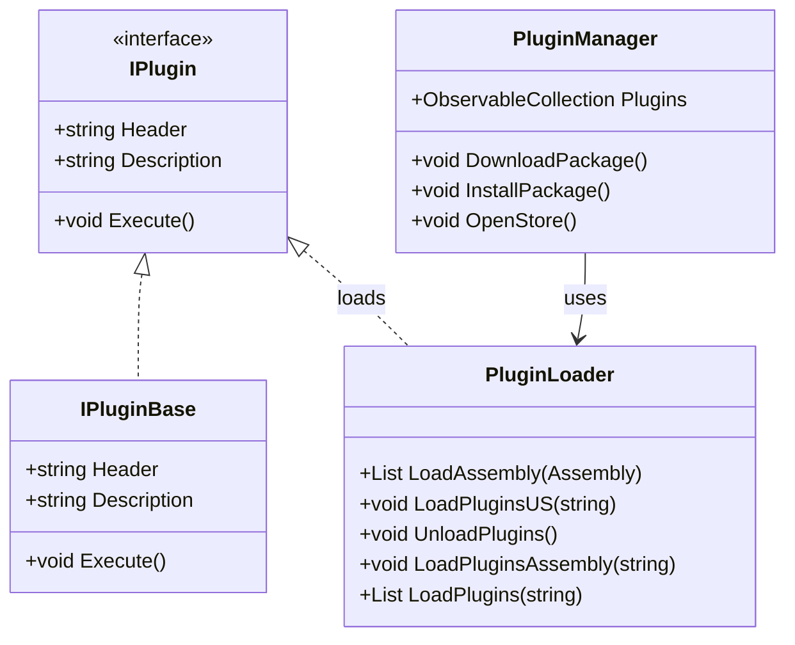

# 插件架构


# 插件架构

## 目录
1. [介绍](#介绍)
2. [项目结构](#项目结构)
3. [核心组件](#核心组件)
4. [架构概览](#架构概览)
5. [详细组件分析](#详细组件分析)
6. [依赖分析](#依赖分析)
7. [性能考量](#性能考量)
8. [故障排除指南](#故障排除指南)
9. [总结](#总结)

---

## 介绍

ColorVision 的插件系统设计用于实现功能的灵活扩展。通过插件机制，系统允许动态加载外部功能模块，增强主程序的能力，而无需修改核心代码。本文档详细解析了插件系统的架构设计、插件类型、生命周期管理、与主系统的交互方式以及关键插件接口，帮助用户和开发者深入理解插件机制。

---

## 项目结构

ColorVision 的插件系统相关代码主要分布在以下目录：



1. **ColorVision/Plugins/**  
   - 该目录包含插件管理核心代码，如插件管理器 `PluginManager.cs`。  
   - 负责插件的安装、更新、加载及管理。  
   - 包含插件配置类和相关命令实现。  

2. **UI/ColorVision.UI/**  
   - 包含插件加载相关代码，如 `PluginLoader.cs`，负责插件的动态加载和卸载。  
   - 还包含插件接口定义 `IPlugin.cs`，定义插件必须实现的接口规范。  

3. **UI/ColorVision.Common/Interfaces/**  
   - 存放各种接口定义文件，包括插件接口 `IPlugin.cs`。  
   - 规范插件与主程序的交互契约。  

整体架构分层清晰：  
- 插件接口定义层（定义插件必须实现的契约）  
- 插件加载层（负责动态加载、卸载插件）  
- 插件管理层（管理插件生命周期、更新、安装）  

这种分层设计提高了系统的模块化和可维护性。

---

## 核心组件

### 1. IPlugin 接口（`IPlugin.cs`）

定义插件的基本结构，包括插件的标题、描述和执行方法。

```csharp
public interface IPlugin
{
    string Header { get; }
    string Description { get; }
    void Execute();
}

public abstract class IPluginBase : IPlugin
{
    public virtual string Header { get; set; }
    public virtual string Description { get; set; }
    public virtual void Execute() { }
}
```

- **Header** 和 **Description** 用于描述插件信息。  
- **Execute()** 方法是插件的入口执行点，主系统调用此方法启动插件功能。  
- `IPluginBase` 提供了接口的默认实现，方便插件开发者继承扩展。

### 2. PluginLoader 类（`PluginLoader.cs`）

负责插件的动态加载和卸载，支持多种加载方式。

- **LoadAssembly<T>**  
  泛型方法，从给定程序集加载所有实现了接口 `T` 的插件实例。  

- **LoadPluginsUS(string path)**  
  利用自定义的 `PluginLoadContext` 加载指定路径下所有 DLL 文件的插件，并执行。支持卸载插件。  

- **UnloadPlugins()**  
  卸载当前加载的插件上下文，释放资源。  

- **LoadPluginsAssembly(string path)**  
  加载路径下的子目录中对应名称的 DLL 文件，尝试加载插件。  

- **LoadPlugins(string path)**  
  通过读取 DLL 文件字节流加载插件，执行插件并返回插件列表。  

核心代码示例：

```csharp
foreach (string file in Directory.GetFiles(path, "*.dll"))
{
    var assembly = loadContext.LoadFromAssemblyPath(Path.GetFullPath(file));
    foreach (var type in assembly.GetTypes().Where(t => typeof(IPlugin).IsAssignableFrom(t) && !t.IsAbstract))
    {
        if (Activator.CreateInstance(type) is IPlugin plugin)
        {
            plugin.Execute();
        }
    }
}
```

### 3. PluginManager 类（`PluginManager.cs`）

插件管理器，负责插件的发现、信息维护、安装、下载及更新。

- 维护插件集合 `ObservableCollection<PluginInfo>`，存储插件实例和元数据。  
- 支持插件自动更新配置，通过 `PluginWindowConfig` 实现。  
- 提供下载插件包、安装插件包、打开插件商店等命令。  
- 使用异步任务处理插件下载和更新，支持管理员权限执行更新批处理。  

更新批处理示例（用于插件更新时停止程序、替换文件、重启程序）：

```bat
@echo off
taskkill /f /im "ColorVision.exe"
timeout /t 0
xcopy /y /e "临时目录\*" "程序插件目录"
start "" "ColorVision.exe" -c MenuPluginManager
rd /s /q "临时目录"
del "%~f0" & exit
```

---

## 架构概览

ColorVision 插件系统基于接口和动态加载机制构建，核心架构如下：



- **IPlugin** 定义插件必须实现的接口，保证插件功能统一入口。  
- **PluginLoader** 负责插件的动态加载和卸载，底层调用反射机制。  
- **PluginManager** 负责插件的管理和生命周期控制，包括安装、更新、配置。  
- 插件通过实现 `IPlugin` 接口与主系统交互，主系统通过 `PluginLoader` 加载插件，`PluginManager` 管理插件状态。

---

## 详细组件分析

### 1. IPlugin 接口（`/UI/ColorVision.Common/Interfaces/IPlugin.cs`）

- **目的**：定义插件的基本接口，插件必须实现此接口以供系统识别和调用。  
- **关键成员**：  
  - `Header`：插件名称。  
  - `Description`：插件描述信息。  
  - `Execute()`：插件启动方法。  

代码示例：

```csharp
public interface IPlugin
{
    string Header { get; }
    string Description { get; }
    void Execute();
}
```

### 2. PluginLoader 类（`/UI/ColorVision.UI/PluginLoader.cs`）

- **目的**：动态加载插件 DLL，实例化插件对象，执行插件。支持卸载插件释放资源。  
- **主要方法**：  
  1. `LoadAssembly<T>(Assembly assembly)`：泛型加载指定程序集内所有实现接口 T 的插件实例。  
  2. `LoadPluginsUS(string path)`：使用自定义加载上下文加载路径下所有 DLL 插件并执行。  
  3. `UnloadPlugins()`：卸载插件上下文，释放内存。  
  4. `LoadPluginsAssembly(string path)`：加载路径下子目录对应 DLL。  
  5. `LoadPlugins(string path)`：通过读取 DLL 文件字节流加载插件。  

- **设计亮点**：  
  - 使用 `Assembly.GetTypes()` 结合接口类型过滤，确保只加载符合接口的插件。  
  - 通过 `Activator.CreateInstance` 动态实例化插件。  
  - 使用自定义的 `PluginLoadContext` 实现插件隔离和卸载。  
  - 详尽异常捕获，保证加载过程稳定。  

代码片段说明：

```csharp
foreach (string file in Directory.GetFiles(path, "*.dll"))
{
    var assembly = loadContext.LoadFromAssemblyPath(Path.GetFullPath(file));
    foreach (var type in assembly.GetTypes().Where(t => typeof(IPlugin).IsAssignableFrom(t) && !t.IsAbstract))
    {
        if (Activator.CreateInstance(type) is IPlugin plugin)
        {
            plugin.Execute();
        }
    }
}
```

### 3. PluginManager 类（`/ColorVision/Plugins/PluginManager.cs`）

- **目的**：整体管理插件，支持插件信息维护、自动更新、下载安装包、打开插件商店等功能。  
- **核心属性**：  
  - `ObservableCollection<PluginInfo> Plugins`：插件列表，包含插件实例及元信息。  
  - `PluginWindowConfig Config`：配置项，支持自动更新开关。  
- **主要功能**：  
  1. 初始化时扫描所有程序集，加载插件并记录信息。  
  2. 支持插件包的下载（异步）、安装（解压、替换文件、重启程序）。  
  3. 提供打开插件商店的命令。  
  4. 支持编辑插件配置。  

- **更新流程**：  
  - 下载 ZIP 包到本地临时目录。  
  - 解压 ZIP，生成批处理脚本，关闭程序并替换插件文件。  
  - 批处理脚本重启程序，清理临时文件。  

- **异常处理**：下载及安装过程中均有异常捕获，保证用户体验。  

示例代码片段：

```csharp
string batchContent = $@"
@echo off
taskkill /f /im \"{executableName}\"
timeout /t 0
xcopy /y /e \"{tempDirectory}\\*\" \"{programPluginsDirectory}\"
start \"\" \"{Path.Combine(AppDomain.CurrentDomain.BaseDirectory, executableName)}\"  -c MenuPluginManager
rd /s /q \"{tempDirectory}\"
del \"%~f0\" & exit
";
File.WriteAllText(batchFilePath, batchContent);
```

---

## 依赖分析

- 插件系统依赖于 `IPlugin` 接口作为契约，确保插件统一实现 `Execute()` 方法。  
- `PluginLoader` 依赖于反射机制和自定义加载上下文 `PluginLoadContext` 实现插件动态加载和隔离。  
- `PluginManager` 依赖于 `PluginLoader` 加载插件，管理插件生命周期。  
- 插件更新依赖于操作系统批处理脚本实现文件替换和程序重启。  
- 日志依赖 `log4net`，保证插件加载及管理过程的异常记录。  

整体依赖关系清晰，层次分明，符合松耦合设计原则。

---

## 性能考量

- 插件加载采用异步及流式读取方式，避免阻塞主线程。  
- 使用 `PluginLoadContext` 支持插件卸载，释放资源，避免内存泄漏。  
- 插件更新通过批处理脚本离线执行，减少程序运行时资源占用。  
- 插件扫描时通过接口过滤减少无效类型实例化，提升加载效率。  

---

## 故障排除指南

- **插件加载失败**  
  - 检查插件 DLL 是否正确放置，确保实现了 `IPlugin` 接口。  
  - 查看日志文件，定位异常信息。  
  - 确保插件依赖的其他 DLL 也被正确加载。  

- **插件更新失败**  
  - 确认程序是否以管理员权限运行，批处理脚本需要权限执行。  
  - 检查临时目录权限及磁盘空间。  
  - 确认网络连接正常，下载 URL 有效。  

- **插件卸载无效**  
  - 确认调用了 `UnloadPlugins()` 方法。  
  - 确保插件未被其他进程或线程占用。  

---

## 总结

ColorVision 的插件系统采用接口驱动和动态加载机制，实现了功能模块的灵活扩展。插件通过实现统一的 `IPlugin` 接口与主系统交互，`PluginLoader` 负责插件的动态加载和卸载，`PluginManager` 管理插件的安装、更新和配置。系统设计层次清晰，支持插件的热加载和自动更新，保障了系统的可扩展性和维护性。通过合理的异常处理和权限管理，保证了插件系统的稳定运行。

---

