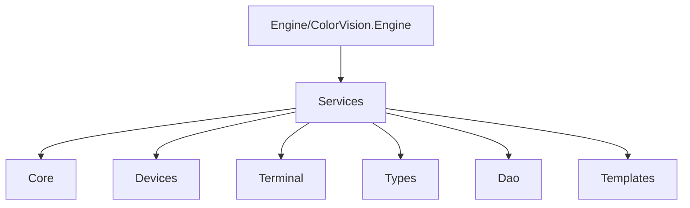
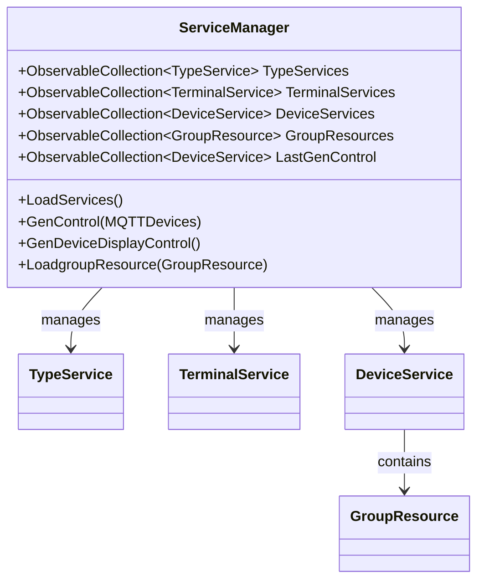
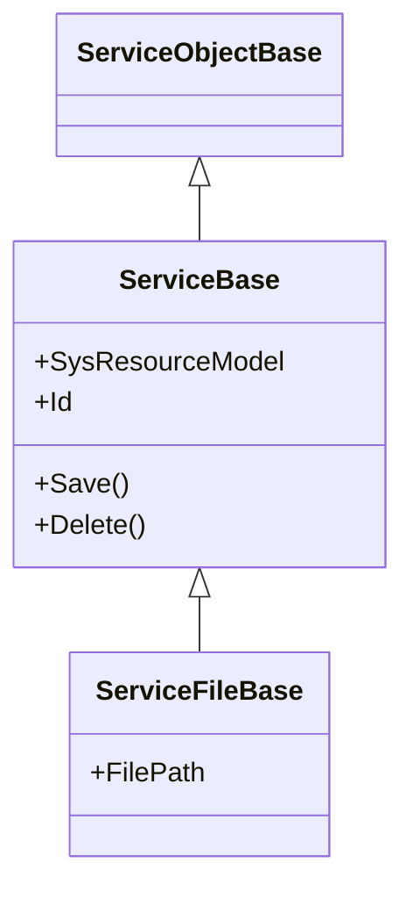

# 服务架构


# 服务架构

## 目录
1. [引言](#引言)
2. [项目结构](#项目结构)
3. [核心组件](#核心组件)
4. [架构概述](#架构概述)
5. [详细组件分析](#详细组件分析)
6. [依赖分析](#依赖分析)
7. [性能考虑](#性能考虑)
8. [故障排查指南](#故障排查指南)
9. [结论](#结论)

## 引言
本文档旨在详细解释 ColorVision 的服务化架构，重点介绍 ServiceManager 的角色，各类设备服务和系统服务的概念，以及它们在系统中的管理和交互方式。服务化架构使得 ColorVision 能够灵活管理多种设备和系统资源，支持扩展和模块化开发，提升系统的可维护性和可扩展性。

---

## 项目结构
ColorVision 项目结构较为清晰，采用按功能模块划分的目录组织方式，便于管理和扩展。核心服务相关代码主要集中在 `Engine/ColorVision.Engine/Services` 目录下。下面是主要目录及其功能说明：



1. **Services 目录**  
   - 负责系统的核心服务管理，包含服务管理器（ServiceManager）、设备服务、终端服务等。  
   - `Core` 子目录中定义了服务的基础类，如 `ServiceBase` 和 `ServiceFileBase`，提供服务的通用属性和方法。  
   - `Devices` 子目录细分为多种设备服务，如相机（Camera）、光谱仪（Spectrum）、传感器（Sensor）、电机（Motor）等，每种设备对应具体实现类。  
   - `Terminal` 目录管理终端服务相关内容。  
   - `Dao` 目录负责数据访问对象，负责从数据库中读取和保存服务相关数据。  
   - `Templates` 目录包含服务相关的模板和配置管理。

2. **Engine 目录**  
   - 包含 ColorVision 的核心引擎代码，处理图像处理、算法实现等底层功能。

3. **UI 目录**  
   - 包含用户界面相关代码，管理显示控件、界面交互等。

---

## 核心组件
### 1. ServiceManager
- 作为服务架构的核心管理类，负责加载、管理和维护所有服务实例。
- 维护三类主要服务集合：
  - `TypeServices`：服务类型集合，如算法服务、设备服务等。
  - `TerminalServices`：终端服务集合。
  - `DeviceServices`：设备服务集合，具体管理各类硬件设备。
- 提供加载服务（`LoadServices`）、生成显示控件（`GenDeviceDisplayControl`）等功能。
- 通过事件 `ServiceChanged` 通知服务状态变化。

### 2. ServiceBase 和 ServiceFileBase
- `ServiceBase` 是所有服务的基类，封装服务的基本信息和数据库模型。
- `ServiceFileBase` 继承自 `ServiceBase`，增加了对文件路径的管理，适用于文件资源类型的服务。

---

## 架构概述
ColorVision 采用服务化架构，将系统划分为多个服务单元，每个服务单元代表一种设备或系统功能。服务管理器（ServiceManager）作为统一入口，负责服务的创建、维护和管理。系统服务和设备服务按类型组织，支持分层管理和动态加载。

- **服务类型**：包括设备服务（如相机、光谱仪、传感器等）、系统服务（如终端服务、类型服务）和资源组服务。
- **服务管理**：通过数据库模型驱动服务实例的加载和配置，支持动态刷新和更新。
- **显示管理**：服务对应的显示控件由显示管理器（DisPlayManager）统一管理，实现界面动态更新。

---

## 详细组件分析

### 1. ServiceManager.cs
- **职责**：管理所有服务类型、终端服务和设备服务，加载数据库中的服务资源，生成对应的显示控件。
- **关键属性**：
  - `TypeServices`：服务类型集合。
  - `TerminalServices`：终端服务集合。
  - `DeviceServices`：设备服务集合。
  - `GroupResources`：设备服务下的资源组集合。
  - `LastGenControl`：最后生成的设备服务控件集合。
- **关键方法**：
  - `LoadServices()`：从数据库加载服务类型、终端服务和设备服务，构建服务树。
  - `GenControl()`：根据给定设备服务集合生成显示控件。
  - `GenDeviceDisplayControl()`：根据所有类型服务生成显示控件。
  - `LoadgroupResource()`：递归加载资源组及其子资源。
- **设计模式**：
  - 单例模式：通过静态方法 `GetInstance()` 保证全局唯一实例。
  - 观察者模式：通过事件 `ServiceChanged` 通知服务变更。
- **示例代码片段**：

```csharp
public void LoadServices()
{
    LastGenControl?.Clear();
    List<SysDictionaryModel> SysDictionaryModels = SysDictionaryDao.Instance.GetAllByPid(1);

    TypeServices.Clear();
    foreach (var sysDictionaryModel in SysDictionaryModels)
    {
        TypeService typeService = new();
        typeService.Name = sysDictionaryModel.Name ?? "未配置";
        typeService.SysDictionaryModel = sysDictionaryModel;
        TypeServices.Add(typeService);
    }

    TerminalServices.Clear();

    foreach (var typeService1 in TypeServices)
    {
        List<SysResourceModel> sysResourceModelServices = SysResourceDao.Instance.GetAllByParam(new Dictionary<string, object>() { { "type",(int)typeService1.ServiceTypes },{ "tenant_id", UserConfig.TenantId }, { "is_delete", 0} });
        foreach (var sysResourceModel in sysResourceModelServices)
        {
            TerminalService terminalService = new TerminalService(sysResourceModel);
            typeService1.AddChild(terminalService);
            TerminalServices.Add(terminalService);
        }
    }

    // 设备服务加载逻辑略...
    ServiceChanged?.Invoke(this, new EventArgs());
}
```

- **结构关系图**：



### 2. ServiceBase.cs
- **职责**：定义服务的基础属性和数据库映射，支持保存和删除操作。
- **主要类**：
  - `ServiceBase`：服务基类，封装数据库模型和名称属性。
  - `ServiceFileBase`：继承 `ServiceBase`，增加文件路径属性，用于文件类型服务。
- **示例代码片段**：

```csharp
public class ServiceBase : ServiceObjectBase
{
    public SysResourceModel SysResourceModel { get; set; }
    public int Id { get => SysResourceModel.Id; set { } }

    public ServiceBase(SysResourceModel sysResourceModel)
    {
        SysResourceModel = sysResourceModel;
        Name = sysResourceModel.Name ?? string.Empty;
    }

    public override void Save()
    {
        SysResourceModel.Name = Name;
        VSysResourceDao.Instance.Save(SysResourceModel);
    }

    public override void Delete()
    {
        base.Delete();  
        SysResourceDao.Instance.DeleteById(SysResourceModel.Id);
    }
}
```

- **继承关系图**：



---

## 依赖分析
- ServiceManager 依赖多个 DAO 层（如 `SysDictionaryDao`、`SysResourceDao`、`VSysDeviceDao`）来获取数据库资源，依赖设备服务具体实现类（如 `DeviceCamera`、`DeviceSpectrum` 等）进行设备实例化。
- 通过事件机制与 MySqlControl 交互，实现数据库连接状态变化时自动刷新服务。
- 依赖 UI 层的 `DisPlayManager` 进行显示控件管理，体现服务与界面分离设计。
- 依赖单例模式保证服务管理的唯一性，避免状态不一致。

---

## 性能考虑
- 服务加载通过数据库查询实现，考虑数据库索引和查询优化以提升加载速度。
- 显示控件生成采用集合操作和清理，避免重复加载和内存泄漏。
- 事件驱动机制保证服务状态变化及时响应，避免轮询浪费资源。

---

## 故障排查指南
- 数据库连接失败时，服务无法加载，检查 MySqlControl 连接状态和配置。
- 设备服务实例化失败，检查 `SysDeviceModel` 的类型配置是否正确。
- 显示控件未刷新，确认 `ServiceChanged` 事件是否被正确触发和监听。
- 资源组加载异常，检查递归加载逻辑避免循环引用。

---

## 结论
ColorVision 的服务化架构通过 ServiceManager 实现统一的服务管理和设备服务实例化，支持多种设备类型和资源组管理。架构设计合理，采用单例和事件驱动模式，结合数据库驱动的动态加载机制，实现了灵活且可扩展的服务管理体系。通过分层设计和显示控件管理，保证了系统的模块化和界面响应性，满足复杂工业视觉系统的需求。

