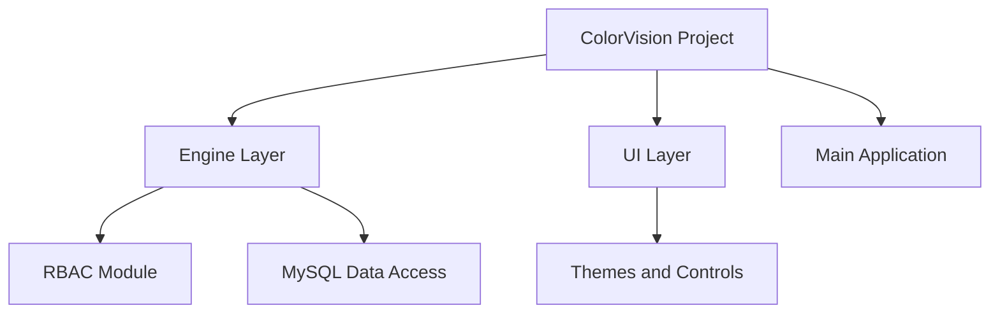
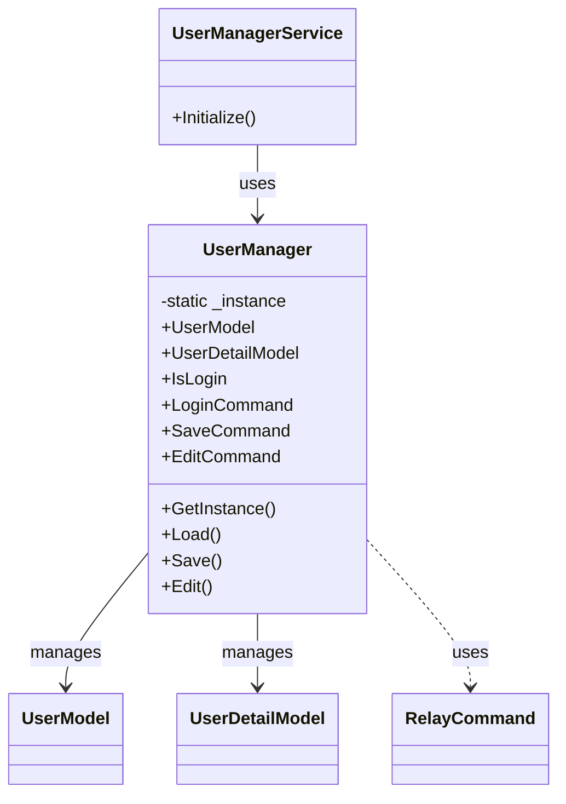

# 用户角色与权限 (RBAC)


# 用户角色与权限 (RBAC)

## Table of Contents
1. [Introduction](#introduction)
2. [Project Structure](#project-structure)
3. [Core Components](#core-components)
4. [Architecture Overview](#architecture-overview)
5. [Detailed Component Analysis](#detailed-component-analysis)
6. [Dependency Analysis](#dependency-analysis)
7. [Performance Considerations](#performance-considerations)
8. [Troubleshooting Guide](#troubleshooting-guide)
9. [Conclusion](#conclusion)

## Introduction

本文档介绍 ColorVision 软件中的用户管理和基于角色的访问控制 (RBAC) 系统。重点讲解如何创建用户、分配角色，以及不同角色的权限范围。通过详细分析代码结构和实现细节，帮助用户和开发者理解系统的设计理念及功能实现，确保用户管理的安全性和灵活性。

## Project Structure

ColorVision 项目结构庞大且模块划分清晰，主要按照功能和技术层次组织文件。针对用户管理和 RBAC 相关功能，主要位于 `/Engine/ColorVision.Engine/Rbac` 目录，该目录包含用户管理的核心代码。

整体项目结构大致如下：

1. `/Engine/ColorVision.Engine`  
   - 主要业务逻辑和引擎层代码。  
   - 包含 RBAC（用户管理）模块、消息模块、服务模块等。  
2. `/UI/ColorVision.Themes`  
   - UI 主题和控件样式。  
3. `/ColorVision`  
   - 主程序入口及核心 UI 界面。  
4. `/Engine/ColorVision.Engine/MySql`  
   - 数据库访问层，提供 MySQL 相关操作。  
5. `/Engine/ColorVision.Engine/Rbac`  
   - 用户管理和权限控制实现。  
   - 关键文件如 `UserManager.cs`、`UserDao.cs` 等。  

这种分层结构体现了典型的分层架构设计，业务逻辑与 UI 分离，数据访问独立，方便维护和扩展。



## Core Components

针对用户管理和 RBAC，核心组件包括：

- **UserManagerService**：应用启动时初始化用户管理。
- **UserManager**：单例模式实现的用户管理核心，负责用户登录、编辑、保存等操作。
- **UserModel / UserDetailModel**：用户的基本信息和详细信息数据模型。
- **UserDao / UserDetailDao**：数据库访问对象，操作用户相关表。
- **Authorization**：权限管理，控制不同角色的权限范围。

这些组件协同工作，实现用户的创建、登录验证、信息编辑及权限分配。

## Architecture Overview

RBAC 系统基于角色控制权限，设计理念如下：

- 用户信息分为基础信息（UserModel）和详细信息（UserDetailModel）。
- 用户管理采用单例模式，确保全局唯一实例。
- 数据存储使用 MySQL，表结构支持用户信息和详细信息关联。
- 通过权限模式（PermissionMode）控制用户权限，结合授权模块实现权限校验。
- UI 交互通过命令（RelayCommand）绑定，实现登录、编辑和保存功能。

系统启动时，`UserManagerService` 初始化并加载用户数据，默认创建 admin 用户。用户登录后，权限模式设置为当前用户权限，系统据此限制功能访问。

## Detailed Component Analysis

### 文件分析：`/Engine/ColorVision.Engine/Rbac/UserManager.cs`

#### 文件目的

该文件实现了用户管理的核心逻辑，包括用户的加载、登录状态维护、编辑和保存功能。它是 RBAC 系统的关键入口，负责用户信息的生命周期管理。

#### 关键类与方法

1. **UserManagerService**  
   - 作用：实现接口 `IMainWindowInitialized`，用于程序主窗口初始化时加载用户管理。  
   - 方法：  
     - `Initialize()`：调用 `UserManager.GetInstance().Load()` 加载用户数据。  

2. **UserManager**  
   - 作用：单例模式管理用户状态和操作。  
   - 主要属性：  
     - `UserModel`：当前用户基础信息。  
     - `UserDetailModel`：当前用户详细信息。  
     - `IsLogin`：登录状态。  
     - `Config`：用户配置（静态访问）。  
   - 主要命令（RelayCommand）：  
     - `LoginCommand`：弹出登录窗口。  
     - `SaveCommand`：保存用户信息。  
     - `EditCommand`：编辑用户信息。  
   - 主要方法：  
     - `Load()`：加载用户数据，检查登录，默认创建 admin 用户及其详细信息。  
     - `Save()`：保存用户详细信息，并设置权限模式。  
     - `Edit()`：弹出属性编辑窗口，编辑后自动保存。  

#### 代码示例

```csharp
public void Load()
{
    // 检查登录状态
    IsLogin = UserDao.Instance.Checklogin(UserConfig.Instance.Account, UserConfig.Instance.UserPwd);

    // 加载 admin 用户数据
    UserModel = UserDao.Instance.GetByParam(new Dictionary<string, object>() { { "name", "admin" } });
    if (UserModel == null)
    {
        // 默认创建 admin 用户
        UserModel = new UserModel() { UserName = "admin", UserPwd = "admin" };
        UserDao.Instance.Save(UserModel);
        UserDetailModel = new UserDetailModel { UserId = UserModel.Id };
        UserDetailDao.Instance.Save(UserDetailModel);
    }

    // 加载用户详细信息
    var detailModel = UserDetailDao.Instance.GetByParam(new Dictionary<string, object>() { { "user_id", UserModel.Id } });
    if (detailModel != null)
    {
        UserDetailModel = detailModel;
    }
    else
    {
        UserDetailModel = new UserDetailModel { UserId = UserModel.Id };
        UserDetailDao.Instance.Save(UserDetailModel);
    }
}
```

#### 设计模式

- **单例模式**：`UserManager` 使用静态实例和锁保证线程安全的单例访问。
- **命令模式**：通过 `RelayCommand` 实现 UI 事件与业务逻辑解耦。
- **MVVM 模式**：继承自 `ViewModelBase`，支持数据绑定和属性通知。

#### 关系图示



#### 错误处理与边界情况

- 在 `Load()` 方法中，若没有 admin 用户，自动创建，保证系统至少有一个管理员账户。
- 登录状态通过数据库校验，实现安全验证。
- 用户详细信息不存在时自动初始化，避免空引用。

#### 优化建议

- 登录状态的 `IsLogin` 设置中，属性赋值写死为 `true`，应根据实际登录结果赋值。
- 异步操作可进一步优化，避免 UI 阻塞。
- 增加异常捕获机制，提升健壮性。

## Dependency Analysis

- `UserManager` 依赖 `UserDao` 和 `UserDetailDao` 进行数据库操作。
- 依赖 `MySqlControl` 执行 SQL 语句，保证用户表结构存在。
- 依赖 `Authorization` 实现权限管理。
- 使用 `RelayCommand` 实现 UI 命令绑定。
- 依赖 `PropertyEditorWindow` 和 `LoginWindow` 提供用户交互界面。

这些依赖体现了清晰的职责分离，数据访问、业务逻辑和 UI 分层明确。

## Performance Considerations

- 用户数据加载操作较轻量，主要涉及数据库查询和简单逻辑。
- 使用单例模式避免重复实例创建，节省资源。
- SQL 表结构创建操作只执行一次，减少启动开销。
- 可考虑对频繁访问的用户数据进行缓存，提升响应速度。

## Troubleshooting Guide

- 若登录失败，检查数据库连接和用户表是否正确初始化。
- 用户信息编辑后未生效，确认是否调用了 `Save()` 方法。
- 权限控制异常，确认 `UserDetailModel.PermissionMode` 是否正确设置。
- 界面命令无响应，检查 `RelayCommand` 是否正确绑定。

## Conclusion

ColorVision 的用户管理和 RBAC 系统通过合理的架构设计，实现了用户的创建、登录、编辑和权限分配功能。系统采用单例和命令设计模式，结合数据库持久化，确保用户数据安全和操作便捷。文档详细解析了核心代码，帮助理解系统实现细节，为后续扩展和维护提供基础。

