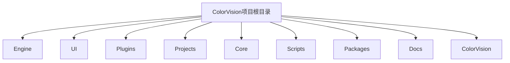
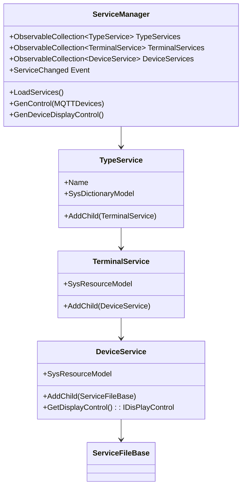
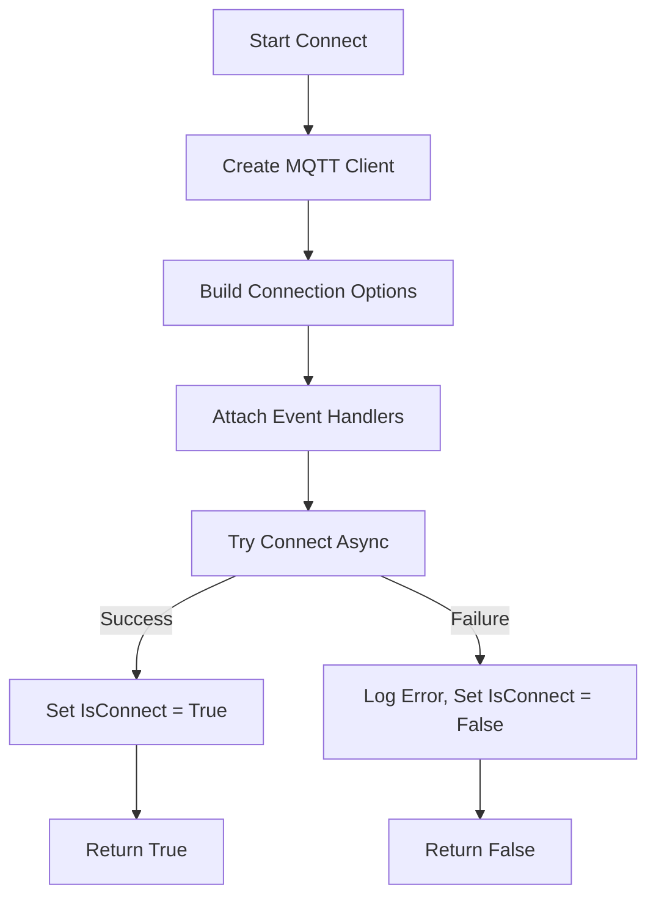

# 核心概念


# 核心概念

## 目录
1. [引言](#引言)
2. [项目结构](#项目结构)
3. [核心组件](#核心组件)
4. [架构概览](#架构概览)
5. [详细组件分析](#详细组件分析)
    - [ServiceManager.cs](#servicemanagercs)
    - [MQTTControl.cs](#mqttcontrolcs)
    - [TemplateManagerWindow.xaml.cs](#templatemanagerwindowxamlcs)
6. [依赖分析](#依赖分析)
7. [性能考虑](#性能考虑)
8. [故障排除指南](#故障排除指南)
9. [结论](#结论)

---

## 引言
ColorVision 系统是一套基于现代软件设计理念与关键技术构建的视觉检测与分析平台。本文档旨在阐述支撑 ColorVision 运行的关键技术和设计理念，帮助用户和开发者理解系统内部的工作原理，为更高级的使用和开发打下坚实基础。

---

## 项目结构

ColorVision 项目结构庞大且模块化，整体采用分层和功能分区的设计，主要目录与职责如下：



1. **Engine**  
   - 负责核心业务逻辑和算法实现，包含子模块如 ColorVision.Engine、ColorVision.Net、CVImageChannelLib 等。  
   - 主要实现图像处理、设备管理、算法模板、服务管理、MQTT通信等功能。  
   - 采用面向服务和模块化设计，方便扩展和维护。

2. **UI**  
   - 包含用户界面相关的主题、控件、视图和界面逻辑。  
   - 通过 MVVM 模式实现界面与业务逻辑分离，提升代码可维护性。  
   - 主题和控件库支持多语言和多样化界面风格。

3. **Plugins**  
   - 插件模块，支持系统功能的扩展，如事件查看器、屏幕录制、系统监控等。  
   - 采用插件架构设计，支持动态加载和管理。

4. **Projects**  
   - 各个具体项目实现目录，针对不同业务需求定制。  
   - 包含项目配置、窗口界面、设备通信等。

5. **Core**  
   - 核心底层库，如 OpenCV 相关的 CUDA 和 OpenGL 支持库。  
   - 提供底层图像处理和硬件加速支持。

6. **Scripts**  
   - 构建、配置和部署相关的脚本文件。  
   - 支持自动化构建和环境配置。

7. **Packages**  
   - 第三方依赖包和库，如 OpenCV、spdlog、nlohmann JSON 等。  
   - 统一管理外部依赖，确保版本一致性。

8. **Docs**  
   - 文档资源目录，包含使用说明、API 文档、许可协议等。

9. **ColorVision**  
   - 主程序入口和核心应用层，负责整体应用的启动、配置和插件管理。  
   - 包含主窗口、启动窗口、项目管理、设置管理、自动更新等功能。

整体项目采用模块化设计，清晰划分了业务逻辑、界面、插件和底层支持，方便协同开发和功能扩展。命名规范统一，目录结构层次分明，符合大型企业级软件开发标准。

---

## 核心组件

ColorVision 系统的核心组件主要包括：

1. **服务管理（ServiceManager）**  
   - 负责管理系统中的各种服务类型，包括设备服务、终端服务和类型服务。  
   - 动态加载和组织服务资源，管理设备的显示控件。  
   - 通过单例模式保证全局唯一实例。

2. **MQTT通信模块（MQTTControl）**  
   - 实现基于 MQTT 协议的通信功能，支持连接管理、消息订阅与发布。  
   - 支持自动重连、日志记录和消息异步处理。  
   - 采用事件驱动设计，方便扩展消息处理逻辑。

3. **模板管理窗口（TemplateManagerWindow）**  
   - 提供模板管理的用户界面，支持模板的搜索、编辑和加载。  
   - 结合 MVVM 模式，实现界面与数据逻辑分离。  
   - 支持多模板类型的统一管理。

这些组件构成了系统的业务核心，支撑了设备管理、通信交互和模板配置，是理解 ColorVision 系统的关键。

---

## 架构概览

ColorVision 采用分层架构，主要包括：

- **底层核心库层**：OpenCV、CUDA、OpenGL 支持，提供高性能图像处理能力。  
- **引擎层（Engine）**：实现业务逻辑、设备管理、算法模板、服务管理和通信。  
- **界面层（UI）**：基于 WPF 的用户界面，采用 MVVM 模式实现解耦。  
- **插件层（Plugins）**：支持功能扩展和动态加载。  
- **项目层（Projects）**：针对不同应用场景的定制项目。  

系统通过单例模式和事件驱动机制实现组件间解耦和灵活交互，支持多设备、多服务的协同工作。

---

## 详细组件分析

### ServiceManager.cs

#### 文件目的
ServiceManager 负责管理系统中的所有服务实例，包括类型服务、终端服务和设备服务。它从数据库加载服务配置，构建服务树，并管理设备显示控件的生成和恢复。

#### 关键类和方法

1. **ServiceManager**  
   - 单例实现，确保全局唯一管理实例。  
   - 属性包括：`TypeServices`（类型服务集合）、`TerminalServices`（终端服务集合）、`DeviceServices`（设备服务集合）、`GroupResources`（分组资源集合）等。  
   - 事件 `ServiceChanged` 用于通知服务状态变化。

2. **LoadServices()**  
   - 从数据库加载所有服务类型、终端服务和设备服务。  
   - 根据服务类型实例化对应设备服务对象（如 DeviceCamera、DeviceSpectrum 等）。  
   - 构建服务之间的层级关系（类型服务 -> 终端服务 -> 设备服务 -> 资源）。  
   - 加载分组资源并递归加载子资源。

3. **GenControl() 和 GenDeviceDisplayControl()**  
   - 生成设备显示控件集合，供界面显示使用。  
   - 支持根据指定设备集合生成显示控件。

4. **LoadgroupResource(GroupResource groupResource)**  
   - 递归加载分组资源，构建资源树。

#### 代码片段示例

```csharp
public void LoadServices()
{
    LastGenControl?.Clear();
    List<SysDictionaryModel> SysDictionaryModels = SysDictionaryDao.Instance.GetAllByPid(1);

    TypeServices.Clear();
    foreach (var sysDictionaryModel in SysDictionaryModels)
    {
        TypeService typeService = new();
        typeService.Name = sysDictionaryModel.Name ?? "未配置";
        typeService.SysDictionaryModel = sysDictionaryModel;
        TypeServices.Add(typeService);
    }

    // 省略终端服务和设备服务加载代码...

    ServiceChanged?.Invoke(this, new EventArgs());
}
```

#### 设计与模式
- 采用单例模式保证唯一实例。  
- 使用观察者模式（事件）通知服务变更。  
- 通过工厂方法根据类型动态实例化设备服务。  
- 递归加载分组资源，构建树形结构。

#### Mermaid 类图示意



---

### MQTTControl.cs

#### 文件目的
MQTTControl 负责系统中 MQTT 协议的客户端通信，提供连接管理、消息订阅、消息发布及自动重连功能。

#### 关键类和方法

1. **MQTTControl**  
   - 单例实现，管理 MQTT 客户端实例。  
   - 属性 `IsConnect` 表示连接状态，支持事件通知连接变化。  
   - 事件 `MQTTLogChanged` 用于日志输出。  
   - 事件 `ApplicationMessageReceivedAsync` 支持异步消息处理。

2. **Connect() / Connect(MQTTConfig)**  
   - 异步连接 MQTT 服务器，配置服务器地址、端口和认证信息。  
   - 注册连接、断开和消息接收事件处理。

3. **SubscribeAsyncClientAsync(string topic)**  
   - 异步订阅指定主题，支持日志记录和异常处理。

4. **PublishAsyncClient(string topic, string msg, bool retained)**  
   - 异步发布消息到指定主题。

5. **自动重连机制**  
   - 断开后等待3秒自动尝试重连。

#### 代码片段示例

```csharp
public async Task<bool> Connect(MQTTConfig mqttConfig)
{
    log.Info($"Connecting to MQTT: {mqttConfig}");
    IsConnect = false;
    // 断开旧连接，重新创建客户端
    MQTTClient = new MqttFactory().CreateMqttClient();
    var options = new MqttClientOptionsBuilder()
        .WithTcpServer(mqttConfig.Host, mqttConfig.Port)
        .WithCredentials(mqttConfig.UserName, mqttConfig.UserPwd)
        .WithClientId(Guid.NewGuid().ToString("N"))
        .Build();
    MQTTClient.ConnectedAsync += MQTTClient_ConnectedAsync;
    MQTTClient.DisconnectedAsync += MQTTClient_DisconnectedAsync;
    MQTTClient.ApplicationMessageReceivedAsync += MQTTClient_ApplicationMessageReceivedAsync;
    try
    {
        await MQTTClient.ConnectAsync(options);
        IsConnect = true;
        return true;
    }
    catch (Exception ex)
    {
        log.Error(ex);
        IsConnect = false;
        return false;
    }
}
```

#### 设计与模式
- 单例模式保证唯一 MQTT 管理实例。  
- 事件驱动模型处理连接和消息事件。  
- 使用异步编程提升通信效率和响应性。  
- 缓存订阅主题，支持断线重连后恢复订阅。

#### Mermaid 流程图示意



---

### TemplateManagerWindow.xaml.cs

#### 文件目的
提供模板管理窗口的界面逻辑，实现模板的展示、搜索和编辑功能。

#### 关键类和方法

1. **MenuTemplateManagerWindow**  
   - 菜单项类，点击后打开模板管理窗口。

2. **TemplateManagerWindow**  
   - WPF 窗口类，初始化时加载所有模板名称。  
   - 支持搜索框输入动态过滤模板列表。  
   - 支持键盘操作（上下键选择，回车执行）。  
   - 双击列表项打开对应模板编辑窗口。

3. **搜索功能实现**  
   - 通过分割关键词匹配模板标题或 ID。  
   - 使用 ObservableCollection 支持界面绑定动态更新。

#### 代码片段示例

```csharp
private void Searchbox_TextChanged(object sender, TextChangedEventArgs e)
{
    if (sender is TextBox textBox)
    {
        string searchtext = textBox.Text;
        if (string.IsNullOrWhiteSpace(searchtext))
        {
            SearchPopup.IsOpen = false;
        }
        else
        {
            SearchPopup.IsOpen = true;
            var keywords = searchtext.Split(Chars, StringSplitOptions.RemoveEmptyEntries);

            filteredResults = Searches
                .OfType<ISearch>()
                .Where(template => keywords.All(keyword =>
                    template.Header.Contains(keyword, StringComparison.OrdinalIgnoreCase) ||
                    template.GuidId.ToString().Contains(keyword, StringComparison.OrdinalIgnoreCase)
                    ))
                .ToList();
            ListView1.ItemsSource = filteredResults;
            if (filteredResults.Count > 0)
            {
                ListView1.SelectedIndex = 0;
            }
        }
    }
}
```

#### 设计与模式
- 采用 MVVM 模式，界面与数据逻辑分离。  
- 使用事件驱动处理用户输入和界面交互。  
- 利用集合绑定实现动态界面刷新。

---

## 依赖分析

- **ServiceManager** 依赖数据库访问层（Dao）和设备服务具体实现，耦合业务逻辑与数据持久层。  
- **MQTTControl** 依赖 MQTTnet 库实现协议细节，使用日志组件（log4net）做日志管理。  
- **TemplateManagerWindow** 依赖 UI 层框架（WPF）和模板接口（ITemplate），实现界面与模板管理交互。  
- 组件间通过事件和接口解耦，支持模块化扩展。  
- 存在单例和工厂模式，保证实例唯一和动态创建。

---

## 性能考虑

- MQTTControl 采用异步通信，避免阻塞 UI 线程，提升响应速度。  
- ServiceManager 通过缓存和事件机制减少重复加载，优化资源管理。  
- UI 采用虚拟化和延迟加载技术，保证界面流畅。  
- 使用 ObservableCollection 动态更新界面，避免全量刷新。

---

## 故障排除指南

- **MQTT 连接失败**：检查配置参数、网络连接，查看日志输出的错误信息。  
- **服务加载异常**：确认数据库连接状态和数据完整性，重启服务尝试。  
- **模板搜索无结果**：确认关键词输入正确，模板数据是否已加载。  
- **设备显示控件未生成**：检查设备服务是否正确加载，调用 GenControl 或 GenDeviceDisplayControl 方法。

---

## 结论

ColorVision 系统通过模块化、分层设计实现了功能丰富且可扩展的视觉检测平台。服务管理模块动态加载和管理多种设备服务，MQTT模块实现稳定的消息通信，模板管理界面支持灵活的模板操作。整体架构清晰，设计模式合理，适合持续迭代和扩展。本文档详细解析了关键组件的结构与功能，为用户和开发者理解系统提供了有力支持。

---

