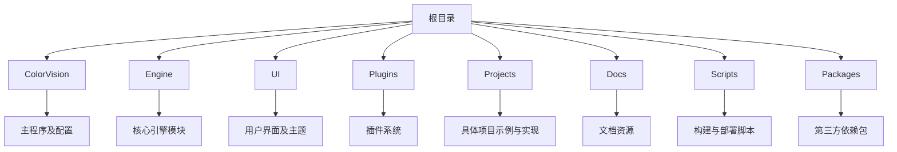

# 贡献指南

# 贡献指南

## 目录
1. [介绍](#介绍)
2. [项目结构](#项目结构)
3. [核心组件](#核心组件)
4. [架构概览](#架构概览)
5. [详细组件分析](#详细组件分析)
6. [依赖分析](#依赖分析)
7. [性能考虑](#性能考虑)
8. [故障排查指南](#故障排查指南)
9. [结论](#结论)
10. [附录](#附录)

## 介绍
ColorVision 项目是一个功能丰富的视觉处理软件平台，旨在为用户提供强大的图像处理与分析能力。本文档旨在为希望向 ColorVision 项目贡献代码的开发者提供全面的指导，涵盖编码规范、代码提交流程、Issue 跟踪和代码审查过程，帮助开发者顺利参与项目开发，提升代码质量和协作效率。

本文档适合不同技术水平的开发者，力求以通俗易懂的语言解释项目结构、关键组件、代码规范和贡献流程，确保贡献者能够快速理解并融入项目。

## 项目结构
ColorVision 项目采用模块化设计，代码库结构清晰，主要按功能和技术层次划分目录，便于维护和扩展。以下是主要目录及其职责的详细说明：

1. **ColorVision/**  
   - 包含主程序入口、配置文件和应用程序资源。  
   - 主要负责应用启动、窗口管理和基础功能实现。  

2. **Engine/**  
   - 核心算法与引擎代码所在，包含图像处理、设备接口、算法实现等。  
   - 细分为多个子模块，如 ColorVision.Engine、ColorVision.Net、cvColorVision 等，分别承担不同的功能。  
   - 负责底层数据处理和算法执行，是整个系统的计算核心。  

3. **UI/**  
   - 负责用户界面展示，包括主题、控件、视图和界面逻辑。  
   - 主题目录（ColorVision.Themes）提供多种界面风格，提升用户体验。  
   - 包含 MVVM 架构的视图模型和命令绑定，确保界面与业务逻辑分离。  

4. **Plugins/**  
   - 插件系统目录，支持扩展功能，如事件查看器、屏幕录制、系统监控等插件。  
   - 每个插件独立管理，便于功能模块化和按需加载。  

5. **Projects/**  
   - 存放不同具体项目的实现示例，如 ProjectKB、ProjectHeyuan、CV_Spectrometer 等。  
   - 这些项目展示了如何基于 ColorVision 平台进行定制开发。  

6. **Docs/**  
   - 文档资源目录，包含技术文档、API 说明、许可协议等。  
   - 为开发者和用户提供参考资料。  

7. **Scripts/**  
   - 构建、配置和部署相关的自动化脚本。  
   - 包括批处理、Python 脚本和 PowerShell 脚本，支持多种操作系统环境。  

8. **Packages/**  
   - 第三方依赖库和包管理目录，如 OpenCV、spdlog、nlohmann json 等。  
   - 确保项目依赖的稳定和版本控制。  

整体架构采用分层设计，UI 层负责用户交互，Engine 层负责业务逻辑和算法处理，Plugins 负责功能扩展，Projects 展示应用案例，Scripts 和 Packages 支持开发与运行环境。

## 核心组件
ColorVision 的核心组件涵盖了图像处理引擎、设备管理、插件框架和用户界面等，以下是关键组件的简要介绍：

- **ColorVision.Engine**：核心引擎模块，负责图像处理算法、数据管理和设备通信。  
- **ColorVision.UI**：界面层，负责呈现数据和用户交互，采用 MVVM 模式。  
- **Plugins**：插件管理，支持动态加载和管理多种扩展功能。  
- **Projects**：具体业务项目实现，展示不同场景下的应用。  
- **Scripts**：自动化脚本，支持构建、部署和维护。  
- **Packages**：第三方依赖，保障功能实现和性能优化。  

## 架构概览
ColorVision 项目采用模块化、分层架构，核心分为三大层：

1. **表示层（UI）**：负责用户界面和交互，采用 WPF 技术，支持主题切换和丰富控件。  
2. **业务逻辑层（Engine）**：实现核心算法、设备通信和数据处理，采用面向对象设计，支持多种算法模板和设备类型。  
3. **扩展层（Plugins 和 Projects）**：插件系统支持功能扩展，项目目录提供具体业务实现示例。  

模块间通过接口和事件进行解耦，提升系统灵活性和可维护性。

## 详细组件分析
（此部分将在后续文档中针对关键文件和模块进行详细代码结构、设计模式、类关系和功能实现的剖析。）

## 依赖分析
（此部分将分析模块间依赖关系、第三方库集成、接口契约和潜在耦合点。）

## 性能考虑
（此部分将探讨算法复杂度、资源管理和优化策略。）

## 故障排查指南
（此部分将提供常见问题解决方案和调试建议。）

## 结论
本文档为 ColorVision 项目贡献者提供了全面的项目结构和核心组件概览，帮助开发者快速了解项目架构和功能分布。后续将补充详细代码分析和贡献流程指导，助力高效协作和代码质量提升。

## 附录
- 贡献流程示意图  
- 代码规范摘要  
- 术语表  

