# 核心库使用 (C#/C++)


# 核心库使用 (C#/C++)

## 目录
1. [介绍](#介绍)
2. [项目结构](#项目结构)
3. [核心组件](#核心组件)
4. [架构概述](#架构概述)
5. [详细组件分析](#详细组件分析)
6. [依赖分析](#依赖分析)
7. [性能考虑](#性能考虑)
8. [故障排查指南](#故障排查指南)
9. [总结](#总结)
10. [附录](#附录)

## 介绍
本文档旨在介绍如何在 ColorVision 系统中使用其核心的 C++ 和 C# 库，重点涵盖 OpenCV 封装、CUDA 功能以及 C# 的图像通道库 CVImageChannelLib。文档将详细说明各核心库的架构与功能，并通过具体的 API 调用示例和注意事项，帮助用户理解和使用这些库。

---

## 项目结构

该项目结构庞大，涵盖多个模块和子系统，主要分为以下几个部分：

```mermaid
graph TD
  A[根目录] --> B[Engine]
  A --> C[UI]
  A --> D[Core]
  A --> E[Plugins]
  A --> F[Projects]
  A --> G[Packages]
  A --> H[Docs]
  A --> I[ColorVision]
  A --> J[Scripts]

  B --> B1[cvColorVision]
  B --> B2[ColorVision.Net]
  B --> B3[ColorVision.Engine]
  B --> B4[CVImageChannelLib]

  C --> C1[ColorVision.Themes]
  C --> C2[ColorVision.Scheduler]
  C --> C3[ColorVision.Common]
  C --> C4[ColorVision.ImageEditor]
  C --> C5[ColorVision.Core]
  C --> C6[ColorVision.UI]

  D --> D1[opencv_opengl]
  D --> D2[opencv_cuda]
  D --> D3[ColorVisionIcons64]
  D --> D4[opencv_helper]

  E --> E1[EventVWR]
  E --> E2[ScreenRecorder]
  E --> E3[WindowsServicePlugin]
  E --> E4[SystemMonitor]
  E --> E5[ColorVisonChat]

  F --> F1[ProjectKB]
  F --> F2[ProjectHeyuan]
  F --> F3[ProjectBase]
  F --> F4[CV_Spectrometer]
  F --> F5[ProjectARVR]
  F --> F6[ProjectBlackMura]
  F --> F7[ProjectShiyuan]

  G --> G1[OpenCV]
  G --> G2[spdlog]
  G --> G3[nlohmann]
  G --> G4[gl]
  G --> G5[zlib]
  G --> G6[CUDA]
```



### 1. Engine 目录
- 包含 ColorVision 的核心引擎代码和算法实现。
- 子目录：
  - `cvColorVision`：核心视觉算法及硬件通信。
  - `ColorVision.Net`：网络相关的辅助类库。
  - `ColorVision.Engine`：系统核心逻辑、服务和模板管理。
  - `CVImageChannelLib`：C#封装的图像通道库，处理图像流和视频编解码。

### 2. UI 目录
- 包含用户界面相关代码，采用 WPF 框架。
- 子目录：
  - `ColorVision.Themes`：主题和样式管理。
  - `ColorVision.Scheduler`：任务调度模块。
  - `ColorVision.Common`：通用工具和接口。
  - `ColorVision.ImageEditor`：图像编辑相关功能。
  - `ColorVision.Core`：核心 UI 逻辑。
  - `ColorVision.UI`：UI 主要实现与控件。

### 3. Core 目录
- 主要包含 OpenCV 和 CUDA 的底层封装代码。
- 包括 OpenGL、CUDA 相关的实现和资源文件。

### 4. Plugins 目录
- 各类插件实现，如事件查看器、屏幕录制、系统监控等。

### 5. Projects 目录
- 各个具体项目实现，针对不同的应用场景。

### 6. Packages 目录
- 第三方依赖库，如 OpenCV、CUDA、spdlog、nlohmann 等。

### 7. Docs 目录
- 文档、说明文件。

### 8. ColorVision 目录
- 主程序实现，包括启动窗口、主窗口、插件管理和更新模块。

### 9. Scripts 目录
- 构建和配置脚本。

总体来看，项目采用分层架构，核心引擎和算法集中在 Engine 目录，UI 逻辑在 UI 目录，底层依赖在 Core 和 Packages 中，插件和具体项目分离管理，方便维护和扩展。

---

## 核心组件

根据文档目标，重点关注以下核心库：

### 1. OpenCV 封装和 CUDA 功能
- 位于 `Core/opencv_helper`、`Core/opencv_cuda` 等目录。
- 提供图像处理、加速计算的底层支持。

### 2. CVImageChannelLib (图像通道库)
- 位于 `Engine/CVImageChannelLib`。
- 处理 H264 编码视频流的读取、解码和管理。
- 该库为 C# 实现，封装了视频数据的接收和解码逻辑。

---

## 架构概述

ColorVision 系统采用模块化设计，核心架构包括：

- **底层图像处理层**：基于 OpenCV 和 CUDA，提供图像采集、处理和加速功能。
- **图像通道层**：CVImageChannelLib 负责视频流的接收和解码，支持 H264 编码格式。
- **引擎层**：ColorVision.Engine 负责业务逻辑、算法处理、模板管理和设备服务。
- **UI 层**：WPF 实现，负责用户交互、显示和操作。
- **插件层**：支持多种插件扩展系统功能。
- **项目层**：面向具体应用的项目实现。

该架构确保了系统的灵活性和可扩展性，底层性能优化与上层业务逻辑分离。

---

## 详细组件分析

### CVImageChannelLib 示例分析

文件：`Engine/CVImageChannelLib/CVImageChannelLib/H264Reader.cs`

该文件实现了 H264Reader 类，作为 H264 视频流读取器，继承自 `CVImageReaderProxy`。

功能简述：
- 通过 `OpenH264Coder` 进行 H264 视频数据解码。
- 通过 `H264ReaderProxy` 订阅本地 IP 和端口的视频数据包。
- 接收到数据包后调用解码器解码，成功后触发事件（目前注释掉了事件触发代码）。
- 提供订阅接口和端口获取接口。
- 实现资源释放和清理。

关键代码片段：

```csharp
public class H264Reader : CVImageReaderProxy
{
    private OpenH264Coder Decoder;
    private H264ReaderProxy subscriber;

    public event H264ReaderRecvHandler H264ReaderRecv;

    public H264Reader(string localIp, int localPort)
    {
        Decoder = new OpenH264Coder();
        subscriber = new H264ReaderProxy(localIp, localPort);
        subscriber.H264PacketHandler += Subscriber_H264PacketHandler;
    }

    private void Subscriber_H264PacketHandler(H264Packet args)
    {
        Bitmap bitmap = Decoder.Decode(args.data, args.len);
        if (bitmap != null)
        {
            MessageBox.Show("解码成功");
            //this.H264ReaderRecv?.Invoke(bitmap.ToBitmapSource());
        }
    }

    public override WriteableBitmap Subscribe()
    {
        return null;
    }

    public int GetLocalPort()
    {
        return subscriber.GetLocalPort();
    }

    public override void Dispose()
    {
        subscriber.Dispose();
        Decoder.Dispose();
        GC.SuppressFinalize(this);
        base.Dispose();
    }
}
```

说明：
- 构造函数中初始化解码器和代理订阅器，绑定事件处理。
- `Subscriber_H264PacketHandler` 是核心解码回调，接收数据包并解码成 Bitmap。
- 事件 `H264ReaderRecv` 用于通知外部解码结果，当前被注释。
- `Subscribe` 方法为抽象实现，当前返回 null，可能由子类或调用者实现具体订阅逻辑。
- 资源释放确保解码器和订阅器正确清理。

---

## 依赖分析

- `H264Reader` 依赖 `OpenH264Coder` 实现解码功能。
- 依赖 `H264ReaderProxy` 实现数据包接收和事件触发。
- 继承自 `CVImageReaderProxy`，表明其为图像读取代理类，符合面向接口编程设计。
- 事件机制用于解耦解码处理与外部通知。

---

## 性能考虑

- 解码过程为 CPU 密集型操作，使用 `OpenH264Coder` 可能封装了硬件加速。
- 事件回调中解码成功后弹窗示例，实际应用中应避免阻塞UI线程。
- 资源释放遵循 IDisposable 模式，避免内存泄露。
- 订阅和数据接收采用事件驱动，适合实时视频流处理。

---

## 故障排查指南

- 确认本地 IP 和端口配置正确，确保能接收到视频数据包。
- 检查 `OpenH264Coder` 是否正确初始化，解码失败时返回 null。
- 事件 `H264ReaderRecv` 未触发时，确认是否注释或未正确绑定。
- UI 阻塞问题，避免在事件中弹窗或执行耗时操作。
- 调用 `Dispose` 释放资源，防止内存泄漏。

---

## 总结

本文档介绍了 ColorVision 中核心 C++ 和 C# 库的使用，重点分析了图像通道库 CVImageChannelLib 中的 H264Reader 类。通过对项目结构和关键文件的分析，明确了系统的分层架构和模块职责。提供了代码示例和设计说明，帮助用户理解如何调用和扩展核心库。

---

## 附录

### 参考文件
- [Engine/CVImageChannelLib/CVImageChannelLib/H264Reader.cs](https://github.com/xincheng213618/scgd_general_wpf/blob/master/Engine/CVImageChannelLib/CVImageChannelLib/H264Reader.cs)

