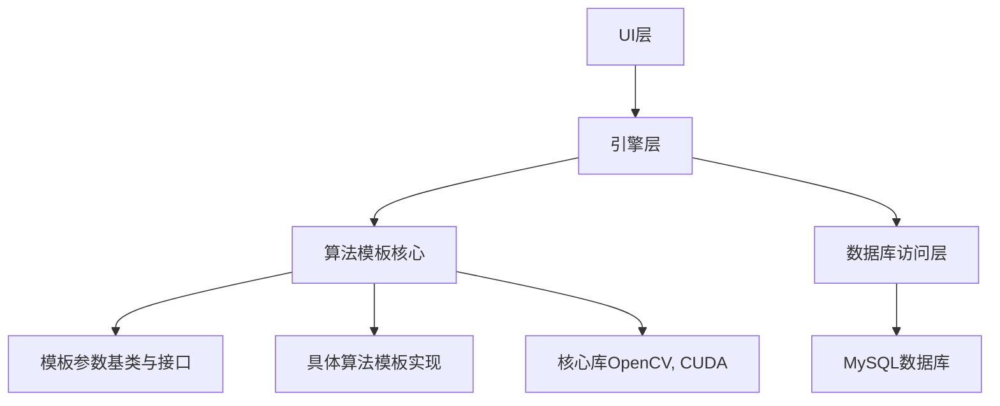
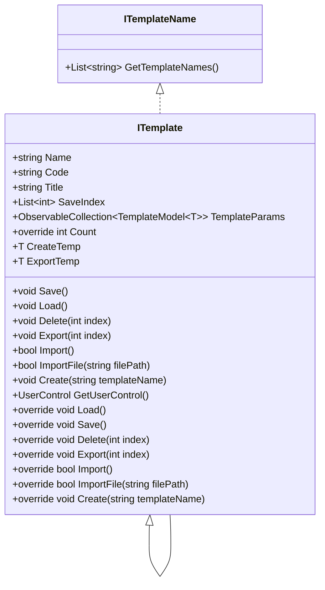

# 创建新算法模板


# 创建新算法模板

## 目录
1. [引言](#引言)
2. [项目结构](#项目结构)
3. [核心组件](#核心组件)
4. [架构概览](#架构概览)
5. [详细组件分析](#详细组件分析)
6. [依赖分析](#依赖分析)
7. [性能考虑](#性能考虑)
8. [故障排查指南](#故障排查指南)
9. [总结](#总结)
10. [附录](#附录)

## 引言
本项目致力于设计和实现新的算法模板体系，重点包括模板参数的定义、算法逻辑的实现（可调用核心库或其他服务）、结果的展示以及数据的存储。该文档将详细介绍项目的结构、核心组件、架构设计、关键代码分析及其实现细节，帮助用户理解如何在该系统中创建和管理算法模板。

---

## 项目结构

### 目录结构概览
项目采用模块化设计，代码按照功能和技术层次进行划分，主要目录如下：

1. `/Engine/ColorVision.Engine/Templates/`  
   - 该目录是算法模板的核心实现部分，包含模板接口定义、模板参数基类、模板管理及具体算法模板实现。  
   - 例如：`ITemplate.cs`定义模板接口及泛型模板基类，`ParamModBase.cs`定义模板参数基类。

2. `/Engine/ColorVision.Engine/`  
   - 包含引擎层的核心业务逻辑、服务、数据库访问层（DAO）、消息处理、权限管理等。  
   - 负责算法模板的数据库交互和业务逻辑实现。

3. `/UI/`  
   - 用户界面相关代码，包括主题、控件、视图模型等，负责与用户交互。

4. `/Projects/`  
   - 各个具体项目的实现，如`ProjectKB`、`ProjectHeyuan`等，体现不同应用场景的算法模板使用。

5. `/Core/`  
   - 核心库和底层辅助功能，如OpenCV相关的图像处理、CUDA加速等。

6. `/Plugins/`  
   - 插件模块，提供额外功能扩展。

7. `/Scripts/`  
   - 构建、部署及辅助脚本。

### 设计理念
- **分层架构**：UI层、引擎层、核心库层分离，职责清晰。
- **模板化设计**：通过泛型模板类支持多种算法模板复用。
- **数据库驱动**：模板参数及配置通过数据库管理，支持动态加载和保存。
- **MVVM模式**：UI层采用MVVM设计，便于维护和扩展。



---

## 核心组件

### 1. ITemplate 接口与泛型模板类（`ITemplate.cs`）
- **作用**：定义算法模板的通用接口，支持模板的增删改查、导入导出、UI绑定等功能。
- **关键点**：
  - `ITemplate` 类实现了模板的基础功能，如模板名称管理、保存索引、导入导出、UI控件绑定等。
  - 泛型类 `ITemplate<T>` 继承自 `ITemplate`，其中 `T` 是继承自 `ParamModBase` 的模板参数类型，支持模板参数的集合管理。
  - 支持模板数据的数据库加载（Load）、保存（Save）、删除（Delete）等操作。
  - 支持模板文件的导入导出，单个模板导出为 `.cfg` 文件，多模板导出为 `.zip` 压缩包。
  - 支持模板的创建，自动关联数据库字典表，实现模板参数初始化。

### 2. ParamModBase 参数基类（`ParamModBase.cs`）
- **作用**：定义模板参数的基类，封装了参数的基本属性和行为。
- **关键点**：
  - 继承自 `ModelBase`，包含参数详细信息集合 `ModDetailModels`。
  - 提供创建命令 `CreateCommand`，用于弹出参数编辑界面。
  - 支持从数据库模型加载参数及其详细信息。

---

## 架构概览

项目整体架构基于模板设计理念，核心是模板接口 `ITemplate` 和参数基类 `ParamModBase`，通过数据库持久化模板数据，实现算法模板的动态管理。模板类通过泛型支持多种参数类型，方便扩展新算法。

数据库访问层（DAO）负责模板数据的增删改查，UI层通过数据绑定展示模板参数和结果。导入导出功能支持模板文件的持久化和共享。

---

## 详细组件分析

### 文件：`/Engine/ColorVision.Engine/Templates/ITemplate.cs`

#### 功能概述
该文件定义了模板接口 `ITemplateName` 和模板基类 `ITemplate`，以及泛型模板类 `ITemplate<T>`。它是算法模板体系的核心，负责模板的生命周期管理、数据交互和UI交互。

#### 关键类和方法

1. **ITemplateName 接口**  
   - `GetTemplateNames()`：获取模板名称列表。

2. **ITemplate 类**  
   - 构造函数：自动将模板实例注册到模板控制器中。
   - `Name`、`Code`、`Title` 属性：模板标识和显示名称。
   - `ItemsSource`：用于数据绑定的模板集合。
   - `Save()`：保存模板数据（空实现，子类重写）。
   - `Load()`：加载模板数据（空实现，子类重写）。
   - `Delete(int index)`：删除指定索引的模板（空实现，子类重写）。
   - `Export(int index)`：导出模板文件。
   - `Import()`、`ImportFile(string filePath)`：导入模板文件。
   - `Create(string templateName)`：创建新模板。
   - `GetUserControl()`：获取模板对应的UI控件（抽象）。

3. **ITemplate<T> 泛型类**  
   - `TemplateParams`：模板参数集合，类型为 `ObservableCollection<TemplateModel<T>>`。
   - 重写了父类的模板管理方法，如 `GetTemplateIndex`、`GetTemplateNames`、`Count`、`Load`、`Save`、`Delete`、`Export`、`Import` 等。
   - `CreateDefault()`：基于数据库字典创建默认模板参数实例。
   - `AddParamMode()`：向数据库添加新的参数模板。
   - `CopyTo(int index)`：复制指定模板数据到临时导出对象。
   - `Create(string templateName)`：创建数据库中新的模板记录并加载。

#### 代码示例

```csharp
public override void Load()
{ 
    SaveIndex.Clear();
    var backup = TemplateParams.ToDictionary(tp => tp.Id, tp => tp);

    if (MySqlSetting.Instance.IsUseMySql && MySqlSetting.IsConnect)
    {
        ModMasterDao masterDao = new ModMasterDao(Code);

        List<ModMasterModel> smus = masterDao.GetAll(UserConfig.Instance.TenantId);
        foreach (var dbModel in smus)
        {
            List<ModDetailModel> smuDetails = ModDetailDao.Instance.GetAllByPid(dbModel.Id);

            if (dbModel != null && smuDetails != null)
            {
                if (Activator.CreateInstance(typeof(T), new object[] { dbModel, smuDetails }) is T t)
                {
                    if (backup.TryGetValue(t.Id, out var model))
                    {
                        model.Value = t;
                        model.Key = t.Name;
                    }
                    else
                    {
                        var templateModel = new TemplateModel<T>(dbModel.Name ?? "default", t);
                        TemplateParams.Add(templateModel);
                    }
                }
            }
        }
    }
}
```

此方法从数据库加载模板数据，实例化模板参数对象并更新集合。

#### Mermaid 类图



---

### 文件：`/Engine/ColorVision.Engine/Templates/ParamModBase.cs`

#### 功能概述
定义模板参数的基类，封装模板参数的基本属性、数据集合和UI命令。

#### 关键类和属性

- `ParamModBase` 继承自 `ModelBase`。
- `ModDetailModels`：模板参数的详细数据集合。
- `CreateCommand`：绑定的命令，用于弹出参数编辑窗口。
- 构造函数支持从数据库模型和详细数据初始化。

#### 代码示例

```csharp
public ParamModBase(ModMasterModel modMaster, List<ModDetailModel> detail) : base(detail)
{
    Id = modMaster.Id;
    Name = modMaster.Name ?? string.Empty;
    ModMaster = modMaster;
    ModDetailModels = new ObservableCollection<ModDetailModel>(detail);
    CreateCommand = new RelayCommand(a => new CreateModeDetail(this) { Owner = Application.Current.GetActiveWindow(), WindowStartupLocation = WindowStartupLocation.CenterOwner }.ShowDialog(), a => true);
}
```

此构造函数初始化参数对象，并绑定创建命令。

---

## 依赖分析

- 模板类依赖于数据库访问层（`ModMasterDao`、`ModDetailDao`等）实现模板数据的持久化。
- 使用 `Newtonsoft.Json` 进行模板数据的序列化和反序列化，实现导入导出功能。
- UI层通过 `UserControl` 实现模板参数的可视化编辑。
- 使用 `ObservableCollection` 支持数据绑定和动态更新。
- 采用 `RelayCommand` 支持MVVM命令绑定，实现界面与逻辑解耦。

---

## 性能考虑

- 模板加载时批量从数据库获取数据，避免多次查询，提升性能。
- 使用 `ObservableCollection` 支持高效UI刷新。
- 导出多模板时，先将所有模板导出到临时目录，再压缩，避免内存占用过高。
- 使用异步调度（`Dispatcher.BeginInvoke`）保证UI线程响应。

---

## 故障排查指南

- 导入模板失败时，弹出错误提示，检查文件格式和内容是否正确。
- 数据库操作失败时，提示用户是否重置数据库相关项。
- 模板创建失败时，检查数据库连接和字典表配置。
- 导出文件时，确保文件路径有效且有写权限。

---

## 总结

本文档详细介绍了如何在该项目中设计和实现新的算法模板。通过 `ITemplate` 接口及其泛型实现，结合参数基类 `ParamModBase`，实现了模板参数的定义、数据库持久化、导入导出及UI交互功能。项目采用模块化、分层架构，支持灵活扩展和高效管理算法模板。

---

## 附录

- 相关代码文件链接  
  - [ITemplate.cs](https://github.com/xincheng213618/scgd_general_wpf/blob/master/Engine/ColorVision.Engine/Templates/ITemplate.cs)  
  - [ParamModBase.cs](https://github.com/xincheng213618/scgd_general_wpf/blob/master/Engine/ColorVision.Engine/Templates/ParamModBase.cs)

