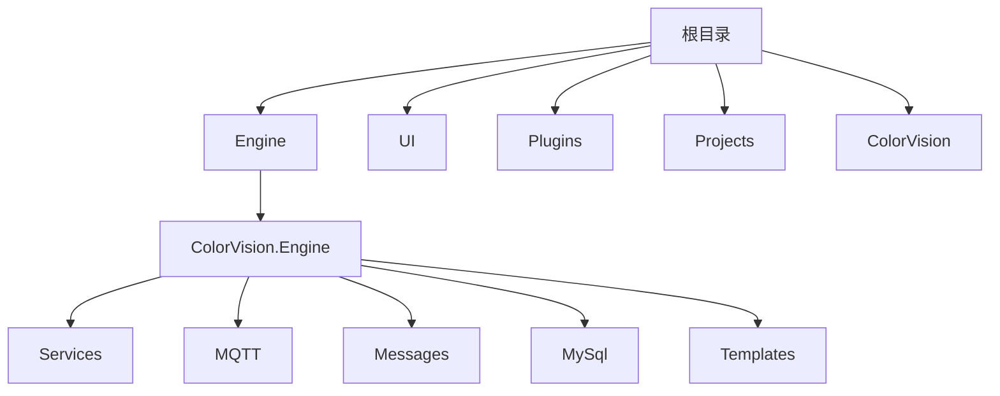
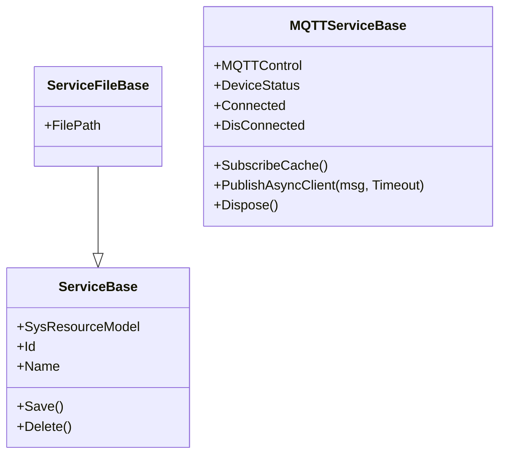

# 开发新设备服务


# 开发新设备服务

## 目录
1. [介绍](#介绍)
2. [项目结构](#项目结构)
3. [核心组件](#核心组件)
4. [架构概述](#架构概述)
5. [详细组件分析](#详细组件分析)
6. [依赖分析](#依赖分析)
7. [性能考虑](#性能考虑)
8. [故障排除指南](#故障排除指南)
9. [总结](#总结)
10. [附录](#附录)

## 介绍
本项目旨在指导开发者如何为新的硬件设备创建设备服务。文档详细解释了需要实现的服务接口、MQTT通信协议设计、配置界面的开发以及设备服务在 ServiceManager 中的注册流程。项目基于 C# 语言，采用模块化设计，支持多种设备类型的服务开发，方便设备的集成和管理。

本指南面向不同技术背景的开发者，力求以通俗易懂的方式介绍系统架构和关键代码实现，帮助快速上手并高效开发新设备服务。

## 项目结构
项目整体结构清晰，采用按功能模块划分的目录组织方式，主要目录及其职责如下：



1. **Engine/ColorVision.Engine**  
   核心引擎层，包含设备服务（Services）、MQTT通信模块（MQTT）、消息处理（Messages）、数据库操作（MySql）及模板相关代码（Templates）。是设备服务实现的主要代码区。

2. **UI**  
   用户界面层，包含主题、控件、热键、菜单、搜索等界面相关代码，负责用户交互。

3. **Plugins**  
   插件模块，包含多个独立功能插件，如事件查看器、屏幕录像、系统监控等，支持系统功能扩展。

4. **Projects**  
   具体项目实现代码目录，每个子目录为一个项目，如 ProjectKB、ProjectHeyuan 等，体现项目定制化。

5. **ColorVision**  
   应用主程序及相关配置、启动等代码，包含主窗口和应用入口。

此结构体现了典型的分层设计，核心服务与UI分离，支持插件扩展和项目定制，方便维护和扩展。

## 核心组件
针对新设备服务开发，以下核心组件尤为关键：

1. **ServiceBase.cs**  
   设备服务基类，封装服务的基础属性和持久化操作。

2. **MQTTServiceBase.cs**  
   MQTT通信基础服务类，实现设备与MQTT服务器的连接、消息收发、心跳检测等功能。

3. **ServiceManager.cs**（待分析）  
   负责设备服务的注册和管理，协调设备服务生命周期。

4. **设备相关目录**  
   如 `Services/Devices` 下的具体设备服务实现目录（如 Motor、Camera、Sensor 等），包含设备配置、视图和业务逻辑。

## 架构概述
系统采用典型的分层架构：

- **设备服务层**：基于 `ServiceBase` 和 `MQTTServiceBase`，实现设备具体业务逻辑和通信协议。
- **通信层**：MQTT模块负责设备与服务器的消息交互，支持异步消息处理和心跳机制保障连接稳定。
- **持久化层**：通过数据库访问对象（DAO）实现设备配置和状态的持久化。
- **UI层**：提供设备配置界面和状态展示，支持用户交互。
- **管理层**：ServiceManager 统一管理设备服务实例，支持动态注册和注销。

通信采用 MQTT 协议，消息格式基于 JSON，支持命令下发和状态回报。

## 详细组件分析

### 1. ServiceBase.cs 分析
Source:
 - [https://github.com/xincheng213618/scgd_general_wpf/blob/main/Engine/ColorVision.Engine/Services/Core/ServiceBase.cs](ServiceBase.cs)

该文件定义了设备服务的基础类 `ServiceBase` 及其派生类 `ServiceFileBase`。

- **ServiceBase**  
  - 继承自 `ServiceObjectBase`（基础服务对象，未展示）  
  - 持有 `SysResourceModel`，表示设备资源模型，包含设备的基本信息如ID和名称。  
  - 提供 `Save()` 和 `Delete()` 方法，实现设备服务数据的持久化和删除操作，调用对应的 DAO。  
  - `Id` 属性直接映射到 `SysResourceModel.Id`。

- **ServiceFileBase**  
  - 继承自 `ServiceBase`，扩展了文件路径 `FilePath` 属性，适用于基于文件的设备服务。

示例代码片段：

```csharp
public class ServiceBase : ServiceObjectBase
{
    public SysResourceModel SysResourceModel { get; set; }
    public int Id { get => SysResourceModel.Id; set { } }

    public ServiceBase(SysResourceModel sysResourceModel)
    {
        SysResourceModel = sysResourceModel;
        Name = sysResourceModel.Name ?? string.Empty;
    }

    public override void Save()
    {
        SysResourceModel.Name = Name;
        VSysResourceDao.Instance.Save(SysResourceModel);
    }

    public override void Delete()
    {
        base.Delete();
        SysResourceDao.Instance.DeleteById(SysResourceModel.Id);
    }
}
```

此设计体现了面向对象的封装和单一职责原则，服务基类负责管理设备模型和持久化接口，便于派生类扩展具体功能。

---

### 2. MQTTServiceBase.cs 分析
Source:
 - [https://github.com/xincheng213618/scgd_general_wpf/blob/main/Engine/ColorVision.Engine/Services/Core/MQTTServiceBase.cs](MQTTServiceBase.cs)

该文件实现了基于 MQTT 的设备服务通信基础类，支持消息订阅、发布、心跳检测及消息回调。

- 继承自 `ViewModelBase`，支持属性变化通知，便于UI绑定。
- 实现接口 `IHeartbeat`（心跳检测）、`IServiceConfig`（服务配置接口）、`IDisposable`（资源释放）。
- 内部维护 `MQTTControl` 单例实例，负责底层 MQTT 连接管理。
- 提供事件 `Connected` 和 `DisConnected`，用于连接状态通知。
- 通过定时器实现心跳检测，判断设备是否在线。
- 处理收到的 MQTT 消息，反序列化为 `MsgReturn` 对象，分发给注册的回调处理。
- 提供 `PublishAsyncClient` 方法异步发送消息，支持超时管理和消息状态跟踪。

核心功能点：

- **消息处理**  
  监听订阅主题消息，解析 JSON，处理心跳和错误码，触发事件通知。

- **心跳检测**  
  定时检查最后心跳时间，超时则触发断开事件。

- **消息发送**  
  生成唯一消息ID，序列化消息，异步发布，维护消息发送记录和超时定时器。

代码示例：

```csharp
internal virtual MsgRecord PublishAsyncClient(MsgSend msg, double Timeout = 30000)
{
    if (Timeout == 30000)
    {
        Timeout = MQTTSetting.Instance.DefaultTimeout;
    }
    Guid guid = Guid.NewGuid();
    msg.MsgID ??= guid.ToString();
    msg.DeviceCode ??= DeviceCode;
    msg.Token ??= ServiceToken;
    msg.ServiceName ??= SendTopic;

    string json = JsonConvert.SerializeObject(msg, Formatting.Indented, new JsonSerializerSettings { NullValueHandling = NullValueHandling.Ignore });

    Task.Run(() => MQTTControl.PublishAsyncClient(SendTopic, json, false));

    MsgRecord msgRecord = new() { SendTopic = SendTopic, SubscribeTopic = SubscribeTopic, MsgID = msg.MsgID, SendTime = DateTime.Now, MsgSend = msg, MsgRecordState = MsgRecordState.Sended };

    Application.Current.Dispatcher.Invoke(() =>
    {
        MsgConfig.Instance.MsgRecords.Insert(0, msgRecord);
        MsgRecords.Add(msgRecord);
    });

    Timer timer = new(Timeout);
    timer.Elapsed += (s, e) =>
    {
        timer.Enabled = false;
        lock (_locker) { timers.Remove(msg.MsgID); }
        msgRecord.MsgRecordState = MsgRecordState.Timeout;
        MsgRecords.Remove(msgRecord);
    };
    timer.AutoReset = false;
    timer.Enabled = true;
    timers.Add(msg.MsgID, timer);
    timer.Start();
    return msgRecord;
}
```

该类为所有基于 MQTT 的设备服务提供了统一的通信基础，简化了消息管理和状态监控。

---



## 依赖分析
- `ServiceBase` 依赖 `SysResourceModel` 和对应 DAO（`VSysResourceDao`、`SysResourceDao`）实现数据持久化。
- `MQTTServiceBase` 依赖 `MQTTControl` 实例管理 MQTT 连接，依赖 `MsgReturn` 消息模型及 `MsgRecord` 消息记录管理。
- `MQTTServiceBase` 通过事件和回调解耦消息处理与业务逻辑，支持异步和多线程环境。
- 定时器机制保证心跳检测的实时性，避免长时间无响应导致设备状态未知。

## 性能考虑
- 异步消息发布避免阻塞主线程，提高响应性能。
- 消息超时管理通过字典和定时器实现，保证资源及时释放。
- 使用锁 `_locker` 保护共享资源，避免多线程冲突。
- 心跳间隔和超时可配置，适应不同设备网络环境。

## 故障排除指南
- 设备无法连接或心跳超时：检查 MQTT 服务器配置及网络状态。
- 消息回调异常：查看日志，确认消息格式及处理逻辑。
- 消息发送超时：确认设备是否在线及消息主题配置是否正确。
- 配置保存失败：确认数据库连接及 DAO 实现。

## 总结
本文档详细介绍了新设备服务开发的基础框架，重点分析了设备服务基类 `ServiceBase` 和 MQTT 通信基础类 `MQTTServiceBase`。通过合理的架构设计和代码封装，系统支持多种设备的快速集成与管理。开发者可基于此框架实现具体设备的服务接口、配置界面和通信协议，确保设备稳定高效运行。

## 附录
- 参考源码链接  
  - [ServiceBase.cs](https://github.com/xincheng213618/scgd_general_wpf/blob/main/Engine/ColorVision.Engine/Services/Core/ServiceBase.cs)  
  - [MQTTServiceBase.cs](https://github.com/xincheng213618/scgd_general_wpf/blob/main/Engine/ColorVision.Engine/Services/Core/MQTTServiceBase.cs)

