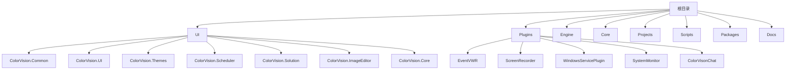
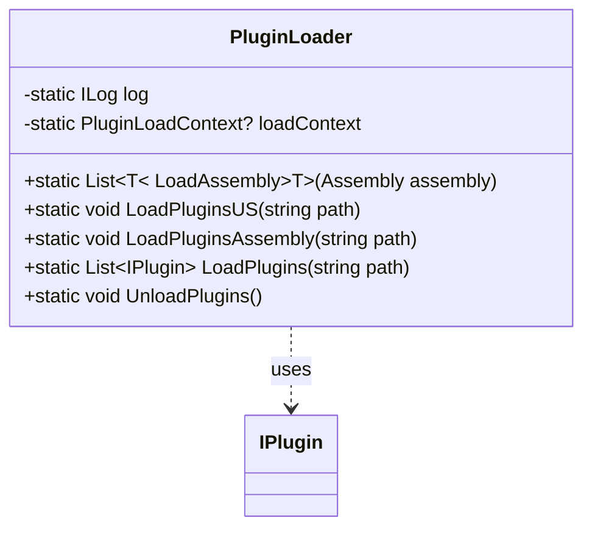

# 插件开发


# 插件开发

## 目录
1. [介绍](#介绍)
2. [项目结构](#项目结构)
3. [核心组件](#核心组件)
4. [架构概览](#架构概览)
5. [详细组件分析](#详细组件分析)
6. [依赖分析](#依赖分析)
7. [性能考量](#性能考量)
8. [故障排除指南](#故障排除指南)
9. [总结](#总结)
10. [附录](#附录)

## 介绍
本教程旨在详细介绍如何在ColorVision系统中开发插件。插件是扩展主系统功能的独立模块，通过实现特定接口与主系统交互。本文档将涵盖如何创建新的插件项目，实现必要的接口（如 `IPlugin` 和 `IMenuItemProvider`），插件与主系统的交互机制，以及插件的打包和部署流程。即使您是初学者，也能通过本教程理解和开发插件。

## 项目结构

ColorVision项目整体采用模块化设计，代码结构清晰，按功能和技术层次划分目录。主要目录及其职责如下：



### 1. UI目录
包含用户界面相关的模块和控件库。`ColorVision.Common` 提供公共接口和基础组件，`ColorVision.UI` 是主界面实现，`ColorVision.Themes` 管理主题和样式，`ColorVision.Scheduler` 负责任务调度界面，`ColorVision.Solution` 和 `ColorVision.ImageEditor` 提供解决方案管理和图像编辑功能。

### 2. Plugins目录
存放各类插件项目，每个子目录是一个插件的独立项目，如事件查看器（EventVWR）、屏幕录制（ScreenRecorder）、系统监控（SystemMonitor）等。插件通常包含实现接口和UI交互的代码。

### 3. Engine目录
核心业务逻辑和算法实现，包括图像处理、算法模板、设备服务等，支撑整个系统的功能实现。

### 4. Core目录
底层基础库和工具，包含OpenCV相关的封装、图形处理和辅助功能。

### 5. Projects目录
具体业务项目的实现，每个子目录对应一个业务项目，包含项目配置、窗口定义和插件配置。

### 6. Scripts目录
包含构建、配置和部署相关的脚本文件，辅助自动化流程。

### 7. Packages目录
第三方库和依赖包的存放位置。

### 8. Docs目录
项目的文档资源。

整体项目采用分层架构，UI层负责界面交互，Engine层处理业务逻辑，Core层提供基础功能，Plugins目录为扩展点，支持插件开发和加载。

## 核心组件

### 插件接口 `IPlugin`

位于 `/UI/ColorVision.Common/Interfaces/IPlugin.cs`，定义插件的基础接口：

```csharp
public interface IPlugin
{
    string Header { get; }
    string Description { get; }
    void Execute();
}

public abstract class IPluginBase : IPlugin
{
    public virtual string Header { get; set; }
    public virtual string Description { get; set; }
    public virtual void Execute() { }
}
```

- `Header`：插件的标题，供UI显示。
- `Description`：插件描述。
- `Execute()`：插件的执行入口方法，主系统调用此方法启动插件功能。

`IPluginBase` 是接口的抽象基类，提供默认实现，插件开发者可以继承它并重写需要的方法。

### 插件加载器 `PluginLoader`

位于 `/UI/ColorVision.UI/PluginLoader.cs`，负责动态加载插件DLL，实现插件的发现和执行。

主要功能包括：

- 通过反射加载指定路径下的DLL。
- 查找实现了 `IPlugin` 接口的类型并实例化。
- 调用插件的 `Execute()` 方法。
- 支持卸载插件。
- 通过不同方法（如 `LoadPluginsUS`、`LoadPluginsAssembly`、`LoadPlugins`）实现插件加载，支持不同的加载策略和上下文。

代码示例（部分）：

```csharp
public static List<IPlugin> LoadPlugins(string path)
{
    List<IPlugin> plugins = new();
    if (!Directory.Exists(path)) return plugins;
    foreach (string file in Directory.GetFiles(path, "*.dll"))
    {
        try
        {
            using (FileStream fs = new FileStream(file, FileMode.Open, FileAccess.Read))
            {
                byte[] assemblyData = new byte[fs.Length];
                fs.Read(assemblyData, 0, assemblyData.Length);
                Assembly assembly = Assembly.Load(assemblyData);
                foreach (var type in assembly.GetTypes().Where(t => typeof(IPlugin).IsAssignableFrom(t) && !t.IsAbstract))
                {
                    if (Activator.CreateInstance(type) is IPlugin plugin)
                    {
                        plugin.Execute();
                        plugins.Add(plugin);
                    }
                }
            }
        }
        catch (Exception ex)
        {
            log.Error(ex);
        }
    }
    return plugins;
}
```

- 通过读取DLL文件字节流加载程序集，避免文件锁定。
- 反射寻找插件类型，实例化并执行。
- 使用日志记录加载异常。

## 架构概览

ColorVision插件架构基于接口和反射机制，插件通过实现 `IPlugin` 接口与主系统约定交互。主系统通过 `PluginLoader` 动态加载插件DLL，实例化插件对象并执行其功能。插件可以包含UI界面和业务逻辑，实现特定功能模块。

插件开发流程大致如下：

1. 创建插件项目，引用主系统的接口库。
2. 实现 `IPlugin` 接口或继承 `IPluginBase`。
3. 在 `Execute()` 方法中实现插件逻辑。
4. 编译生成DLL，放置于主系统指定插件目录。
5. 主系统启动时或运行时调用 `PluginLoader` 加载插件。
6. 插件功能集成至主系统界面或后台。

此架构支持插件的灵活扩展和动态加载，降低主系统耦合，提高系统可维护性和扩展性。

## 详细组件分析

### 1. `IPlugin`接口及基类

- 位置：`/UI/ColorVision.Common/Interfaces/IPlugin.cs`
- 功能：定义插件必须实现的属性和方法。
- 关键点：
  - `Header` 和 `Description` 用于插件信息展示。
  - `Execute()`是插件启动入口。
- 代码示例：

```csharp
public interface IPlugin
{
    string Header { get; }
    string Description { get; }
    void Execute();
}

public abstract class IPluginBase : IPlugin
{
    public virtual string Header { get; set; }
    public virtual string Description { get; set; }
    public virtual void Execute() { }
}
```

### 2. `PluginLoader`类

- 位置：`/UI/ColorVision.UI/PluginLoader.cs`
- 功能：动态加载插件DLL，管理插件生命周期。
- 关键方法：
  - `LoadAssembly<T>(Assembly assembly)`：从程序集加载指定接口的插件。
  - `LoadPluginsUS(string path)`：使用自定义上下文加载插件，支持卸载。
  - `LoadPluginsAssembly(string path)`：加载目录下子目录中的插件DLL。
  - `LoadPlugins(string path)`：读取DLL字节流加载插件，避免文件锁定。
  - `UnloadPlugins()`：卸载插件上下文释放资源。
- 代码结构示意：



- 设计思路：
  - 利用反射动态发现插件类型。
  - 使用自定义加载上下文支持插件卸载。
  - 捕获异常保证系统稳定。
  - 记录日志便于调试。

## 依赖分析

- 插件依赖于接口定义库 `ColorVision.Common` 中的 `IPlugin`。
- `PluginLoader`依赖于日志库 `log4net`，用于异常记录。
- 插件DLL放置在指定目录，主系统通过路径加载。
- 插件通过实现接口与主系统交互，保证低耦合。
- 反射和自定义加载上下文是关键技术点。

## 性能考量

- 通过字节流加载DLL避免文件锁定，支持插件热更新。
- 使用自定义加载上下文支持插件卸载，减少内存占用。
- 异常捕获防止插件加载失败影响主系统。
- 插件执行采用接口调用，开销较小。

## 故障排除指南

- 插件加载失败时，检查DLL是否正确放置且依赖完整。
- 查看日志文件获取详细异常信息。
- 确认插件实现了 `IPlugin` 接口且无抽象类。
- 避免插件间依赖冲突，保持接口兼容。
- 使用 `UnloadPlugins()` 卸载旧插件后再加载新版本。

## 总结

本教程详细介绍了ColorVision插件开发的基础架构和关键组件。通过实现 `IPlugin` 接口和利用 `PluginLoader` 动态加载机制，开发者可以快速创建和集成插件。系统设计支持插件的灵活扩展和动态管理，提升整体可维护性。希望本教程能帮助您顺利开发出高质量的插件。

## 附录

- 相关代码文件：
  - [IPlugin接口定义](https://github.com/xincheng213618/scgd_general_wpf/blob/master/UI/ColorVision.Common/Interfaces/IPlugin.cs)
  - [PluginLoader实现](https://github.com/xincheng213618/scgd_general_wpf/blob/master/UI/ColorVision.UI/PluginLoader.cs)
  - [Plugins目录README](https://github.com/xincheng213618/scgd_general_wpf/blob/master/Plugins/README.md)

