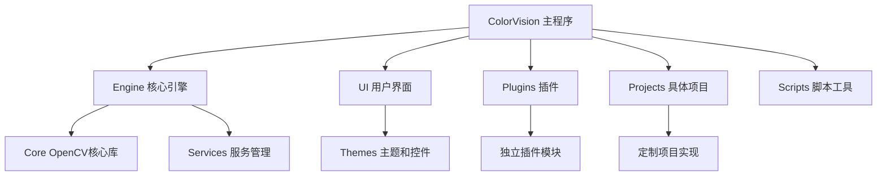

# 开发者指南


# 开发者指南

## 目录
1. [介绍](#介绍)
2. [项目结构](#项目结构)
3. [核心组件](#核心组件)
4. [架构概览](#架构概览)
5. [详细组件分析](#详细组件分析)
6. [依赖关系分析](#依赖关系分析)
7. [性能考虑](#性能考虑)
8. [故障排除指南](#故障排除指南)
9. [总结](#总结)
10. [附录](#附录)

## 介绍
ColorVision 是由 ColrVision Inc 开发的一款基于 Windows WPF 的应用程序，旨在提供先进的色彩管理和光电技术解决方案。该项目支持多语言（包括英语、简体中文、繁体中文、日语、韩语、俄语等），兼容 Win10 和 Win11 操作系统，支持多种显示分辨率和多种窗口模式，具备热键控制和任务计划等功能。用户可以通过该软件进行色彩管理、设备配置、任务执行及插件扩展，满足光电行业的多样化需求。

## 项目结构

### 1. 目录层级与模块划分

从仓库目录结构可以看出，项目采用了多层次、多模块的组织方式，主要按照功能和技术进行划分，方便开发、维护和扩展。主要目录如下：

1. **/ColorVision**  
   - 主程序核心代码，包括启动类、主窗口、插件管理、项目管理、设置界面、更新机制等。  
   - 负责应用的整体界面和核心功能的实现。

2. **/Engine**  
   - 核心引擎模块，包含图像处理、算法实现、设备通信、消息处理、权限管理、服务管理、数据库操作等。  
   - 这是系统的“心脏”，处理数据流、算法运算、设备交互等关键逻辑。

3. **/UI**  
   - 用户界面相关代码，包含主题管理、控件、转换器、扩展、语言支持、菜单管理、热键管理等。  
   - 负责界面风格、用户交互和界面逻辑。

4. **/Plugins**  
   - 插件模块，包含多个独立插件项目，如事件查看器、屏幕录像、系统监控、聊天插件、Windows 服务插件等。  
   - 支持插件的动态加载，扩展主程序功能。

5. **/Projects**  
   - 多个具体项目实现，如 ProjectKB、ProjectHeyuan、ProjectBase、CV_Spectrometer 等。  
   - 这些项目可能是针对特定设备或业务场景的定制化实现。

6. **/Scripts**  
   - 自动化脚本和工具，如构建脚本、配置脚本、文件管理脚本等。  
   - 支持项目的自动构建、部署和维护。

7. **/Docs**  
   - 文档资料，包含许可协议、API 说明、解决方案说明、控件支持等。  
   - 为开发者和用户提供参考资料。

8. **/Core**  
   - 包含 OpenCV 相关的核心库和接口实现，如 opencv_helper、opencv_cuda、opencv_opengl 等。  
   - 负责底层图像处理和计算。

9. **/Test**  
   - 测试项目，主要用于测试 OpenCV 辅助功能。  
   - 确保核心库的正确性和稳定性。

10. **/Advanced**  
    - 高级安装包相关文件。  
    - 用于安装程序的制作和发布。

11. **/ColorVisionSetup**  
    - 安装程序相关代码。  
    - 包含更新窗口、自动更新逻辑等。

12. **/DLL**  
    - 第三方组件或 ActiveX 控件。  

### 2. 命名规范与技术栈

- 采用 C# 语言开发，基于 .NET 6.0 和 WPF 框架。
- 代码文件命名清晰，类名、方法名采用 PascalCase，变量和参数采用 camelCase。
- 目录结构清晰区分功能模块，便于快速定位代码。
- 支持多语言国际化，采用资源文件和 Resx Manager 管理语言资源。
- 采用插件架构，支持动态加载和卸载插件。
- 使用 MQTT、MySQL 等技术与外部设备和数据库交互。
- 大量使用 MVVM 设计模式，分离视图和业务逻辑。



## 核心组件

### 1. 主程序（/ColorVision）
- 启动入口：`App.xaml` 和 `MainWindow.xaml`，负责初始化应用和主界面。
- 插件管理：`PluginManager.cs` 和相关窗口，实现插件的加载和管理。
- 项目管理：`ProjectManager.cs`，管理用户项目及其配置。
- 更新模块：实现自动更新和版本管理。

### 2. 核心引擎（/Engine/ColorVision.Engine）
- 流程引擎：基于 Flow 的流程管理，支持任务调度和执行。
- 设备通信：支持多种设备如光谱仪、相机、传感器等的控制和数据采集。
- 算法模块：实现多种图像和光电算法，如匹配、畸变校正、MTF、鬼影检测等。
- 消息系统：消息传递和状态更新。
- 权限管理：用户认证和权限控制。
- 数据库操作：MySQL ORM，数据持久化和查询。

### 3. 用户界面（/UI）
- 主题管理：多种主题支持，用户可切换界面风格。
- 控件库：自定义控件如进度环、消息框、文件上传等。
- 语言支持：多语言资源管理和动态切换。
- 热键管理：全局和窗口热键支持。

### 4. 插件系统（/Plugins）
- 插件接口：通过 `IPlugin` 接口规范插件开发。
- 多个插件项目：事件查看器、屏幕录像、系统监控、聊天插件等。
- 插件动态加载，支持扩展功能。

### 5. 具体项目（/Projects）
- 针对不同业务和设备的定制实现。
- 包含项目配置、界面、服务和插件配置。

## 架构概览

ColorVision 采用模块化架构，核心引擎负责数据处理和设备交互，UI 层提供用户操作界面，插件系统支持功能扩展，具体项目实现业务定制。系统采用 MVVM 模式分离视图和业务逻辑，支持多语言和多主题，确保灵活性和可维护性。

核心数据流从设备采集数据，经算法处理，结果展示在界面，用户操作通过消息和命令传递至引擎和设备。插件通过接口与主程序交互，动态加载扩展功能。

## 详细组件分析

### 示例：/Scripts/build.py 脚本分析

该脚本用于自动化构建和发布 ColorVision 项目，主要功能包括：

- 使用 MSBuild 编译解决方案。
- 使用 Advanced Installer 重建安装包。
- 查找最新版本的安装文件。
- 比较版本号，更新版本信息文件。
- 复制和上传安装文件（支持微信和百度云路径）。
- 显示文件复制进度和上传进度。

关键函数：

1. `rebuild_project(msbuild_path, solution_path, advanced_installer_path, aip_path)`  
   执行 MSBuild 和 Advanced Installer 命令，完成编译和安装包重建。

2. `get_latest_file(directory, file_pattern)`  
   查找指定目录下匹配正则表达式的最新文件。

3. `extract_version_from_filename(filename)`  
   从文件名中提取版本号，格式如 1.2.3.4。

4. `compare_and_write_version(latest_version, latest_release_path, latest_file, changelog_src, changelog_dst)`  
   比较版本号，更新版本文件和变更日志，执行上传操作。

5. `copy_with_progress(src, dst)`  
   复制文件时显示进度和速度。

6. `upload_file(file_path, folder_name)`  
   通过 HTTP PUT 请求上传文件，显示上传进度。

```python
def rebuild_project(msbuild_path, solution_path, advanced_installer_path, aip_path):
    try:
        subprocess.run([msbuild_path, solution_path, '/p:Configuration=Release', '/p:Platform=x64'], check=True)
        subprocess.run([advanced_installer_path, '/rebuild', aip_path], check=True)
    except subprocess.CalledProcessError as e:
        print(f"An error occurred while rebuilding the project: {e}")
```

该脚本体现了自动化构建流程，减少人工操作，提高发布效率。

## 依赖关系分析

- 主程序依赖 Engine、UI、Plugins 模块。
- Engine 模块依赖 Core（OpenCV）、数据库 ORM 和服务模块。
- UI 模块依赖主题和控件库，支持多语言和热键。
- 插件通过接口与主程序解耦，支持动态加载。
- 多项目共享 Engine 和 UI 基础架构，方便定制开发。

## 性能考虑

- 使用异步和多线程处理设备通信和数据采集，避免界面阻塞。
- 利用 OpenCV 和 CUDA 加速图像处理算法。
- 采用缓存和批量处理减少数据库访问次数。
- 插件动态加载减少主程序体积，按需加载功能。

## 故障排除指南

- 编译失败时检查 MSBuild 路径和依赖项是否正确。
- 安装包重建失败时确认 Advanced Installer 配置和路径。
- 设备连接异常排查 MQTT 服务状态和物理连接。
- 多语言显示异常检查资源文件和语言配置。
- 插件加载失败确认插件接口实现和路径是否正确。

## 总结

ColorVision 项目结构清晰，模块划分合理，采用现代软件架构和设计模式，支持多语言、多设备和多插件扩展。通过自动化脚本提高开发和发布效率。文档中详细介绍了项目结构、核心组件和关键脚本，便于开发者快速理解和二次开发。

## 附录

- 参考文档：[CHANGELOG.md](CHANGELOG.md)、[CONTRIBUTING.md](CONTRIBUTING.md)
- 联系方式：support@colrvision.com
- 官方网站：[ColrVision Inc](https://www.colrvision.com)

