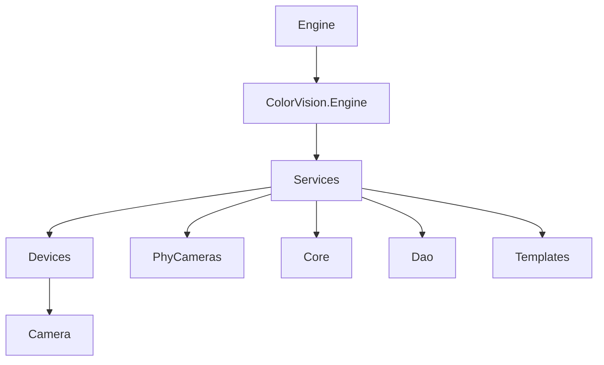
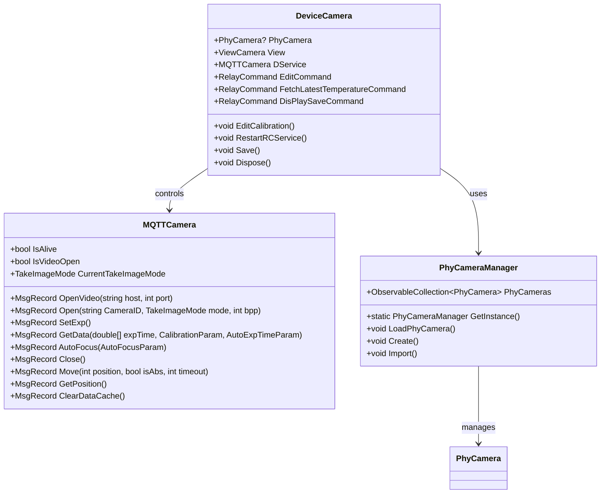

# 相机服务


# 相机服务

## 目录
1. [引言](#引言)
2. [项目结构](#项目结构)
3. [核心组件](#核心组件)
4. [架构概览](#架构概览)
5. [详细组件分析](#详细组件分析)
    - [DeviceCamera.cs](#devicecameracs)
    - [MQTTCamera.cs](#mqttcameracs)
    - [PhyCameraManager.cs](#phycameramanagercs)
6. [依赖分析](#依赖分析)
7. [性能考虑](#性能考虑)
8. [故障排查指南](#故障排查指南)
9. [总结](#总结)

---

## 引言
本文档详细介绍了项目中的相机服务模块，涵盖支持的相机类型、物理相机设置（PhyCameras）、相机参数配置（如曝光、增益、白平衡等）、图像采集、视频流处理，以及相关的模板功能（自动曝光、自动对焦等）。旨在帮助技术及非技术人员理解相机服务的架构与实现，便于维护和二次开发。

---

## 项目结构

该项目采用模块化设计，代码组织清晰，主要分为以下几个核心部分：



- **Engine/ColorVision.Engine/Services/Devices/Camera/**  
  负责相机设备服务的实现，包括设备抽象、MQTT通信、视频流控制、相机参数配置等。

- **Engine/ColorVision.Engine/Services/PhyCameras/**  
  管理物理相机（PhyCamera）实体，包括相机的创建、导入许可证、配置管理及资源加载。

- **Engine/ColorVision.Engine/Services/Devices/Camera/Templates/**  
  包含相机相关的模板，如自动曝光（AutoExpTime）、自动对焦（AutoFocus）、相机曝光参数模板等。

- **Engine/ColorVision.Engine/Services/Core/**  
  提供服务基类和核心功能支持。

- **Engine/ColorVision.Engine/Services/Dao/**  
  数据访问层，负责数据库操作。

- **Engine/ColorVision.Engine/Services/Devices/Camera/Video/**  
  视频流相关控制。

项目的设计采用了MVVM模式，使用RelayCommand绑定命令，支持权限控制，符合现代WPF应用设计规范。

---

## 核心组件

1. **DeviceCamera**  
   作为相机设备服务的核心类，负责管理物理相机对象、视图界面、MQTT通信服务及相机控制命令。支持编辑相机配置、自动曝光、自动对焦、视频流开启关闭、设备刷新等功能。

2. **MQTTCamera**  
   继承自MQTTDeviceService，封装了与相机设备的MQTT通信逻辑，包括消息处理、曝光设置、自动对焦、视频流控制、文件下载及缓存清理等。

3. **PhyCameraManager**  
   单例管理物理相机集合，实现相机的创建、许可证导入、资源加载及相机信息刷新。负责维护物理相机的生命周期及相关资源树形结构。

---

## 架构概览

相机服务架构基于设备服务抽象，物理相机（PhyCamera）作为实体对象被管理，设备服务（DeviceCamera）通过配置关联物理相机，利用MQTT协议进行通信控制。服务层、数据访问层和UI视图层分离，支持异步消息处理和权限控制。



---

## 详细组件分析

### DeviceCamera.cs

**文件路径**  
[Engine/ColorVision.Engine/Services/Devices/Camera/DeviceCamera.cs](https://github.com/xincheng213618/scgd_general_wpf/blob/master/Engine/ColorVision.Engine/Services/Devices/Camera/DeviceCamera.cs)

**功能概述**  
DeviceCamera类继承自DeviceService，代表一个相机设备服务实例。它封装了物理相机对象的引用、视图界面、MQTT通信服务实例（MQTTCamera），并定义了多种命令用于编辑配置、刷新设备、管理物理相机等操作。

**关键功能点**  
1. **构造函数**：初始化MQTT服务、视图、命令绑定，关联物理相机，监听配置变更。  
2. **编辑校正文件**：通过模板编辑窗口编辑校正参数。  
3. **自动曝光、自动对焦及相机参数模板编辑**：静态方法弹出对应模板编辑窗口。  
4. **视频流控制**：支持开启关闭视频流，重启服务时优先关闭视频。  
5. **物理相机配置变更监听**：同步物理相机配置到当前服务配置。  
6. **服务缓存清理**：管理员权限操作，清理缓存文件。  
7. **刷新设备列表**：刷新物理设备列表，处理许可证过期情况。  
8. **保存配置**：同步物理相机配置并保存。  
9. **获取设备信息和显示控件**：返回对应的WPF控件用于UI展示。  
10. **资源释放**：释放物理相机绑定，释放MQTT服务资源。

**示例代码片段**  
```csharp
public DeviceCamera(SysDeviceModel sysResourceModel) : base(sysResourceModel)
{
    DService = new MQTTCamera(Config);
    View = new ViewCamera(this);
    View.View.Title = $"相机视图 - {Config.Code}";
    this.SetIconResource("DrawingImageCamera", View.View);

    EditCommand = new RelayCommand(a => EditCameraAction(), b => AccessControl.Check(EditCameraAction));
    FetchLatestTemperatureCommand = new RelayCommand(a => FetchLatestTemperature(a));
    DisPlaySaveCommand = new RelayCommand(a => SaveDis());

    RefreshDeviceIdCommand = new RelayCommand(a => RefreshDeviceId());
    OpenPhyCameraMangerCommand = new RelayCommand(a => OpenPhyCameraManger());

    PhyCamera = PhyCameraManager.GetInstance().GetPhyCamera(Config.CameraCode);
    if (PhyCamera != null)
    {
        PhyCamera.ConfigChanged += PhyCameraConfigChanged;
        PhyCamera.DeviceCamera = this;
    }
}
```

**设计说明**  
- 采用命令模式（RelayCommand）实现UI命令绑定，支持权限校验。  
- 物理相机和设备服务分离，维护双向关联。  
- 通过事件监听实现配置同步，保证数据一致性。  
- 使用懒加载（Lazy）实现显示控件的延迟创建，提高性能。

---

### MQTTCamera.cs

**文件路径**  
[Engine/ColorVision.Engine/Services/Devices/Camera/MQTTCamera.cs](https://github.com/xincheng213618/scgd_general_wpf/blob/master/Engine/ColorVision.Engine/Services/Devices/Camera/MQTTCamera.cs)

**功能概述**  
MQTTCamera继承自MQTTDeviceService，负责通过MQTT协议与相机硬件设备通信。处理消息响应，执行相机控制命令，包括曝光设置、自动对焦、视频打开关闭、文件下载等。

**关键功能点**  
1. **消息处理**：根据事件名称处理不同消息，更新配置状态。  
2. **曝光设置**：支持单通道和三通道曝光时间设置。  
3. **图像采集**：发送获取数据命令，带自动曝光模板参数。  
4. **自动对焦**：发送自动对焦命令，支持超时控制。  
5. **视频流控制**：支持打开关闭视频流，监听窗口关闭事件自动关闭视频。  
6. **文件管理**：支持文件下载和数据缓存清理。

**示例代码片段**  
```csharp
public MsgRecord OpenVideo(string host, int port)
{
    CurrentTakeImageMode = TakeImageMode.Live;
    bool IsLocal = (host == "127.0.0.1");
    MsgSend msg = new()
    {
        EventName = "OpenLive",
        Params = new Dictionary<string, object>() { { "RemoteIp", host }, { "RemotePort", port }, { "Gain", Config.Gain }, { "ExpTime", Config.ExpTime }, { "IsLocal", IsLocal } }
    };
    return PublishAsyncClient(msg);
}
```

**设计说明**  
- 通过事件驱动处理MQTT消息，保证异步通信的响应及时。  
- 采用字典和函数参数封装命令，灵活扩展。  
- 结合WPF Dispatcher更新UI，避免线程安全问题。  
- 支持多种相机操作，覆盖从参数配置到视频流的完整功能链。

---

### PhyCameraManager.cs

**文件路径**  
[Engine/ColorVision.Engine/Services/PhyCameras/PhyCameraManager.cs](https://github.com/xincheng213618/scgd_general_wpf/blob/master/Engine/ColorVision.Engine/Services/PhyCameras/PhyCameraManager.cs)

**功能概述**  
PhyCameraManager是物理相机的单例管理器，负责相机的创建、导入许可证、加载相机配置及资源，维护物理相机集合。支持导入.zip和.lic格式的许可证文件，自动更新数据库和本地资源。

**关键功能点**  
1. **单例模式**：确保全局唯一实例管理物理相机。  
2. **创建相机**：检测未创建的空相机，弹出创建窗口。  
3. **导入许可证**：支持批量导入许可证文件，处理.zip压缩包和单独.lic文件。  
4. **加载相机**：从数据库加载相机及其资源，构建资源树形结构。  
5. **刷新空相机计数**：统计数据库中未创建的相机数量。  
6. **资源递归加载**：递归加载组资源和校正资源，构建完整资源树。

**示例代码片段**  
```csharp
public void LoadPhyCamera()
{
    var phyCameraBackup = PhyCameras.ToDictionary(pc => pc.Id, pc => pc);
    var list = SysResourceDao.Instance.GetAllType((int)ServiceTypes.PhyCamera);
    foreach (var item in list)
    {
        if (!string.IsNullOrWhiteSpace(item.Value))
        {
            if (phyCameraBackup.TryGetValue(item.Id, out var existingPhyCamera))
            {
                existingPhyCamera.Name = item.Name ?? string.Empty;
                existingPhyCamera.SysResourceModel = item;
                existingPhyCamera.Config.CameraID = item.Name ?? string.Empty;
            }
            else
            {
                var newPhyCamera = new PhyCamera(item);
                LoadPhyCameraResources(newPhyCamera);
                PhyCameras.Add(newPhyCamera);
            }
        }
    }
    Loaded?.Invoke(this, EventArgs.Empty);
}
```

**设计说明**  
- 使用ObservableCollection维护相机集合，支持UI绑定自动更新。  
- 利用数据库操作封装，实现数据持久化。  
- 递归加载资源保证资源层级完整。  
- 导入许可证功能增强授权管理，保障设备合法使用。

---

## 依赖分析

- **DeviceCamera依赖MQTTCamera**进行设备通信，MQTTCamera封装了MQTT协议细节。  
- **DeviceCamera依赖PhyCameraManager**获取物理相机实例，实现物理与逻辑相机绑定。  
- **PhyCameraManager依赖数据库访问层（SysResourceDao、CameraLicenseDao）**进行数据加载与保存。  
- **消息和事件机制贯穿MQTT消息处理、UI更新和配置同步，保证系统响应和数据一致性。**  
- **权限控制通过AccessControl和RequiresPermission属性实现，保障关键操作安全。**

---

## 性能考虑

- **懒加载显示控件**减少启动时资源消耗。  
- **异步MQTT消息处理**防止UI阻塞。  
- **事件驱动配置同步**避免不必要的重复操作。  
- **缓存清理命令**帮助释放存储空间，避免系统负载过高。  
- **多通道曝光设置优化**适配复杂相机硬件，提高采集效率。

---

## 故障排查指南

- **相机无法打开**：检查许可证状态，若提示无激活文件，需导入正确许可证。  
- **刷新设备列表失败**：确认物理相机许可证是否过期，必要时清空绑定重新刷新。  
- **视频流无法关闭**：确保调用RestartRCService时正确关闭视频流，避免资源占用。  
- **配置保存失败**：检查数据库连接状态，MySqlSetting应处于连接状态。  
- **温度数据查询无结果**：确认设备是否正常采集温度，数据库中是否有对应记录。

---

## 总结

相机服务模块设计清晰，功能完备，涵盖了从物理相机管理、设备通信、参数配置到视频流处理的完整流程。通过模块间松耦合和事件驱动机制，实现了高效的设备控制和数据同步。模板机制支持自动曝光、自动对焦等高级功能，提升了系统的智能化水平。整体架构符合现代软件设计规范，便于扩展和维护。

---

