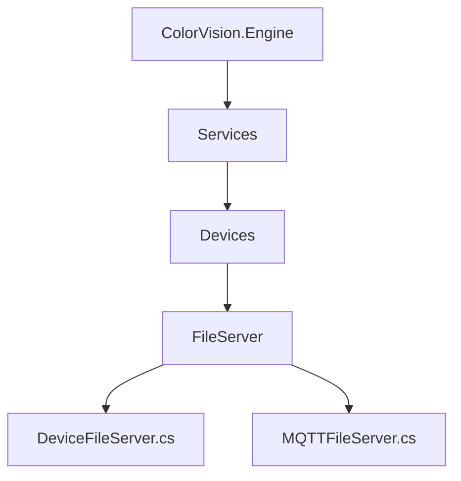
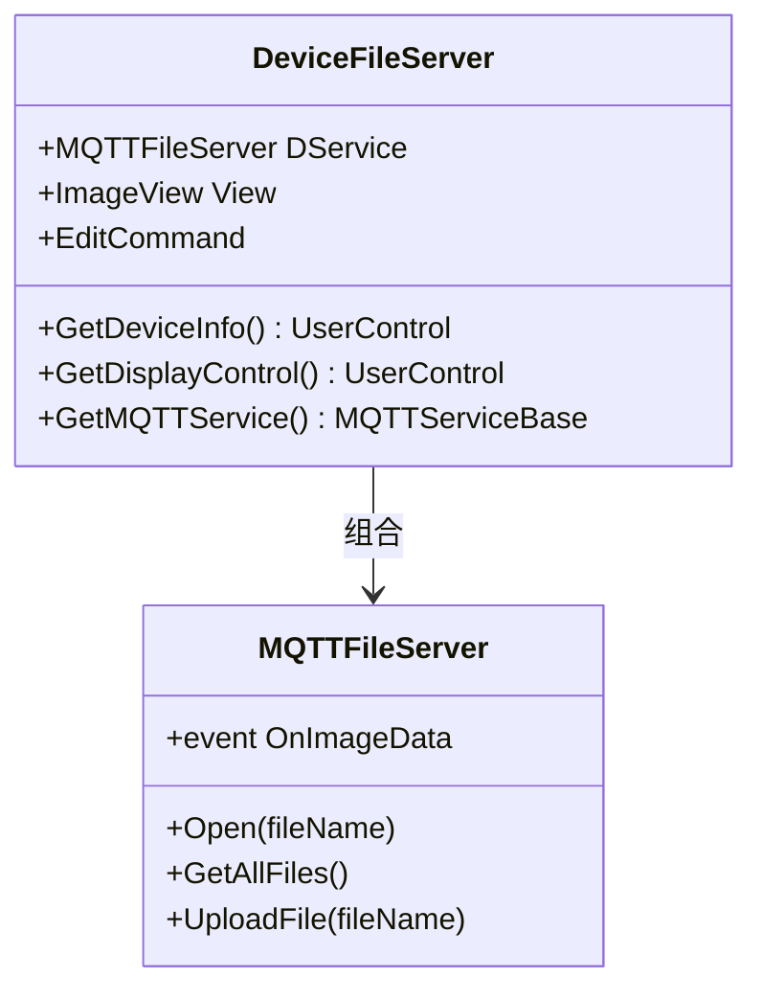

# 文件服务


# 文件服务

## 目录
1. [介绍](#介绍)
2. [项目结构](#项目结构)
3. [核心组件](#核心组件)
4. [架构概览](#架构概览)
5. [详细组件分析](#详细组件分析)
6. [依赖分析](#依赖分析)
7. [性能考量](#性能考量)
8. [故障排查指南](#故障排查指南)
9. [结论](#结论)

## 介绍
文件服务模块主要用于远程文件传输和存储管理，支持文件的上传、下载以及文件列表的获取。该服务通过MQTT协议实现设备间通信，保证数据的实时交互和远程控制。本文档将详细介绍文件服务的架构、核心组件及其实现细节，帮助用户理解和使用该服务。

## 项目结构
文件服务相关代码主要位于路径：
`/Engine/ColorVision.Engine/Services/Devices/FileServer/`

该目录下包含以下主要文件：
- `DeviceFileServer.cs`：设备文件服务类，作为文件服务的核心设备接口，管理文件服务设备和视图。
- `MQTTFileServer.cs`：基于MQTT协议的文件服务通信实现，处理消息的发送和接收，管理文件操作事件。

项目整体采用分层架构，文件服务属于设备服务层，负责设备的具体功能实现。文件服务通过继承通用设备服务基类，实现对文件服务设备的封装和操作。



## 核心组件

### 1. DeviceFileServer.cs
- 继承自泛型设备服务基类 `DeviceService<ConfigFileServer>`。
- 管理MQTT文件服务实例 `MQTTFileServer`。
- 管理文件显示视图 `ImageView`。
- 提供编辑命令，支持管理员权限下的配置编辑。
- 提供设备信息和显示控件的UI界面。

### 2. MQTTFileServer.cs
- 继承自 `MQTTDeviceService<ConfigFileServer>`，实现基于MQTT的文件服务通信。
- 订阅和发布特定主题消息，实现文件操作的异步消息处理。
- 处理文件服务事件，如心跳、文件列表、文件上传、文件下载等。
- 通过事件回调机制通知外部接收文件数据。

## 架构概览
文件服务架构基于MQTT通信协议，核心思想是设备服务层通过MQTT消息与远端文件服务器交互，实现文件的远程管理。

- **设备层（DeviceFileServer）**：封装设备配置和视图，管理文件服务设备的生命周期和UI交互。
- **通信层（MQTTFileServer）**：负责MQTT消息的订阅发布，处理消息解析和事件分发。
- **消息结构**：采用JSON格式进行消息传递，包含事件名和数据内容，确保消息的灵活扩展和解析。

该架构保证了设备与服务之间的解耦，便于扩展和维护。



## 详细组件分析

### DeviceFileServer.cs

该类是文件服务的设备抽象，继承自通用设备服务基类，主要负责设备的配置管理和UI交互。

关键点：
- 构造函数中实例化 `MQTTFileServer` 和 `ImageView`，初始化视图标题为“文件服务 - 设备代码”。
- 提供编辑命令 `EditCommand`，仅管理员权限可用，弹出编辑窗口。
- 重写方法 `GetDeviceInfo()` 和 `GetDisplayControl()` 返回对应的UI控件。
- 重写 `GetMQTTService()` 返回MQTT服务实例。

代码片段示例：
```csharp
public DeviceFileServer(SysDeviceModel sysResourceModel) : base(sysResourceModel)
{
    DService = new MQTTFileServer(Config);
    View = new ImageView();
    View.View.Title = $"文件服务 - {Config.Code}";

    EditCommand = new RelayCommand(a =>
    {
        EditFileServer window = new EditFileServer(this);
        window.Owner = Application.Current.GetActiveWindow();
        window.WindowStartupLocation = WindowStartupLocation.CenterOwner;
        window.ShowDialog();
    }, a => AccessControl.Check(PermissionMode.Administrator));
}
```

### MQTTFileServer.cs

该类实现具体的MQTT通信逻辑，继承自通用MQTT设备服务基类。

关键点：
- 构造函数中根据配置订阅主题，绑定消息接收异步事件。
- 消息接收处理方法 `MqttClient_ApplicationMessageReceivedAsync` 解析JSON消息，过滤设备代码匹配且事件非心跳的消息，触发事件通知。
- 提供文件操作方法：
  - `Open(string fileName)`：请求下载文件。
  - `GetAllFiles()`：请求获取所有文件列表。
  - `UploadFile(string fileName)`：请求上传文件。
- 消息格式基于事件名和参数字典，灵活传递文件名和文件类型。

代码片段示例：
```csharp
private Task MqttClient_ApplicationMessageReceivedAsync(MqttApplicationMessageReceivedEventArgs arg)
{
    if (arg.ApplicationMessage.Topic == SubscribeTopic)
    {
        string Msg = Encoding.UTF8.GetString(arg.ApplicationMessage.PayloadSegment);
        try
        {
            MsgReturn json = JsonConvert.DeserializeObject<MsgReturn>(Msg);
            if (json == null)
                return Task.CompletedTask;
            if (json.Code == 0 && json.DeviceCode.Equals(Config.Code, StringComparison.Ordinal))
            {
                if (json.EventName.Equals(FileServerEventName.Heartbeat, StringComparison.Ordinal))
                {
                    // 心跳处理（空实现）
                }
                else
                {
                    OnImageData?.Invoke(this, new FileServerDataEvent(json.EventName, json.Data));
                }
            }
        }
        catch
        {
            return Task.CompletedTask;
        }
    }
    return Task.CompletedTask;
}
```

## 依赖分析
- 依赖MQTT通信库（如 `MQTTnet.Client`）实现消息收发。
- 依赖JSON序列化库 `Newtonsoft.Json` 进行消息解析。
- 依赖通用设备服务基类和UI控件（`DeviceService<T>`，`ImageView`等）。
- 权限控制通过 `AccessControl.Check` 实现管理员权限验证。
- 事件机制实现数据异步通知，提高响应性能。

## 性能考量
- 异步消息处理保证UI线程不阻塞。
- 事件驱动模型减少轮询开销，提高响应效率。
- MQTT订阅缓存机制优化消息接收性能。
- JSON解析性能依赖于消息大小和复杂度，文件传输建议分片处理（代码未显示，可能在其他模块实现）。

## 故障排查指南
- 确认MQTT服务正常运行，订阅主题正确。
- 检查设备配置中的 `SendTopic` 和 `SubscribeTopic` 是否匹配。
- 确认设备代码配置正确，避免消息过滤失效。
- 权限不足时编辑命令不可用，需管理员权限。
- 处理异常时消息接收方法捕获异常防止崩溃。

## 结论
文件服务模块通过设备抽象和MQTT通信实现远程文件管理功能，架构清晰，职责分明。设备类负责UI和配置管理，MQTT服务类负责消息通信和文件操作。该设计支持灵活扩展和高效异步交互，适合远程文件传输和存储管理场景。

