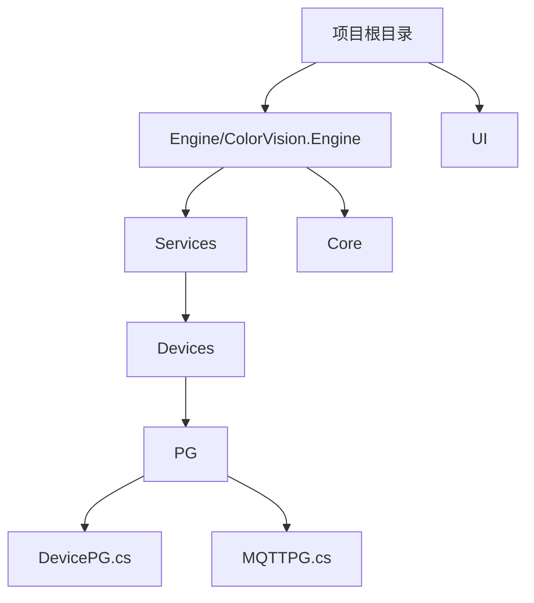
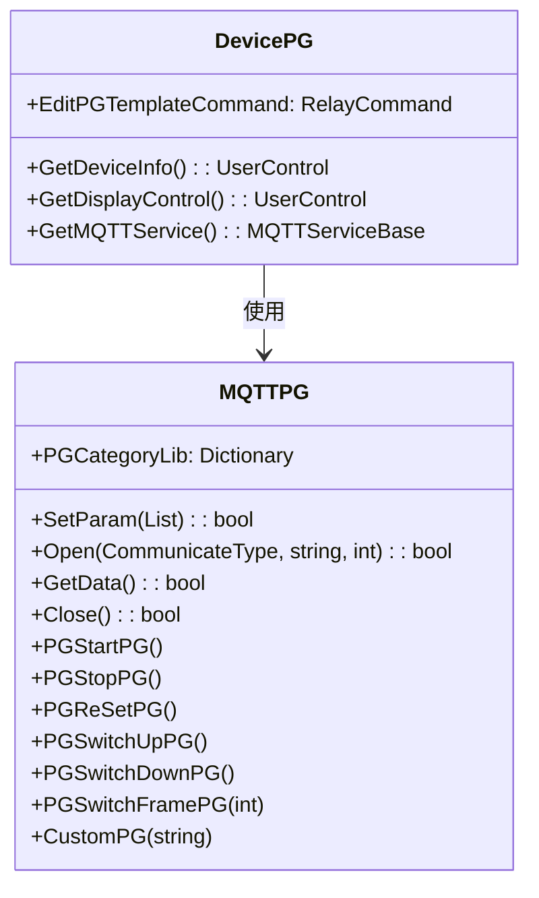

# 图像模式发生器 (PG) 服务


# 图像模式发生器 (PG) 服务

## 目录
1. [简介](#简介)
2. [项目结构](#项目结构)
3. [核心组件](#核心组件)
4. [架构概述](#架构概述)
5. [详细组件分析](#详细组件分析)
    - [DevicePG.cs](#devicepgcs)
    - [MQTTPG.cs](#mqttpgcs)
6. [依赖分析](#依赖分析)
7. [性能考虑](#性能考虑)
8. [故障排除指南](#故障排除指南)
9. [总结](#总结)

---

## 简介

图像模式发生器（Pattern Generator，简称 PG）服务是本项目中负责控制和管理图像模式发生器设备的关键模块。PG 服务的主要职责是通过 MQTT 通信协议与硬件设备交互，实现对 PG 设备的参数配置、测试图像和序列的输出控制。用户可以通过该服务灵活配置 PG 参数，启动、停止或切换不同的测试图像序列，以满足不同的测试需求。

本文档将详细介绍 PG 服务的作用，如何控制 PG 输出不同的测试图像和序列，以及如何配置 PG 参数。文档面向不同技术背景的用户，力求以通俗易懂的语言解释代码结构、架构设计和功能实现。

---

## 项目结构

本项目采用模块化设计，代码按功能和设备类型进行分层和组织。PG 服务相关代码主要集中在以下目录：

```plaintext
/Engine/ColorVision.Engine/Services/Devices/PG/
```

该目录下包含 PG 服务的设备定义、MQTT 通信实现及相关模板定义。

整体项目结构简述如下：

1. **/Engine/ColorVision.Engine/Services/Devices/PG/**  
   - 负责 PG 设备的服务实现，包括设备类（DevicePG.cs）、MQTT 通信（MQTTPG.cs）、配置和模板等。  
   - 体现设备服务层，封装设备相关的业务逻辑和通信细节。

2. **/Engine/ColorVision.Engine/Services/Devices/**  
   - 其他设备服务模块，如摄像头、光谱仪等，均遵循类似设计，便于扩展和维护。

3. **/Engine/ColorVision.Engine/**  
   - 核心引擎代码，包含服务基础类、消息处理、数据库访问等通用功能。

4. **/UI/**  
   - 用户界面层，展示设备信息和控制界面。

5. **/Engine/ColorVision.Core/**  
   - 核心算法和底层工具库。

此种分层结构明确职责，设备服务模块负责与硬件交互，UI 层负责展示和用户操作，核心引擎提供公共支持，整体架构清晰、易于维护。



---

## 核心组件

PG 服务的核心组件包括：

- **DevicePG.cs**  
  设备服务类，继承自通用设备服务基类，负责PG设备的生命周期管理、界面交互命令绑定及与MQTT服务的关联。

- **MQTTPG.cs**  
  MQTT 通信类，继承自 MQTT 设备服务基类，负责与 PG 硬件设备通过 MQTT 协议发送和接收消息，实现参数设置、控制命令以及数据获取。

- **TemplatePGParam.cs**（模板参数类，定义了PG设备支持的参数和命令映射）

这些组件协同工作，实现了对 PG 设备的全面控制和管理。

---

## 架构概述

PG 服务架构基于设备服务抽象层和 MQTT 通信层的设计思想：

- **设备服务层（DevicePG）**  
  作为设备的抽象表示，封装设备信息、配置和用户交互逻辑。通过命令绑定支持用户界面操作，如编辑设备参数和模板配置。

- **MQTT 通信层（MQTTPG）**  
  负责具体的消息编解码和网络通信，订阅和发布 MQTT 主题消息，实现设备的启动、停止、参数设置和数据采集等功能。

- **模板参数库（PGCategoryLib）**  
  维护不同PG设备类别对应的命令映射，支持灵活扩展和定制不同型号设备的控制命令。

整体架构使 PG 服务具备良好的扩展性和解耦性，方便后续新增设备型号和功能。



---

## 详细组件分析

### DevicePG.cs

#### 文件位置
Source:  
- [Engine/ColorVision.Engine/Services/Devices/PG/DevicePG.cs](https://github.com/xincheng213618/scgd_general_wpf/blob/master/Engine/ColorVision.Engine/Services/Devices/PG/DevicePG.cs)

#### 文件作用
DevicePG 类是 PG 设备的服务类，继承自通用设备服务基类 `DeviceService<ConfigPG>`，负责设备实例的初始化、命令绑定和界面控件提供。

#### 关键类与方法

1. **DevicePG(SysDeviceModel sysResourceModel)**  
   构造函数，初始化 MQTT 服务实例 `DService`，绑定编辑命令 `EditCommand` 和模板编辑命令 `EditPGTemplateCommand`。

2. **EditPGTemplate()** (静态方法)  
   弹出模板编辑窗口，允许用户配置 PG 模板参数。若数据库未连接，弹出提示框警告。

3. **GetDeviceInfo()**  
   返回设备信息界面控件 `InfoPG`。

4. **GetDisplayControl()**  
   返回设备显示界面控件 `DisplayPG`。

5. **GetMQTTService()**  
   返回 MQTT 服务实例。

#### 代码示例

```csharp
public DevicePG(SysDeviceModel sysResourceModel) : base(sysResourceModel)
{
    DService = new MQTTPG(Config);

    EditCommand = new RelayCommand(a =>
    {
        EditPG window = new(this);
        window.Owner = Application.Current.GetActiveWindow();
        window.WindowStartupLocation = WindowStartupLocation.CenterOwner;
        window.ShowDialog();
    }, a => AccessControl.Check(PermissionMode.Administrator));

    EditPGTemplateCommand = new RelayCommand(a => EditPGTemplate());
}
```

#### 说明
- 通过命令绑定，用户界面可以调用编辑窗口，方便配置设备参数。
- 设备信息和显示控件封装了界面逻辑，界面与设备逻辑分离。
- 依赖于 MQTT 服务实现设备通信。

---

### MQTTPG.cs

#### 文件位置
Source:  
- [Engine/ColorVision.Engine/Services/Devices/PG/MQTTPG.cs](https://github.com/xincheng213618/scgd_general_wpf/blob/master/Engine/ColorVision.Engine/Services/Devices/PG/MQTTPG.cs)

#### 文件作用
MQTTPG 类继承自 MQTTDeviceService，负责通过 MQTT 协议与 PG 设备通信，实现设备控制命令的发送和消息的接收处理。

#### 关键枚举

- **PGType**  
  定义 PG 设备型号，如 GX09CLCM、SKYCODE。

- **CommunicateType**  
  定义通信方式，TCP 或 串口。

#### 关键属性与方法

1. **PGCategoryLib**  
   字典，维护不同设备类别对应的命令映射。

2. **构造函数 MQTTPG(ConfigPG pGConfig)**  
   初始化 MQTT 主题订阅，加载命令模板库。

3. **MqttClient_ApplicationMessageReceivedAsync**  
   异步处理接收到的 MQTT 消息，解析 JSON 格式的消息体，根据事件名称执行相应逻辑（当前实现为空壳，预留扩展）。

4. **设备控制命令方法**  
   - `PGStartPG()`, `PGStopPG()`, `PGReSetPG()`, `PGSwitchUpPG()`, `PGSwitchDownPG()`, `PGSwitchFramePG(int index)`  
   这些方法通过调用 `SetParam` 发送对应的控制命令参数到设备。

5. **SetParam(List<ParamFunction> Functions)**  
   封装发送参数命令的消息结构，异步发布到 MQTT 服务器。

6. **Open(CommunicateType communicateType, string value1, int value2)**  
   发送打开设备的命令，支持不同通信类型（TCP/串口），参数包括端口名/IP地址和端口号。

7. **GetData() / Close()**  
   分别发送获取数据和关闭设备的命令。

8. **ReLoadCategoryLib()**  
   重新加载命令模板库，支持不同型号设备的命令映射。

9. **CustomPG(string text)**  
   支持发送自定义命令字符串，方便扩展和特殊需求。

#### 代码示例

```csharp
public bool SetParam(List<ParamFunction> Functions)
{
    MsgSend msg = new()
    {
        EventName = "SetParam",
        ServiceName = Config.Code,
        Params = Functions
    };
    PublishAsyncClient(msg);
    return true;
}

public void PGStartPG() => SetParam(new List<ParamFunction>() { new() { Name = PGParam.StartKey } });
public void PGStopPG() => SetParam(new List<ParamFunction>() { new() { Name = PGParam.StopKey } });
```

#### 说明
- 通过 MQTT 协议实现设备控制，消息格式统一，便于扩展。
- 维护了不同设备型号对应的控制命令，支持多样化硬件。
- 异步消息处理保证通信效率和响应速度。
- 支持自定义命令，增强灵活性。

---

## 依赖分析

- **MQTTnet.Client**  
  用于实现 MQTT 客户端通信。

- **Newtonsoft.Json**  
  用于消息的 JSON 序列化和反序列化。

- **ColorVision.Engine.MQTT**  
  项目内部实现的 MQTT 控制和管理类。

- **ColorVision.Engine.Services.Core**  
  提供设备服务基类和通用服务支持。

- **ColorVision.Engine.Services.Dao**  
  数据访问层，支持设备配置和状态持久化。

- **ColorVision.UI.Authorizations**  
  权限控制，确保操作安全。

依赖关系清晰，模块间职责分明，利于维护和升级。

---

## 性能考虑

- 使用异步消息处理，避免阻塞主线程，提高响应能力。
- 通过字典缓存命令模板，减少重复计算和查找开销。
- MQTT 订阅采用缓存机制，提升消息接收效率。
- 设备控制命令封装简洁，网络通信负载小，适合实时控制需求。

---

## 故障排除指南

- **数据库连接失败**  
  在编辑 PG 模板时，如果数据库未连接，系统会弹出提示，需先确保数据库连接正常。

- **MQTT 订阅失败**  
  需检查 MQTT 服务器状态及配置的主题是否正确。

- **设备通信异常**  
  确认通信参数（串口号、IP、端口）配置正确，且设备处于在线状态。

- **自定义命令无效**  
  自定义命令需符合设备协议格式，注意转义字符的正确使用。

---

## 总结

图像模式发生器（PG）服务是本系统中用于控制图像测试设备的关键模块。通过设备服务层（DevicePG）和 MQTT 通信层（MQTTPG）的协作，实现了对 PG 设备的灵活控制和参数配置。系统支持多型号设备，提供模板化的命令管理和用户友好的界面操作。异步通信和缓存机制保证了系统的高效稳定运行。本文档详细介绍了 PG 服务的架构、功能及关键代码实现，帮助用户理解和使用该服务。

