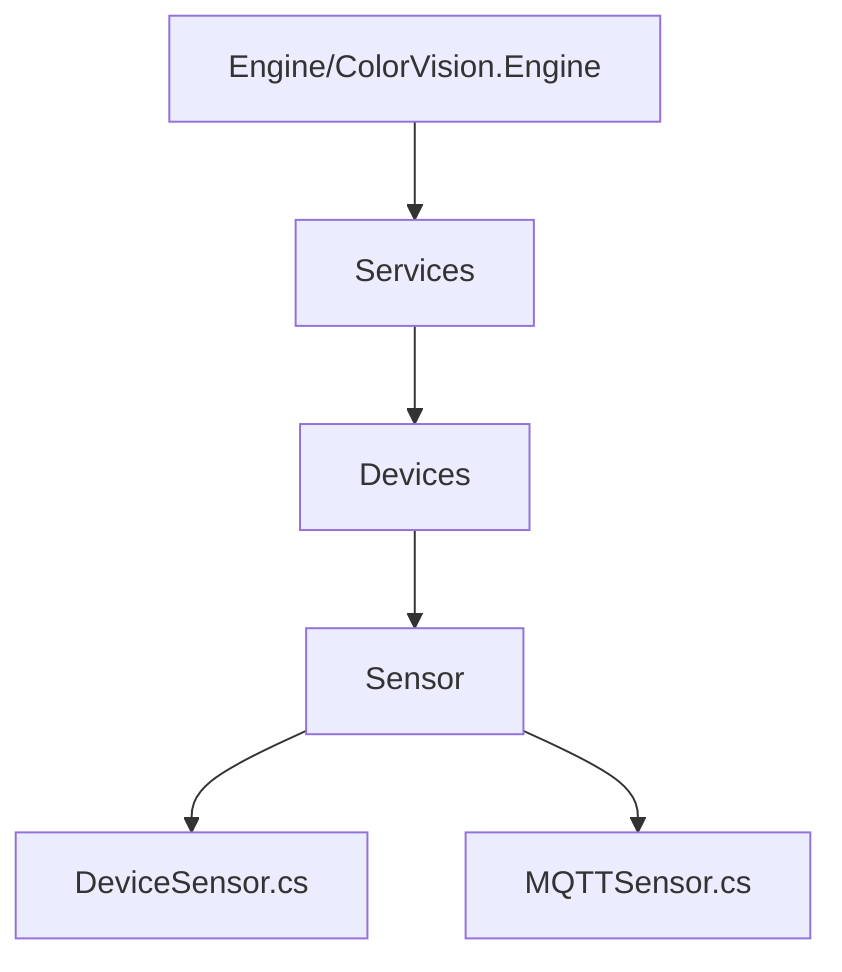

# 传感器服务


# 传感器服务

## 目录
1. [简介](#简介)
2. [项目结构](#项目结构)
3. [核心组件](#核心组件)
4. [架构概览](#架构概览)
5. [详细组件分析](#详细组件分析)
6. [依赖关系分析](#依赖关系分析)
7. [性能考虑](#性能考虑)
8. [故障排除指南](#故障排除指南)
9. [结论](#结论)
10. [附录](#附录)

## 简介
传感器服务是本项目中负责集成和读取各类传感器数据（如温湿度、亮度等）的关键模块。它不仅支持传感器数据的采集，还提供了传感器的配置和校准功能。通过MQTT协议实现与传感器硬件的通信，确保数据的实时性和准确性。该服务设计注重易用性和权限控制，保证系统安全和稳定运行。

本文档旨在详细解释传感器服务的功能、架构及其核心代码实现，帮助技术人员和用户理解如何集成和使用传感器设备。

## 项目结构
传感器服务相关代码主要位于路径：
```
/Engine/ColorVision.Engine/Services/Devices/Sensor/
```
该目录下核心文件包括：
- `DeviceSensor.cs`：传感器设备服务的主要类，负责传感器设备的管理和界面交互。
- `MQTTSensor.cs`：基于MQTT协议的传感器通信实现类，负责发送命令和接收数据。

项目结构采用按功能模块划分的方式，`Services`目录下细分各类设备（如传感器、摄像头、光谱仪等），每个设备模块包含设备管理类、配置类、界面控件等，便于维护和扩展。



### 目录说明
- `Engine/ColorVision.Engine`：核心引擎代码，包含业务逻辑和设备服务实现。
- `Services`：服务层，管理设备和业务服务。
- `Devices`：设备相关代码分类。
- `Sensor`：传感器设备实现模块。

此分层结构清晰，便于针对不同设备独立开发和调试。

## 核心组件

### 1. DeviceSensor 类
位于 `DeviceSensor.cs`，继承自泛型设备服务基类 `DeviceService<ConfigSensor>`，用于管理传感器设备。

主要功能：
- 初始化MQTT传感器服务实例 `DService`。
- 提供编辑传感器配置的界面命令 `EditCommand`，并限制管理员权限使用。
- 返回传感器信息和显示控件的界面组件。
- 提供MQTT服务实例访问。

关键代码示例：
```csharp
public class DeviceSensor : DeviceService<ConfigSensor>
{
    public MQTTSensor DService { get; set; }

    public DeviceSensor(SysDeviceModel sysResourceModel) : base(sysResourceModel)
    {
        DService = new MQTTSensor(Config);
        EditCommand = new RelayCommand(a =>
        {
            EditSensor window = new(this);
            window.Owner = Application.Current.GetActiveWindow();
            window.WindowStartupLocation = WindowStartupLocation.CenterOwner;
            window.ShowDialog();
        }, a => AccessControl.Check(PermissionMode.Administrator));
    }

    public override UserControl GetDeviceInfo() => new InfoSensor(this);
    public override UserControl GetDisplayControl() => new DisplaySensor(this);

    public override MQTTServiceBase? GetMQTTService()
    {
        return DService;
    }
}
```

### 2. MQTTSensor 类
位于 `MQTTSensor.cs`，继承自 `MQTTDeviceService<ConfigSensor>`，实现基于MQTT协议的传感器通信。

主要功能：
- 打开传感器连接（`Open`方法），通过MQTT发送连接参数。
- 发送单个命令（`ExecCmd(SensorCmd command)`），支持对传感器执行指定操作。
- 发送模板命令（`ExecCmd(CVTemplateParam temp)`），用于批量或复杂指令。
- 关闭传感器连接（`Close`方法）。

关键代码示例：
```csharp
public class MQTTSensor : MQTTDeviceService<ConfigSensor>
{
    public MQTTSensor(ConfigSensor sensorConfig) : base(sensorConfig) { }

    public MsgRecord Open()
    {
        MsgSend msg = new()
        {
            EventName = "Open",
            Params = new Dictionary<string, object> {
                { "eCOM_Type", Config.Category },
                { "szIPAddress", Config.Addr },
                { "nPort", Config.Port }
            }
        };
        return PublishAsyncClient(msg);
    }

    public MsgRecord ExecCmd(SensorCmd command)
    {
        SensorExecCmdParam req = new();
        req.Cmd = command;
        MsgSend msg = new()
        {
            EventName = MQTTSensorEventEnum.Event_ExecCmd,
            Params = req,
        };
        return PublishAsyncClient(msg);
    }

    public void ExecCmd(CVTemplateParam temp)
    {
        SensorExecCmdParam req = new();
        req.TemplateParam = temp;
        req.Cmd = new SensorCmd() { CmdType = SensorCmdType.None };
        MsgSend msg = new()
        {
            EventName = MQTTSensorEventEnum.Event_ExecCmd,
            Params = req,
        };
        PublishAsyncClient(msg);
    }

    public void Close()
    {
        MsgSend msg = new()
        {
            EventName = "Close",
        };
        PublishAsyncClient(msg);
    }
}
```

## 架构概览
传感器服务架构基于面向对象设计，采用继承和组合模式实现设备管理和通信分离。具体架构特点：

- 设备服务基类 `DeviceService<T>` 提供通用设备管理接口。
- `DeviceSensor` 作为传感器设备的具体实现，负责配置管理和UI交互。
- `MQTTSensor` 负责MQTT通信协议细节，实现消息的发送与接收。
- 通过命令模式（`RelayCommand`）实现用户界面操作权限控制。
- 采用消息发布-订阅机制（MQTT）实现设备指令传输，支持异步通信。

整体架构保证了代码的模块化、可扩展性和维护性。

## 详细组件分析

### DeviceSensor.cs 分析
- 继承自 `DeviceService<ConfigSensor>`，泛型参数指定传感器配置类型。
- 构造函数中实例化MQTT服务 `DService`，并定义编辑命令，编辑窗口通过 `EditSensor` 类实现。
- 提供两个界面组件接口：
  - `GetDeviceInfo()` 返回传感器信息界面。
  - `GetDisplayControl()` 返回传感器数据显示界面。
- 重写 `GetMQTTService()` 返回MQTT服务实例。

### MQTTSensor.cs 分析
- 继承自 `MQTTDeviceService<ConfigSensor>`，利用配置初始化。
- `Open()` 方法构造带有通信类型、IP地址和端口参数的消息，发送开启连接指令。
- `ExecCmd(SensorCmd command)` 方法封装单个传感器命令，发送执行请求。
- `ExecCmd(CVTemplateParam temp)` 方法支持发送模板参数，适用于复杂操作。
- `Close()` 方法发送关闭设备指令。

## 依赖关系分析
- `DeviceSensor` 依赖 `MQTTSensor` 实现通信。
- `MQTTSensor` 依赖消息发送库 `MQTTMessageLib` 及其传感器相关命令定义。
- UI层通过 `UserControl` 提供设备信息和数据显示界面。
- 权限控制通过 `AccessControl` 检查，保证操作安全。

## 性能考虑
- MQTT异步消息发送保证通信效率，避免阻塞界面线程。
- 设备配置和命令封装简洁，减少消息体大小。
- UI组件分离，便于界面响应速度优化。

## 故障排除指南
- 若无法连接传感器，检查 `Open()` 方法传入的IP和端口配置。
- 权限不足时，编辑命令会被拒绝，需确保用户具备管理员权限。
- 发送命令无响应时，确认MQTT服务是否正常运行。

## 结论
传感器服务模块通过清晰的类结构和MQTT通信实现了对多种传感器的集成和管理。它支持传感器的配置、命令执行及数据展示，架构设计合理，易于扩展和维护。通过权限控制和异步通信保证了系统的安全性和响应性。

## 附录
- 代码文件链接：
  - [DeviceSensor.cs](https://github.com/xincheng213618/scgd_general_wpf/blob/main/Engine/ColorVision.Engine/Services/Devices/Sensor/DeviceSensor.cs)
  - [MQTTSensor.cs](https://github.com/xincheng213618/scgd_general_wpf/blob/main/Engine/ColorVision.Engine/Services/Devices/Sensor/MQTTSensor.cs)

