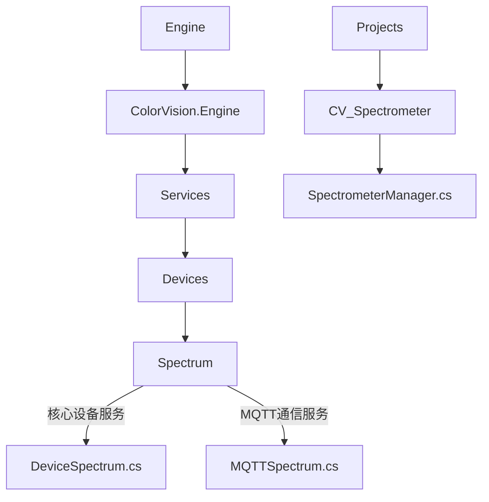
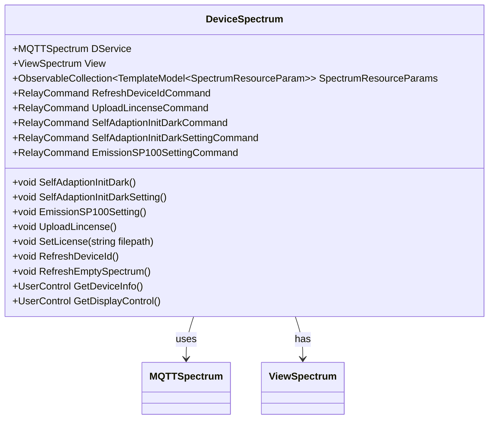
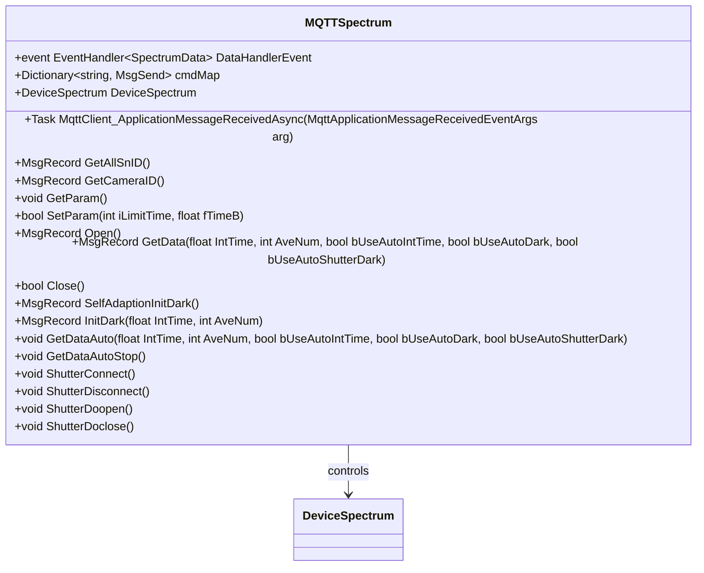
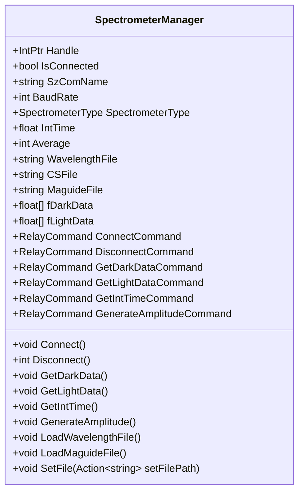

# 光谱仪服务

# 光谱仪服务

## 目录
1. [介绍](#介绍)
2. [项目结构](#项目结构)
3. [核心组件](#核心组件)
4. [架构概览](#架构概览)
5. [详细组件分析](#详细组件分析)
6. [依赖关系分析](#依赖关系分析)
7. [性能考虑](#性能考虑)
8. [故障排查指南](#故障排查指南)
9. [总结](#总结)
10. [附录](#附录)

## 介绍
本项目实现了光谱仪服务，支持光谱仪参数配置（如积分时间、平均次数）、光谱测量、数据处理与显示。核心功能包括通过MQTT协议与光谱仪设备通信，实现数据采集和控制，支持自适应校零、自动积分时间配置、许可证管理等功能。项目中`CV_Spectrometer`模块提供了光谱仪的具体管理和操作接口。

本文档旨在详细介绍光谱仪服务的架构、核心组件、关键代码实现及其功能，帮助用户和开发者理解和使用该服务。

---

## 项目结构
项目整体采用模块化设计，代码按功能和设备类型分层组织，主要目录结构如下：

- **Engine/ColorVision.Engine/Services/Devices/Spectrum**  
  包含光谱仪设备服务核心代码，分为设备服务类（`DeviceSpectrum.cs`）和基于MQTT的通信服务类（`MQTTSpectrum.cs`）。  
  - `DeviceSpectrum.cs`：封装了光谱仪设备的业务逻辑，包括设备参数管理、视图显示、许可证上传、自适应校零等功能。  
  - `MQTTSpectrum.cs`：负责通过MQTT协议与光谱仪设备通信，实现命令发送和数据接收，处理异步消息。  

- **Projects/CV_Spectrometer**  
  该模块为光谱仪的具体管理器，集中处理光谱仪的连接、数据采集、校零、自动积分时间等功能。  
  - `SpectrometerManager.cs`：管理光谱仪硬件连接及数据操作，提供命令绑定，支持文件加载（波长文件、幅值文件）、数据获取及自动积分时间配置。  

整体架构体现了设备服务与通信服务分离、配置与视图分离的设计思路，便于维护和扩展。

---

## 核心组件

### 1. DeviceSpectrum（设备服务类）

- 功能：封装光谱仪设备的业务逻辑，管理设备参数、视图、许可证、校零等。  
- 关键属性：  
  - `DService`：MQTT通信服务实例。  
  - `View`：设备视图界面。  
  - `SpectrumResourceParams`：光谱资源参数集合。  
- 关键命令：  
  - `RefreshDeviceIdCommand`：刷新设备ID。  
  - `UploadLincenseCommand`：上传许可证。  
  - `SelfAdaptionInitDarkCommand`：自适应校零执行。  
  - `SelfAdaptionInitDarkSettingCommand`：自适应校零参数设置。  
  - `EmissionSP100SettingCommand`：EmissionSP100参数设置。

### 2. MQTTSpectrum（MQTT通信服务类）

- 功能：通过MQTT协议与光谱仪设备通信，实现命令发送和异步消息接收处理。  
- 关键事件：  
  - `DataHandlerEvent`：数据接收事件，通知数据更新。  
- 关键方法：  
  - `GetData`：请求光谱数据，支持积分时间、平均次数及自动参数。  
  - `SetParam`：设置积分时间和平均次数。  
  - `Open`、`Close`：打开和关闭设备连接。  
  - `SelfAdaptionInitDark`：执行自适应校零。  
  - `ShutterConnect`等：控制快门相关操作。

### 3. SpectrometerManager（光谱仪管理器）

- 功能：管理光谱仪硬件连接、参数配置和数据采集。  
- 关键功能：  
  - 连接与断开设备。  
  - 获取暗电流数据和光照数据。  
  - 自动积分时间计算。  
  - 配置文件加载（波长文件、幅值文件）。  
  - 命令绑定，支持UI交互。

---

## 架构概览

光谱仪服务架构主要分为三层：

1. **设备管理层（DeviceSpectrum）**  
   负责设备参数管理、视图交互和业务逻辑实现，作为用户操作的入口。

2. **通信协议层（MQTTSpectrum）**  
   负责与光谱仪设备的消息通信，采用MQTT协议，发送控制命令，接收设备数据。

3. **硬件接口层（SpectrometerManager）**  
   直接操作光谱仪硬件，完成设备连接、数据采集和硬件参数设置。

三层协同工作，实现光谱仪的完整功能。

---

## 详细组件分析

### 1. DeviceSpectrum.cs

该类继承自通用设备服务基类`DeviceService<ConfigSpectrum>`，封装了光谱仪设备的功能。

- 构造函数  
  初始化MQTT通信服务`DService`和视图`View`，加载光谱资源参数，绑定命令。

- 主要方法  
  - `SelfAdaptionInitDark()`：调用MQTT服务执行自适应校零，执行完成后弹窗提示。  
  - `SelfAdaptionInitDarkSetting()`：弹出自适应校零参数配置窗口。  
  - `EmissionSP100Setting()`：弹出EmissionSP100参数配置窗口。  
  - `UploadLincense()`：弹出文件选择对话框，支持多文件上传，支持`.zip`和`.lic`格式许可证文件。  
  - `SetLicense(string filepath)`：解析许可证文件，保存许可证信息到数据库。  
  - `RefreshDeviceId()`：请求所有设备ID，并异步上传许可证。  
  - `RefreshEmptySpectrum()`：统计未配置值的光谱仪数量。

- 视图与UI  
  提供`GetDeviceInfo()`和`GetDisplayControl()`方法返回对应的WPF用户控件视图。

---

### 2. MQTTSpectrum.cs

该类继承自`MQTTDeviceService<ConfigSpectrum>`，实现基于MQTT的光谱仪设备通信。

- 事件  
  `DataHandlerEvent`用于广播接收到的光谱数据。

- 消息处理  
  通过`MqttClient_ApplicationMessageReceivedAsync`异步处理接收到的MQTT消息，解析不同事件名称（如`GetData`、`GetParam`等），并更新设备状态或触发UI更新。

- 主要方法  
  - `GetData(float IntTime, int AveNum, ...)`：请求光谱数据，支持自动积分时间和自动校零。  
  - `SetParam(int iLimitTime, float fTimeB)`：设置积分时间和平均次数参数。  
  - `Open()`、`Close()`：打开或关闭设备连接。  
  - `SelfAdaptionInitDark()`：执行自适应校零命令。  
  - 快门控制方法：`ShutterConnect()`、`ShutterDisconnect()`、`ShutterDoopen()`、`ShutterDoclose()`。

---

### 3. SpectrometerManager.cs

该类位于`CV_Spectrometer`项目中，负责直接操作光谱仪硬件。

- 属性  
  - 硬件句柄`Handle`，连接状态`IsConnected`。  
  - 设备串口号`SzComName`，波特率`BaudRate`，光谱仪类型`SpectrometerType`。  
  - 积分时间、平均次数、最大积分时间等参数。  
  - 波长文件、幅值文件路径。  
  - 暗电流和光照数据缓存数组。

- 命令绑定  
  - 连接、断开设备命令。  
  - 获取暗电流、光照数据命令。  
  - 生成幅值文件命令。  
  - 配置文件加载命令。

- 主要方法  
  - `Connect()`：初始化并连接光谱仪设备。  
  - `Disconnect()`：关闭连接并释放资源。  
  - `GetDarkData()`、`GetLightData()`：采集暗电流和光照数据。  
  - `GetIntTime()`：获取自动积分时间。  
  - `GenerateAmplitude()`：生成幅值文件。  
  - 文件加载和设置方法：`LoadWavelengthFile()`、`LoadMaguideFile()`、`SetFile()`等。

---

## 依赖关系分析

- `DeviceSpectrum`依赖`MQTTSpectrum`进行设备通信，负责业务逻辑和UI视图管理。  
- `MQTTSpectrum`作为通信层，负责消息的发送和接收，解耦了设备控制和网络通信。  
- `SpectrometerManager`直接调用底层硬件接口（如`Spectrometer.CM_Emission_Init`等），负责硬件交互。  
- 配置类（如`SetEmissionSP100Config`、`IntTimeConfig`）集中管理参数配置，支持界面编辑。

这种分层设计降低了耦合度，提高了代码的可维护性和扩展性。

---

## 性能考虑

- MQTT通信异步处理消息，避免阻塞UI线程。  
- 设备数据缓存（如`fDarkData`、`fLightData`）避免频繁内存分配。  
- 使用`Lazy<T>`延迟加载视图，节省启动资源。  
- 支持自动积分时间和自适应校零，提高测量效率和准确性。

---

## 故障排查指南

- 连接失败：检查串口号和波特率设置，确认设备已正确连接。  
- 数据获取异常：查看MQTT消息日志，确认消息格式和设备状态。  
- 许可证上传失败：确认文件格式为`.zip`或`.lic`，并检查解压权限。  
- 配置文件加载失败：确认文件路径正确且文件格式符合规范。  
- 自动积分时间异常：检查配置参数`IntLimitTime`和`AutoIntTimeB`是否合理。

---

## 总结

本光谱仪服务实现了设备管理、参数配置、数据采集和显示的完整功能。通过MQTT协议实现设备通信，采用分层架构设计，代码结构清晰，易于维护和扩展。`CV_Spectrometer`项目提供了硬件层操作接口，支持多种参数配置和自动化功能。许可证管理功能保证软件合法使用。整体设计兼顾性能和用户体验，适合光谱仪应用场景。

---

## 附录

### 参考文件

- [DeviceSpectrum.cs](https://github.com/xincheng213618/scgd_general_wpf/blob/master/Engine/ColorVision.Engine/Services/Devices/Spectrum/DeviceSpectrum.cs)  
- [MQTTSpectrum.cs](https://github.com/xincheng213618/scgd_general_wpf/blob/master/Engine/ColorVision.Engine/Services/Devices/Spectrum/MQTTSpectrum.cs)  
- [SpectrometerManager.cs](https://github.com/xincheng213618/scgd_general_wpf/blob/master/Projects/CV_Spectrometer/SpectrometerManager.cs)  

