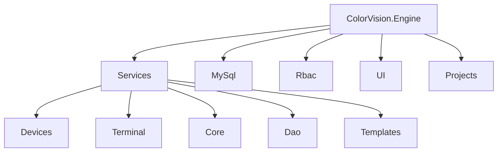
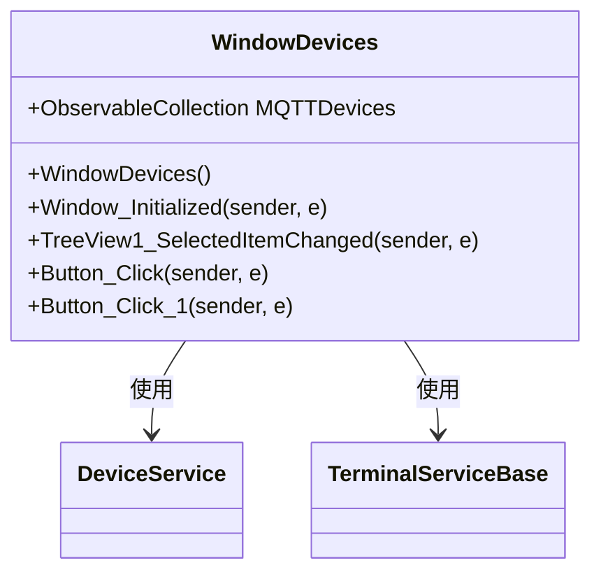
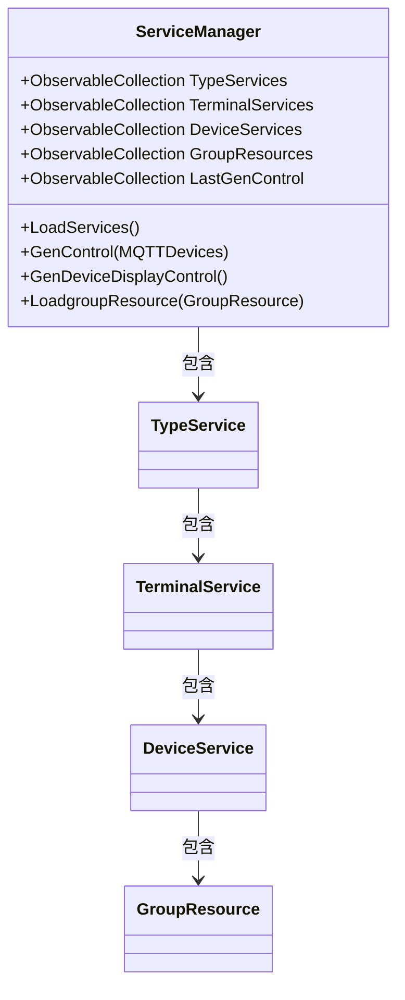

# 设备管理与服务


# 设备管理与服务

## 目录
1. [介绍](#介绍)
2. [项目结构](#项目结构)
3. [核心组件](#核心组件)
4. [架构概览](#架构概览)
5. [详细组件分析](#详细组件分析)
   - [WindowDevices.xaml.cs](#windowdevicesxamlcs)
   - [ServiceManager.cs](#servicemanagercs)
6. [依赖分析](#依赖分析)
7. [性能考虑](#性能考虑)
8. [故障排查指南](#故障排查指南)
9. [总结](#总结)
10. [附录](#附录)

## 介绍
ColorVision 的设备管理功能旨在实现对各种硬件设备的添加、配置和监控。该功能支持多种设备类型，如摄像头、光谱仪、传感器、马达等，通过统一的服务管理体系，实现设备的集中管理和界面展示。本文档将全面介绍设备管理模块的架构设计、核心代码结构及其功能实现，帮助用户理解如何添加、配置和监控硬件设备，并为每种设备类型提供专门的配置和使用指南。

## 项目结构
项目采用模块化设计，代码按功能和设备类型进行组织，主要目录和职责如下：



- **/Engine/ColorVision.Engine/Services/**  
  设备管理的核心目录，包含设备服务(DeviceService)及其子类，设备类型划分明确（如Camera、SMU、Sensor等），并包含服务管理(ServiceManager)和窗口交互类(WindowDevices)。

- **/Engine/ColorVision.Engine/Services/Devices/**  
  具体设备类型实现目录，每种设备类型有独立文件夹和配置、视图、控制逻辑，如Camera、Motor、Spectrum等。

- **/Engine/ColorVision.Engine/Services/Terminal/**  
  终端服务相关功能，支持设备的终端交互功能。

- **/Engine/ColorVision.Engine/Services/Core/**  
  基础服务类和接口定义。

- **/Engine/ColorVision.Engine/Services/Dao/**  
  数据访问层，封装数据库操作。

- **/Engine/ColorVision.Engine/MySql/**  
  MySQL数据库连接和ORM支持。

- **/Engine/ColorVision.Engine/Rbac/**  
  角色权限控制相关。

- **/UI/**  
  用户界面相关代码。

- **/Projects/**  
  项目配置和特定项目实现。

该结构清晰分离了设备类型、服务管理、数据库访问和界面交互，易于维护和扩展。

## 核心组件
- **ServiceManager**  
  设备服务管理单例，负责加载所有设备服务，维护设备服务集合，生成设备显示控件，管理设备与终端的关系。

- **DeviceService及子类**  
  代表具体设备的服务类，如DeviceCamera、DeviceMotor等，封装设备特有的配置和操作逻辑。

- **WindowDevices**  
  设备管理窗口，展示设备树形列表，支持设备信息展示和配置界面调用。

- **GroupResource**  
  设备资源分组，支持设备下的资源管理。

## 架构概览
ColorVision设备管理模块基于服务管理器(ServiceManager)的单例模式，统一管理设备服务集合和终端服务集合。服务管理器通过数据库加载设备和资源信息，实例化对应的设备服务对象，并维护它们的层级关系。用户通过WindowDevices窗口与设备服务交互，设备服务提供对应的界面控件供窗口展示和配置。

设备服务通过继承DeviceService基类实现多态，支持不同设备类型扩展。服务管理器负责生成所有设备的显示控件，并通过DisPlayManager进行统一管理和展示。

## 详细组件分析

### WindowDevices.xaml.cs
Source:  
- [https://github.com/xincheng213618/scgd_general_wpf/blob/master/Engine/ColorVision.Engine/Services/WindowDevices.xaml.cs](WindowDevices.xaml.cs)

#### 目的
WindowDevices 是设备管理的主窗口交互逻辑，负责显示当前所有设备服务的树形结构，支持设备信息和配置界面的动态加载，并处理用户的交互操作。

#### 关键类与方法
1. **WindowDevices() 构造函数**  
   初始化窗口，调用 `InitializeComponent()` 加载XAML界面，应用窗口标题样式。

2. **Window_Initialized**  
   窗口初始化事件，设置设备列表数据源 `MQTTDevices`，绑定到树形控件 `TreeView1`，并设置界面数据上下文。

3. **TreeView1_SelectedItemChanged**  
   监听树形控件选中项变化，根据选中设备类型动态加载设备信息控件或终端控件，显示在右侧面板。

4. **Button_Click**  
   确认按钮事件，调用 `ServiceManager.GenControl` 生成设备显示控件后关闭窗口。

5. **Button_Click_1**  
   打开设备设置窗口 `WindowDevicesSetting`，关闭后刷新设备列表并自动选中第一个设备节点。

#### 代码示例
```csharp
private void TreeView1_SelectedItemChanged(object sender, RoutedPropertyChangedEventArgs<object> e)
{
    StackPanelShow.Children.Clear();
    if (TreeView1.SelectedItem is DeviceService baseObject)
        StackPanelShow.Children.Add(baseObject.GetDeviceInfo());

    if (TreeView1.SelectedItem is TerminalServiceBase baseService)
        StackPanelShow.Children.Add(baseService.GenDeviceControl());
}
```
此方法根据选中设备类型，动态加载对应的设备信息或终端交互控件，增强用户体验。

#### 结构图示



#### 说明
WindowDevices作为用户操作入口，负责设备树展示和配置信息加载，依赖ServiceManager提供设备数据，界面动态响应用户操作。

---

### ServiceManager.cs
Source:  
- [https://github.com/xincheng213618/scgd_general_wpf/blob/master/Engine/ColorVision.Engine/Services/ServiceManager.cs](ServiceManager.cs)

#### 目的
ServiceManager 是设备管理的核心管理类，采用单例设计模式，负责加载设备服务、维护设备集合、生成设备显示控件、管理设备与资源的层级关系。

#### 关键属性
- `TypeServices`：设备类型服务集合，表示设备分类。
- `TerminalServices`：终端服务集合。
- `DeviceServices`：所有设备服务集合。
- `GroupResources`：设备资源分组集合。
- `LastGenControl`：最近生成的设备控件集合。

#### 关键方法
1. **GetInstance()**  
   单例获取方法，保证全局唯一实例。

2. **LoadServices()**  
   读取数据库中设备类型、终端和设备资源信息，实例化对应的服务对象，构建设备层级结构。  
   该方法通过多次数据库调用加载系统字典、资源和设备信息，动态创建不同类型设备的服务对象（如DeviceCamera、DeviceMotor等）。

3. **GenControl(ObservableCollection<DeviceService>)**  
   根据传入设备集合生成对应的显示控件，并插入到显示管理器中。

4. **GenDeviceDisplayControl()**  
   根据设备类型服务集合递归生成所有设备的显示控件，支持显示管理器的控件恢复。

5. **LoadgroupResource(GroupResource)**  
   递归加载设备资源分组及其子资源，构建资源树。

#### 代码示例
```csharp
public void LoadServices()
{
    LastGenControl?.Clear();
    List<SysDictionaryModel> SysDictionaryModels = SysDictionaryDao.Instance.GetAllByPid(1);

    TypeServices.Clear();
    foreach (var sysDictionaryModel in SysDictionaryModels)
    {
        TypeService typeService = new();
        typeService.Name = sysDictionaryModel.Name ?? "未配置";
        typeService.SysDictionaryModel = sysDictionaryModel;
        TypeServices.Add(typeService);
    }

    TerminalServices.Clear();

    foreach (var typeService1 in TypeServices)
    {
        List<SysResourceModel> sysResourceModelServices = SysResourceDao.Instance.GetAllByParam(new Dictionary<string, object>() { { "type",(int)typeService1.ServiceTypes },{ "tenant_id", UserConfig.TenantId }, { "is_delete", 0} });
        foreach (var sysResourceModel in sysResourceModelServices)
        {
            TerminalService terminalService = new TerminalService(sysResourceModel);
            typeService1.AddChild(terminalService);
            TerminalServices.Add(terminalService);
        }
    }

    List<SysDeviceModel> sysResourceModelDevices = VSysDeviceDao.Instance.GetAll(UserConfig.TenantId);
    DeviceServices.Clear();

    foreach (var terminalService in TerminalServices)
    {
        var sysResourceModels = sysResourceModelDevices.FindAll((x) => x.Pid == (int)terminalService.SysResourceModel.Id);
        foreach (var sysResourceModel in sysResourceModels)
        {
            DeviceService deviceService = null;

            switch ((ServiceTypes)sysResourceModel.Type)
            {
                case ServiceTypes.Camera:
                    deviceService = new DeviceCamera(sysResourceModel);
                    break;
                case ServiceTypes.PG:
                    deviceService = new DevicePG(sysResourceModel);
                    break;
                // 省略其他设备类型创建
            }

            if (deviceService != null)
            {
                terminalService.AddChild(deviceService);
                DeviceServices.Add(deviceService);
            }
        }
    }

    // 资源分组加载略
}
```

#### 结构图示



#### 说明
ServiceManager作为设备管理的核心，负责设备服务的生命周期管理和层次结构构建。它通过数据库动态加载设备和资源，支持多种设备类型扩展。该设计保证了系统的灵活性和可扩展性。

---

## 依赖分析
- ServiceManager 依赖数据库访问层（SysDictionaryDao、SysResourceDao、VSysDeviceDao）动态加载设备信息。
- 设备服务类继承自DeviceService基类，实现多态，便于新增设备类型。
- WindowDevices依赖ServiceManager提供设备数据，依赖设备服务提供UI控件。
- 设备显示控件通过DisPlayManager统一管理，支持动态生成和恢复。

## 性能考虑
- 设备和资源信息加载采用延迟加载和集合缓存，避免重复数据库访问。
- 设备显示控件的生成和恢复机制减少界面刷新开销。
- 使用ObservableCollection保证界面数据绑定的动态更新。

## 故障排查指南
- 确认数据库连接状态，ServiceManager会监听MySqlControl连接变化自动加载服务。
- 设备显示异常时，检查ServiceManager的设备集合是否正确加载。
- 设备配置界面未显示，确认WindowDevices中树形控件选中事件是否正确触发。

## 总结
ColorVision设备管理模块设计清晰，采用单例管理器统一管理设备服务，支持多种设备类型的扩展和动态加载。通过WindowDevices窗口实现设备的展示和配置交互，保证用户体验的流畅和灵活。系统架构支持设备资源的分组管理，便于复杂设备环境的维护。整体设计兼顾性能和扩展性，适合工业级设备管理需求。

## 附录
- 代码示例来源：
  - [WindowDevices.xaml.cs](https://github.com/xincheng213618/scgd_general_wpf/blob/master/Engine/ColorVision.Engine/Services/WindowDevices.xaml.cs)
  - [ServiceManager.cs](https://github.com/xincheng213618/scgd_general_wpf/blob/master/Engine/ColorVision.Engine/Services/ServiceManager.cs)

