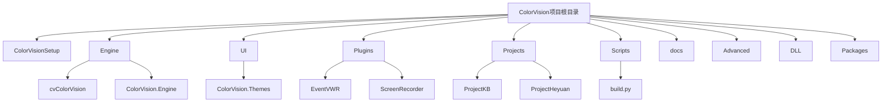

# 入门指南

# 入门指南

## 目录
1. [介绍](#介绍)
2. [项目结构](#项目结构)
3. [核心组件](#核心组件)
4. [架构概述](#架构概述)
5. [详细组件分析](#详细组件分析)
6. [依赖分析](#依赖分析)
7. [性能考虑](#性能考虑)
8. [故障排查指南](#故障排查指南)
9. [总结](#总结)
10. [附录](#附录)

---

## 介绍
ColorVision 是一款专业的视觉检测软件，旨在为用户提供高效、精准的图像处理及分析功能。本指南主要面向新用户，帮助其快速完成软件安装、了解系统需求及首次运行的基础操作流程。文档还涉及开发者环境的初步搭建指引，便于开发者进行二次开发和维护。

---

## 项目结构

### 1. 总体架构与目录概览

ColorVision 项目采用模块化结构，代码按功能和技术层次划分，主要包含以下几个核心目录：

1. **/ColorVisionSetup/**  
   - 包含软件安装程序相关文件和配置，如安装项目文件（`.csproj`）、安装界面定义文件（`.xaml`）、自动更新逻辑等。  
   - 负责软件的安装、升级及更新机制。

2. **/Engine/**  
   - 主要业务逻辑实现目录，包含视觉算法、设备通讯、数据处理等核心引擎代码。  
   - 例如 `/Engine/cvColorVision/` 实现了视觉处理相关核心代码。  
   - `/Engine/ColorVision.Engine/` 是引擎的主框架，包含界面、MQTT通讯、数据库访问等模块。

3. **/UI/**  
   - 用户界面相关代码，包括主题管理、控件定义、界面交互逻辑。  
   - 负责软件的界面美化和用户体验。

4. **/Plugins/**  
   - 插件模块，包括事件查看器、屏幕录制、系统监控等扩展功能插件。  
   - 方便后续功能扩展和模块化维护。

5. **/Projects/**  
   - 具体项目实现目录，包含不同客户或不同功能的定制项目代码。  
   - 如 `/Projects/ProjectKB/`、`/Projects/ProjectHeyuan/` 等。

6. **/Scripts/**  
   - 自动化脚本和工具，如构建脚本、版本管理、文件上传脚本。  
   - 例如 `build.py` 用于自动构建和发布。

7. **/docs/**  
   - 文档资源，包含软件许可协议、API 文档、解决方案说明等。

8. **/Advanced/**  
   - 高级安装程序配置文件（`.aip`），用于 Advanced Installer 软件生成安装包。

9. **/DLL/** 和 **/Packages/**  
   - 第三方库和依赖的动态链接库及包管理文件。

### 2. 目录结构示意图

### 3. 说明

- **分层清晰**：项目将安装、核心引擎、UI、插件和具体项目分开管理，便于维护和扩展。  
- **技术栈**：主要基于 .NET Framework 4.8 / .NET 8.0，使用 WPF 进行界面开发，集成 OpenCV 等图像处理库。  
- **模块职责明确**：  
  - `ColorVisionSetup` 负责安装和更新流程。  
  - `Engine` 实现图像处理、设备通信和业务逻辑。  
  - `UI` 提供用户交互界面和主题支持。  
  - `Plugins` 为软件提供可插拔的扩展功能。  
  - `Projects` 为客户定制不同应用场景。  
- **自动化支持**：`Scripts/build.py` 脚本实现自动构建、版本管理及文件上传，支持持续集成。

---

## 核心组件

### 1. 安装程序（ColorVisionSetup）

- 负责软件的安装、升级和卸载。  
- 使用 Advanced Installer (`.aip` 文件) 配置安装界面、安装文件和依赖。  
- 包含自动更新逻辑和安装界面定义（`WindowUpdate.xaml`）。  

### 2. 核心引擎（Engine）

- 图像处理核心模块，包含视觉算法、相机控制、数据采集等。  
- 通过 MQTT 和 MySQL 实现设备通信和数据存储。  
- 设计多种模板和插件，支持不同检测算法和业务需求。  

### 3. 用户界面（UI）

- 基于 WPF 框架，支持多主题切换（`ColorVision.Themes`）。  
- 实现自定义控件、消息框、加载覆盖层等交互元素。  
- 通过 MVVM 模式实现界面与业务逻辑分离。

### 4. 插件系统（Plugins）

- 支持事件查看、屏幕录制、系统监控等功能扩展。  
- 插件采用独立项目，易于管理和更新。  

### 5. 项目模块（Projects）

- 针对不同客户或应用场景的定制开发。  
- 每个项目包含独立的窗口、配置和业务逻辑。  

---

## 架构概述

ColorVision 采用典型的分层架构：

- **表示层（UI）**：负责用户交互和界面显示。  
- **业务逻辑层（Engine）**：实现核心算法和业务流程。  
- **数据访问层**：通过 MySQL 和本地文件进行数据存储和读取。  
- **设备层**：管理硬件设备通信，如相机、传感器、光源等。  
- **插件层**：提供可扩展的功能模块。  
- **安装与更新层（Setup）**：管理软件安装和升级流程。

各层通过接口和事件机制解耦，确保系统灵活性和可维护性。

---

## 详细组件分析

### 1. 安装程序项目文件分析（ColorVisionSetup.csproj）

- 定义了目标框架为 .NET Framework 4.8，支持 x64 平台。  
- 包含应用入口（`App.xaml`）、主窗口、自动更新逻辑（`AutoUpdater.cs`）等。  
- 引用多种系统和 WPF 相关程序集，支持界面和网络功能。  
- 使用签名文件 `ColorVision.snk` 保护程序集安全。  
- 配置了安装包发布路径和更新策略（目前关闭自动更新）。  

### 2. 安装包配置文件分析（ColorVision.aip）

- 使用 Advanced Installer 19.7.1 版本创建。  
- 定义安装目录结构，包含主程序目录、插件目录、项目目录、文档目录等。  
- 配置了安装文件列表，包含主程序、依赖库、插件 DLL、资源文件等。  
- 设置了安装条件，如最低支持 Windows 版本和 .NET Framework 版本（4.7.2 及以上）。  
- 配置了安装界面，包括许可协议显示、安装进度条、按钮等。  
- 定义了安装后快捷方式（桌面和开始菜单）。  
- 配置了数字签名和时间戳，确保安装包安全可信。  
- 支持多语言资源，包含中文、英文、日文、韩文、俄文等。  

### 3. 自动化构建脚本（build.py）

- 脚本自动调用 MSBuild 构建解决方案（`build.sln`），生成发布版本。  
- 使用 Advanced Installer 命令行工具重建安装包（`.aip` 文件）。  
- 支持从发布目录获取最新安装包文件，提取版本号。  
- 通过比较版本号决定是否更新版本记录和复制变更日志。  
- 支持将最新安装包复制到微信和百度云同步目录，方便分发。  
- 提供复制进度显示和上传反馈，提升自动化体验。  

---

## 依赖分析

- 使用多种第三方库支持功能实现，如 OpenCV（图像处理）、MQTTnet（设备通信）、MySql.Data（数据库访问）、Newtonsoft.Json（JSON 处理）、LiveCharts（图表绘制）、SkiaSharp（图形绘制）等。  
- 依赖 Windows WPF 框架组件实现界面和交互。  
- 通过插件机制支持功能扩展，插件间解耦良好。  
- 使用 Advanced Installer 管理安装包构建和发布，确保安装流程标准化。  

---

## 性能考虑

- 视觉算法模块采用高效的图像处理库 OpenCV，支持 CUDA 加速。  
- 自动化脚本优化文件复制和上传过程，支持进度显示，提升用户体验。  
- 采用分层架构和插件机制，减少模块耦合，提升系统维护性和扩展性。  

---

## 故障排查指南

- **安装失败**：检查系统是否满足 .NET Framework 4.7.2 及以上版本，确保操作系统版本符合要求。  
- **升级失败**：确认安装包版本号正确，自动更新功能是否开启。  
- **设备连接异常**：检查设备驱动是否安装，网络连接是否正常，MQTT 服务是否启动。  
- **界面显示异常**：确认 WPF 依赖库完整，主题资源是否正确加载。  
- **日志查看**：安装目录下查看 log4net 生成的日志文件，定位错误信息。  

---

## 总结

ColorVision 软件项目结构清晰，采用模块化设计，涵盖安装、核心视觉引擎、用户界面、插件扩展和具体项目定制。安装程序采用 Advanced Installer 管理，支持多语言和数字签名，确保安装体验良好。自动化构建脚本实现持续集成和版本管理，提升发布效率。整体架构分层合理，依赖丰富第三方库，支持高性能图像处理和设备通信。新用户可通过本指南快速完成安装和初步使用，开发者亦可基于此架构进行二次开发和维护。

---

## 附录

### 重要文件链接示例

- 安装项目文件  
  Source:  
  - [https://github.com/xincheng213618/scgd_general_wpf/blob/master/ColorVisionSetup/ColorVisionSetup.csproj](ColorVisionSetup.csproj)

- 安装包配置文件  
  Source:  
  - [https://github.com/xincheng213618/scgd_general_wpf/blob/master/Advanced/ColorVision.aip](ColorVision.aip)

- 自动化构建脚本  
  Source:  
  - [https://github.com/xincheng213618/scgd_general_wpf/blob/master/Scripts/build.py](build.py)

