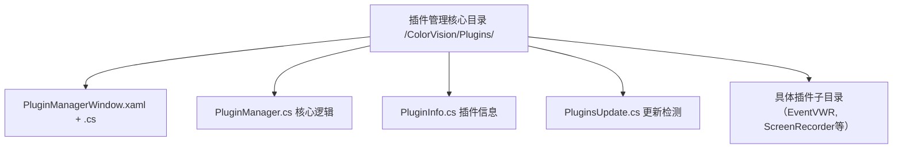
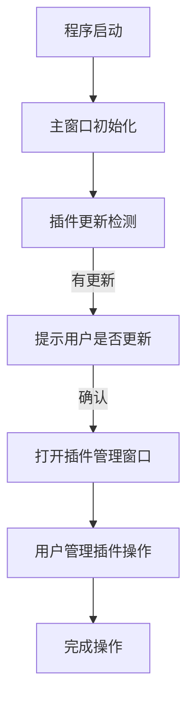

# 插件管理


# 插件管理

## Table of Contents
1. [Introduction](#introduction)
2. [Project Structure](#project-structure)
3. [Core Components](#core-components)
4. [Architecture Overview](#architecture-overview)
5. [Detailed Component Analysis](#detailed-component-analysis)
6. [Dependency Analysis](#dependency-analysis)
7. [Performance Considerations](#performance-considerations)
8. [Troubleshooting Guide](#troubleshooting-guide)
9. [Conclusion](#conclusion)
10. [Appendices](#appendices)

## Introduction

本项目旨在通过插件管理器实现插件的安装、更新检测、启用/禁用以及卸载功能。插件管理器为用户提供了一个统一的界面和后台逻辑，方便用户管理各种插件，提升系统的扩展性和灵活性。

插件管理功能主要包括：
- 安装新的插件
- 检查插件更新
- 启用或禁用插件
- 卸载不再需要的插件

本文档将详细介绍插件管理相关的代码结构、核心组件、架构设计及功能实现，帮助用户和开发者理解和使用插件管理功能。

## Project Structure

插件管理相关代码主要位于仓库路径 `/ColorVision/Plugins/` 目录下，包含多个插件子目录和核心管理代码文件。

### 1. 主要目录及文件说明

- `/ColorVision/Plugins/`  
  该目录是插件管理的核心目录，包含插件管理窗口、插件信息类、插件更新逻辑等核心代码。  
  - `PluginManagerWindow.xaml` 和 `PluginManagerWindow.xaml.cs`：插件管理界面的定义及交互逻辑。  
  - `PluginManager.cs`：插件管理核心逻辑（未展示，但根据命名推断）。  
  - `PluginInfo.cs`：插件信息类定义，描述插件的基本属性。  
  - `PluginsUpdate.cs`：插件更新检测和提示逻辑。  
  - `PluginsUpdate.cs` 实现了插件启动时自动检查更新的功能。  

- `/Plugins/` 子目录  
  包含具体的插件项目，如 `EventVWR`、`ScreenRecorder`、`SystemMonitor`、`WindowsServicePlugin` 等，每个插件独立管理其功能代码。  

### 2. 文件组织方式

- 代码按功能模块划分，插件管理相关代码集中在 `/ColorVision/Plugins/`，每个具体插件为独立子模块。  
- UI 界面文件使用 WPF 的 XAML 文件配合 C# 代码文件实现。  
- 命名规范清晰，类名和文件名直观反映其功能，如 `PluginManagerWindow` 表示插件管理窗口。  

### 3. 主要架构模块

- 插件管理窗口模块（UI层）  
- 插件管理核心逻辑模块（业务层）  
- 插件更新检测模块（服务层）  
- 各具体插件模块（功能实现层）  



## Core Components

### 1. PluginManagerWindow.xaml.cs

此文件实现插件管理窗口的交互逻辑，负责插件列表展示、插件选择和删除操作绑定。

主要功能：
- 初始化窗口，绑定插件管理实例数据上下文
- 设置默认搜索插件列表
- 绑定删除命令，允许用户通过界面删除选中插件
- 监听插件列表选择变化，更新插件详情显示区域

关键代码片段：

```csharp
public PluginManagerWindow()
{
    InitializeComponent();
    this.ApplyCaption();
    PluginWindowConfig.Instance.SetWindow(this);
    this.SizeChanged += (s, e) => PluginWindowConfig.Instance.SetConfig(this);
}

private void Window_Initialized(object sender, System.EventArgs e)
{
    this.DataContext = PluginManager.GetInstance();
    DefalutSearchComboBox.ItemsSource = new List<string>() { "ColorVisonChat", "EventVWR", "ScreenRecorder", "SystemMonitor", "WindowsServicePlugin" };
    ListViewPlugins.SelectedIndex = 0;
    this.CommandBindings.Add(new CommandBinding(ApplicationCommands.Delete, 
        (s, e) => PluginManager.GetInstance().Plugins[ListViewPlugins.SelectedIndex].Delete(), 
        (s, e) => e.CanExecute = ListViewPlugins.SelectedIndex > -1));
}

private void ListViewPlugins_SelectionChanged(object sender, System.Windows.Controls.SelectionChangedEventArgs e)
{
    if (ListViewPlugins.SelectedIndex > -1)
    {
        BorderContent.DataContext = PluginManager.GetInstance().Plugins[ListViewPlugins.SelectedIndex];
    }
}
```

### 2. PluginsUpdate.cs

此文件实现插件自动更新检测功能，在主窗口初始化时检查所有插件版本，提示用户更新。

主要功能：
- 判断是否开启自动更新
- 延迟6秒后遍历所有插件，比较插件当前版本与最新版本
- 若有新版本，弹出提示框询问用户是否更新
- 用户确认后打开插件管理窗口，方便用户执行更新操作
- 异常捕获并记录日志，保证程序稳定性

关键代码片段：

```csharp
public async Task Initialize()
{
    if (!PluginWindowConfig.Instance.IsAutoUpdate) return;

    log.Info("PluginsInitializedCheck");
    try
    {
        PluginManager.GetInstance();
        await Task.Delay(6000);
        foreach (var item in PluginManager.GetInstance().Plugins)
        {
            if (item.LastVersion > item.AssemblyVersion)
            {
                if (MessageBox.Show(Application.Current.GetActiveWindow(),
                    "检测到存在可以更新的插件，是否更新?", item.AssemblyName, MessageBoxButton.YesNo) == MessageBoxResult.Yes)
                {
                    new PluginManagerWindow() { Owner = Application.Current.GetActiveWindow(), WindowStartupLocation = WindowStartupLocation.CenterOwner }.ShowDialog();
                }
            }
        }
    }
    catch (Exception ex)
    {
        log.Error(ex);
    }
    return;
}
```

## Architecture Overview

插件管理架构基于典型的MVVM模式设计，界面层（View）通过数据绑定与业务逻辑层（ViewModel）交互，业务层调用管理类（PluginManager）操作插件数据。

架构特点：
- 插件管理窗口作为用户交互界面，负责展示插件列表和详情
- 插件管理核心类负责插件的加载、删除、启用/禁用等操作
- 插件更新模块独立负责版本检测和更新提示
- 插件以模块化方式独立开发，便于扩展和维护

整体流程：
用户启动程序 → 主窗口初始化 → 自动检测插件更新 → 用户通过插件管理窗口查看、启用、禁用、更新或卸载插件



## Detailed Component Analysis

### PluginManagerWindow.xaml.cs

- 类 `PluginManagerWindow` 继承自 `Window`，表示插件管理的窗口界面。
- 构造函数中调用 `InitializeComponent()` 初始化界面组件，应用窗口样式。
- 通过 `PluginWindowConfig` 类保存窗口配置，实现窗口大小变化时的配置保存。
- `Window_Initialized` 方法绑定插件管理实例为数据上下文，初始化插件搜索列表，绑定删除命令。
- `ListViewPlugins_SelectionChanged` 方法根据选中插件更新右侧详情面板的数据上下文。

### PluginsUpdate.cs

- 类 `PluginsUpdate` 实现接口 `IMainWindowInitialized`，表示在主窗口初始化时执行初始化逻辑。
- `Initialize` 异步方法中，首先检查是否开启自动更新。
- 延迟6秒确保系统稳定后，遍历所有插件，比较当前版本与最新版本。
- 通过消息框提示用户是否更新插件，确认后打开插件管理窗口。
- 使用日志记录操作和异常，保证良好的错误追踪。

## Dependency Analysis

- `PluginManagerWindow` 依赖 `PluginManager` 单例类获取插件列表和操作插件。
- `PluginsUpdate` 依赖 `PluginManager` 获取插件信息，依赖 `PluginWindowConfig` 判断自动更新配置。
- UI层通过数据绑定与业务逻辑层解耦，便于维护和扩展。
- 插件管理模块与具体插件模块解耦，通过接口或约定实现插件加载和卸载。

## Performance Considerations

- 插件更新检测采用异步延迟，避免阻塞主线程，提升用户体验。
- 插件管理窗口通过数据绑定动态更新界面，减少手动刷新代码，提升响应速度。
- 插件操作（如删除）通过命令绑定实现，符合WPF最佳实践。

## Troubleshooting Guide

- 如果插件更新提示未弹出，检查 `PluginWindowConfig.Instance.IsAutoUpdate` 配置是否开启。
- 插件删除操作需确保选中插件有效，否则删除命令不可执行。
- 异常日志可通过 `log4net` 日志系统查看，定位插件管理相关错误。
- 窗口大小配置异常可检查 `PluginWindowConfig` 保存机制。

## Conclusion

本插件管理模块设计合理，功能完善，采用现代WPF MVVM架构，通过插件管理窗口实现插件的安装、更新、启用和卸载。自动更新检测功能增强了系统的维护性和用户体验。整体架构模块化，便于扩展和维护，满足用户对插件灵活管理的需求。

## Appendices

### 参考代码文件

- [PluginManagerWindow.xaml.cs](https://github.com/xincheng213618/scgd_general_wpf/blob/master/ColorVision/Plugins/PluginManagerWindow.xaml.cs)
- [PluginsUpdate.cs](https://github.com/xincheng213618/scgd_general_wpf/blob/master/ColorVision/Plugins/PluginsUpdate.cs)

