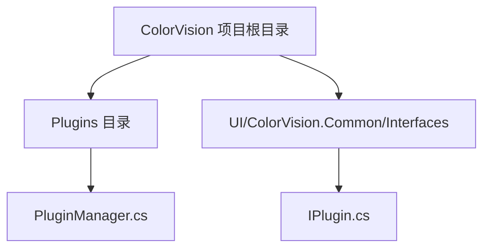
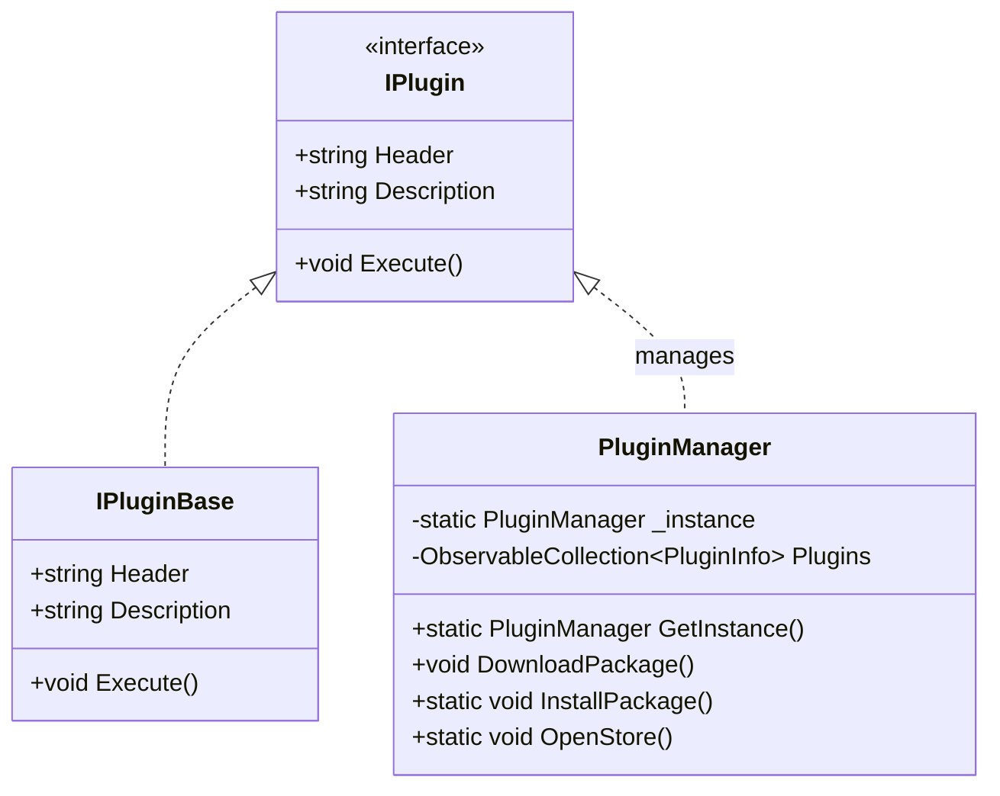

# 插件系统


# 插件系统

## 目录
1. [引言](#引言)
2. [项目结构](#项目结构)
3. [核心组件](#核心组件)
4. [架构概览](#架构概览)
5. [详细组件分析](#详细组件分析)
6. [依赖关系分析](#依赖关系分析)
7. [性能考虑](#性能考虑)
8. [故障排除指南](#故障排除指南)
9. [结论](#结论)

## 引言
ColorVision 的插件系统提供了一个灵活的生态环境，允许用户通过安装、更新和管理插件来扩展系统功能。本文档旨在介绍插件系统的架构与功能，指导用户如何使用已有的标准插件，并为开发者提供插件开发的入门指导。文档内容深入浅出，适合技术背景有限的读者理解。

## 项目结构

ColorVision 插件系统的代码主要集中在 `/ColorVision/Plugins` 目录下，核心插件管理逻辑在 `PluginManager.cs` 中实现。插件接口定义位于 `/UI/ColorVision.Common/Interfaces/IPlugin.cs`，定义了插件的标准行为。

### 主要目录与文件
1. `/ColorVision/Plugins/`  
   该目录包含插件管理相关的代码和资源，其中：
   - `PluginManager.cs`：插件管理核心类，实现插件的加载、安装、更新和下载。
   - 其他插件相关子目录和批处理脚本等。

2. `/UI/ColorVision.Common/Interfaces/`  
   存放公共接口定义，`IPlugin.cs` 定义了插件接口 `IPlugin` 和基础抽象类 `IPluginBase`，插件开发需实现此接口。

3. 其他目录（如 `/Engine/`, `/UI/` 等）包含系统的其他功能模块，但插件系统核心逻辑主要集中在上述路径。



## 核心组件

### 1. 插件接口 (IPlugin)
定义插件必须实现的接口，包括插件的标题、描述和执行方法。  
接口代码示例：

```csharp
public interface IPlugin
{
    string Header { get; }
    string Description { get; }
    void Execute();
}

public abstract class IPluginBase : IPlugin
{
    public virtual string Header { get; set; }
    public virtual string Description { get; set; }
    public virtual void Execute() { }
}
```

插件开发者需继承 `IPlugin` 或 `IPluginBase`，实现具体功能。

### 2. 插件管理器 (PluginManager)
负责插件的生命周期管理，包括：
- 自动检测和加载插件
- 插件安装（通过 ZIP 文件）
- 插件下载和更新（从远程服务器获取最新版本）
- 插件配置管理（如是否自动更新）

主要功能函数：
- `GetInstance()`：单例模式获取插件管理器实例。
- `DownloadPackage()`：异步下载指定插件的最新版本。
- `InstallPackage()`：通过文件对话框选择 ZIP 文件安装插件。
- `InstallFromZip()`：解压 ZIP 并替换插件目录，实现插件安装或更新。
- `OpenStore()`：打开插件商店网页。

插件管理器通过扫描所有程序集，查找实现了 `IPlugin` 接口的类型并实例化，动态加载插件。

## 架构概览

插件系统采用典型的插件架构设计，核心是插件接口定义和插件管理器。插件通过实现统一接口，插件管理器负责发现、加载和管理这些插件。系统支持插件的动态安装和远程更新，保障插件生态的灵活扩展。

架构关键点：
- **插件接口统一规范**：保证所有插件行为一致，便于管理。
- **单例管理器**：确保插件管理的唯一性和全局访问。
- **动态程序集扫描**：运行时加载插件，提高扩展性。
- **异步下载与更新**：提升用户体验，自动化插件维护。
- **批处理辅助安装**：利用 Windows 批处理脚本实现插件文件替换和程序重启。



## 详细组件分析

### PluginManager.cs

#### 功能概述
- 单例设计模式确保全局唯一实例。
- 构造函数中扫描所有程序集，查找实现 `IPlugin` 的类，实例化并加入插件列表。
- 提供命令绑定支持 UI 操作，如打开插件商店、安装插件包、下载插件包。
- 下载插件时，先获取最新版本号，确认后下载 ZIP 包，解压并通过批处理脚本替换插件目录，重启程序完成更新。
- 支持用户通过文件对话框选择本地 ZIP 文件安装插件。

#### 关键方法说明

- `DownloadPackage()`
  - 异步获取远程插件最新版本。
  - 弹窗确认是否下载。
  - 下载完成后解压至临时目录。
  - 生成批处理文件执行插件文件替换并重启程序。
  - 处理异常，提示更新失败。

- `InstallPackage()`
  - 弹出文件选择对话框，选中 ZIP 文件后调用 `InstallFromZip()`。
  
- `InstallFromZip(string zipFilePath)`
  - 解压 ZIP 文件至临时目录。
  - 生成批处理文件替换插件目录并重启程序。
  - 处理异常，提示更新失败。

- `OpenStore()`
  - 通过系统默认浏览器打开插件商店网页。

#### 代码示例

```csharp
public static void InstallFromZip(string zipFilePath)
{
    Application.Current.Dispatcher.Invoke(() =>
    {
        try
        {
            string tempDirectory = Path.Combine(Path.GetTempPath(), "ColorVisionPluginsUpdate");
            if (Directory.Exists(tempDirectory))
            {
                Directory.Delete(tempDirectory, true);
            }
            ZipFile.ExtractToDirectory(zipFilePath, tempDirectory);

            string batchFilePath = Path.Combine(tempDirectory, "update.bat");
            string programPluginsDirectory = AppDomain.CurrentDomain.BaseDirectory + "/Plugins";

            string? executableName = Path.GetFileName(Environment.ProcessPath);

            string batchContent = $@"
@echo off
taskkill /f /im \"{executableName}\"
timeout /t 0
xcopy /y /e \"{tempDirectory}\\*\" \"{programPluginsDirectory}\"
start \"\" \"{Path.Combine(AppDomain.CurrentDomain.BaseDirectory, executableName)}\"  -c MenuPluginManager
rd /s /q \"{tempDirectory}\"
del \"%~f0\" & exit
";
            File.WriteAllText(batchFilePath, batchContent);

            ProcessStartInfo startInfo = new()
            {
                FileName = batchFilePath,
                UseShellExecute = true,
                WindowStyle = ProcessWindowStyle.Hidden
            };
            if (Environment.CurrentDirectory.Contains("C:\\Program Files"))
            {
                startInfo.Verb = "runas"; // 请求管理员权限
                startInfo.WindowStyle = ProcessWindowStyle.Normal;
            }
            Process.Start(startInfo);
            Environment.Exit(0);
        }
        catch (Exception ex)
        {
            MessageBox.Show($"更新失败: {ex.Message}");
        }
    });
}
```

### IPlugin.cs

#### 功能概述
- 定义插件必须实现的接口，包括插件标题、描述和执行入口。
- 提供基础抽象类 `IPluginBase`，插件开发者可继承该类简化实现。

#### 代码结构

```csharp
public interface IPlugin
{
    string Header { get; }
    string Description { get; }
    void Execute();
}

public abstract class IPluginBase : IPlugin
{
    public virtual string Header { get; set; }
    public virtual string Description { get; set; }
    public virtual void Execute() { }
}
```

## 依赖关系分析

- 插件管理器依赖于 `IPlugin` 接口来识别和管理插件。
- 使用 `AssemblyHandler` 动态加载程序集，反射查找插件实现。
- 依赖 `DownloadFile` 类实现插件包的下载功能。
- 依赖 Windows API 和批处理脚本完成插件文件替换和程序重启。
- UI 命令绑定使用 MVVM 模式的 `RelayCommand` 实现。
- 日志记录通过 `log4net` 实现。

## 性能考虑

- 插件加载采用程序集扫描，首次加载时可能稍慢，但保证插件动态发现。
- 插件包下载和安装使用异步操作，避免阻塞 UI。
- 插件更新通过临时目录和批处理脚本操作，保证安全和完整性。
- 使用缓存和版本号判断减少不必要的下载。

## 故障排除指南

- 如果插件下载失败，检查网络连接和远程服务器地址。
- 安装或更新插件时，确保程序有管理员权限，尤其安装目录在“Program Files”时。
- 若插件无法加载，确认插件实现了 `IPlugin` 接口且程序集正确加载。
- 日志文件中记录了插件加载和更新过程，查看日志有助于定位问题。

## 结论

ColorVision 插件系统设计合理，支持插件的动态加载、安装和远程更新。通过统一接口规范和插件管理器的单例模式，实现了插件生态的灵活扩展。系统采用异步下载和批处理脚本结合的方式保证了更新过程的安全和用户体验。文档通过详细代码分析和示例，帮助用户和开发者理解和使用插件系统。

