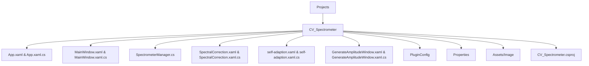
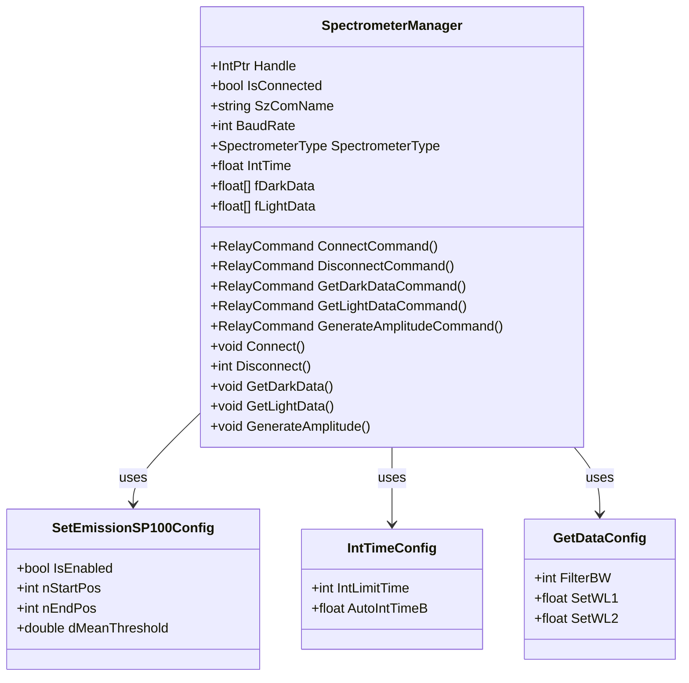

# CV_Spectrometer 项目


# CV_Spectrometer 项目

## 目录
1. [介绍](#介绍)
2. [项目结构](#项目结构)
3. [核心组件](#核心组件)
4. [架构概览](#架构概览)
5. [详细组件分析](#详细组件分析)
6. [依赖关系分析](#依赖关系分析)
7. [性能考虑](#性能考虑)
8. [故障排除指南](#故障排除指南)
9. [结论](#结论)
10. [附录](#附录)

## 介绍
CV_Spectrometer 项目是一个基于 WPF 的光谱仪应用实现，主要功能是对光谱仪设备进行连接、数据采集、自动积分时间调整、数据校零以及生成幅值文件等操作。该项目利用了 OpenCVSharp 进行图像处理，并集成了丰富的配置管理和用户界面交互，适用于光谱测量及相关科研或工业应用场景。

项目采用现代 .NET 8.0 框架，结合 MVVM 设计模式，旨在为用户提供稳定高效的光谱数据采集和分析解决方案。

---

## 项目结构

通过分析项目目录和文件，CV_Spectrometer 项目结构清晰，模块划分合理，主要目录和文件说明如下：



### 1. Projects/CV_Spectrometer
这是光谱仪项目的核心目录，包含了程序的主要界面文件（XAML）和逻辑实现（C#）。其中：

- **App.xaml & App.xaml.cs**：应用程序入口，负责应用启动和全局资源管理。
- **MainWindow.xaml & MainWindow.xaml.cs**：主窗口界面及其后台逻辑，用户的主要交互界面。
- **SpectrometerManager.cs**：光谱仪管理核心类，封装设备连接、数据采集、配置管理等功能。
- **SpectralCorrection.xaml(.cs)**：光谱校正相关界面和逻辑。
- **self-adaption.xaml(.cs)**：自适应功能相关界面和逻辑。
- **GenerateAmplitudeWindow.xaml(.cs)**：生成幅值文件的界面和逻辑。
- **PluginConfig**：插件配置相关代码，支持扩展功能。
- **Properties**：资源文件和配置文件，如应用设置和本地化资源。
- **Assets/Image**：存放光谱相关图像资源，如 CIE-1931 色度图。
- **CV_Spectrometer.csproj**：项目文件，定义项目配置、依赖和构建规则。

### 2. 依赖及引用
项目引用了两个重要的子项目：

- `Engine/cvColorVision/cvColorVision.csproj`：底层光谱和视觉算法引擎。
- `UI/ColorVision.UI/ColorVision.UI.csproj`：通用 UI 组件库。

此外，项目还使用了以下 NuGet 包：

- `Microsoft.Xaml.Behaviors.Wpf`：WPF 行为扩展，支持 MVVM 绑定交互。
- `OpenCvSharp4` 及相关运行时和 WPF 扩展：OpenCV 的 .NET 封装，用于图像处理。
- `ScottPlot.WPF`：图表绘制库，用于数据可视化。

---

## 核心组件

### 1. SpectrometerManager.cs

这是 CV_Spectrometer 的核心管理类，负责光谱仪设备的连接、数据采集、配置管理和控制命令。其主要功能包括：

- 设备连接与断开
- 自动积分时间获取与设置
- 暗电流数据和光强数据采集
- 幅值文件生成
- 波长文件和幅值文件的加载与配置
- 配置界面命令绑定和数据通知

#### 主要类和属性

- `SpectrometerManager`：主管理类，继承自 `ViewModelBase`，实现数据绑定通知。
- `SetEmissionSP100Config`：EmissionSP100 设备特定配置。
- `IntTimeConfig`：自动积分时间配置。
- `GetDataConfig`：数据获取参数配置。

#### 关键方法示例

```csharp
public void Connect()
{
    Handle = Spectrometer.CM_CreateEmission((int)SpectrometerType);
    int ncom = int.Parse(SzComName.Replace("COM",""));
    int iR = Spectrometer.CM_Emission_Init(Handle, ncom, BaudRate);
    if (iR == 1)
    {
        MessageBox.Show("连接成功");
    }
    else
    {
        MessageBox.Show("连接失败");
    }
}
```

该方法用于创建设备句柄并初始化串口连接，连接成功与否通过弹窗提示用户。

---

## 架构概览

CV_Spectrometer 项目采用典型的 MVVM 架构：

- **Model**：设备配置类（如 `SetEmissionSP100Config`, `IntTimeConfig` 等）封装设备参数。
- **ViewModel**：`SpectrometerManager` 作为主要视图模型，提供设备操作逻辑和数据绑定。
- **View**：WPF 界面文件（XAML），负责用户交互和显示。

设备交互通过 `cvColorVision` 引擎提供的接口实现，利用底层 DLL 进行光谱数据采集和处理。

项目通过命令绑定（`RelayCommand`）实现界面与逻辑的解耦，支持配置编辑窗口弹出和数据实时刷新。

---

## 详细组件分析

### SpectrometerManager.cs 详细分析

#### 1. 类职责
- 管理光谱仪设备连接状态。
- 提供设备参数配置接口。
- 执行数据采集和处理命令。
- 维护数据缓存（暗电流和光强数据数组）。
- 处理文件路径设置及文件加载。

#### 2. 关键属性和命令

| 属性/命令名              | 类型              | 说明                             |
|-------------------------|-------------------|--------------------------------|
| `Handle`                | `IntPtr`          | 设备句柄                       |
| `IsConnected`           | `bool`            | 设备连接状态                   |
| `SzComName`             | `string`          | 串口名称（如 COM1）            |
| `BaudRate`              | `int`             | 波特率                         |
| `SpectrometerType`      | `SpectrometerType`| 设备类型枚举                   |
| `IntTime`               | `float`           | 积分时间                       |
| `fDarkData`             | `float[]`         | 暗电流数据数组                 |
| `fLightData`            | `float[]`         | 光强数据数组                   |
| `ConnectCommand`        | `RelayCommand`    | 连接设备命令                   |
| `DisconnectCommand`     | `RelayCommand`    | 断开设备命令                   |
| `GetDarkDataCommand`    | `RelayCommand`    | 获取暗电流数据命令             |
| `GetLightDataCommand`   | `RelayCommand`    | 获取光强数据命令               |
| `GenerateAmplitudeCommand` | `RelayCommand` | 生成幅值文件命令               |

#### 3. 重要方法说明

- **Connect()**  
  建立与光谱仪的串口连接，初始化设备。

- **Disconnect()**  
  关闭设备连接，释放资源。

- **GetDarkData()**  
  从设备采集暗电流数据，用于校零。

- **GetLightData()**  
  采集光强数据，进行光谱测量。

- **GenerateAmplitude()**  
  根据采集数据和配置文件生成幅值文件。

- **LoadWavelengthFile() 和 LoadMaguideFile()**  
  加载波长和幅值校正文件，配置设备参数。

#### 4. 代码片段示例

```csharp
public void GetIntTime()
{
    float fIntTime = IntTime;
    int ret = Spectrometer.CM_Emission_GetAutoTimeEx(Handle, ref fIntTime, IntLimitTime, AutoIntTimeB, Max);
    if (ret == 1)
    {
        IntTime = fIntTime;
        MessageBox.Show("获取成功");
    }
    else
    {
        MessageBox.Show("自动积分获取失败");
    }
}
```

该函数调用设备接口自动获取积分时间，成功后更新界面显示。

#### 5. 设计模式与架构原则

- **MVVM**：通过 `ViewModelBase` 实现属性通知，支持数据绑定。
- **命令模式**：使用 `RelayCommand` 封装用户操作。
- **单例模式**：通过 `ConfigService.Instance.GetRequiredService<T>()` 实现配置的单例访问。
- **解耦设计**：界面与设备交互通过命令和数据绑定分离。

#### 6. 错误处理与用户提示

- 设备操作结果通过返回值判断，弹窗提示用户操作成功或失败。
- 文件加载失败同样有对应提示。
- 连接失败时用户可知晓，便于排查硬件或配置问题。

#### 7. Mermaid 类关系图



---

## 依赖关系分析

- **Engine/cvColorVision**：提供底层光谱设备接口和算法支持。
- **UI/ColorVision.UI**：提供通用 UI 控件和 MVVM 基础设施。
- **OpenCvSharp4**：图像处理库，支持光谱数据处理和可视化。
- **ScottPlot.WPF**：绘图库，用于显示光谱图表。
- **log4net**：日志记录，便于调试和维护。

这些依赖确保了项目具备设备控制、数据处理、界面交互和日志管理的能力。

---

## 性能考虑

- 光谱数据采集涉及大量浮点数组操作，采用数组缓存数据以减少频繁内存分配。
- 自动积分时间获取优化避免长时间等待。
- 文件加载和配置操作异步或延迟执行，避免界面卡顿。
- 依赖 OpenCVSharp 进行高效图像处理和计算。

---

## 故障排除指南

- **连接失败**：检查串口号和波特率配置，确保设备正确连接且未被占用。
- **数据采集失败**：确认设备状态正常，尝试重新连接。
- **文件加载失败**：确认校正文件路径正确且格式符合要求。
- **自动积分时间获取失败**：检查设备是否支持自动积分功能，调整参数重试。

---

## 结论

CV_Spectrometer 项目是一个结构清晰、功能完善的光谱仪应用实现。它通过 MVVM 架构实现了设备控制和数据采集的高度解耦，结合强大的图像处理库和配置管理，为用户提供了灵活且高效的光谱测量解决方案。项目支持多种设备类型和配置，适合科研和工业应用。

---

## 附录

### 相关源码链接

- [CV_Spectrometer.csproj](https://github.com/xincheng213618/scgd_general_wpf/blob/main/Projects/CV_Spectrometer/CV_Spectrometer.csproj)
- [SpectrometerManager.cs](https://github.com/xincheng213618/scgd_general_wpf/blob/main/Projects/CV_Spectrometer/SpectrometerManager.cs)

