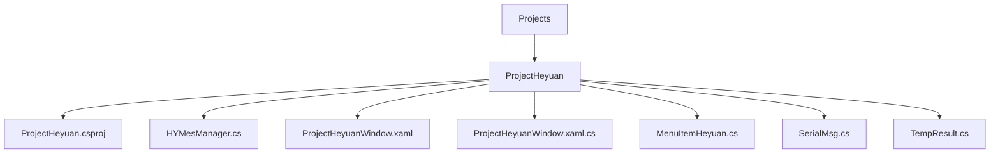
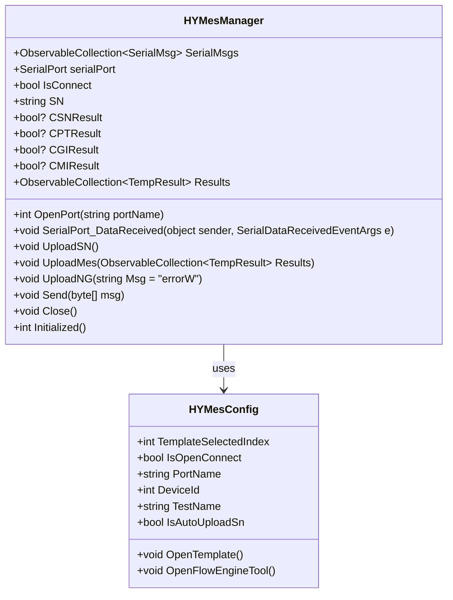

# ProjectHeyuan 解决方案


# ProjectHeyuan 解决方案

## 目录
1. [介绍](#介绍)
2. [项目结构](#项目结构)
3. [核心组件](#核心组件)
4. [架构概览](#架构概览)
5. [详细组件分析](#详细组件分析)
6. [依赖关系分析](#依赖关系分析)
7. [性能考虑](#性能考虑)
8. [故障排除指南](#故障排除指南)
9. [结论](#结论)

## 介绍
ProjectHeyuan 是一个基于 WPF 的 Windows 应用程序，集成了 MES（制造执行系统）功能，特别聚焦于与 MES 系统的交互通信。该项目通过串口通信实现与 MES 系统的数据交互，支持上传产品序列号、测试结果等信息，确保生产数据的实时传输和管理。此文档将详细介绍 ProjectHeyuan 的功能实现，尤其是 `HYMesManager.cs` 中与 MES 系统集成的核心机制，包括配置、工作流程和数据交互细节。

## 项目结构
ProjectHeyuan 作为整个解决方案中的一个子项目，位于 `/Projects/ProjectHeyuan/` 目录下。其主要文件包括：

- `ProjectHeyuan.csproj`：项目文件，定义了项目的构建配置、依赖项以及后构建事件。
- `HYMesManager.cs`：核心功能实现文件，包含 MES 系统通信管理类和配置类。
- 其他 UI 相关文件如窗口定义（`ProjectHeyuanWindow.xaml`、`ProjectHeyuanWindow.xaml.cs`）、菜单项定义等。

### 目录结构详解


- **ProjectHeyuan.csproj**：定义项目使用 .NET SDK，启用 WPF 支持，引用了外部 DLL 和解决方案中的 Engine 项目。构建后会将输出复制到主应用的插件目录，方便插件化管理。
- **HYMesManager.cs**：实现了与 MES 系统的串口通信管理，包括连接初始化、数据发送接收、消息解析与上传逻辑。
- **UI 文件**：定义了用户界面窗口和交互逻辑，支持用户操作和数据显示。

项目采用 MVVM 设计模式，`HYMesConfig` 继承自 `ViewModelBase`，实现数据绑定和命令绑定，支持界面响应式更新。

## 核心组件

### 1. HYMesConfig 类
- 负责 MES 相关配置管理，如串口端口名、设备 ID、测试名称等。
- 提供打开模板编辑窗口和流程引擎工具的命令。
- 具备属性变更通知机制，支持 UI 数据绑定。

示例代码：
```csharp
public class HYMesConfig : ViewModelBase, IConfig
{
    public static HYMesConfig Instance => ConfigService.Instance.GetRequiredService<HYMesConfig>();

    public RelayCommand OpenTemplateCommand { get; set; }
    public RelayCommand OpenFlowEngineToolCommand { get; set; }

    public int TemplateSelectedIndex { get => _TemplateSelectedIndex; set { _TemplateSelectedIndex = value; NotifyPropertyChanged(); } }
    private int _TemplateSelectedIndex;

    // 串口连接相关配置
    public bool IsOpenConnect { get => _IsOpenConnect; set { _IsOpenConnect = value; NotifyPropertyChanged(); } }
    private bool _IsOpenConnect;

    public string PortName { get => _PortName; set { _PortName = value; NotifyPropertyChanged(); } }
    private string _PortName;

    public int DeviceId { get => _DeviceId; set { _DeviceId = value; NotifyPropertyChanged(); } }
    private int _DeviceId;

    public string TestName { get => _TestName; set { _TestName = value; NotifyPropertyChanged(); } }
    private string _TestName = "WBROtest";

    public bool IsAutoUploadSn { get => _IsAutoUploadSn; set { _IsAutoUploadSn = value; NotifyPropertyChanged(); } }
    private bool _IsAutoUploadSn;

    // 命令实现
    public void OpenTemplate() { /* 打开模板编辑窗口 */ }
    public void OpenFlowEngineTool() { /* 打开流程引擎工具窗口 */ }
}
```

### 2. HYMesManager 类
- 单例设计模式保证系统中只有一个实例管理 MES 通信。
- 管理串口连接，支持打开串口、接收数据、发送数据和关闭串口。
- 解析 MES 返回的协议消息，处理 CSN（序列号）、CPT、CGI、CMI 等命令的响应。
- 维护测试结果集合，支持上传测试数据到 MES。
- 使用日志记录关键操作，便于调试和维护。

核心方法包括：
- `OpenPort(string portName)`：打开指定串口，初始化连接并发送握手消息。
- `SerialPort_DataReceived`：串口数据接收事件处理，解析消息并更新状态。
- `UploadSN()`：上传产品序列号到 MES。
- `UploadMes()`：上传测试结果数据。
- `UploadNG()`：上传不合格信息。
- `Send(byte[] msg)`：封装消息格式并发送。

示例代码片段：
```csharp
public int OpenPort(string portName)
{
    IsConnect = false;
    try
    {
        if (!serialPort.IsOpen)
        {
            serialPort = new SerialPort { PortName = portName, BaudRate = 38400 };
            serialPort.Open();
            string SetMsg = $"CSN,C,0,TEST202405140001";
            byte[] buffer = Encoding.UTF8.GetBytes(SetMsg);
            byte[] framedMsg = new byte[buffer.Length + 2];
            framedMsg[0] = 0x02; // STX
            buffer.CopyTo(framedMsg, 1);
            framedMsg[framedMsg.Length - 1] = 0x03; // ETX

            serialPort.Write(framedMsg, 0, framedMsg.Length);

            for (int i = 0; i < 10; i++)
            {
                Thread.Sleep(16);
                int bytesread = serialPort.BytesToRead;
                if (bytesread > 0)
                {
                    byte[] buff = new byte[bytesread];
                    serialPort.Read(buff, 0, bytesread);
                    if (buff.Length > 3 && buff[0] == 0x02)
                    {
                        IsConnect = true;
                        serialPort.DataReceived += SerialPort_DataReceived;
                        return 0;
                    }
                }
            }
            serialPort.Close();
            return -1;
        }
        else
        {
            return 0;
        }
    }
    catch
    {
        return -2;
    }
}
```

## 架构概览
ProjectHeyuan 采用典型的 MVVM 架构模式，分离视图（UI）、视图模型（ViewModel）和模型（Model）职责。其核心是 `HYMesManager` 单例类，负责与 MES 系统的串口通信和协议解析，`HYMesConfig` 提供配置支持和命令绑定，UI 层通过数据绑定与它们交互。

串口通信遵循特定协议，消息以 STX (0x02) 开头，ETX (0x03) 结尾，消息体为 UTF-8 编码的字符串。通信流程包括打开串口、发送握手消息、接收消息、解析消息内容并触发相应操作（如上传数据）。

系统设计注重异步事件处理，确保 UI 响应流畅，且通过日志记录关键操作，方便后续维护。

## 详细组件分析

### HYMesConfig 类详细分析
- 继承自 `ViewModelBase`，支持属性变更通知，适合与 WPF UI 绑定。
- 通过 `RelayCommand` 实现命令绑定，允许 UI 按钮触发打开模板编辑和流程引擎工具。
- 属性包括串口连接开关、设备编号、端口名称、测试名称、数据路径和自动上传序列号开关。
- 单例模式通过 `ConfigService.Instance.GetRequiredService<HYMesConfig>()` 获取，确保配置一致性。

### HYMesManager 类详细分析
- 单例模式实现，确保系统中仅有一个实例管理 MES 通信。
- `OpenPort` 方法负责打开串口，设置波特率，发送握手消息，并等待响应确认连接成功。
- 串口事件 `SerialPort_DataReceived` 负责接收数据，解析消息，并根据消息内容更新状态或触发上传。
- 维护一个 `ObservableCollection<SerialMsg>`，用于记录发送和接收的消息，方便 UI 显示通信日志。
- 通过 `UploadSN`、`UploadMes`、`UploadNG` 等方法向 MES 发送不同类型的信息。
- 发送消息时，自动添加 STX 和 ETX 控制字符，确保协议格式正确。
- 具备异常捕获和错误返回机制，保证通信稳定性。

#### 关键类关系 Mermaid 图


## 依赖关系分析
- ProjectHeyuan 依赖于 `ColorVision.Engine` 项目，特别是 `ColorVision.Engine.Templates` 和 `ColorVision.Engine.Templates.Flow`，用于模板和流程引擎的支持。
- 引用的外部 DLL 包括 `CVCommCore.dll`、`FlowEngineLib.dll`、`MQTTMessageLib.dll` 和 `ST.Library.UI.dll`，分别提供通信核心库、流程引擎库、消息传递库及 UI 组件支持。
- 通过 `ConfigService` 单例服务获取配置实例，实现解耦和统一管理。
- 串口通信依赖于 .NET Framework 的 `System.IO.Ports.SerialPort` 类，支持串口的打开、关闭、读写和事件监听。

## 性能考虑
- 串口通信采用事件驱动方式，避免阻塞 UI 线程，保证应用响应性。
- 发送和接收消息时，使用缓冲区和编码转换，考虑了消息完整性和协议格式。
- 连接初始化时采用轮询等待响应，时间间隔较短（16ms），最多尝试 10 次，平衡了响应速度和资源占用。
- 使用 `ObservableCollection` 方便 UI 绑定，但大量消息时可能影响性能，需注意消息量管理。

## 故障排除指南
- 串口无法打开：检查端口是否被占用或配置是否正确。
- 连接超时或握手失败：确认设备连接状态，检查波特率和协议格式。
- 数据上传失败：确认 MES 系统可用，检查日志中发送的消息格式和内容。
- UI 不响应或数据不同步：检查事件处理是否被正确调用，确保绑定属性通知正常。

## 结论
ProjectHeyuan 通过 `HYMesManager` 类实现了与 MES 系统的串口通信集成，支持产品序列号和测试结果的实时上传。配置通过 `HYMesConfig` 类集中管理，支持灵活调整。项目采用 MVVM 架构，结合 WPF 界面，实现了功能模块的清晰分离和良好扩展性。整体设计注重通信稳定性和数据完整性，适合生产环境中 MES 系统的数据交互需求。

---

更多详细内容和示例代码可参考项目源码：

- [ProjectHeyuan.csproj](https://github.com/xincheng213618/scgd_general_wpf/blob/main/Projects/ProjectHeyuan/ProjectHeyuan.csproj)
- [HYMesManager.cs](https://github.com/xincheng213618/scgd_general_wpf/blob/main/Projects/ProjectHeyuan/HYMesManager.cs)

